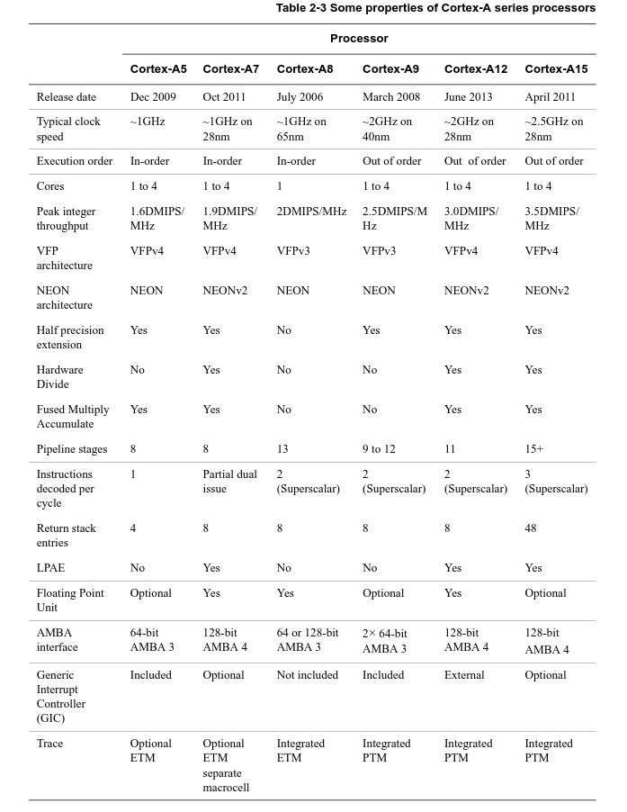
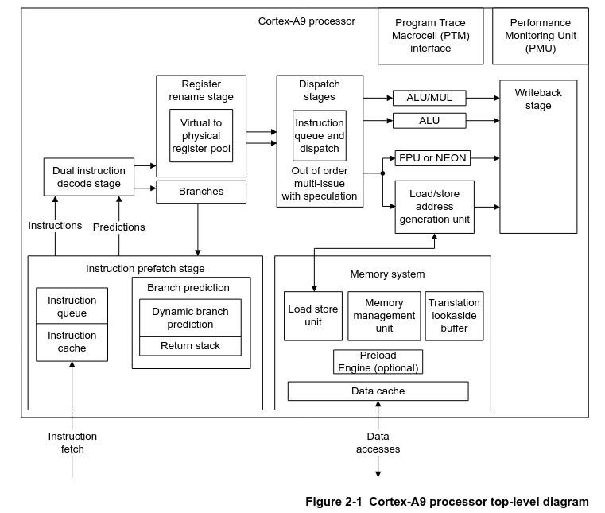
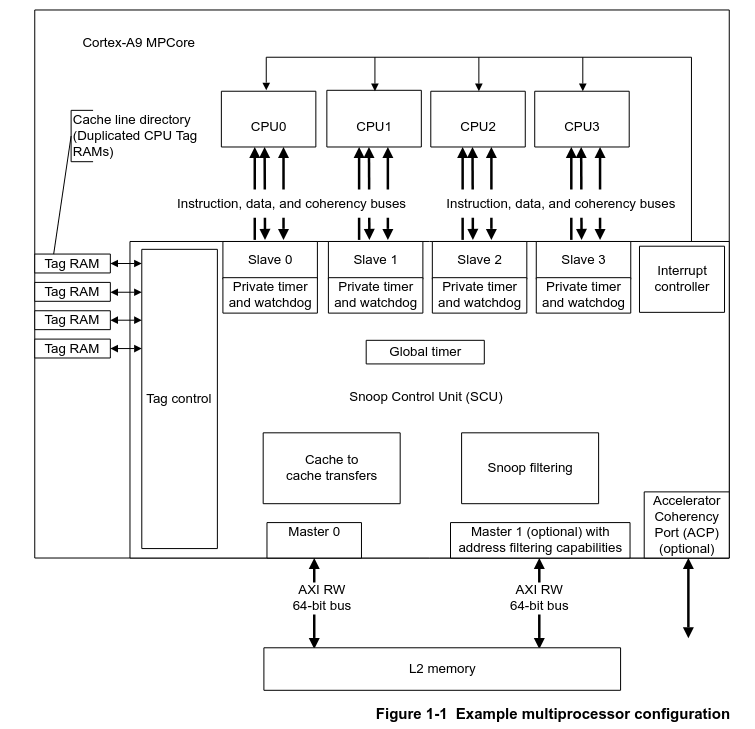
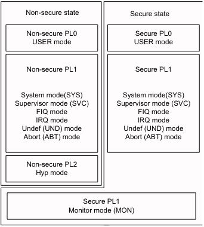
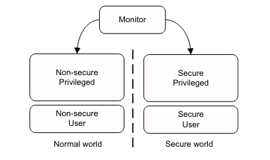
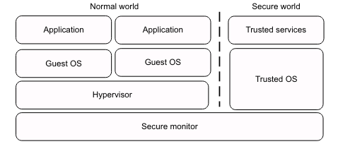
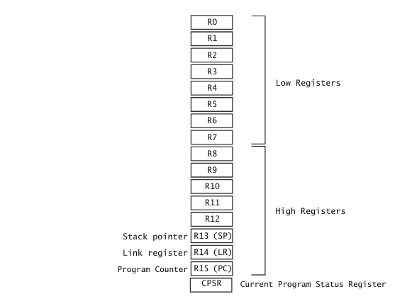
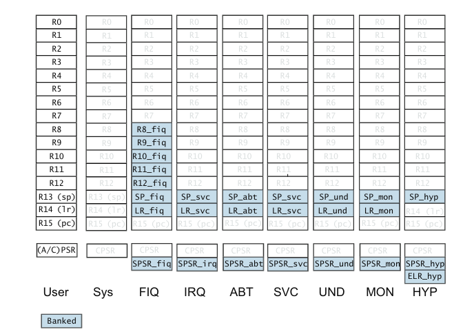

# ARMv7-A体系结构

ARMv7-M体系结构笔记[传送门](201020a_stm32.md)

## 参考

[ARM Developer](https://developer.arm.com)

[ARM Cortex-A Series Programmer's Guide for ARMv7-A, ARM](https://developer.arm.com/documentation/den0013/d/?lang=en)

[ARM Architecture Reference Manual ARMv7-A and ARMv7-R edition, ARM](https://developer.arm.com/documentation/ddi0406/cd/?lang=en)

## 前言

随着2000年代中后期从苹果开始的智能手机大爆发，ARM逐渐统治了手机领域。ARMv7是ARM历史上具有革命性的一代，也是这一代开始ARM将产品线分为A、R、M三大系列。在工业控制领域ST推出了基于ARMv7-M系列核心的STM32。也是从这里开始32位MCU得到了推广，并最终由ARM的Cortex-M系列统治了32位MCU领域。现在ARM处理器是全世界出货量最多的处理器，它已经渗透到我们生活的各个角落，从超算到玩具都可以见到它的存在

如今ARM已经推出了ARMv9，作为ARMv8的小幅升级。即便如此，老旧的ARMv7处理器依然凭借成熟的生态以及足够的性能维持强大的生命力，在工控以及低端数码领域继续发展。许多厂商依然在推出基于32位ARMv7-A处理器的新产品，例如Allwinner等，ST也开始涉及SoC领域，推出了STM32MP1系列，这些产品大部分都是基于Cortex-A7设计

## 常见SoC厂商与产品

有可玩性的SoC

**国内**

+ Allwinner (sunxi) 全志科技 （主打低端，适合低难度廉价DIY）
    + 新论坛 https://bbs.aw-ol.com/
    + 已废弃Wiki https://linux-sunxi.org/Main_Page
    + 部分新产品文档 https://gitee.com/aw-sunxi/awesome-sunxi
    + RISCV产品省略
    + T113-s3 (2xA7 with 128MB DDR3, eLQFP128)
    + R328/528-s3 (2xA7 with 128MB DDR3)
    + F1C100/200s (ARM9 with DDR)
    + A133 (4xA53)
    + H616 (4xA53)
    + V3s (1xA7 with 64MB DDR2, eLQFP128)
    + V833 (1xA7)
    + V853 (1xA7+1xRISCV)
    + R11 (1xA7)
    + H3 (4xA7)
    + H5 (4xA53)
    + H6 (4xA55)
+ Rockchip 瑞芯微 （主打中高端）
    + 文档开源 https://opensource.rock-chips.com/wiki_Main_Page
    + RK3588 (4xA76+4xA55)
    + RK3568 (4xA55)
    + RK3566 (4xA55)
    + RK3399 (2xA72+4xA53)
    + RK3328 (4xA53)
    + RK3288 (4xA17)
    + RK1808 (2xA35)
+ Amlogic 晶晨半导体 （主打中高端）
    + A311D (4xA73+4xA53)
    + S922X (4xA73+4xA53)
    + S905Y2 (4xA53)
    + S905 (4xA53)
    + S905X (4xA53)
    + S905X3/D3 (4xA55)

**国际**

+ ST 意法半导体
    + STM32MP1
+ NXP 恩智浦
    + i.MX Series
+ Xilinx 赛灵思
    + ZYNQ-7000
+ Qualcomm
    + MSM8916(Snapdragon 410)/APQ8016 https://github.com/msm8916-mainline https://wiki.postmarketos.org/wiki/MSM8916_Mainlining
+ TI 德州仪器
    + Sitara AMxxxx
    + Jacinto 
+ Nvidia 英伟达
+ Microchip 微芯半导体
    + ATSAMA5
+ Samsung 三星半导体

## 1 简介

ARMv7 Cortex-A和R、M两个系列不同，它面向完整的现代操作系统应用，最大的特性是具备MMU。同时，ARMv7-A系列通常还具备较长的流水线，更高的运行频率，并配备有Cache。有些支持指令双发射、三发射，和乱序执行。除Cortex-A8以外其他处理器都原生支持多核配置，每个Cluster可以配备1到4个核心。同时为满足多媒体运算需求，ARMv7 Cortex-A核心通常会配备有VFP以及NEON SIMD扩展

## 1.1 ARMv7-A系列特性概览

> 后来推出的Cortex-A17是Cortex-A12的升级版，Rockchip的RK3288就使用了Cortex-A17核心并且获得了良好的市场表现

## 1.2 微架构：Cortex-A9

以Cortex-A9为例，单个处理器核心。Cortex-A9是可变长度流水线，双发射乱序执行结构

MPCore，单个Cluster结构

> Cortex-A9 MPCore可以配备多个核心，且核心的功能只包含指令的执行、数据的运算和存取，核心包含了L1指令和数据缓存
>
> 其他部件相当于处理器核心的外壳，每一个核心可以拥有一个私有的定时器以及看门狗。其他的部件，如全局定时器，并行内存加速ACP，中断控制GIC，扇出的AXI总线等，都是由4个核心共享的。4个处理器的中断都是由一个GIC进行分配和控制。而SCU主要负责多个核心之间L1缓存的同步
>
> Cortex-A9使用AMBA3 AXI总线连接到L2缓存。L2不属于Cortex-A9的组成部分，但是几乎所有的SoC都会配备有L2
>
> 其他MPCore处理器除核心外，组成结构基本类似

## 1.3 其他关键特性

支持32位定长指令ARM模式以及16/32位变长指令Thumb-2模式

MMU硬件实现的虚拟物理地址查表转换

TLB快表集成

大小端模式支持

可配置虚拟页面大小：4KB，64KB，1MB，16MB

## 1.4 说明

由于ARMv7-A指令众多，且内存架构、中断控制较复杂，本笔记仅对重要的基本指令进行讲解，会省略大量NEON和VFP指令。重点在于内存架构、中断异常和多核，这是ARMv7-A区别于R、M两种核心的重要特性

ARMv7-A不包含DMA。通常不同的SoC厂商使用的DMA也不同

ARMv7-A部分指令和ARMv7-M工作原理相同，例如`IT`指令，这里不再详细讲述，具体内容可以看[ARMv7-M体系结构笔记](201020a_stm32.md)

## 2 工作模式与寄存器

## 2.1 工作模式

带有虚拟化Hypervisor扩展以及TrustZone安全扩展的ARMv7-A处理器支持以下工作模式

> `PL0`为非特权模式（Unprivileged），`PL1`为特权模式（Privileged）。`PL1`模式可以访问的部件更多

| 模式 | 全称 | CPSR.M[4:0] | 等级 | 说明 | 安全模式（如果处理器支持TrustZone） |
| :-: | :-: | :-: | :-: | :-: | :-: |
| USR | User 用户模式 | `10000` | `PL0` | 用户程序代码的工作模式，受限访问MMU等敏感部件的配置寄存器 | `Secure/Non-secure` |
| SYS | System 系统模式 | `11111` | `PL1` | 操作系统代码的工作模式，可以访问MMU，GIC等部件 | `Secure/Non-secure` |
| FIQ | 快速中断 | `10001` | `PL1` | 执行快速中断的工作模式。快速中断一般用于实时性要求较高的场合 | `Secure/Non-secure` |
| IRQ | 普通中断 | `10010` | `PL1` | 执行普通中断的工作模式 | `Secure/Non-secure` |
| SVC | Supervisor | `10011` | `PL1` | CPU复位或执行`SVC`指令后进入的模式。`SVC`指令一般由用户程序执行来请求系统调用 | `Secure/Non-secure` |
| ABT | Abort 访存异常 | `10111` | `PL1` | 访存异常后进入的模式 | `Secure/Non-secure` |
| UND | Undef 未定义指令 | `11011` | `PL1` | 执行未定义指令后进入的模式 | `Secure/Non-secure` |
| HYP | Hypervisor | `11010` | `PL2` | 支持虚拟化的处理器中，Hypervisor代码运行的模式，用以支持同时运行多操作系统 | `Non-secure` |
| MON | Monitor 监视模式 | `10110` | `PL1` | 在支持TrustZone扩展的处理器中的特殊模式，通常用于切换Secure模式 | `Secure` |

在支持TrustZone安全扩展的处理器中，运行状态的`Secure`或`Non-secure`模式（TrustZone）和`PL`模式是互相独立的，两者没有必然联系。运行在`Non-secure`模式下的处理器无法访问`Secure`模式下使用的内存，包括外设。`MON`模式就是用于切换处理器运行的`Secure`和`Non-secure`模式，如下

> 通常情况下，用户程序以及操作系统内核都运行在`Non-secure`模式下。只有一些硬件固件以及包含敏感信息的软件需要通过TrustZone来保护

在支持虚拟化扩展的处理器中，Hypervisor和操作系统、用户程序的关系如下

## 2.2 寄存器

### 2.2.1 通用寄存器和CPSR

和Cortex-M相同，Cortex-A也拥有16个基本的通用寄存器GPR。其中`R0`到`R7`为低寄存器，`R8`到`R12`为高寄存器，剩余3个有特殊用途，`R13`为`SP`栈寄存器，`R14`为`LR`链接寄存器（函数调用时用于存放返回地址，模式切换时用于存放之后`PC`返回值），`R15`为`PC`程序计数器

> ARM模式下读取`PC`获得的是当前指令地址`+8`，Thumb模式下获得的是当前指令地址`+4`，相当于两条指令的长度。因为最早的ARM是3级流水线结构
>
> 复位后，处理器的`R0`到`R14`是不确定值，`SP`必须由代码进行初始化后才能正常使用

此外ARMv7-A处理器在特权模式下，部分寄存器会被替换为物理上单独的专用寄存器，这些寄存器会取代原来用户模式（非特权模式）下的寄存器，称为`banking`

> 上表中蓝色块代表该模式下被bank的寄存器。其中除`SYS`模式以外，其余所有特权模式都bank了`SP`寄存器，同时添加了`SPSR`用于**保存**进入当前模式之前`CPSR`的状态，以便任务执行完毕以后将`SPSR`恢复到`CPSR`回到原来的状态。实际在代码中访问这些寄存器不用在后面加上例如`_fiq`的后缀
>
> `FIQ`快速中断相比普通中断`IRQ`bank了高寄存器，这意味着进入`FIQ`时高寄存器可以不用压栈，这也是`FIQ`有更快响应性能的原因之一
>
> `HYP`模式下同时具有`LR`以及`ELR`寄存器，`LR`和`USR`模式使用的是同一个，用于`HYP`模式下的函数调用返回；而`ELR`用于异常返回

`CPSR`定义如下

> `USR`模式下实际只能访问`CPSR`的`APSR`部分（`A`指Application）。此时`APSR`只有`N Z C V Q`以及`GE[3:0]`是可访问的

各bit功能，和ARMv7-M不同

| 名称 | 位域 | 作用 | 复位值 | 备注 |
| :-: | :-: | :-: | :-: | :-: |
| `N` | 31 | Negative标志，整数计算结果首位为1 | UNKNOWN | 任意模式下可以任意读写，建议通过指令自动更改。条件指令依照这些位执行 |
| `Z` | 30 | Zero标志，整数计算结果为0 | UNKNOWN | 同上 |
| `C` | 29 | Carry标志，无符号运算产生进位 | UNKNOWN | 同上 |
| `V` | 28 | Overflow标志，有符号运算产生溢出，例如加法中正正得负或负负得正 | UNKNOWN | 同上 |
| `Q` | 27 | 整数饱和运算标志 | UNKNOWN | 同上，但是不属于`N Z C V`标准标志位，条件指令不会检测该位 |
| `IT[1:0]` | 26:25 | 用于`IT`条件指令 | `00` | `MRS`读取全`0`，`MSR`写无效 |
| `J` | 24 | Jazelle模式，历史遗留。绝大部分ARMv7处理器不提供此扩展，该位没有实际作用 | `0` | `MRS`读取为`0`，`MSR`写无效 |
| `GE[3:0]` | 19:16 | 用于部分整数SIMD指令（不是NEON或VFP），表示32位运算中每个字节大于或等于 | UNKNOWN | 同`N Z C V`，可以影响例如`SEL`的执行 |
| `IT[7:2]` | 15:10 | 用于`IT`条件指令 | `000000` | `MRS`读取全`0`，`MSR`写无效 |
| `E` | 9 | 指示**数据**大小端模式Endianness，`0`小端，`1`大端。指令大小端不受影响 | `=SCTLR.EE`，一般为`0`小端模式 | 在`PL1`及以上模式可以使用`MRS MSR`读写，但是不建议这样操作。更改大小端需要使用`SETEND`指令 |
| `A` | 8 | Asynchronous abort屏蔽位 | `1`，默认禁用 | 仅支持TrustZone的处理器中，如果`SCR.AW=0`该位无法更改。如果还支持虚拟化，`SCR.AW=0`会使得该位的更改受限 |
| `I` | 7 | `IRQ`屏蔽位 | `1`，默认禁用 |  |
| `F` | 6 | `FIQ`屏蔽位 | `1`，默认禁用 | 仅支持TrustZone的处理器中，如果`SCR.FW=0`该位无法更改。如果还支持虚拟化，`SCR.FW=0`会使得该位的更改受限。如果处理器支持`NMFI`不可屏蔽快速中断，`SCTLR.NMFI=1`时该位无法置`1` |
| `T` | 5 | 指令模式，置`1`表示Thumb-2，置`0`表示ARM | `=SCTLR.TE`，一般为`0`处于ARM模式 | `MRS`读取为`0`，`MSR`写无效 |
| `M[4:0]` | 4:0 | 表示当前[工作模式](#21-工作模式) | `10011`，默认处于`SVC`模式 | 通常只在`PL1`及以上运行模式下读写 |

> `IT J E T`位为指示位，**除调试模式外**，只有专用的指令才能更改这些位。`IT`位对应`IT`条件指令，`E`使用`SETEND`指令。更改`T`需要使用跳转指令进行ARM和Thumb模式的切换

### 2.2.2 协处理器简介

协处理器在ARMv8中被废弃，转而使用特殊寄存器指令访问这些系统配置相关的寄存器

ARMv7-A依然沿用了协处理器，使用专用的协处理器指令如`MRC` `MCR`访问，共计16个协处理器`CP0`到`CP15`，其中`CP8`到`CP15`为ARM保留使用。协处理器`CP14 CP15`主要用于系统配置，`CP10 CP11`主要用于VFP以及SIMD相关配置

为方便对于协处理器概念的理解，这里给出协处理器指令`MRC` `MRRC`格式如下（`MCR` `MCRR`类似）

> `MRC`指令读取指定协处理器的一个32位寄存器并存入到1个指定的GPR，而`MRRC`指令读取指定协处理器的一个64位寄存器并存入到2个指定的GPR
>
> `MRC`指令中，`opc1`以及`opc2`为操作码，`CRn`以及`CRm`分别为两个协处理器中的逻辑寄存器。由于`MRC`操作码长度为`3`，所以每个操作码支持`8`种操作；而`CRn`和`CRm`地址长度为`4`，所以支持`16`个寄存器，使用`c0`到`c15`表示
>
> 协处理器如`CP15`在实际的应用中作为配置寄存器使用。我们可以将协处理器完全视作一组寄存器，而`opc1 opc2 CRn CRm`中所有编码的任意组合视作一个地址，那么一个协处理器可以支持`2^(3+3+4+4)=16384`个`32`位寄存器。而如果使用`MRRC`访问，一个协处理器可以支持`2^(4+4)=256`个`64`位寄存器

### 2.2.3 系统控制：协处理器CP15

`CP15`为System Control coprocessor，在系统的控制中有重要作用。而在Cortex-M中这些配置寄存器通常位于内存空间，使用例如`SCB` `MPU`这样的结构体访问

> 使用`MRC`指令访问时，指令中的`CRn`指定`CP15`的`Primary register`；使用`MRRC`访问时，指令中的`CRm`指定`CP15`的`Primary register`。拥有同一个`Primary register`的协处理器指令，访问的物理寄存器功能通常属于同一类别，如下所示

`CP15`中各`Primary register`的主要作用

| 寄存器编号 | 作用 |
| :-: | :-: |
| `c0` | 处理器基本信息 |
| `c1` | System Control registers，系统控制 |
| `c2 c3` | Memory protection and control registers，用于配置MMU |
| `c5 c6` | Memory system fault registers，访存错误信息 |
| `c7` | Cache maintenance and other functio访问ns，主要用于配置Cache |
| `c8` | TLB maintenance operations，用于配置TLB快表 |
| `c9` | Performance monitors，用于监视性能 |
| `c12` | Security Extensions registers，TrustZone扩展 |
| `c13` | Process, context and thread ID registers，操作系统相关 |
| `c15` | Implementation defined |

以下是`CP15`中**部分**物理寄存器的作用，在C代码中访问`CP15`时使用这些寄存器名访问

| 寄存器名 | 作用 | 所属 |
| :-: | :-: | :-: |
| `MIDR` | Main ID，主要是处理器的基本信息 | `c0` |
| `MPIDR` | 用于区分多核系统中的每个核 | `c0` |
| `SCTLR` | System Control Register，最重要的**系统控制**寄存器 | `c1` |
| `ACTLR` | Auxiliary Control Register，不同的处理器功能不同 | `c1` |
| `CPACR` | 控制除`CP14 CP15`以外所有的协处理器访问权限 | `c1` |
| `SCR` | 安全配置，用于TrustZone扩展 | `c1` |
| `TTBR0` | MMU相关，level 1转换表基址 | `c2 c3` |
| `TTBR1` | MMU相关，level 1转换表基址 | `c2 c3` |
| `TTBCR` | 控制`TTB0`和`TTB1` | `c2 c3` |
| `DFSR` | 数据访存错误状态信息 | `c5 c6` |
| `IFSR` | 指令访存错误状态信息 | `c5 c6` |
| `DFAR` | 数据访存错误地址（Virtual address） | `c5 c6` |
| `IFAR` | 指令访存错误地址（Virtual address） | `c5 c6` |
| `VBAR` | TrustZone扩展，非Monitor模式中断异常向量基址 | `c12` |
| `MVBAR` | TrustZone扩展，Monitor模式中断异常向量基址 | `c12` |
| `CONTEXTIDR` | ASID | `c13` |
| `CBAR` | GIC、定时器等外设配置基址 | `c15` |

`SCTLR`**寄存器**

`SCTLR`长度32位，位于`c1`，完整定义如下

这里只讲述部分bit的定义，如下

### 2.2.4 VFP浮点扩展与NEON SIMD寄存器

## 3 内存架构

## 3.1 Cache

## 3.2 MMU

## 4 中断与异常

## 5 指令集

在ARM预取指操作中，**预取指最多可能先行于当前执行指令64字节**

**非显式的访存即除访存指令之外对内存的访问操作，如取指，缓存交换，Tranlation Table Walk**