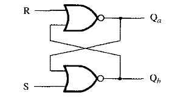
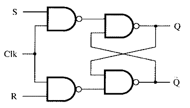
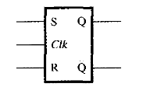
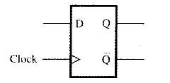
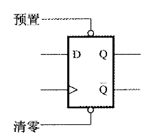
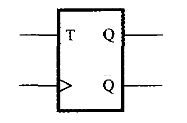
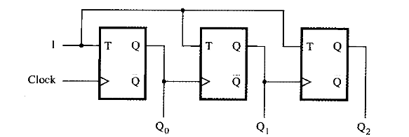
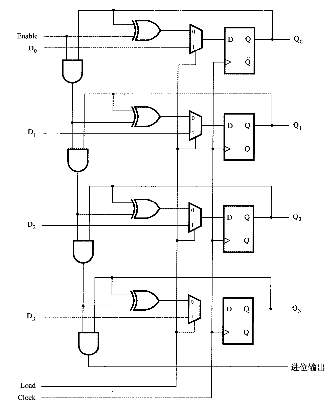
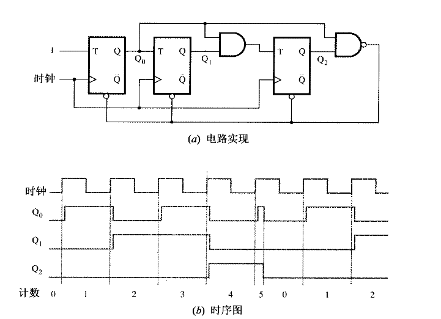
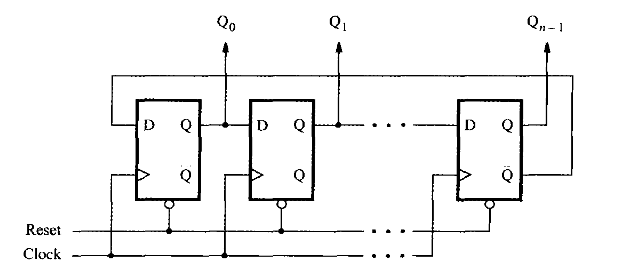

# 数字电路基础 Verilog FPGA 开发入门笔记

有关数字电路的一些理论知识以及基于Verilog的FPGA开发入门

## 参考书籍

*Fundamentals of Digital Logic with Verilog Design (Second Edition), Stephen Brown, Zvonko Vranesic, Canada, 2007, ISBN 978-7-111-22182-1*

## 1 数字电路基础

*记录比较常用的一些理论以及解决问题的方法*

### 1.1 布尔（逻辑）代数公理

用于基本与或非电路的设计

*（离散数学学过了）*

| 名称 | 公式 |
| :--: | :--: |
| 双否律 | ~~A = A |
| 交换律 | A·B = B·A, A+B = B+A |
| 结合律 | (A·B)·C = A·(B·C), (A+B)+C = A+(B+C) |
| 分配律 | (A·B)+C = (A+C)·(B+C), (A+B)·C = (A·C)+(B·C) |
| 德摩根律 | ~(A+B) = (~A)·(~B), ~(A·B) = (~A)+(~B) |
| 吸收律 | A·(A+B) = A, A+(A·B) = A |
| 幂等律 | A+A = A, A·A = A |
| 同一律 | A+0 = A, A·1 = A |
| 零一律 | A·0 = 0, A+1 = 1 |
| 排中律 | (~A)+A = 1 |
| 矛盾律 | (~A)·A = 0 |
| 异或等价公式 | A⊕B = (B·~A)+(A·~B) | 

### 1.2 触发器，寄存器，计数器

逻辑电路中，触发器为重要组成部分，带入了时序，将逻辑电路的行为从空间扩展到了时间，从组合逻辑到时序逻辑

#### 1.2.1 SR锁存器

**SR锁存器** 电路如下

可以看作由两个非门的电路演变而来

经过分析，SR锁存器行为可定义如下

| S | R | Q | ~Q |
| :-: | :-: | :-: | :-: |
| 0 | 0 | 0/1 | 1/0 |
| 1 | 0 | 1 | 0 |
| 0 | 1 | 0 | 1 |
| 1 | 1 | 0 | 0 |

当S,R都为0时输出状态保持不变。S高电平R低电平置位，R高电平S低电平复位，RS高电平输出都为低电平

*注意：RS触发器在RS端都为0时上电瞬间，以及RS端同时从1跳变为0时会出现短时间振荡*

**门控SR锁存器**

就是在RS触发器基础上加一个输入控制门

与非门实现的门控RS锁存器

表示符号如下

*注意：同上，当RS端同时为1时，如果Clk负跳变会导致短时间振荡*

#### 1.2.2 D锁存器

D锁存器就是为了解决RS触发器可能出现的不确定情况而出现的（防止RS同时为1）

D高电平，Clk高电平，D被锁存

电路符号如下

**主从D触发器**

主从D触发器结构如下图

D在Clk高电平时被主触发器取样，输出不变，Clk变为低电平后从从触发器输出

电路符号如下

**边沿触发D触发器**

边沿触发D触发器结构如下图

由上图分析，当Clk为0时，P1 = P2 = 1，P3 = D，P4 = ~D，触发器状态不变。若Clk正跳变时D为0，P1 = 1，P4 = 1，P2 = 0，P3 = 0，Q = 0，此时若D变为1，由于P2 = 0锁死了P4 = 1，所以不会有变化。若Clk正跳变时D为1，P1 = 0，P4 = 0，P2 = 1，P3 = 1，此时若D变为0，由于P1 = 0锁死了P3 = 1，P2 = 1，所以也不会有变化。

边沿D触发器可以保证在Clk高电平时D发生改变而输出状态不变

电路符号如下

**有清零端和预置信号的D触发器**

带清零端和置位端的主从D触发器

使用时，需要保持清零端和置位端为高电平。清零和置位为异步于时钟，低电平有效

带清零端和置位端的沿触发D触发器

使用时，需要保持清零端和置位端为高电平。清零和置位为异步于时钟，低电平有效

**同步清零的实现：**

如下，实现同步清零直接在数据输入端加一个与门即可

#### 1.2.3 T触发器

T触发器结构如下图

T触发器符号

T触发器行为可以定义如下：如果T = 0则不跳变；如果T = 1则不停跳变

#### 1.2.4 JK触发器

JK触发器结构如下图，就是

JK触发器有两个输入端J和K，既可以当SR触发器使用，也可以当T触发器使用（T触发器就是由JK触发器演变而来）。J = K = 1在SR触发器中是不允许的状态，此时JK触发器可以相当于T触发器T = 1不停跳变；其他状态相当于J = S，K = R，相当于SR触发器的SR端

#### 1.2.5 寄存器

**移位寄存器**

移位寄存器由沿触发D锁存器组成，一个D触发器的Q输出端接下一个D触发器D输入端，原理好理解

**并行存取移位寄存器**

并行存取移位寄存器结合了并行寄存器以及移位寄存器的功能，加入了外部电路，实现~SHIFT/LOAD端低电平时串行移位，高电平时并行置位，如图原理好理解

#### 1.2.6 计数器

**异步计数器(Asynchronous Timer)**

异步计数器由T触发器组成，上一个触发器的反相输出端连接下一个触发器的时钟输入端，T输入端接高电平

以上是递增计数器，递减计数器如下

异步计数器由于时钟经过每一级都会有延迟，所以不能用于对时序要求高的高频场合

**同步计数器(Synchronous Timer)**

同步计数器保证了时钟的同步，所有位延迟相同

同步计数器添加复位和使能端后如图，复位为异步复位，使能端即第一个触发器的T端

**D触发器实现的同步计数器**

**支持并行加载的计数器**

计数器可以使用触发器自带的异步Preset以及Clear端进行置位或复位，这里使用另外一种同步并行加载法

并行加载计数器的应用：并行加载的计数器可以添加少量外部器件构建任意模数以及复位初始值的计数器，可以使用与门使计数器计数到特定值后输出高电平到Load端，加载预置输入，如下图实现了一个模6（输出0~5）计数器

该模6计数器时序图如下

由上图分析，在计数器计数到5后，Load变为高电平，下一次时钟到来时会直接将预置值加载

下图示例另外一种使用异步复位端的模5计数器以及其时序图，并说明为什么这种设计不好

这个计数器设计和以上同步加载的相同，区别是它只能作为模5（输出0~4）计数器使用，由时序图可知，其输出为5的时间非常短，但是确实会输出5用于复位（输出为5后立即强制复位），和时钟无关，只和门电路固有延迟有关。虽然这个电路相对来说更简单，但是这在一个数字系统中，尤其是使用同步时钟的系统，是可能带来不可预知的行为的，要尽量避免。

**BCD（8421码计数器）**

由同步加载计数器可以设计出以上2位BCD码计数器。计数器巧妙应用了第2位计数器的Enable端，可以实现逢十进一。复位依然使用与门

**环形计数器**

环形计数器原理和移位寄存器差不多，区别于一般二进制计数器，环形计数器输出不代表二进制数，同一时刻只有一个输出为高电平（独热码）。

如图，模n环形计数器有一个异步Start端，相当于是这个计数器的复位端，Start高电平将Q0置位为1，其他复位为0，时钟触发后Q0逐个移位作为计数功能

环形计数器也可以使用一般二进制计数器加上译码器组成，适用于较大的环形计数器

**Johnson计数器**

Johnson计数器和环形计数器差不多，区别就是Johnson计数器复位后所有位为0，且最后一位的反相输出端连接到第一个触发器的输入端，Johnson计数器工作输出规律如下：0000,1000,1100,1110,1111,0111,0011,0001,0000

### 1.3 根据真值表反推逻辑表达式

有两种方法，所有真值为1的项的主析取范式，或所有真值为0的项的主合取范式，具体视情况而定，尽量使用较简单的方法

**示例**

有如下真值表，ABC为输入，X为输出

| A | B | C | X |
| :-: | :-: | :-: | :-: |
| 0 | 0 | 0 | 1 |
| 1 | 0 | 0 | 1 |
| 0 | 1 | 0 | 0 |
| 1 | 1 | 0 | 1 |
| 0 | 0 | 1 | 0 |
| 1 | 0 | 1 | 1 |
| 0 | 1 | 1 | 0 |
| 1 | 1 | 1 | 0 |

**取1项作主析取范式（正则积之和形式，每一个积都是最小项）**

> X = (~A)·(~B)·(~C) + A·(~B)·(~C) + A·B·(~C) + A·(~B)·C

**取0项作主合取范式（正则和之积形式，每一个和都是最大项）**

> X = (A+(~B)+C) · (A+B+(~C)) · (A+(~B)+(~C)) · ((~A)+(~B)+(~C))

**主析取范式/主合取范式互相转换**

以上为例，主析取范式为

> X = (~A)·(~B)·(~C) + A·(~B)·(~C) + A·B·(~C) + A·(~B)·C

没有出现的项为

> A·B·C, (~A)·B·C, (~A)·(~B)·C, (~A)·B·(~C)

那么

> ~X = A·B·C + (~A)·B·C + (~A)·(~B)·C + (~A)·B·(~C)

由双否律以及德摩根律又可以推出

> X = ~~X = ~(A·B·C + (~A)·B·C + (~A)·(~B)·C + (~A)·B·(~C))
> 
> X = ((~A)+(~B)+(~C)) · (A+(~B)+(~C)) · (A+B+(~C)) · (A+(~B)+C)

*反之求主合取范式的等价主析取范式同理*

**补充：积之和/和之积一般表示方式**

积之和

> X = m0 + m1 + m3 + m5 = ∑m(0, 1, 3, 5)

和之积

> X = M2 · M4 · M6 · M7 = ∏M(2, 4, 6, 7)

*最小项与其对应的最大项关系 m2 = ~M2*

### 1.4 逻辑电路的优化

在逻辑电路的设计中，同一个电路一般有多种具体实现，考虑到成本，设计复杂度以及功耗，需要对电路进行化简

门电路数以及门电路输入端数量之和为衡量电路成本的重要因素

#### 1.4.1 一般化简

简单情况下，逻辑电路的化简，就是使用布尔代数公理，化简主析取/主合取范式的过程

在之前的示例中，可以化简主范式如下

> X = (~B)·(~C) + (~B)·A + (~C)·A

#### 1.4.2 优化理论

在大规模电路中，一般的根据布尔代数公理推导会非常复杂，因此引入一套完整的理论用于逻辑代数的优化，也可以看作是通用的高级优化方法。这些方法被广泛应用于集成电路设计以及FPGA的EDA中。

##### 1.4.2.1 图表法（卡诺图法，适用于人工作业）

*可以使用积之和，也可以和之积，原理相同*

**二变量卡诺图**

真值表

| X1 | X2 | X |
| :-: | :-: | :-: |
| 0 | 0 | m0 |
| 0 | 1 | m1 |
| 1 | 0 | m2 |
| 1 | 1 | m3 |

卡诺图

| X2 \ X1 | 0 | 1 |
| :-: | :-: | :-: |
| 0 | m0 | m2 |
| 1 | m1 | m3 |

这里设 m0=1, m1=1, m2=0, m3=1 

| X2 \ X1 | 0 | 1 |
| :-: | :-: | :-: |
| 0 | 1 | 0 |
| 1 | 1 | 1 |

**分析**：由上图可以发现，X1=0 对应的列为1，X2=1 对应的行为1，直接可以得出

> X = (~X1) + X2

**三变量卡诺图**

真值表

| X1 | X2 | X3 | X |
| :-: | :-: | :-: | :-: |
| 0 | 0 | 0 | 0 |
| 0 | 0 | 1 | 1 |
| 0 | 1 | 0 | 0 |
| 0 | 1 | 1 | 0 |
| 1 | 0 | 0 | 1 |
| 1 | 0 | 1 | 1 |
| 1 | 1 | 0 | 1 |
| 1 | 1 | 1 | 0 |

卡诺图，三维表格

| X3 \ X1X2 | 00 | 01 | 11 | 10 |
| :-: | :-: | :-: | :-: | :-: |
| 0 | 0 | 0 | 1 | 1 |
| 1 | 1 | 0 | 0 | 1 |

这里X1X2行需要使用格雷码，有关格雷码这里写了一个生成器，[查看源码](src/200920c01/graycode/gray.c)

**分析**：由上图，可以把表想象成可以卷起来的圆筒，X1X2行构成循环，所以X1X2=00 X3=1以及X1X2=10 X3=1也要考虑 

> X = X1(~X3) + (~X2)X3

**卡诺图优化一般规律总结**

找到卡诺图里面相邻2^n(2, 4, 8, 16...)个都是1的格子，可以合并成一个项，在拐角处相交重合的也可以优化，正方形的也可以优化成一个项，总之基本原则就是使用尽量少的优化次数优化尽量多的项，并且一次优化的数量在允许范围内要尽可能多，以减少单个项的元素数，例如在有正方形存在情况下就不要使用相邻两个优化了

**再举例：四变量卡诺图**

四维表格

| X3X4 \ X1X2 | 00 | 01 | 11 | 10 |
| :-: | :-: | :-: | :-: | :-: |
| 00 | 1 | 0 | 0 | 1 |
| 01 | 0 | 0 | 0 | 0 |
| 11 | 1 | 1 | 1 | 0 | 
| 10 | 1 | 1 | 0 | 1 |

通过观察

> X = (~X1)X3 + (~X2)(~X4) + X2X3X4

**扩展：五变量卡诺图**

五维表格，可以使用两张四维表格表示

X5 = 0

| X3X4 \ X1X2 | 00 | 01 | 11 | 10 |
| :-: | :-: | :-: | :-: | :-: |
| 00 |  |  |  |  |
| 01 |  |  | 1 | 1 |
| 11 | 1 | 1 |  |  | 
| 10 | 1 | 1 |  |  |

X5 = 1

| X3X4 \ X1X2 | 00 | 01 | 11 | 10 |
| :-: | :-: | :-: | :-: | :-: |
| 00 |  |  |  | 1 |
| 01 |  |  | 1 | 1 |
| 11 | 1 | 1 |  |  | 
| 10 | 1 | 1 |  |  |

> X = (~X1)X3 + X1(~X3)X4 + X1(~X2)(~X3)X5

**卡诺图法小记**

卡诺图法只适用于少量变量的情况

介绍几个概念：

> 蕴含项：可以使f=1的项
>
> 质蕴含项：不可再次合并为项数更少的项
> 
> 本质蕴含项：不可缺少，必须包含的质蕴含项，其他可有可无的为非本质蕴含项
>
> 覆盖：一个蕴含项的集合可以说明函数值为1的所有情况
> 
> 成本：假设求反成本为零，门电路数与输入端数之和

在优化中，要在可能的蕴含项集合中凑出相比其他大部分方案更节约成本的方案，因为可能的解法一般远远不止一种，而且这些方案成本一般会不同

有时候会碰到根本不存在本质蕴含项的情况，这种情况只能逐个凑

**非完全指定函数**

有时候一个逻辑电路的所有输入情况并不会全部出现，这种情况下就会形成非完全指定函数，如下例

| X3X4 \ X1X2 | 00 | 01 | 11 | 10 |
| :-: | :-: | :-: | :-: | :-: |
| 00 | 0 | 1 | d | 0 |
| 01 | 0 | 1 | d | 0 |
| 11 | 0 | 0 | d | 0 | 
| 10 | 1 | 1 | d | 1 |

其中，d代表的输入永远不会出现

这样，可以把部分d补为1，以实现最简电路

| X3X4 \ X1X2 | 00 | 01 | 11 | 10 |
| :-: | :-: | :-: | :-: | :-: |
| 00 | 0 | 1 | 1 | 0 |
| 01 | 0 | 1 | 1 | 0 |
| 11 | 0 | 0 | d | 0 | 
| 10 | 1 | 1 | 1 | 1 |

> X = X2(~X3) + X3(~X4)

**多输出电路**

很多时候要求一个电路输出端不止一个，这时候就要求设计共用尽量多的电路，以下为一般方法

f1定义

| X3X4 \ X1X2 | 00 | 01 | 11 | 10 |
| :-: | :-: | :-: | :-: | :-: |
| 00 |  |  |  |  |
| 01 | 1 | 1 | 1 |  |
| 11 | 1 | 1 | 1 |  | 
| 10 |  | 1 |  |  |

f2定义

| X3X4 \ X1X2 | 00 | 01 | 11 | 10 |
| :-: | :-: | :-: | :-: | :-: |
| 00 |  |  |  |  |
| 01 | 1 |  | 1 | 1 |
| 11 | 1 |  | 1 | 1 | 
| 10 |  | 1 |  |  |

> f1 = X1X2X4 + (~X1)X2X3(~X4) + (~X1)X4
>
> f2 = X1X2X4 + (~X1)X2X3(~X4) + (~X2)X4

可以达到共用的目的

**多级综合问题**

有时候当一个电路的输入端过多时，需要解决电路的扇入问题

在一般的逻辑电路中，与门输入端一般不超过8个，FPGA中单个查找表的输入也是相当有限的，所以要将多输入的逻辑函数分解成多级以适应具体的电路限制

示例：

> f = X1X3(~X6) + X1X4X5(~X6) + X2X3X7 + X2X4X5X7

提取公因式

> f = X1(~X6)(X3 + X4X5) + X2X7(X3 + X4X5)

可以用于2输入端逻辑单元的FPGA

补充：子函数分解

有时候可以将某些部分看作一个完整的子函数，可以大大降低电路成本

示例：

> f = ((~X1)X2 + X1(~X2))X3 + (X1X2 + (~X1)(~X2))X4

推导可知

> (~X1)X2 + X1(~X2) = ~(X1X2 + (~X1)(~X2))

可以将(~X1)X2 + X1(~X2)看作一个子函数g(X1, X2)

那么

> f = g(X1, X2)·X3 + ~g(X1, X2)·X4

##### 1.4.2.2 列表法/立方体表示法（适用于计算机算法）

所谓立方体实际是一个抽象概念

设想这样一个由3位格雷码生成的立方体

所有边连接的两个顶点都只有一个比特不同，一条边代表有两个比特相同的项，比如连接 000 010 的边代表项 (~X1)(~X3)，可以表示为 0x0。相似的，一个面 000 100 010 110 代表项 (~X3)，可以表示为 xx0。立方体中每个顶点都和另外3个顶点相连，这另外3个顶点正好就只差一个比特。所谓立方体就是指的这种互联结构。这种互联结构可以看作多维立方体（2^n个顶点），内部包含低于其维度的子立方体。

要找出一个电路的优化，首先就要找出所有f=1的边。

立方体的合并：两个小立方体可以合并成为一个大立方体。例如：0xx1x 和 0xx0x 可以合并为 0xxxx

**列表法化简**

设 f = ∑m(0, 4, 8, 10, 11, 12, 13, 15)

可以列表如下

| m | x x x x |
| :-: | :-: |
| 0 | 0 0 0 0 |
| 4 | 0 1 0 0 |
| 8 | 1 0 0 0 |
| 10 | 1 0 1 0 |
| 12 | 1 1 0 0 |
| 11 | 1 0 1 1 |
| 13 | 1 1 0 1 |
| 15 | 1 1 1 1 |

最终合并如下

| m | x x x x |
| :-: | :-: |
| 8,10 | 1 0 x 0 |
| 10,11 | 1 0 1 x |
| 12,13 | 1 1 0 x |
| 11,15 | 1 x 1 1 |
| 13,15 | 1 1 x 1 |

| m | x x x x |
| :-: | :-: |
| 0,4,8,12 | x x 0 0 |

设P={10x0, 101x, 110x, 1x11, 11x1, xx00} = {p1, p2, p3, p4, p5, p6}，可以列表如下

| P | 0 | 4 | 8 | 10 | 11 | 12 | 13 | 15 |
| :-: | :-: | :-: | :-: | :-: | :-: | :-: | :-: | :-: |
| p1 |  |  | √ | √ |  |  |  |  |
| p2 |  |  |  | √ | √ |  |  |  |
| p3 |  |  |  |  |  | √ | √ |  |
| p4 |  |  |  |  | √ |  |  | √ |
| p5 |  |  |  |  |  |  | √ | √ |
| p6 | √ | √ | √ |  |  | √ |  |  |

由上表，p6唯一覆盖了0 4，必须包含

去掉p6行以及对应的0,4,8,12列，得到下表

| P | 10 | 11 | 13 | 15 |
| :-: | :-: | :-: | :-: | :-: |
| p1 | √ |  |  |  |
| p2 | √ | √ |  |  |
| p3 |  |  | √ |  |
| p4 |  | √ |  | √ |
| p5 |  |  | √ | √ |

**支配行**：由上表可以看到p2包含了p1的情况，称为p2支配p1，并且p2和p1实现成本相同，因此可以去掉p1（如果p2实现成本高于p1则不可删除），同理可以去掉p3得到下表

另外还有**支配列**的概念，和支配行类似，不同的是支配列去掉的是支配列而不是被支配列，好理解

| P | 10 | 11 | 13 | 15 |
| :-: | :-: | :-: | :-: | :-: |
| p2 | √ | √ |  |  |
| p4 |  | √ |  | √ |
| p5 |  |  | √ | √ |

发现p2和p5不可删除，p4包含在p2和p5里面

所以最终覆盖C={p2, p5, p6}={101x, 11x1, xx00}

**列表法算法小结**

    1. 首先根据真值表列出所有f=1的最小项，使用立方体比较产生f的所有质蕴含项
    2. 列出质蕴涵项覆盖表
    3. 将当前已经发现的本质蕴含项包含到最终覆盖表并去除对应行和列
    4. 使用行支配以及列支配进一步化简，注意先比较成本再决定是否删去
    5. 重复3至4，直到覆盖表变空或不可化简
    6. 若化简后不为空，用分支法确定哪些项应该包含在最终覆盖表中

*列表法局限性：一般逻辑函数很少以最小项形式给出，而是以代数表达式或立方体集合给出。这样就需要先将代数表达式和立方体集合扩展成为最小项形式。这样的覆盖表会变得非常大，立方体简化也会异常复杂，算法速度很慢*

**立方体表示法化简**

这些算法一般会在EDA里面集成用于电路的优化，一般用户不用考虑这些算法，了解一下就行

实际应用中（比如开发一个EDA），一般得到的用户输入都是蕴含项之和的形式，这些蕴含项不一定是最小项或者质蕴含项。

这里定义 **星积（*）** 运算：

*运算一般用于寻找质蕴涵项，运算结果如果是维数大的立方体则应该保留，维数相同看包含关系决定是否删除（其实就是看生成的C立方体是否被原来的包含）

设A,B为n变量函数中的两个蕴含项

> A = A1A2...An
> 
> B = B1B2...Bn
> 
> Ai或Bi可以为0,1,x

设C = A * B

*运算规律如下

| Ai\Bi | 0 | 1 | x |
| :-: | :-: | :-: | :-: |
| 0 | 0 | ∅ | 0 |
| 1 | ∅ | 1 | 1 |
| x | 0 | 1 | x |

生成C规则：

    1. 若多于一个Ai*Bi=空，则C=空
    2. 以上条件不满足，则当Ai*Bi=空时Ci=x；Ai*Bi≠空时Ci=Ai*Bi

计算f质蕴涵项步骤

    1. 设Ck为f的一个覆盖，对Ck中所有项两两配对进行*运算后生成Gk+1
    2. 设Ck+1 = Ck ∪ Gk+1 - 冗余立方体（冗余立方体：若A被B所包含，则去掉A）
    3. 重复以上运算直到Ck+1 = Ck
    4. 最终的C就是质蕴含项集合

再定义一个 **飒（#）** 运算：

\#运算用于确定本质蕴含项，判断一个立方体是否包含另一个立方体

\#运算规律如下，\#运算具有反对称性，不支持交换律

| Ai\Bi | 0 | 1 | x |
| :-: | :-: | :-: | :-: |
| 0 | ε | ∅ | ε |
| 1 | ∅ | ε | ε |
| x | 1 | 0 | ε |

生成C规则：

    1. 若存在Ai # Bi = 空，则C = A （不相交）
    2. 若所有Ai # Bi = ε，则C = 空 （B覆盖A）
    3. 除以上情况，此情况可能生成多个立方体，Ai = x，Bi ≠ x，C = ∪i(A1, A2,...(~Bi)...,An) （B部分覆盖A）

获取本质蕴含项步骤：

    1. 直接套公式：pi # (P - pi) # DC ≠ 空 成立，那么pi就是本质蕴含项

其中，P为质蕴含项总集合，DC为无关项总集合

### 1.5 常用的算术硬件以及计算方法

算术电路是CPU的核心部分，常见的一般有加法器，乘法器，除法器，以及针对定点浮点运算的算术逻辑电路

本小节也会记录各种算法原理，如二进制乘法除法，浮点算法，SIMD机制，以及其他常用加密/校验算法，如AES，DES，CRC，MD5，SHA等（现代CPU很多都带有加解密硬件）

#### 1.5.1 加法器

#### 1.5.2 

### 1.6 同步时序电路设计

### 1.7 异步时序电路设计

## 2 Verilog HDL入门

*注意Verilog HDL 和 VHDL 是两种不同的硬件描述语言*

### 2.1

