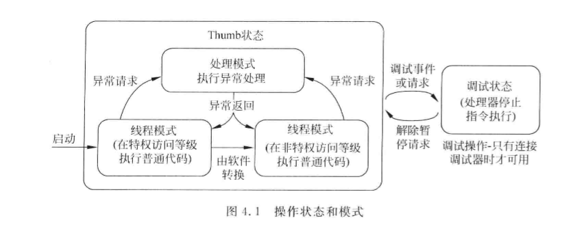
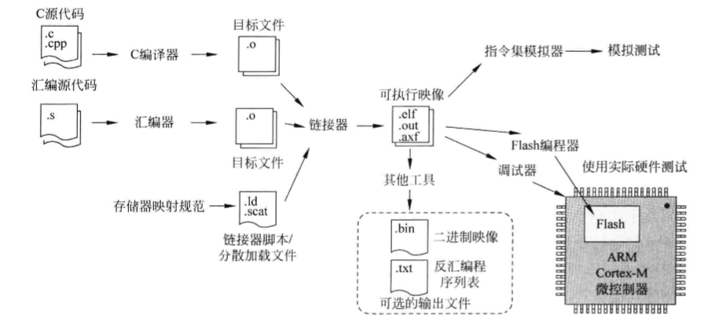

# ARM Cortex-M体系结构研究，STM32学习笔记（基于GNU工具链）

## 参考资料

*《ARM Cortex-M3与Cortex-M4权威指南（第3版）》，Joseph Yiu，2015.11，清华大学出版社*

*《ARM Cortex-M4 嵌入式实战开发精解 - 基于STM32F4》，廖义奎，2013.7，北京航空航天大学出版社*

## 1 ARMv7-M体系结构

## 1.1 简介

目前在低功耗微控制器中最主流的32位ARM核心有Cortex-M3以及Cortex-M4。这两种核心都使用**3级流水线**，**哈佛总线结构**，以及**统一的内存地址空间**，总共可以寻址**4GB**

Cortex-M核心的中断系统为**NVIC**（Nested Vectored Interrupt Controller），中文翻译为**嵌套向量中断控制器**，是属于核心的一部分。它支持最多240个中断请求以及8到256个中断优先级（具体要看实际的核心配置）

Cortex-M支持在一个MCU系统中集成多个处理器核心

另外Cortex-M还支持可选的MPU，用于提高运行时内存的安全性（目前绝大多数的MCU不会配备MPU。如果有MPU的需求一般直接使用Cortex-R系列核心）

## 1.2 ISA与微架构概览

由于MCU存储资源有限，为压缩程序大小，ARMv7-M的CPU只支持Thumb-2，不支持32位的ARM指令集。该指令集是对旧有Thumb指令集的扩展，是16位（2字节）或32位（4字节）可变长度的

+ 支持硬件除法

+ 支持字节（B）、半字（H）、单字（W）、双字（D）存储器访问与数据操作，可变的大小端模式

+ 支持累乘加`MAC`以及饱和指令

+ 支持多种跳转以及函数调用指令

Cortex-M4相比Cortex-M3多出了一些适用于DSP的指令，比如对于浮点数的硬件支持，以及SIMD指令等

### 1.2.1 架构，系统总线与中断控制

**架构**

ARMv7-M的处理器为典型的32位机，其通用寄存器（GPR），数据总线，总线接口都是32位，寻址也是32位所以总共支持4GB的内存空间。不同于8051等早期单片机，ARM使用统一的内存架构，包括SRAM，程序Flash以及各种外设寄存器等都位于相同的内存空间，拥有唯一的地址。这些使用ARM Cortex-M核心的MCU既可以在Flash中运行程序，也可以将程序放到SRAM中运行

**总线**

之前说过Cortex-M3，Cortex-M4都是使用3级流水线的哈佛结构，取指令和存取数据可以同时执行，当然前提是指令和数据不使用同一条总线。**一般在一个MCU中会有多片SRAM以及Flash，尽管它们使用统一的内存编址，这些存储器都拥有完全独立的总线。CPU核心以及DMA等通过总线交换矩阵和它们连接，可以同时访问不同的存储器**。这种情况下，如果将指令和数据放在同一片SRAM中将会导致总线冲突，降低流水线效率

基于Cortex-M的MCU内部都使用了AMBA标准总线，该标准由ARM规定。MCU中常见的有两种协议：**AHB Lite**以及**APB**。AHB总线是系统高速总线（矩阵），运行频率高，一般用于连接CPU，SRAM，Flash，DMA，APB桥，DMA-USB等。而APB用于一些低速IO外设，如I2C，SPI，USART，CAN，ADC，DAC等，**APB总线通过APB桥和AHB总线连接**。有些MCU中的APB也分为低速APB和高速APB

Cortex-M0以及Cortex-M0+属于ARMv6-M，并且使用冯诺依曼结构。这两种核心能耗较低，门电路数量少

**中断**

中断控制器NVIC属于Cortex-M核心的一部分。对于所有Cortex-M核心，NVIC的寄存器地址都是固定且相同的，并且也是使用和SRAM、Flash以及外设IO相同的地址空间。NVIC的编程模型都是相同的。NVIC支持**外设中断**，**NMI不可屏蔽中断**以及**处理器内部异常**等多种异常和中断，总共最多支持240个中断，除NMI以外所有中断都可以单独使能或禁止。NVIC还支持中断的屏蔽功能。Cortex-M3以及M4的中断优先级可以在运行时修改，Cortex-M0和M0+不支持该功能。中断向量取出由CPU硬件实现，无需软件检测

### 1.2.2 指令集ISA

以前更老的ARM处理器以及现在的Cortex-A核心一般都支持32位ARM指令。32位的ARM指令相比Thumb以及Thumb-2在执行时具有更好的性能，但是程序较大。为优化程序大小一般需要在ARM执行模式以及Thumb模式下来回切换

ARMv7-M直接舍弃了庞大的ARM指令。所有的Cortex-M核心（包括ARMv6-M的Cortex-M0以及M0+）都只支持Thumb-2的不同子集，ARMv7-M的处理器兼容ARMv6-M所有的指令。这些处理器也舍弃了部分在旧有Thumb中的指令，如协处理器指令，指令集状态切换指令等

绝大多数使用Cortex-M4核心的MCU都为核心配备了FPU（带FPU的M4核心），支持额外的FPU指令。而Cortex-M3没有FPU以及SIMD指令的支持

### 1.2.3 OS支持特性

Cortex-M3和M4带有SysTick节拍定时器，同时提供了两个栈指针**MSP**和**PSP**，分别用于OS和用户进程。在一般的应用中如果不使用OS特性，可以只使用MSP

另外，这两种CPU核心还支持特权以及非特权模式。在一般的应用中默认使用的是特权模式。非特权模式一般要在RTOS中的用户程序中才会使用到，这种模式会限制用户对于一些模块如NVIC的访问

### 1.2.4 工作模式

Cortex-M3和M4处理器有2种运行状态，分别为**Thumb状态**以及**调试状态**。其中**Thumb状态**分为2种操作模式，执行中断或异常处理程序时为**处理模式**，正常执行程序时为**线程模式**。另外Cortex-M3和M4核心除一般的**特权模式**以外还支持**非特权模式**（Cortex-M0不支持）

状态转换示意图如下

其中特权模式到非特权模式的转换是单向的，非特权模式想要到达特权模式只能通过异常转换。执行异常的处理模式属于特权模式。非特权模式主要就用于保护NVIC的寄存器。另外在支持非特权模式的处理器中，物理上有2个**SP**寄存器，一个用于特权模式，另一个影子寄存器用于非特权模式

## 1.3 常用软硬件以及程序原理

一般情况下，MCU厂商提供的SDK中除了各自的MCU外设库以外都会包含CMSIS（Cortex-M Software Interface Standard，由ARM提出并开发）。这个软件库包含了各种基本的库与头文件，以及针对各种Cortex-M核心的专有功能与对应函数（比如DSP函数库）

开发环境方面，以前最流行的就是Keil MDK和IAR了。然而现在各路MCU厂商都开始力推自家的开发环境，典型的有ST的STM32CubeIDE（基于Eclipse），TI的CCS（基于Eclipse），Microchip的Atmel Studio（基于Visual Studio）等。以前的IDE使用ARMCC编译器居多（现在Keil最新版已经转向LLVM），而现在越来越多的厂商开始使用GNU工具链。这也是总趋势

在运行调试方面，一般的MCU都支持JTAG和SWD两种调试接口。目前常用的调试硬件有JLINK，ULINK以及开源的CMSIS-DAP（Debug Access Port）。其中CMSIS-DAP由于其开放的特性，近几年已经得到广泛的采用。CMSIS-DAP其实就是一种开源的调试器固件实现，走USB-HID所以在所有操作系统平台免驱，用户可以对固件进行适当的更改以后下载到一个廉价的小型开发板上将开发板变成一个调试器（最流行的就是使用搭载STM32F103C8T6的BluePill）。而调试上位机除了各IDE集成的以外，目前在开源平台最流行的就是OpenOCD

如果想要在Linux平台开发ARM单片机，并且想要使用开源工具集，只使用SDK而不依赖IDE，那么最少需要ARM的GNU工具链（arm-none-eabi-gcc），OpenOCD，Make（CMake看情况），再使用一个小核心板烧录一个CMSIS-DAP作为调试器即可

在Windows平台如果想要不依赖IDE自己搭建开发环境，建议安装MSYS2

### 1.3.1 编译流程

在PC上编译单片机程序就是交叉编译。关于GNU工具链的组成与工作流程可以见[笔记](210731a_llvm.md#11-编译器基本工作流程)

编译单片机程序时，一般首先需要提供一个`.s`启动文件。这个启动文件使用汇编语言编写，相当于单片机的Bootloader，单片机在上电时会首先执行该程序对时钟等部件进行初始化，建立一个合适的程序执行环境，再调用`main()`函数开始执行用户程序

如上图，最终就是将所有的`.c`源代码以及`.s`汇编代码全部编译为`.o`可重定位二进制文件，最终通过`ld`链接器链接成为可执行映像。其中`ld`链接过程需要用到的链接器脚本有时会随厂商的开发环境发布。实际的应用中建议直接使用`gcc`自动调用工具链

### 1.3.2 程序结构

**轮询**

轮询是最傻瓜式的程序结构，基本原理就是将整个重复的工作流程编写成为一个大循环，两次循环之间一般会加入软延时（一般是`delay()`函数）。这种程序经过恰当的设计可以实现功能，但是缺点很多：代码难以维护，循环间隔时间难以控制，能耗比差，CPU利用率较差，反应迟钝等。只适合在初学者在要求不严格的场合使用

**中断**

实际的应用中建议使用**中断驱动**的程序设计模式。这种工作模式下，定时任务不依赖CPU的软延时，而是依赖定时器产生的中断。而无法预测的突发事件同样通过中断服务程序处理。事实上中断系统才是单片机良好工作表现的根本保证。所有的单片机中断系统都支持中断优先级，更高级别的中断可以打断低级别的中断程序。这种工作模式下，定时任务会有精准的时间间隔，突发事件也可以得到及时的响应。同时CPU在无任务执行时可以进入休眠或最低功耗模式，节省能源

**RTOS实时操作系统**

随着MCU程序的不断复杂化，有时会遇到更加复杂的控制需求，比如多个任务同时执行的需求，这使用中断程序已经难以满足要求，就需要用到时间片轮转等方式，需要一个调度器。这种情况下就要使用到RTOS，这些RTOS一般还有信号量以及消息等特性。但是使用RTOS会占用更多的资源，有些低端MCU限于内存与Flash大小基本无法使用RTOS，这就要结合实际进行权衡。目前已经有上百种开源RTOS，这些RTOS也是学习操作系统原理的良好选择

## 1.3.3 CMSIS

CMSIS由ARM提出并被所有使用ARM核心的MCU厂商所采用。CMSIS标准只和ARM有关，目的就是为了保证单片机软件的复用性，兼容性，可移植性，工具链独立性以及开放性，开发者可以通过这些代码访问Cortex-M处理器的各种特性。CMSIS还提供了DSP算法的实现，以及RTOS的API定义，避免开发者重复造轮子造成混乱。CMSIS-DAP也是属于CMSIS项目的一部分

CMSIS包括但不限于以下功能：

+ 和处理器有关的部件的寄存器定义，如中断控制器NVIC，节拍定时器SysTick以及SCB的寄存器定义等，以及和这些外设有关的C函数（API）

+ 用于特殊指令的C函数（否则要使用内联汇编实现），如`WFI`

+ 为各种异常处理进行了命名

+ 系统的初始化函数（`SystemInit()`，对于不同的MCU该函数有不同的实现）

+ 时钟频率数值的获取

+ 常用DSP函数的实现

CMSIS事实上是可有可无的，程序开发者不使用CMSIS提供的各种定义也可以实现功能，但是建议开发者还是充分利用CMSIS提供的函数与功能，避免重复冗余的劳动

## 1.4 ISA详解

### 1.4.1 寄存器定义

**通用寄存器组GPR**

定义如下

> 其中，R0到R12可以分为高低两组，低组8个为R0到R7，高组5个为R8到R12。限于Thumb指令的长度要求，**绝大多数16位长度的指令都只能使用低8个寄存器**。而高5个寄存器只有32位指令以及少数16位指令可用
>
> R13寄存器又称为**SP**，作为栈指针使用，一般不做其他用途。栈用于存储局部变量，以及在函数或子程序调用、中断处理时寄存器现场的保存。在Cortex-M3和M4中两个物理上的寄存器分别为**MSP和PSP**，分别用于**特权模式**以及**线程模式**。在运行过程中，当前使用到的寄存器是MSP还是PSP由特殊寄存器**CONTROL**的设置决定，一般只有RTOS才会涉及到PSP的使用。**在ARM中栈是从高地址向低地址生长的**，同时**栈访问必须是4字节对齐的**，所以事实上SP的低2位没有作用，总是00。另外，**复位后MSP的初始值是从中断向量的最开头4字节取出的**
>
> R14寄存器又称为**LR**，作为链接寄存器使用。在程序中如果发生了函数或子程序调用，LR寄存器会自动保存该函数返回时的地址。在函数与子程序运行结束以后，LR中的地址就会被加载到PC中，返回到原来的地方继续执行。而中断触发不同，LR会被更新为特殊值**EXC_RETURN**，这会在之后的中断中讲到。此外，在处理嵌套子程序调用时同样**需要将LR压栈**，否则返回的地址就丢失了。因为Cortex-M的Thumb-2指令集是2字节或4字节可变长的，所以**指令的访问是2字节对齐的**，而LR的最低位事实上是有意义的，部分调用指令需要**将LR最低位置1表示使用Thumb状态**（**这是Cortex-M在舍弃掉ARM指令后的遗留问题**）
>
> R15寄存器又称为**PC**，作为程序计数器使用。由于ARM处理器的流水线结构，读取PC获得的地址是**当前正在执行指令的地址加4**。使用一般寄存器指令写PC寄存器也会触发跳转。和LR寄存器类似的，使用部分跳转指令以及寄存器操作指令操作PC时需要将最低位置1。一般情况下函数调用以及跳转**会使用专门的指令**而不是使用一般指令写PC实现，但是在访问连续的常量字符数据时可以将PC作为基址寄存器使用

**程序状态寄存器PSR**

## 2 STM32F103C8T6/C6T6

## 3 STM32F401CCU6/411CEU6

## 4 STM32F407VET6

## 补充：ARMv6-M体系结构（Cortex-M0+）

ARMv6-M仅仅支持16位长的Thumb指令