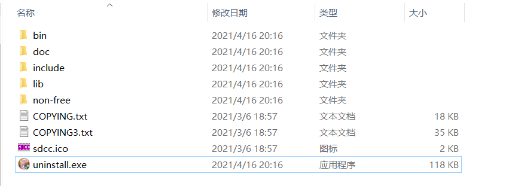

# 基于VSCode以及开源工具链的通用MCU开发环境，适用于Windows，Linux，FreeBSD

**本环境要求最好有Linux基础，~~主要面向经常使用Linux或FreeBSD的Windows用户~~**

支持的MCU：8051（Atmel，STC），ARM（ST，TI，Atmel）

未来添加对于AVR（Atmel）的支持，适用于Arduino

上次编辑于：2021.05.31


## 1 环境搭建

### 1.1 基本环境配置

### 1.1.1 编辑器安装

安装VSCode（步骤略，一般Linux下VSCode的开源许可证版本为OSS）


### 1.1.2 Windows下的MSYS2安装

如果是Windows，安装[MSYS2](https://www.msys2.org/)

> MSYS2是一个Windows下的类Unix环境，类似并**包含了mingw和llvm-clang软件集，集成`pacman`包管理器**，可以方便下载安装各种开源软件比如Git，Make，GCC，LLVM，CMake，像使用ArchLinux一样使用Windows
> MSYS2还有一个非常有趣的地方在于，插上CH340或者CP2102之后你甚至可以直接在Shell下操作串口，一般在`/dev/ttySx`

**首先配置Windows环境变量**，这样可以直接使用`bash`，也可以`Win+R`调出`msys2`或`mingw64`

设MSYS2安装在`D:\msys64`，那么

> 1. 在`Path`变量末尾添加`D:\msys64\usr\bin`（为了能运行基本的软件如`bash`，`make`等）
> 2. 添加`D:\msys64\mingw64\bin`和`D:\msys64\mingw32\bin`（为了使用mingw下的软件，比如mingw版的arm工具链）
> 3. 添加`D:\msys64\clang64\bin`和`D:\msys64\clang32\bin`
> 4. 添加`D:\msys64`（`Win+R`调出`msys2`和`mingw64`）

**使用方法1（直接运行bash，推荐）**：如果配置正常，`Win+R`运行，输入`bash`启动，此时`bash`继承了Windows的`Path`环境变量，现在既可以使用MSYS2下已经安装的软件，也可以使用Windows的命令

**使用方法2（常规方法，在msys2或mingw64或clang64下运行bash）**：`Win+R`运行，可以直接启动`msys2`并提供一个`bash`操作界面，但是注意`msys2`中的`$PATH`不是继承于Windows下`Path`环境变量，所以要用到其他命令时需要配置`$PATH`

其他更多有关MSYS2常规的配置（比如改镜像源，pacman更新）此处省略


### 1.2 工具链部署

### 1.2.1 安装make

安装`cmake`和`make`，有需要的话安装`git`

**Windows**

通过MSYS2安装

```shell
pacman -S cmake make
```

**ArchLinux**

```shell
pacman -S cmake make
```

**FreeBSD**

```shell
pkg install cmake gmake make
```


### 1.2.2 8051工具链

使用[SDCC](http://sdcc.sourceforge.net/)，官方[手册](http://sdcc.sourceforge.net/doc/sdccman.pdf)

SDCC是一个适用于8051，PIC，STM8等经典MCU的工具集

一般的Linux发行版也可以通过官方仓库安装，但是可能版本较老

SDCC虽然难以实机调试，但是已经包含了8051模拟器（还有Z80，6808，STM8模拟器，具体使用有待研究），使用`sdcdb`调试即可

**Windows**

[下载](https://sourceforge.net/projects/sdcc/files/sdcc-win64/)页面

安装完成后，允许SDCC自动配置环境变量

此时启动`bash`，输入`sdcc`，正常情况下会有输出


**ArchLinux**

```shell
pacman -S sdcc
```

**FreeBSD**

```shell
pkg install sdcc
```


### 1.2.3 ARM（Cortex-M）工具链

可以直接通过官方仓库安装，使用GNU或LLVM工具链（**建议使用GNU工具链**，目前OpenOCD对GDB支持较好，LLDB未知）

**Windows**

`Win+R`，打开`bash`

```shell
pacman -S mingw-w64-x86_64-arm-none-eabi-toolchain
```

安装了包含`arm-none-eabi-gdb`在内的工具

**ArchLinux**

```shell
pacman -S arm-none-eabi-gcc arm-none-eabi-binutils arm-none-eabi-gdb
```

**FreeBSD**

~~FreeBSD正在去GNU化~~，官方仓库只有`arm-none-eabi-gcc`，可以使用`llvm`工具链作为替代（目前最新的Keil AC6已经转向`llvm`），或者下载`arm-none-eabi`编译安装

```shell
pkg install llvm
```


### 1.2.4 OpenOCD

OpenOCD是一个开源的调试服务器，会连接调试器（比如ST-LINK）驱动并负责接受`arm-none-eabi-gdb`的连接与调试。**建议安装最新版**

[官网](openocd.org)

[GNU toolchains](https://gnutoolchains.com/arm-eabi/openocd/)

[参考文档](http://openocd.org/documentation/)

**Windows**

MSYS2官方库有OpenOCD软件包，这里还是使用传统方法安装

OpenOCD Windows [下载](https://www.gnutoolchains.com/arm-eabi/openocd/)

假设解压到`D:\OpenOCD`下，需要添加`D:\OpenOCD\bin`到`Path`

**ArchLinux**

```shell
pacman -S openocd
```

**FreeBSD**

目前只有10版

```shell
pkg install openocd
```


### 1.3 硬件驱动

### 1.3.1 串口

Windows下常用串口VCP驱动

CH340 [南京沁恒](http://www.wch.cn/products/CH340.html)

CP2102 [Silicon Labs](https://www.silabs.com/developers/usb-to-uart-bridge-vcp-drivers)

FT232 [FTDI](https://ftdichip.com/drivers/vcp-drivers/)


### 1.3.2 调试器（Linker）驱动

如果是在Linux或者FreeBSD下，各种调试器在安装完OpenOCD之后应该就已经可以直接用了，而Windows下调试器驱动需要手动安装

CMSIS-DAP（开源） [ARM](https://www.keil.com/support/man/docs/dapdebug/dapdebug_introduction.htm)Keil官方 

CMSIS-DAP [Github1](https://github.com/RadioOperator/STM32F103C8T6_CMSIS-DAP_SWO)，[Github2](https://github.com/wuxx/nanoDAP)，需要自己编译烧录

ST-Link [ST](https://www.st.com/zh/development-tools/stsw-link009.html#get-software)

J-Link [SEGGER](https://www.segger.com/downloads/jlink/#J-LinkSoftwareAndDocumentationPack)

[OpenOCD](https://gnutoolchains.com/arm-eabi/openocd/)也有以上部分调试器驱动，可以直接使用里面的驱动


## 2 8051单片机

### 2.1 工具链使用：SDCC

### 2.1.1 SDCC的目录结构与组成

Windows下SDCC的目录如下



| Windows目录 | Linux安装目录 | FreeBSD安装目录 | 内容 |
| :-: | :-: | :-: | :-: |
| bin | /usr/bin | /usr/local/bin | 二进制文件，SDCC的各种工具，包括编译器，汇编器，连接器，调试器，模拟器，hex文件生成器等 |
| include | /usr/share/sdcc/include | /usr/local/share/sdcc/include | 头文件 |
| lib | /usr/share/sdcc/lib | /usr/local/share/sdcc/lib | 库文件 |
| non-free/include | /usr/share/sdcc/non-free/include | /usr/local/share/sdcc/non-free/include | 非自由许可证头文件 |
| non-free/lib | /usr/share/sdcc/non-free/lib | /usr/local/share/sdcc/non-free/lib | 非自由许可证库文件 |

命令：

| 命令 | 作用 |
| :-: | :-: |
| `sdcc` | 主要的编译器，将根据不同的指令集生成不同的汇编代码 |
| `sdcpp` | 预处理器 |
| `sdas8051 sdas390 sdasz80 sdasgb sdas6808 sdasstm8` | 不同指令集的汇编器 |
| `sdld sdldz80 sdldgb sdld6808` | 链接器 |
| `sdcdb` | 调试器 |
| `s51 sz80 shc08 sstm8`  | ucSim模拟器 |
| `sdar sdranlib sdnm sdobjcopy` | 用于库文件的操作 |
| `packihx` | 将.ihx文件转换为.hex文件用于烧录，输出到标准输出 |
| `makebin` | 将.hex转换为二进制.bin文件，输出到标准输出 |


### 2.1.2 SDCC的工作流程简介

在最为简单的情况下，`sdcc`调用`sdcpp`进行预处理，之后编译为汇编代码，然后调用对应`sdas`和`sdld`编译出目标代码

包含的头文件，**如果使用了`-I`参数进行指定，那么会优先到指定的目录下查找头文件，之后再到安装的`include`以及`non-free/include`下面找**。而类似的对于库文件来说，如果使用`-L`参数指定，那么同样会优先到指定的目录下查找


### 2.1.3 SDCC编译方法

**`sdcc`参数**

| 命令行参数 | 作用 |
| :-: | :-: |
| `--std-sdcc99` | c99标准，带sdcc扩展 |
| `--std-sdcc11` | c11标准（默认选项），带sdcc扩展 |
| `-mmcs51` | 指定为8051指令集，默认选项 |
| `-E` | 仅预处理，处理结果输出到标准输出 |
| `-S` | 仅预处理和编译，生成`.asm` |
| `-c` | 预处理、编译和汇编，但不链接，生成`.rel`，`.lst`，`.sym` |
| `-o` | 指定输出文件名或输出到目录，目录名必须带`/` |
| `--debug` | 如果需要使用`sdcdb`和模拟器调试，那么编译时在最后添加该选项 |
| `-V`或`-v` | 显示过程 |
| `--opt-code-size` | 向程序大小优化 |
| `--opt-code-speed` | 向程序速度优化 |
| `-Wp option1,option2` | 向`sdcpp`传参 |
| `-Wa option1,option2` | 向汇编器传参 |
| `-Wl option1,option2` | 向链接器传参 |

**`sdcpp`预处理参数**

| 命令行参数 | 作用 |
| :-: | :-: |
| `-I` | 添加头文件路径 |
| `-Dmy_macro=xxx` | 添加宏定义 |
| `-Umy_macro` | 去除宏定义 |
| `-M`或`-MM` | 从标准输出显示每个目标文件的文件依赖，`-M`显示全部 |
| `-dM` | 显示最终有用的宏 |
| `-dD` | 显示所有宏 |
| `-dN` | 显示所有宏，但是不显示宏内容 |

**链接器参数**

| 命令行参数 | 作用 |
| :-: | :-: |
| `-L` | 添加库文件路径 |
| `--xram-loc 0x8000` | 指定外部RAM起始位置为`0x8000` |
| `--code-loc` | 指定代码区起始位置 |
| `--stack-loc` | 指定堆栈起始位置 |
| `--xstack-loc` | 指定外部堆栈起始位置 |
| `--data-loc` | 指定内部RAM数据区起始位置 |
| `--idata-loc` | 指定间接寻址RAM起始位置 |
| `--bit-loc` | bit寻址起始位置 |

**mcs8051专有参数**

| 命令行参数 | 作用 |
| :-: | :-: |
| `--model-small` `--model-medium` `--model-large` `--model--huge` | 指定内存模型 |
| `--xstack` | 使用pseudo stack |
| `--iram-size` | 链接器检测内部RAM是否在限制以内 |
| `--xram-size` | 链接器检测外部RAM是否在限制以内 |
| `--code-size` | 链接器检测代码大小是否在限制以内 |
| `--stack-size` | 链接器检测堆栈大小 |

**`sdcc -c main.c`编译后生成各文件作用**

| 后缀名 | 作用 |
| :-: | :-: |
| `.asm` | `sdcc`通过预处理和编译生成的汇编源文件 |
| `.rel` | 汇编器的输出，作为链接器的输入 |
| `.lst` | 汇编器生成的汇编列表文件 |
| `.sym` | 汇编器生成的符号列表 |

**如果是`sdcc main.c`，相比不链接多出以下文件**

| 后缀名 | 作用 |
| :-: | :-: |
| `.ihx` | 加载模块，Intel的hex格式文件 |
| `.lk` | 链接器命令行参数 |
| `.map` | 链接器的输出，加载模块的memory map |
| `.mem` | 内存使用统计 |
| `.rst` | 链接器输出，添加了linkedit信息的汇编列表文件 |

**`--debug`模式，相比普通模式会多出以下文件**

| 后缀名 | 作用 |
| :-: | :-: |
| `.cdb` | 调试信息文件 |
| `.adb` | 包含调试信息，用于生成.cdb文件的中间文件 |
| `.omf` | absolute object module format，包含调试信息（AOMF51格式），用于第三方工具 |

**最后输出文件的处理**

| 命令 | 作用 |
| :-: | :-: |
| `packihx` | 将`.ihx`转换为标准`.hex`文件，输出到标准输出 |
| `makebin` | 生成`.bin`二进制文件，输出到标准输出 |

**简单的多文件编译方法**

> 假设有main.c，lib1.c，lib2.c三个文件的工程
> 可以有如下两种编译方法

```shell
sdcc -c lib1.c
sdcc -c lib2.c
sdcc main.c lib1.rel lib2.rel
```

```shell
sdcc -c lib1.c
sdcc -c lib2.c
sdcc -c main.c
sdcc main.rel lib1.rel lib2.rel
```


### 2.1.4 使用库

`sdcc`同样支持`.lib`库的使用，生成`.lib`库时最好将不同的功能模块写到不同源文件

```shell
sdcc main.c mylib.lib -L libdir
```

可以使用`sdar`创建`.lib`库文件

```shell
sdar -rc mylib.lib module1.rel module2.rel module3.rel
```

### 2.1.5 基于sdcdb的调试

如果想要调试，就必须在编译时加上`--debug`选项，生成`.cdb`文件

假设调试`sample.c`，已经编译完成，`sdcdb`会自动启动相应模拟器

```shell
sdcdb -cpu 8051 sample
```

**`sdcdb`命令行参数**

| 命令行参数 | 作用 |
| :-: | :-: |
| `--directory=` | 指定查找目录，调试器会查找`.c` `.ihx` `.cdb` |
| `-cd` | 到指定目录 |
| `-cpu` | 指定cpu类型 |
| `-X` | 指定晶振频率 |
| `-s` `-S` `-k` | 模拟器参数 |


**`sdcdb`交互命令**

大部分命令和`gdb`类似

| 命令 | 作用 | 使用方法 |
| :-: | :-: | :-: |
| `break` | 设置断点 | `break [file:]<line|func>` |
| `clear` | 清除断点 | `clear [file:]<line|func>` |
| `continue` | 断点后继续 |  |
| `finish` | 执行到当前函数末尾 |  |
| `delete` | 删除断点n，不指定断点则删除所有 | `delete [n]` |
| `info` | 最重要的命令，显示各种信息，后加`break`显示当前所有断点，`stack`显示函数调用堆栈，`frame`显示当前执行frame，`registers`显示所有寄存器内容 | `info [break|stack|frame|registers]` |
| `step` | 单步调试 |  |
| `next` | 单步调试，经过子程序调用 |  |
| `run` | 启动调试程序 |  |
| `ptype` | 显示变量类型 | `ptype var` |
| `print` | 显示变量值 | `print var` |
| `file` | 加载文件 | `file filename` |
| `frame` | 显示当前`frame`信息 |  |
| `set srcmode` | 切换C源码或汇编源码调试模式 |  |
| `!` | 模拟器命令 | `! cmd` |
| `quit` | 退出调试 |  |


### 2.2 STC的89C51系列开发（STC89C52RC）


## 3 ARM单片机

### 3.1 工具链使用：arm-none-eabi-gcc

### 3.2 工具链使用：llvm

### 3.3 ST的STM32系列开发（STM32F103C8T6，STM32F407VET6，STM32F401CCU6）（Third party boards）

### 3.4 Atmel的SAM系列开发（ATSAM3X8E）（Arduino DUE）

### 3.5 TI的Tiva系列开发（TM4C123GH6PM）（TI EK-TM4C123GXL）

## 4 AVR单片机

暂无