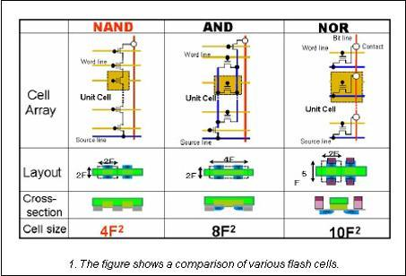
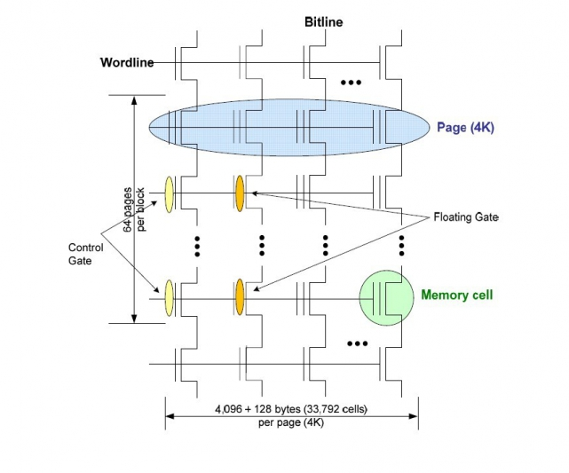
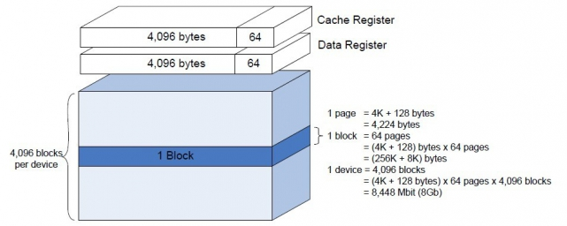
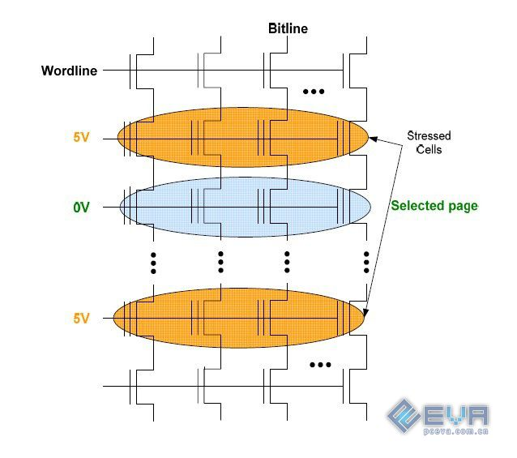
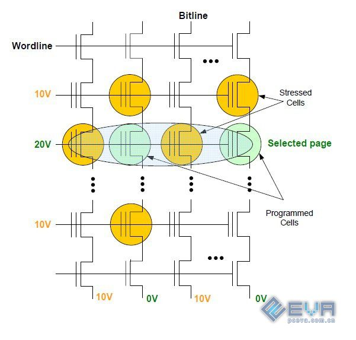
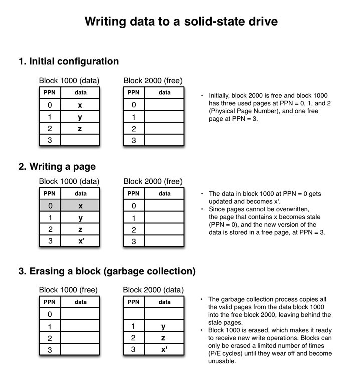

# 有关固态硬盘SSD的原理学习

## 参考

主要参考网络零散资料

重点参考文章[链接](http://codecapsule.com/tag/solid-state-drives/)，作者Emmanuel Goossaert，是荷兰booking.com的一个工程经理，个人[主页](http://goossaert.com/)

## 1 固态硬盘物理结构

目前常见非易失存储器分为NAND以及NOR两大阵营，两者都是由Fujio Masuoka发明改良而来。

NAND，NOR，顾名思义，其内部结构和与门、或门的构造原理有很大相似之处。其根本由特制的场效应管组成，也有S，G，D极之分，区别是在G极之下添加了一个浮空栅。非易失存储器基本存储单元如下图所示：

浮空栅和G极以及衬底之间都有很薄的一层二氧化硅，用于隔开浮空栅防止电荷泄露，浮空栅用于长时间存储电荷。在NAND中，单个数据单元的读写都是通过电子隧道效应，通过给G极施加适当电压就可以对浮空栅极进行充放电。而在NOR中，充电是通过源极对浮栅进行热电子注入进行充电，而放电和NAND相同。

NAND各存储单元采用串联的形式，而NOR采用并联的形式，这也是其名称的由来。NAND属于块设备，操作基于块，软件上使用块号，页号，页内偏移量三级寻址，不可以直接寻址，因此不可以直接执行代码；而NOR可以直接寻址，操作基于字节或字，因此可以直接执行代码（比如STM32的QSPI Flash）。

NAND相比NOR成本更低，功耗也更低，目前固态硬盘等大容量块设备都是基于NAND。而NOR由于直接寻址特性应用同样很广泛，多用于单片机存储器，x86计算机的BIOS等。

### 1.1 NAND基本构成

NAND基本由Block构成，每个Block又由若干Page构成。NAND以Page为基本读写单元，而擦除以Block为单位进行擦除。一般一个页大小为4KB（这也是SSD要进行4K对齐的原因）。如三星840evo的Page大小为8KB，每个Block有256个Page，记块大小为2048KB，需要8K对齐。目前如Linux的fdisk分区工具，会自动检测并进行对齐。

一般一个颗粒的逻辑结构如下，一个Page另外带128字节的Cache和数据寄存器

由之前的存储单元的基本结构（带浮空栅的NMOS）大概可以猜到了，为什么一个颗粒可以开成SLC，MLC，TLC，乃至QLC，甚至以后的PLC（当然前提是技术支持），这里把图再放一遍。

一个颗粒可以代表0或者1，取决于其是否导通。而导通与否并不是绝对的，而是有一个阈值。参考NMOS工作原理，当NAND单元充电时电子由于隧道效应从S极穿过绝缘层到达悬浮栅极，使得悬浮栅极带上负电荷，MOS管倾向于截止。拿最简单粗暴的SLC来说，其悬浮栅极的电压高于Vth算为导通，代表1，为擦除后默认状态，而在充电后悬浮栅极的电压低于Vth，代表0。

而MLC、TLC等之所以可以在一个存储单元存储多个比特位，根本在于其一个比特位可以有多种状态，以MLC为例，设其浮栅电压为（Vth0~Vth1）时代表00，电压为（Vth1'~Vth2）时代表01，以此类推，共有4种状态，读取的直观感受就是读取时通过Cell电流的大小。

由此不难理解为什么使用TLC颗粒的固态理论上可以开卡开成MLC，SLC。目前绝大多数中低端固态主控没有独立DRAM缓存，这些固态为提高性能一般会将部分单元开成SLC作Cache使用，同时也解决了掉电保存的难题。所谓TLC，MLC，SLC，其实可以看作颗粒的工作模式，而不是颗粒的固有属性。

一般固态硬盘所说的缓外，就是指的SLC缓存使用完后的实际写入速度（相当于TLC直接写入速度），而缓内就是SLC直接写入速度。

## 2 固态硬盘工作机制

有关于固态硬盘的读取、写入以及擦除操作

### 2.1 读取

读取操作如下

读取时，打开一个Block的上下两排控制场管，最上方wordline连接检测电路，最下方场管连接低电势位。将除目标Page以外的所有Page控制栅极通上适当电压（可以使得一个Page的所有Cell导通又不至于导致其浮空栅极被充电造成数据破坏），检测电流从wordline进入。若检测到场管导通则代表1，截止代表0。

在实际操作中，读取会产生读取干扰，具体表现就是临近单元会由于电压波动而改变状态。

### 2.2 写入与修改

写入操作如下

**一个Page只能在标记为空闲状态下被写入，而不能被覆写**

**因此，想要修改一个Page的内容，就需要先将该页读取到寄存器，原先页状态被修改为stale，修改之后再存储到空闲页中**

写入时，最上方wordline截止，而最下方场管导通，输入要Program的数据，设0V代表0，Vp代表1（图中为10V，实际现代工艺不需要这么高电压）。设可以改变一个Cell（从1变为0）的条件是Vgs=2Vp。未编程时MOS为导通状态，为1。不需要Program的页控制栅极输入Vp，需要Program的一列Vgs=Vp导通，其他列截止。而需要Program的Page的控制栅极输入2Vp，这时Vgs=2Vp，这会导致S极为0V的Cell被充电更改为0。而其他Cell由于没有足够的Vgs，因此不变依然为1。Vgs=2Vp时，电子可以从Cell的S极通过隧道效应穿过绝缘层到达悬浮栅极而滞留，使悬浮栅极电压降低，Cell截止变为0。

以下为例，设想要修改Page0，修改x重新写入并回收原Block的过程如下

NAND之所以写入擦除次数（P/E Cycle）有限，就是因为电子在穿过绝缘层时，会部分滞留在绝缘层以内，并且这个过程是不可逆的。久而久之绝缘层永久带上负电，电子也无法到达悬浮栅极，导致Cell损坏，产生坏块。虽然曾经有研究表明对NAND芯片施加高温可以修复这些坏块，然而事实上目前还很少有实际应用出现。

在实际操作中，写入也会产生写入干扰，并且相比读取干扰严重的多，一般由于一个Page充电时导致临近Page电压也升高，导致出现差错。

NAND的坏块纠错使用ECC或EDC实现。

### 2.3 擦除

NAND擦除操作只能以Block为单位。

擦除操作对于用户来讲是透明的，用户只知道读取和写入。擦除操作由SSD主控的垃圾回收机制自动完成。

### 2.4 ECC

常用ECC算法：

1.Reed-Solomon

2.Hamming

3.BCH (Bose, Ray-Chaudhuri, Hocquenghem)

Block中一个Page结构如下：

Page被写入同时会生成一个ECC签名存储在SA中，下次取时主控会计算ECC签名并与该ECC比较，如果不同就会自动进行纠错

ECC性能对NAND总体性能影响很大

### 2.5 常用性能评估单位

Throughput吞吐率：一般指读写速率，一般以MB/s，KB/s计算，通常用于评估顺序读写性能

IOPS每秒操作数：SSD为块设备，这个单位指每秒操作的数据块数，通常用于评估随机读写性能

Latency延迟：发出一个指令到收到回应经历的时间，以ms计

这3个参数都是重要参数，没有哪个更重要之分。吞吐量大的硬盘不代表性能就好，如果传输速率快而延迟很大那么执行多条指令的宏观性能还是会比较差。

### 2.6 写入放大（Write amplification）

只要是会导致非必要多余写入的操作就被称为写入放大

最低效的情况就是，用户仅仅修改一个Byte，然而这却导致SSD对一个Page进行修改重写，有的SSD的Page大小达到了8KB。**另外写入SSD时若未对齐页，也会发生写入放大。未对齐时，当写入一个Page的新数据，SSD需要将之前Page空闲部分读入cache，修改后和写入数据剩余的另半部分写入两个空闲Page中，这个操作被称为Read-Modify-Write，应当避免。相比直接将该Page写入到一个空闲Page中，这会造成大量不必要的操作，增加回收负担，拖慢速度，也会降低SSD的寿命。**

建议：

+ **避免写入小于一个Page的数据：** 当数据小于Page大小时不要写入。目前市场上的SSD最大页大小为16KB，所以设计软件时要以此为基准

+ **对齐写：** 写入操作对齐页大小，并且保证写入数据大小是Page的整数倍

+ **写缓存：** 将小的操作缓存在RAM的Buffer中，满后再写入到SSD

### 2.7 磨损（Wear leveling）

正因为NAND寿命有限，所以SSD主控要均衡各Block的读写，以防止个别Block过早的报废，导致磁盘容量快速下降（通常所说的缩盘）

### 2.8 FTL层（Flash Translation Layer）
