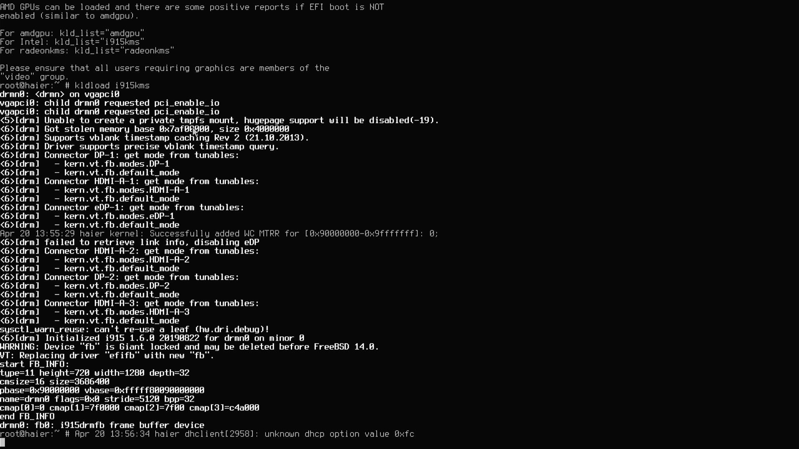
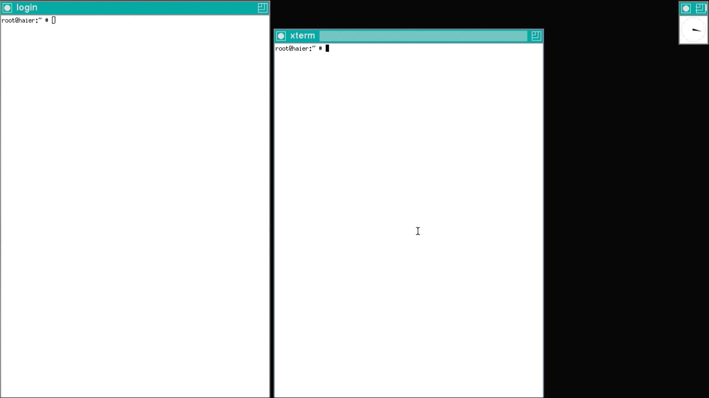
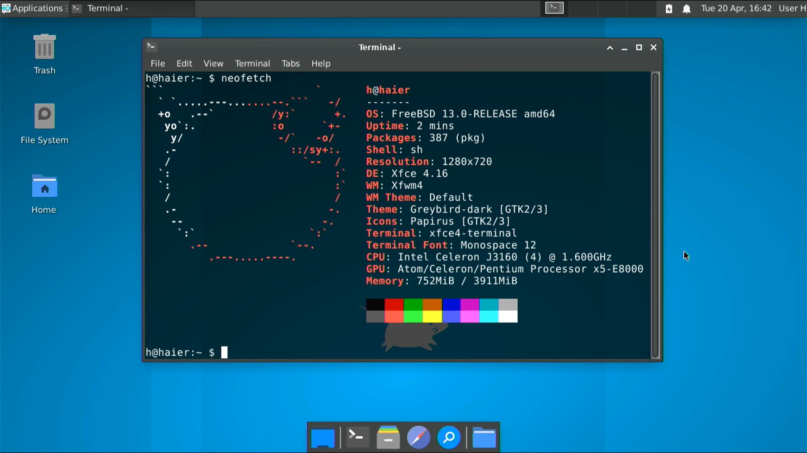

# FreeBSD作为桌面系统使用的安装过程以及注意事项

上一次更新日期：2022-04-09

## 简介

记录有关FreeBSD作为桌面系统使用的安装过程，以及注意事项

常用参考

[FreeBSD Handbook](https://docs.freebsd.org/en/books/handbook/)

[FreeBSD Manual Pages](https://www.freebsd.org/cgi/man.cgi)

[FreeBSD Wiki](https://wiki.freebsd.org/)

[FreeBSD 论坛](https://forums.freebsd.org/)

[FreshPorts](https://www.freshports.org/)

## 平台配置

> CPU：Intel Celeron J3160(4) @ 1.6GHz
>
> GPU：Intel HD Graphics 400 (Gen8)
>
> 内存：2 x 2GB DDR3
>
> 硬盘：KIOXIA 240G SATA SSD & Seagate 500G 5400rpm HDD
>
> 启动模式：UEFI x64
>
> 磁盘分区格式：GPT

# 13.0-RELEASE

## 1 下载镜像

[FreeBSD官网镜像下载](https://download.freebsd.org/ftp/releases/amd64/amd64/ISO-IMAGES/13.0/)

使用U盘启动安装，下载memstick安装镜像，使用`xz -dk`解压后，再使用`dd`命令将.img镜像刻录到u盘


## 2 基本安装

从Intel的H7x/B7x（差不多也就是3代酷睿时代，2012年左右）开始绝大部分Intelx86平台都支持UEFI启动，这里就只记录UEFI启动模式的安装方法。Legacy模式基本不用太复杂的操作就不赘述了

安装前建议将RTC时钟设置成UTC时间。开机进启动项选择U盘启动，到Bootloader界面，按B启动多用户模式

基本安装非常简单，大部分步骤照着bsdinstall的提示走就行了

UEFI安装的主要难点在于磁盘分区和启动引导的解决，大部分配置默认就行


### 2.1 磁盘分区

bsdinstall自带的磁盘分区界面不太友好，这里提供使用Shell分区的方法，便于灵活操作分区

UEFI启动模式需要一个ESP分区，一般为FAT32格式

如果是空磁盘先创建一个GPT分区表，这里假设磁盘为ada0

```shell
gpart create -s gpt ada0
```

创建分区，假设创建一个200M的ESP分区和一个32G的主分区（/dev/ada0p1和/dev/ada0p2）

```shell
gpart add -t efi -s 200M ada0
gpart add -t freebsd-ufs -s 32G ada0
```

格式化分区，其中EFI分区格式化为FAT32，根目录分区格式化为UFS2

```shell
newfs_msdos -F 32 -c 1 /dev/ada0p1
newfs -U -L FreeBSD /dev/ada0p2
```

如果是SSD，可以使用`tunefs`打开UFS2的TRIM功能，经常使用的情况下可以定期TRIM延长SSD寿命

```shell
tunefs -t enable /dev/ada0p2
```

如果想要创建swap分区的可以如以下操作，比如创建一个2G的swap分区（ada0p3）

```shell
gpart add -t freebsd-swap -s 2G ada0
```

swap分区可以通过`swapon`挂载，这里先不必挂载

```shell
swapon /dev/ada0p3
```

最后使用`ee`编辑fstab，文件位于/tmp/bsdinstall_etc/fstab

> 附：个人分区方案参考
>
> ```
> /dev/ada0p3       /         ufs       rw              0 1
> /dev/ada1p3       none      swap      sw              0 0
> /dev/ada1p5       /var      ufs       rw              0 2
> /dev/ada1p8       /home     ufs       rw              0 2
> tmpfs             /tmp      tmpfs     rw,mode=1777    0 0
> ```

最后挂载分区到/mnt，如果想要将其他分区挂载到/home，就要创建目录挂载，以下为例

```shell
mount /dev/ada0p2 /mnt
mkdir /mnt/home
mount /dev/ada1p1 /mnt/home
```

`exit`退出Shell，bsdinstall即开始自动安装


### 2.2 启动引导

启动引导问题可以在分区之前处理，也可以到所有安装都结束以后再进入Shell处理，只要有ESP分区就可以

将loader.efi拷贝到ESP分区下EFI/FreeBSD/BOOTX64.efi，也可以叫其他的

```shell
mount -t msdosfs /dev/ada0p1 /mnt
mkdir -p /mnt/EFI/FreeBSD
cp /boot/loader.efi /mnt/EFI/FreeBSD/BOOTX64.efi
```


### 2.2.1 单系统引导

使用efibootmgr将其注册到BIOS的启动项中，名字这里叫FreeBSDBoot，也可以叫其他的

```shell
efibootmgr -c -l /mnt/EFI/FreeBSD/BOOTX64.efi -L FreeBSDBoot
```

这时候efibootmgr会输出创建启动项的序号，比如0001，需要将0001设为active态（由*标记）

```shell
efibootmgr -B 0001
```

卸载ESP分区

```shell
umount /mnt
```


### 2.2.2 双系统/多系统引导

大部分用户一般都会在已经安装了其他操作系统的电脑上安装FreeBSD作为尝试

这块240G的硬盘原来已经安装了ArchLinux，这里用最笨的方法，用GRUB来chainload FreeBSD的bootloader（原理和UEFI模式手动配置Windows双启动基本相同，不需要`os-prober`）

重启进ArchLinux配置/etc/grub.d/40_custom添加启动入口如下，将XXXX-XXXX替换为ESP分区的UUID（可以通过`blkid`命令获取），**而hints参数对于不同机器配置可能会不一样**，其他hints的获取具体可以参考[ArchWiki](https://wiki.archlinux.org/index.php/GRUB#Windows_installed_in_UEFI/GPT_mode)

```
# /etc/grub.d/40_custom
menuentry "FreeBSD Bootloader" {
    insmod part_gpt
    insmod fat
    insmod chain
    search --no-floppy --fs-uuid --set=root --hint-ieee1275='ieee1275//disk@0,gpt1' --hint-bios=hd0,gpt1 --hint-efi=hd0,gpt1 --hint-baremetal=ahci0,gpt1 XXXX-XXXX
    chainloader /EFI/FreeBSD/BOOTX64.efi
}
```

再重新生成grub配置文件即可

```shell
grub-mkconfig -o /boot/grub/grub.cfg
```

重启进入GRUB界面就应该看到`FreeBSD Bootloader`选项了，可以正常引导FreeBSD


### 2.3 个人设置偏好参考（不代表建议的选择）

安装部分：一般选择kernel-dbg，ports，src三项，不使用lib32，作为纯64位环境使用。如果之后有运行wine的需求，建议勾上lib32

服务启动：一般开启moused，ntpd，powerd，dumpdev。有需要可以开启sshd远程访问

安全特性：一般开启clear_tmp，disable_syslogd，disable_sendmail，secure_console，disable_ddtrace


## 3 安装后杂项

### 3.1 改镜像源

FreeBSD使用ports和pkg两种方法安装软件包，pkg是已经编译好的，ports是源码，需要自己编译

出于某种原因，FreeBSD官方对于镜像站管控非常严格，中国大陆目前还没有官方镜像，以下列出部分亚太地区的官方镜像

+ 台湾镜像 pkg0.twn.freebsd.org

+ 日本镜像 pkg0.kwc.freebsd.org

+ 马来西亚镜像 pkg0.kul.freebsd.org

> 现在FreeBSD官方已经改善大陆地区的访问情况，直接使用官方源也可

几个国内的非官方镜像站：

+ 北交大镜像 mirror.bjtu.edu.cn 有反向代理的pkg，portsnap，update（目前不能用），但是安装镜像比较全，有Release，Current，Stable安装镜像

+ 兰大镜像 mirror.lzu.edu.cn 目前只有安装镜像可用

+ 中科大镜像 mirrors.ustc.edu.cn 有pkg和ports，但是只有Release安装镜像

+ 网易镜像 mirrors.163.com 有pkg和ports，有Release安装镜像，目前Current和Stable镜像无法下载

修改举例：

修改pkg镜像：添加/usr/local/etc/pkg/repos/mymirror.conf如下（可以直接从/etc/pkg/FreeBSD.conf复制修改）

```
# 使用freebsd.cn，最新latest，否则quarterly
freebsdcn:{
  url: "pkg+http://pkg.freebsd.cn/${ABI}/latest", 
  mirror_type: "srv",
  signature_type: "none",
  fingerprints: "/usr/share/keys/pkg",
  enabled: yes
}

# 禁用原/etc/pkg/FreeBSD.conf
FreeBSD:{
  enabled: no
}
```

首次使用`pkg`会自动安装，安装完成以后运行`pkg update -f`更新索引

修改ports源，/etc/make.conf，4为使用的线程数，根据需要更改

```
# 启用线程数
FETCH_CMD=axel -n 4 -a
DISABLE_SIZE=yes
MASTER_SITE_OVERRIDE?=http://ports.freebsd.cn/distfiles/${DIST_SUBDIR}/
```

修改portsnap源，/etc/portsnap.conf。也可以不改使用默认的

```
SERVERNAME=portsnap.freebsd.cn
```

修改后运行`portsnap fetch`获取，**如果之前bsdinstall安装时没有选择Ports，第一次需要再运行**`portsnap extract`（速度可能会很慢）。以后更新只要`portsnap fetch update`即可

> 注意，由于FreeBSD从SVN改为Git管理，`portsnap`即将在未来的版本中被废弃，以后将会改为使用`gitup`更新ports

安装`gitup`

```shell
pkg install gitup
```

更新ports

```shell
gitup ports
```

### 3.2 安装图形界面

### 3.2.1 安装显卡驱动

安装`drm-kmod`，不需要安装`xf86-video-xxx`（目前很多Linux发行版建议不安装该DDX驱动，参考[ArchWiki](https://wiki.archlinux.org/index.php/Intel_graphics#Installation)）

```shell
pkg install drm-fbsd13-kmod
```

之后通过`kldload`加载intel的驱动模块查看驱动是否工作正常

```shell
kldload i915kms
```

出现如下显示代表模块加载成功。如果没有出现类似输出，代表驱动可能不支持该显卡



如果没有问题，编辑`/etc/rc.conf`添加一行，在启动时加载模块

```
# Load i915kms
kld_list="i915kms"
```

编辑`/boot/loader.conf`，使能vt

```
kern.vty=vt
```

> FreeBSD的显卡驱动相比Linux要稍显落后（就是直接从Linux的版本移植而来），包括Intel的核显驱动。这次使用的Celeron J3160属于Intel的低功耗SoC产品线，经测试在RELEASE-13.0的`drm-fbsd13-kmod`之前的驱动中不被正常支持（13.0更新了来自Linux的显卡驱动，然而同属Braswell的N3160早在11.2核显就可以正常工作，见[FreeBSD论坛相关贴](https://forums.freebsd.org/threads/xcfe-login-gui-doesnt-show-up.66419/)）。建议安装FreeBSD之前先考察显卡驱动的支持状况，尤其是使用类似产品的用户（Intel的低功耗奔腾、赛扬、凌动系列，一般使用Nxxxx/Jxxxx/Zxxxx命名方式）

> 附：[2018年FreeBSD论坛的英特尔集显驱动讨论](https://forums.freebsd.org/threads/how-to-use-the-old-or-the-new-i915kms-driver-for-intel-integrated-graphics-with-xorg.66732/)（仅供参考，实际现在新版驱动已经变化）

> 想要查看自己的显卡或其他硬件是否确实被FreeBSD支持，这里推荐一个[网站](https://bsd-hardware.info)

安装3D库（mesa）

```shell
pkg install mesa-libs mesa-dri
```

安装intel硬件视频解码支持

```shell
pkg install libva-intel-media-driver # 适用于HD5000以及更新的显卡
```

或

```shell
pkg install libva-intel-driver # 旧驱动，最高支持到UHD630
```

最后注意必须要将用户添加到`video`或`wheel`组才能访问3D加速，示例

```shell
pw groupmod video -m me
```


### 3.2.2 安装X

```shell
pkg install xorg
```

此时`startx`，可以尝试启动一个简易的TWM，如下，说明xorg可以使用，关闭X只要在左侧窗口`exit`即可




### 3.2.3 安装中文字体

```shell
pkg install wqy-fonts # 安装文泉驿字体
```


### 3.2.4 安装DE/WM以及配置

~~个人不使用DM，通过tty界面登录后startx，这里只安装DE~~

安装xfce

```shell
pkg install xfce xfce4-goodies
```

使能dbus，在`/etc/rc.conf`

```
dbus_enable="YES"
```

编辑`~/.xinitrc`，`source`一下xinitrc

```
. /usr/local/etc/xdg/xfce4/xinitrc
```

重启，登陆后直接`startx`就可以启动xfce了

注意，`startx`之后X默认使用的虚拟终端为`ttyv8`，切换到其他虚拟终端后通过`Ctrl+Alt+F9`返回图形界面


### 3.2.5 图标

安装Papirus扁平风格图标

```shell
pkg install papirus-icon-theme
```


### 3.3 禁用蜂鸣器

FreeBSD默认开启主板蜂鸣器

编辑`/boot/loader.conf`，添加一行

```
kern.vt.enable_bell=0
```


### 3.4 网络配置，无线网卡驱动

主板的minipcie有一张Realtek的RTL8188EE网卡

编辑`/etc/rc.conf`，创建`wlan0`。这里是`rtwn0`，可以通过`sysctl net.wlan.devices`获取名称。注意使用SYNCDHCP会拖慢开机

```
wlans_rtwn0="wlan0"
ifconfig_wlan0="WPA DHCP"
```

在`/etc/wpa_supplicant.conf`根据ssid和密码添加配置

```
network={
  ssid="myssid"
  psk="mypasswd"
}
```

之后重启`netif`即可看到wlan0了

```
service netif restart
```


### 3.5 声音配置，声卡驱动

主板集成声卡ALC662以及Intel的HDMI输出声卡。在/boot/loader.conf添加

```
snd_hda_load="YES"
sysctlinfo_load="YES"
```

调节音量使用终端工具mixertui，使用和alsamixer类似

```
pkg install mixertui
```


### 3.6 输入法

安装`fcitx`，添加中文和日语输入支持。**确保在rc.conf开启了dbus**

```shell
pkg install zh-fcitx zh-fcitx-configtool zh-fcitx-libpinyin ja-fcitx-mozc fcitx-m17n
```

如果使用的是`sh`，那么编辑`.shrc`如下，添加几行设置环境变量。`csh`使用`setenv`

```shell
# fcitx env setup
export XMODIFIERS='@im=fcitx'
export GTK_IM_MODULE=fcitx
export GTK2_IM_MODULE=fcitx
export GTK3_IM_MODULE=fcitx
export QT_IM_MODULE=fcitx
export QT4_IM_MODULE=fcitx
```

自启动

```shell
mkdir ~/.config/autostart
cp /usr/local/share/applications/fcitx.desktop ~/.config/autostart/
```

重启进入fcitx设置添加中文日语输入法即可


### 3.7 添加ext文件系统支持

```
pkg install fusefs-ext2
```

建议只读方式挂载ext4分区

```
kldload ext2fs
mount -t ext2fs -o ro /dev/adaXpX /mnt
```


### 3. ZFS使用简记


### 3. jails使用简记


### 3. 服务管理


### 3. bhyve使用简记


## 最终效果

