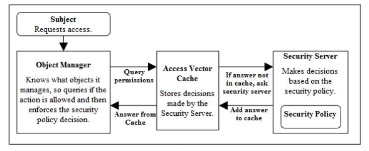
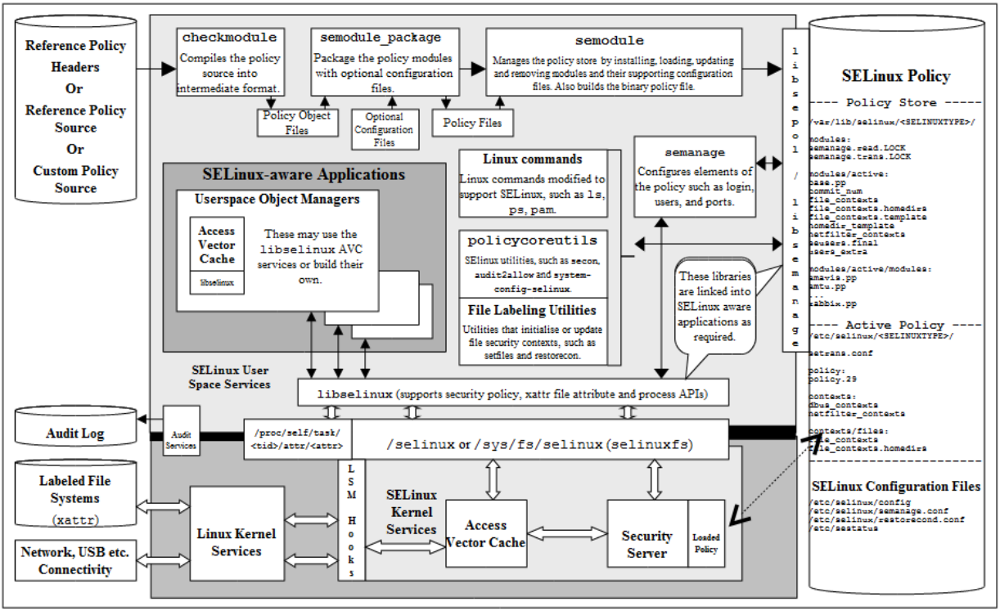
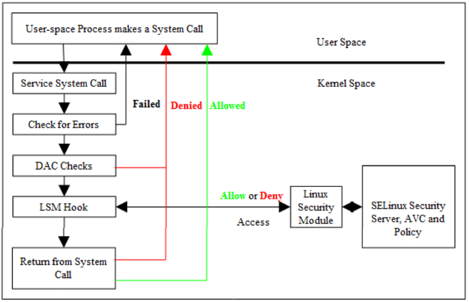
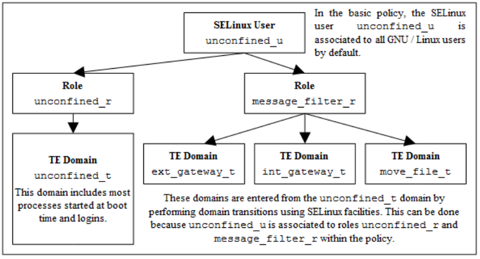
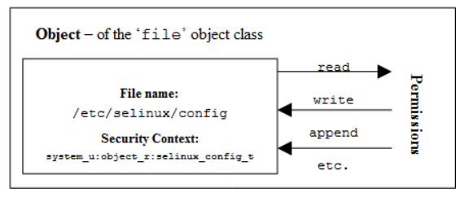
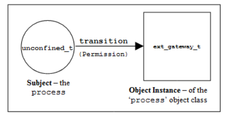
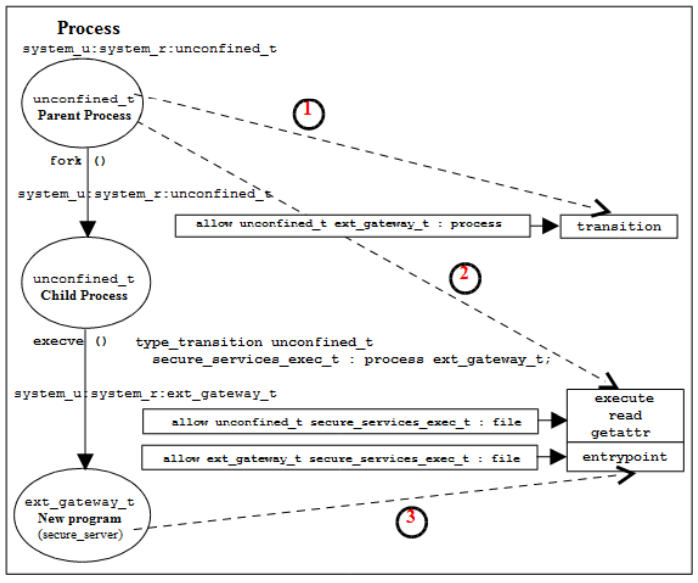
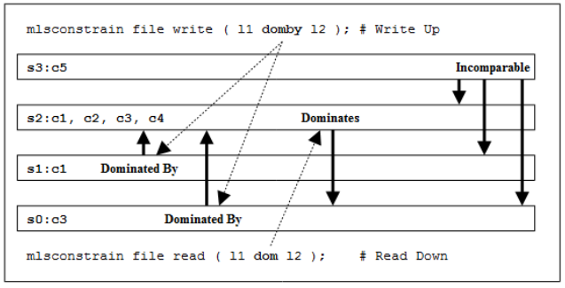

# Linux和FreeBSD的系统配置，安全专题

## 目录
    
+ [**Linux**](#linux)
+ [**1**](#1-安全专题防火墙iptables) 安全专题：防火墙iptables
    + [**1.1**](#11-基本概念) 基本概念
    + [**1.2**](#12-filter表简析) filter表简析
    + [**1.3**](#13-配置文件) 配置文件
    + [**1.4**](#14-常用命令和操作) 常用命令和操作
    + [**1.5**](#15-日志) 日志
    + [**1.6**](#16-常用配置) 常用配置
    + [**1.7**](#17-nat配置) NAT配置
+ [**2**](#2-存储与文件系统) 存储与文件系统
    + [**2.1**](#21-lvm逻辑卷管理) LVM逻辑卷管理
    + [**2.2**](#22-存储安全加密) 存储安全：加密
    + [**2.3**](#23-使用zfs) 使用ZFS
+ [**3**](#3-服务) 服务
    + [**3.1**](#31-基于systemd) 基于Systemd
    + [**3.2**](#32-基于systemv-openrc) 基于SystemV OpenRC
    + [**3.3**](#33-基于systemv-s6) 基于SystemV s6
+ [**4**](#4-其他杂项) 其他杂项
    + [**4.1**](#41-开机信息显示) 开机信息显示
    + [**4.2**](#42-sudo与特权用户) sudo与特权用户
    + [**4.3**](#43-将grub配置文件安装到esp分区) 将grub配置文件安装到ESP分区
    + [**4.4**](#44-cmos时间同步) CMOS时间同步
    + [**4.5**](#45-gpu与3d) GPU与3D
    + [**4.6**](#46-显示器亮度调节) 显示器亮度调节
+ [**5**](#5-安全专题selinux) 安全专题：SELinux
    + [**5.1**](#51-selinux是什么) SELinux是什么
    + [**5.2**](#52-selinux核心架构) SELinux核心架构
    + [**5.3**](#53-selinux中常见的术语解释) SELinux中常见的术语解释
    + [**5.4**](#54-user) User
    + [**5.5**](#55-role) Role
    + [**5.6**](#56-type-enforcement) Type Enforcement
    + [**5.7**](#57-security-context安全上下文) Security Context安全上下文
    + [**5.8**](#58-subjects) Subjects
    + [**5.9**](#59-objects) Objects
    + [**5.10**](#510-security-context计算) Security Context计算
    + [**5.11**](#511-访问决策access-decisions) 访问决策（Access Decisions）
    + [**5.12**](#512-domain和object的切换transition) Domain和Object的切换（Transition）
    + [**5.13**](#513-mls和mcs) MLS和MCS
    + [**5.14**](#514-policy类型) Policy类型
    + [**5.15**](#515-selinux运行模式) SELinux运行模式
    + [**5.16**](#516-查看事件记录) 查看事件记录
    + [**5.17**](#517-selinux配置文件) SELinux配置文件
    + [**5.18**](#518-policy管理) Policy管理
    + [**5.19**](#519-policy编写kernel-policy-language) Policy编写：Kernel Policy Language
    + [**5.20**](#520-policy编写cil) Policy编写：CIL
    + [**5.21**](#521-policy内容) Policy内容
    + [**5.22**](#522-selinux实战) SELinux实战
+ [**6**](#6-安全专题apparmor) 安全专题：AppArmor
+ [**FreeBSD**](#freebsd)
+ [**1**](#1-防火墙) 防火墙
+ [**2**](#2-存储与文件系统-1) 存储与文件系统
    + [**2.1**](#21-zfs) ZFS
+ [**3**](#3-服务-1) 服务

# Linux

## 1 安全专题：防火墙iptables

Linux在内核中已经集成了网络数据包的观察（inspection），修改（modify），转发（forward），重定向（redirect），丢包（drop）功能。实现防火墙功能只需提供一些表（tables）即可。`iptables`就是配置这些表的工具

## 1.1 基本概念

每一张**表**`tables`都代表一个特定的功能，表由规则**链**`chains`组成，而规则链由**规则**`rules`构成。每一条规则`rules`由（多个）**匹配项**`matches`以及对应的**目标**`target`（动作）构成，在数据包和匹配项成功匹配时就会执行目标`target`对应的动作。匹配项可以判断数据包的各项参数，例如来源接口（`eth0 eth1 br0`等），传输层协议（`TCP UDP ICMP`等），目标端口，源IP等。如果一个数据包没有匹配上任何一个规则，每一条规则链还拥有一个`policy`，它指定了默认目标（行为）

> 之所以称为**链**，是因为数据包是依照规则链中规则的顺序一条一条依次匹配的。所以我们优先想要匹配的规则要往前面放
>
> `iptables`有4个内置目标类型，分别为`ACCEPT DROP QUEUE RETURN`，以及扩展目标类型`REJECT LOG`。一个规则的目标也可以是用户定义的**表**，这样可以从一个表跳到另一个表。最常用的目标有`ACCEPT DROP`以及用户定义的表。如果跳转到用户定义的表以后没有任何匹配的规则，那么就会跳回到原来的表，并继续在剩余规则中匹配

`iptables`工作原理如下


> Linux主机从任何端口（无论虚拟还是物理）接收到的数据包都要完整过一遍上图所示的流程。`raw mangle nat filter`就是表，而`PREROUTING INPUT FORWARD OUTPUT POSTROUTING`等就是属于这些表的规则链
>
> 路由会决定转发这些数据包还是将这些数据包给本机运行中的进程处理，相当于走左边的路径。否则走右边路径。最后路由会决定将处理后的数据包发往哪个接口
>
> 绝大部分情况下我们无需配置`raw mangle security`，只需关注`filter nat`两张表即可。`filter`就是我们主要需要配置的表，防火墙规则都放在这张表里

`iptables`对于IPv4以及IPv6分别有一个`systemd`服务，为`iptables`和`ip6tables`，默认自启，可以通过`systemctl`查看状态以及控制启动终止

```shell
sudo systemctl status iptables
sudo systemctl status ip6tables
```

## 1.2 filter表简析

`filter`表默认包含3个链`INPUT OUTPUT FORWARD`，如下

```shell
sudo iptables -nvL -t filter
```

```
Chain INPUT (policy ACCEPT 0 packets, 0 bytes)
 pkts bytes target     prot opt in     out     source               destination         

Chain FORWARD (policy ACCEPT 0 packets, 0 bytes)
 pkts bytes target     prot opt in     out     source               destination         

Chain OUTPUT (policy ACCEPT 0 packets, 0 bytes)
 pkts bytes target     prot opt in     out     source               destination         
```

> 没有配置任何有效的规则时，`policy`默认目标为`ACCEPT`。所有类型的数据包在经过规则链后最终都会被通过并移交给下一个处理阶段。而`DROP`表示将数据包直接丢弃消失，不再有任何后续处理或回应

## 1.3 配置文件

在`iptables`运行时我们的改动是易失的，重启以后就会恢复到原来的配置。`iptables`和`ip6tables`每次启动时都会从`/etc/iptables/iptables.rules`以及`/etc/iptables/ip6tables.rules`加载配置使用。为了将我们的配置存储到文件，可以使用以下命令

```shell
sudo iptables-save -f /etc/iptables/iptables.rules
sudo ip6tables-save -f /etc/iptables/ip6tables.rules
```

之后可以重启防火墙服务，或直接重载配置文件

```shell
sudo iptables-restore /etc/iptables/iptables.rules
sudo ip6tables-restore /etc/iptables/ip6tables.rules
```

## 1.4 常用命令和操作

常用命令示例（`iptables`命令通常都需要`sudo`执行）

创建新规则链

```shell
iptables -t filter -N LOGDROP # 创建一个名为LOGDROP的规则链
```

列出规则

```shell
iptables -t filter -L
iptables -t filter -nvL # 列出表filter对应的规则链与规则，-L相当于--list，-n表示将主机名和端口显示为数字格式的地址，-v为verbose
iptables -t filter -nvL --line-numbers # 同时显示规则行数，行数在编辑规则时会有用
iptables -t nat -S # 列出表nat对应的规则链名以及默认policy目标
```

置空规则链，包括默认内置的

```shell
iptables -t filter -F # flush，相当于将filter表中规则链INPUT，FORWARD，OUTPUT内所有的规则一个一个依次删除
iptables -t filter -F INPUT # 重置filter的INPUT规则链。也可以是用户创建的规则链
```

删除表中非内置的空规则链

```shell
iptables -t filter -X # 将用户自己添加的空规则链全部删除
iptables -t filter -X LOGDROP # 删除用户添加的规则链LOGDROP
```

设置规则链的默认`policy`目标

```shell
iptables -t filter -P FORWARD DROP # 将filter中FORWARD规则链的policy设置为DROP，默认行为直接丢包
```

追加规则

```shell
iptables -t filter -A INPUT -p tcp --dport 17500 -j REJECT --reject-with icmp-port-unreachable # -A表示在现有规则链下追加规则，目标为REJECT。接收到的数据包走的传输层协议为tcp，--dport指定数据包目标端口
```

> 一条规则需要指定目标（`-j`跳转到）以及各项用于匹配的参数，例如协议（`-p`），端口（`--dport --sport`），接口（`-i`），IP（`-d -s`）等

插入规则

```shell
iptables -t filter -I INPUT 2 -p tcp --dport 17500 -s 10.0.0.85 -j ACCEPT -m comment --comment "Dropbox" # -I表示在指定行数添加规则，该规则链内原有后续规则依次向后移动
```

替换规则

```shell
iptables -t filter -R INPUT 1 -p tcp --dport 17500 ! -s 10.0.0.85 -j REJECT --reject-with icmp-port-unreachable # -R表示替换INPUT中的规则，1表示第一行，!表示仅排除-s指定的特定的IP，除此IP外所有的其他IP都会和该规则匹配并被REJECT。使用iptables -L查看时就显示为!10.0.0.85
```

删除规则

```shell
iptables -t filter -D INPUT 1
```

## 1.5 日志

前面提到过`iptables`支持扩展目标`LOG`。`LOG`可以记录指定数据包，在从一条规则跳转到`LOG`后数据包不会消失，而是返回来继续匹配规则链中接下来的规则

可以创建一个`LOG`专用的规则链

```shell
iptables -t filter -N LOGDROP
```

示例，添加一些规则，记录并丢弃数据包

```shell
iptables -t filter -A LOGDROP -m limit --limit 5/m --limit-burst 10 -j LOG # 必须加限制防止攻击者写满磁盘，一开始的10个数据包会被记录，后续每分钟限制记录5个数据包
iptables -t filter -A LOGDROP -j DROP # 没添加任何匹配规则，无论什么数据包到这一步都会直接丢弃
```

> `-m`表示`match`，是一个扩展模块，用于检查并匹配数据包的特定属性，例如频度`limit`，连接状态`conntrack`等，后面需要加上该`match`对应的参数

从其他链中想要记录并丢弃数据包时，直接`-j`设置跳转到`LOGDROP`即可

日志捕捉记录的数据包可以通过`journalctl`查看

```shell
journalctl -k --grep="IN=.*OUT=.*"
```

## 1.6 常用配置

可以将`TCP UDP`数据包分别处理，可以分别创建`TCP UDP`两个链，并使得对应的匹配项跳转到这两个链

```shell
iptables -t filter -N TCP
iptables -t filter -N UDP
```

如果主机不作为路由使用，禁用数据包转发

```shell
iptables -t filter -P FORWARD DROP
```

基于白名单的防火墙，将`INPUT`默认目标设置为`DROP`

```shell
iptables -t filter -P INPUT DROP
```

允许已建立连接所属数据包，以及与这些连接有关的ICMP数据包

```shell
iptables -t filter -A INPUT -m conntrack --ctstate RELATED,ESTABLISHED -j ACCEPT
```

> `ESTABLISHED`表示已建立的连接。对于`iptables`来说，一个数据包可以对应有4种状态，分别为`NEW ESTABLISHED RELATED INVALID`。例如对于TCP数据包而言，`NEW`表示允许握手包建立新连接，`ESTABLISHED`表示允许已建立的连接继续，`RELATED`表示已建立的连接引发的数据包，`INVALID`表示除上述数据包以外的无效数据包
>
> 所谓`stateful firewall`就是防火墙会跟踪数据包的状态并使用一个状态机维护有效的连接，并判断每个数据包所属的状态。除以上状态，还有`UNTRACKED`状态，以及`SNAT DNAT`两个虚拟状态
>
> 注意，`iptables`还有一个不同的`--ctstatus`参数，使用格式和`--ctstate`类似，千万不要混淆

允许所有`lo`回环接口的流量

```shell
iptables -t filter -A INPUT -i lo -j ACCEPT
```

丢弃所有无效（`INVALID`）数据包

```shell
iptables -t filter -A INPUT -m conntrack --ctstate INVALID -j DROP
```

允许其他主机发来的ICMP的[ping请求](221112a_network.md#535-echo和回复)

```shell
iptables -t filter -A INPUT -p icmp --icmp-type 8 -m conntrack --ctstate NEW -j ACCEPT
```

在`INPUT`创建跳转，分别跳转到`TCP UDP`规则链

```shell
iptables -t filter -A INPUT -p udp -m conntrack --ctstate NEW -j UDP
iptables -t filter -A INPUT -p tcp --syn -m conntrack --ctstate NEW -j TCP
```

> `--syn`匹配TCP连接发起时发送的第一个SYN数据包（也即SYN位有效，ACK位无效的数据包）

未匹配TCP UDP规则的（包括上述规则以及TCP UDP规则链内规则，原因[见前](#111-基本概念)），需要使用以下规则

```shell
iptables -t filter -A INPUT -p udp -j REJECT --reject-with icmp-port-unreachable
iptables -t filter -A INPUT -p tcp -j REJECT --reject-with tcp-reset
iptables -t filter -A INPUT -j REJECT --reject-with icmp-proto-unreachable
```

> 上述配置中，所有的剩余数据包都会使用恰当的方式进行`REJECT`

接下来可以按照需求配置TCP UDP规则，由于是基于白名单的防火墙，配置允许的访问即可

```shell
iptables -t filter -A TCP -p tcp --dport 80 -j ACCEPT # 允许请求本机的http服务器
iptables -t filter -A TCP -p tcp --dport 22 -j ACCEPT # 允许SSH
```

防范TCP SYN扫描开放端口

```shell
iptables -t filter -I TCP -p tcp -m recent --update --rsource --seconds 60 --name TCP-PORTSCAN -j REJECT --reject-with tcp-reset

iptables -t filter -D INPUT -p tcp -j REJECT --reject-with tcp-reset
iptables -t filter -A INPUT -p tcp -m recent --set --rsource --name TCP-PORTSCAN -j REJECT --reject-with tcp-reset
```

> 在一台主机接收到其他地方发来的TCP SYN数据包时，如果此时对应TCP端口关闭，那么没有防火墙配置时主机会回复一个TCP RESET；而端口打开时会回复一个SYN+ACK。而防火墙经过配置可以直接丢弃这些数据包，不进行任何回复
>
> 工作原理：由于扫端口时第一个被扫的端口恰巧开放的概率较小（除非有意扫常用的端口），本机将会回复一个TCP RESET并将对方加入到`TCP-PORTSCAN`，此后对方在`60`秒内进行任何TCP连接尝试都会收到TCP RESET，此时防火墙是起作用的。**这种防范措施的弊端也显而易见，如果直接从常用的端口开始扫，此时对方不在**`TCP-PORTSCAN`**中，本机会回复TCP ACK泄露开放的端口**。所以在实际应用中需要使用非标准端口，例如不能在22端口监听SSH连接
>
> 上述示例中分别配置了`TCP INPUT`链中的`REJECT`行为

防范UDP扫描端口

```shell
iptables -t filter -I UDP -p udp -m recent --update --rsource --seconds 60 --name UDP-PORTSCAN -j REJECT --reject-with icmp-port-unreachable

iptables -t filter -D INPUT -p udp -j REJECT --reject-with icmp-port-unreachable
iptables -t filter -A INPUT -p udp -m recent --set --rsource --name UDP-PORTSCAN -j REJECT --reject-with icmp-port-unreachable
```

> 对于无状态的UDP来说，如果是一个未开放的端口，主机回复`icmp-port-unreachable`，而开放的端口不会进行回复。配置基本相似，同样有类似的缺点

如果配置了TCP UDP防扫端口，需要重新将原先`INPUT`的最后一行放到最后

```shell
iptables -t filter  -D INPUT -j REJECT --reject-with icmp-proto-unreachable
iptables -t filter -A INPUT -j REJECT --reject-with icmp-proto-unreachable
```

防SSH爆破示例配置，这些规则需要放在跳转`TCP`表之前

```shell
iptables -N IN_SSH
iptables -N LOG_AND_DROP
iptables -A INPUT -p tcp --dport ssh -m conntrack --ctstate NEW -j IN_SSH
iptables -A IN_SSH -m recent --name sshbf --rttl --rcheck --hitcount 3 --seconds 10 -j LOG_AND_DROP
iptables -A IN_SSH -m recent --name sshbf --rttl --rcheck --hitcount 4 --seconds 1800 -j LOG_AND_DROP 
iptables -A IN_SSH -m recent --name sshbf --set -j ACCEPT
iptables -A LOG_AND_DROP -j LOG --log-prefix "iptables deny: " --log-level 7
iptables -A LOG_AND_DROP -j DROP
```

## 1.7 NAT配置

作为NAT网关使用，配置完成后数据包转发功能需要启用才会生效

例如，启用IPv4数据包转发

```shell
sysctl net.ipv4.ip_forward=1
```

NAT还需要配置`nat`表下的规则链`PREROUTING POSTROUTING`

首先在`filter`创建两个新链`FW_INTERFACES FW_OPEN`，分别用于私网机器以及公网接口

```shell
iptables -t filter -N FW_INTERFACES
iptables -t filter -N FW_OPEN
```

配置`filter`的`FORWARD`链

```shell
iptables -t filter -A FORWARD -m conntrack --ctstate RELATED,ESTABLISHED -j ACCEPT
iptables -t filter -A FORWARD -j FW_INTERFACES
iptables -t filter -A FORWARD -j FW_OPEN
iptables -t filter -A FORWARD -j REJECT --reject-with icmp-host-unreachable
iptables -t filter -P FORWARD DROP
```

> 上述配置将允许转发目的地址非本机地址的（跟踪状态有效的）数据包，并依次与`FW_INTERFACES FW_OPEN`进行匹配

`POSTROUTING`应用，可以配置允许私有网络内主机访问公网

```shell
iptables -t filter -A FW_INTERFACES -i eth0 -j ACCEPT
iptables -t nat -A POSTROUTING -s 192.168.0.0/24 -o eth4 -j MASQUERADE
```

> 上述配置允许`eth0`所连接网络内的主机访问公网。注意，这里没有DHCP，`eth0`接口以及局域网内的主机都需要手动配置IP为`192.168.x.x`。私有网络内的数据包更改源IP后会从`eth4`发出，特殊目标`MASQUERADE`就代表了这个NAT操作
>
> 其他还有必要的DNS DHCP配置等操作，这里不再展示

`PREROUTING`应用，可以配置转发，从公网访问私网内的主机

```shell
iptables -t nat -A PREROUTING -i eth4 -p tcp --dport 22 -j DNAT --to 192.168.0.5
iptables -t filter -A FW_OPEN -d 192.168.0.5 -p tcp --dport 22 -j ACCEPT
```

> 上述配置中特殊目标`DNAT`就实现了端口映射功能。第一行配置指定`eth4`公网接口访问`22`端口的请求全部NAT转换IP后转发到`192.168.0.5`（相当于本机会监听22端口并在连接请求到来时转发）。第二行配置允许（NAT后的数据包）访问`192.168.0.5`的`22`端口

## 2 存储与文件系统

## 2.1 LVM逻辑卷管理

见[LVM](201219a_shell.md#127-逻辑卷管理lvm)

## 2.2 存储安全：加密

## 2.3 使用ZFS

## 3 服务

## 3.1 基于systemd

## 3.2 基于openrc

## 3.3 基于s6

## 4 其他杂项

## 4.1 开机信息显示

编辑`/etc/default/grub`，去掉`quiet`


之后重新`grub-mkconfig`

## 4.2 sudo与特权用户

建议安装`sudo`后将想要使用特权指令的非特权用户添加到`wheel`组而不是手动添加用户入口。使用`visudo`编辑`/etc/sudoers`，去除`%wheel ALL=(ALL:ALL) NOPASSWD: ALL`（执行时无需密码）或`%wheel ALL=(ALL:ALL) ALL`（需要密码）的注释即可

```shell
su
usermod -a -G wheel your-username
visudo
```

## 4.3 将grub配置文件安装到ESP分区

通过以下命令，`grub`的配置文件就会安装到ESP分区下的`grub`目录，假设当前ESP挂载到`/mnt`

```shell
grub-install --target=x86_64-efi --efi-directory=/mnt --bootloader-id=GRUB --boot-directory=/mnt
grub-mkconfig -o /mnt/grub/grub.cfg
```

## 4.4 CMOS时间同步

`systemd`下使能`systemd-timesyncd`

```shell
sudo systemctl enable systemd-timesyncd
```

创建`/etc/systemd/timesyncd.conf.d/myserver.conf`配置文件

```shell
[Time]
NTP=0.arch.pool.ntp.org 1.arch.pool.ntp.org 2.arch.pool.ntp.org 3.arch.pool.ntp.org
FallbackNTP=0.pool.ntp.org 1.pool.ntp.org
```

使能时钟同步

```shell
timedatectl set-ntp true
```

查看状态

```shell
timedatectl status
```

## 4.5 GPU与3D

测试程序，`mesa-utils`

```shell
sudo pacman -S mesa-utils
```

运行`vkgears`和`glxgears`经典齿轮测试程序，分别检查Vulkan和OpenGL是否可用


还可以安装`vulkan-tools`，运行`vkcube`


也可以使用`glmark2`运行OpenGL跑分，使用`vkmark`运行Vulkan跑分。可以测试OpenGL ES，执行`glmark2-es2`


AMD显卡安装`radeontop`查看GPU资源使用

```shell
sudo pacman -S radeontop
```

## 4.6 显示器亮度调节

安装`light`并确保非特权用户加入`video`组

```shell
sudo pacman -S light
su
usermod -a -G video your-username
```

```shell
light -A 5 # 调亮5
light -U 5 # 降低5
```

## 5 安全专题：SELinux

可以在Fedora或RHEL（注册开发者后免费使用）下尝试SELinux

> SELinux is a bit hard to learn for beginners. But please do not disable it :-) https://stopdisablingselinux.com/

## 5.1 SELinux是什么

SELinux是Linux内核的一个安全扩展，全称**Security Enhanced Linux**，提供MAC（Mandatory Access Control）支持

区别于Linux中传统的基于用户身份和文件权限设定的DAC（Discretionary Access Control）访问控制，MAC可以提供更为细粒化的额外访问控制。从Discretionary和Mandatory的含义来看，Discretionary是较为被动、宽松的访问控制，进程能否访问资源取决于两者本身固有的属性（例如进程的用户身份，以及资源的`rwx`权限和属主、属组）；而Mandatory是较为主动、严格的访问控制，需要利用SELinux这样的内核扩展提供的额外信息（主要基于安全上下文）最终才能决定能否访问，不符合要求的访问会被SELinux拦截。在配置完成MAC的保护功能后，即便是以`root`用户身份执行的程序，例如Web服务器，也无法访问指定内容。那些必须以`root`身份运行的程序本就是非常糟糕的，一旦出现导致数据泄漏的0day漏洞会很危险。SELinux可以限制程序的访问内容，使其在被攻击者控制时也无法访问主机上受保护的敏感内容

> SELinux的争议在于NSA参与了开发，曾经在世界各地激进的自由软件用户群体中引发反对的声音。很多非企业级Linux发行版都默认不使用SELinux，开启SELinux需要一些额外的操作，包括更换内核，设置参数，以及一些程序的重新编译
>
> 相比SELinux需要在每一个文件存放额外属性，另一个解决方案为AppArmor，它是基于访问路径设计的，[之后](#16-安全apparmor)会讲到。SELinux的架构更复杂，配置会更繁琐，但是相应的也提供了更好的灵活性
>
> 红帽系的发行版例如Fedora，RHEL，Rocky Linux，AlmaLinux和CentOS默认使用SELinux。而其他许多Debian、SUSE系发行版例如Ubuntu，Debian，OpenSUSE，SLES等更加偏好AppArmor。其他面向爱好者做桌面系统的发行版如ArchLinux，ArtixLinux，Gentoo，AlpineLinux等默认不会使用两者中的任何一个，需要用户自行决定
>
> 安卓也使用了SELinux

SELinux本质上是以白名单的方式工作的。任何不符合`policy`规定的资源访问都会被拦截并禁止

SELinux的`policy`设计较为复杂。因此在设计`policy`时需要非常谨慎，最好要经过完整的验证，而一般的需求直接使用系统提供的`policy`就可以了

SELinux可以将每个应用限制在它的域`domain`中，使其正常工作并给予最小的访问权限

SELinux只是为系统提供了资源访问的安全保护措施。它能做的仅仅是防止数据进一步泄漏

## 5.2 SELinux核心架构

SELinux的核心组件关系框图如下



> 资源访问行为都可以抽象为发起访问请求的一方，以及被访问的一方。SELinux中进程（也即发起访问请求的一方）基本等同于`subject`，而被访问的资源例如文件、socket等基本等同于`object`（进程也可以是`object`，后面会讲）。`subject`和`object`都拥有自己的`context`，即Security Context，它由至少3个字段构成，格式为`user:role:type[:range]`。每个进程（指`subject`视角下的）都有自己的域`domain`，我们说进程运行在这个域`domain`下面。之后还会出现一个常见术语`label`，基本也可以理解为等价于安全上下文
>
> Object Manager相当于给`subject`的资源访问功能包装了一层，它代理了`subject`发来的访问请求，并向AVC和Security Server发送查询请求。如果最终的结果允许访问，那么Object Manager就会执行相应的操作。Object Manager只是执行部件
>
> Security Server仅仅和Object Manager交互提供请求回复，而没有执行功能，内核中的AVC相当于Security Server的缓存。Security Policy`policy`相当于该服务器的数据库
>
> Security Policy以若干规则`rule`为基本单位构成，使用kernel policy language或CIL编写

更详细的架构图如下



> 由上面的示意图可以看到，SELinux只有Security Server部分是完全集成在内核空间的。Object Manager和AVC都可以集成在内核空间或用户空间。**用户空间**的Object Manager也就是SELinux-aware Applications，它访问SELinux功能只通过调用`libselinux`库访问`/sys/fs/selinux`文件系统来实现，同时它们有自己单独的AVC机制。而**内核空间**的Object Manager功能**实际上由LSM框架实现**（通过hooks），它只能使用内核空间的AVC
>
> 用户空间的应用程序可以通过`libsepol`或`libsemanage`直接访问`policy`数据库以获取、修改、管理信息，例如`ls`扩展的`ls -Z`参数，SELinux常用的管理命令`semanage` `semodule`等也会使用这些库。`libsepol`和`libsemanage`主要用于管理SELinux的设定，而`libselinux`才是给应用调用实现受控访问的
>
> 开发者编写的`policy`源码需要编译为二进制格式才能被系统使用，这在上图的顶端有所体现。SELinux可以支持像其他普通的编程语言一样模块化构建`policy`，而无需将所有规则写到一个文件中。kernel policy language不适用于编写大型的`policy`，现在常用的有Reference Policy和CIL
>
> SELinux的配置文件以及`policy`配置位于`/etc/selinux`，SELinux filesystem的路径在`/sys/fs/selinux`，`policy`的二进制文件以及其他详细配置位于`/var/lib/selinux`
>
> Audit Log中存储的就是SELinux的日志，其中包括记录到的安全事件，例如被拦截而失败的访问等

下图更直观地显示了加上MAC后的资源访问过程



> 基于SELinux的MAC是无法绕过的。**MAC的检查位于DAC之后**
>
> 从不同角度看，SELinux支持两种形式的MAC。一种是基于**Type Enforcement**的，进程都运行在自己的`domain`下，`policy`以`type`为根据限制它们，它和SELinux的**Role Based Access Control**共同构成基本的MAC机制。另外一种是基于**MLS**的，它提供了多层的MAC支持，可以有多个保密等级，主要用于应用的隔离。还有一个变种**MCS**，它在虚拟机以及安卓有重要应用

## 5.3 SELinux中常见的术语解释

**AV**：Access Vector，SELinux通过查询该列表获取对应的权限设定（permissions，例如`open read write attach`等）

**AVC**：Access Vector Cache，AV的查询缓存。有两种AVC，其中系统AVC缓存位于内核（kernel）空间，而应用AVC位于用户（userspace）空间。内核空间的AVC存放Security Server自己的查询缓存，而用户空间的AVC通过库`libselinux`为使用到SELinux的软件提供查询缓存

**Domain**：SELinux中每个域`domain`可以有一个或多个进程（process）。这些进程与特定的安全上下文（Security Context，见下）相关联。`policy`中的类型执行规则（Type Enforcement rules）定义了这些域和`object`的交互规则

**LSM**：Linux Security Module，Linux内核专门为SELinux这类安全扩展提供的开发框架，可以在往常的资源访问等流程中加入探针，方便访问控制和权限检验等

**MLS**：Multi-Level Security，分保密等级的多层安全。在多层安全中，资源和访问资源的进程可以放到不同的保密等级。等级数字越大等级越高，处于一个保密等级`L`的进程只能读取小于等于`L`等级的内容，或写大于等于`L`等级的内容（信息只能由低等级向高等级传递，而不能反向流通，否则就是泄密）。SELinux中还有一个术语MCS，即Multi-Category Security，是一个变种

**Object Class**：每一个Object Class都定义了所属`object`的可用权限（`open read write attach`等）和其他附加信息。Object Manager依靠这些权限信息来管理`object`实例的访问

**Object Manager**：在SELinux中接受其他进程的访问请求，并向Security Server发送查询请求（基于Security Context或SID，Object Class，AV），基于回复执行合适的动作，相当于SELinux的执行部分

**Policy**：相当于Security Server的数据库，使用`kernel policy language`或`CIL`语言编写，编译成二进制格式后使用，`policy`由`rule`组成

**Role Based Access Control**：SELinux中的每一个`user`可以隶属于一个或多个`role`，而每一个`role`可以和一个或多个域`domain`关联，实现最终的管理

**Security Server**：接收Object Manager以及其他使用SELinux库的软件发来的请求，查询`policy`，计算Security Context，返回结果，是否可访问

**Security Context**：也可以表示为`context`或`label`，格式为`user:role:type[:range]`

**SID**：Security Identifier，使用`u32`表示一个Security Context，每个`context`都有对应的`SID`，Security Server的数据库会记录`SID`和`context`的映射关系（可以看作数据库主键）。`SID`会用于Security Server和Object Manager之间的信息交换

**Type Enforcement**：SELinux中，所有的`object`和`subject`都有自己的`type`，并且SELinux的`policy`主要就是靠这个`type`来规定是否访问


## 5.4 User

SELinux有自己的用户定义，和Linux系统的用户没有关系。SELinux中的用户名本质上表示了一组用户，这些用户是系统中的各类实体，例如进程，文件，以及系统用户等。例如`staff_u`代表了系统的管理员，而`user_u`代表了系统中的普通用户（不包含程序注册的系统用户）。SELinux中的特殊用户名`system_u`是专门用于表示系统进程和`object`。在大部分Linux发行版中，习惯上SELinux的用户名都以`_u`结尾。安卓只使用一个用户名`u`

## 5.5 Role

SELinux基于用户角色的控制Role Based Access Control。SELinux中`user` `role`和域`type`都是多对多的关系。一个Security Context中`user`和`role`通常只是起标记功能，而`type`才是最重要的部分。在大部分Linux发行版中，习惯上SELinux的用户角色都以`_r`结尾。安卓只使用一个角色名`r`

下图表示了`user` `role` `type`的对应关系



> `role`和`user`实际上没有太大作用，不必过于关注

## 5.6 Type Enforcement

SELinux的MAC起作用的最主要部分就是Type Enforcement。SELinux中，所有的`subject`和`object`都会拥有一个`type`（`type identifier`），它会和一个Security Context所关联。`type`命名习惯上以`_t`结尾

对于`subject`来说，`type`等同于`domain`（`domain type`），一个`type`可以指代一个或一类（多个）进程。例如`unconfined_t`，它表示所有不受限制的进程，这也是在RHEL以及Fedora下启用默认的`targeted`政策时，绝大部分由终端登录用户执行的程序的`domain`。如果想要一个进程运行在特定的`domain`下，必须通过`policy`显式声明

```
allow unconfined_t ext_gateway_t:process transition;
```

```
constrain process transition ( r1 == r2 );
```

> 上述两条声明在当前Type Enforcement环境下，规定运行在`unconfined_t`域下的进程有权将一个进程`transition`到`ext_gateway_t`下。第二条`constrain`声明规定了切换出的`domain`的`role`必须和切换进的`domain`的`role`相同

对于`object`来说，`type`就是`type`（`file type`等）

至于`user`和`role`，SELinux并没有实际Enforce它们，即便它们出现在了编译后的`policy`中。只有`type`通过`typebounds`规则被Enforce

## 5.7 Security Context安全上下文

SELinux中所有`subject`和`object`都有对应的Security Context，Security Server会依照这些安全上下文结合`policy`规定来判断是否可以允许访问。安全上下文也被称为Security Label或`label`，**后文表述若不作特殊说明，**`label`**等同于安全上下文**

```
user:role:type[:range]
```

> 需要在SELinux的政策定义中将一个用户`user`和一个或多个`role`关联，该`user`可以被允许使用这些`role`身份。而`role`和`type`也是同理。一个`subject`的`type`定义了它可以访问的域，而`object`的`type`定义了哪些`subject`可以访问（拥有对应`type`的`subject`），在隐含的附加信息中指定拥有哪些权限
>
> `range`只有在支持MLS多层安全或MCS的`policy`中才有用。`sX`表示敏感等级sensitivity level，而`cX`表示门类category。`sX`可以是单个等级例如`s0`，或是一个敏感等级范围例如`s0-s15`；后面可以是`:`加空白（没有category），或使用`.`分隔的category。示例`s0-s19:c0.c1023`
>
> 访问决策过程中会使用到`subject`安全上下文`user:role:type[:range]`的所有信息。而对于`object`来说，其`user`会被设定为`system_u`或创建该`object`的进程的`user`名；`role`通常设定为特殊的内置`role`类型`object_r`

以下示例通过`ls`和`ps`命令配合`-Z`参数显示`subject`进程和`object`文件资源的安全上下文

```
$ ps -eZ
LABEL                                                       PID TTY         TIME        CMD
system_u:system_r:init_t:s0                                   1 ?       00:00:01        systemd
system_u:system_r:kernel_t:s0                                 2 ?       00:00:00        kthreadd
system_u:system_r:kernel_t:s0                                 3 ?       00:00:00        rcu_gp
...
unconfined_u:unconfined_r:unconfined_t:s0-s0:c0.c1023     62491 ?       00:00:00        firefox
unconfined_u:unconfined_r:unconfined_t:s0-s0:c0.c1023     62511 pts/0   00:00:00        ps
```

```
$ ls -lZ
-rw-rw-rw-. 1 root root     unconfined_u:object_r:user_home_t:s0 40 Nov  1 09:00 file.txt
-rw-r--r--. 1 user group    unconfined_u:object_r:user_home_t:s0 32 Nov  1 09:01 raw.img

$ ls -lZ /etc
...
-rw-r--r--. 1 root root     system_u:object_r:net_conf_t:s0     158 Jun 23 2020 hosts
...
```

## 5.8 Subjects

在SELinux中，`subjects`就是进程，它们都拥有自己的安全上下文Security Context

> 进程本身也是一个`object`。SELinux中每个进程的`object class`值都为`process`。`policy`中也定义了对应这些进程`object`的规则

从安全角度看，SELinux中`subjects`只分为可信Trusted或不可信Untrusted。在Linux系统中，可信的程序通常有init，pam，login等，可以认为它们不会出现非法访问的行为，是可信的。如果系统管理员有需要，也可以选择Trust其他任何安全并经过验证的应用。除这些`subject`以外，所有其他的`subject`都是不可信的

可信的程序可能会运行在自己的`domain`中，也可能几个程序共用一个`domain`，例如`semanage semodule`共用`semanage_t`

**为Subject打标签（Security Context）**

> 一个进程（`subject`）启动时：
>
> 它首先会从父进程处继承上下文；
>
> 可以在`policy`中定义`transition`来允许该程序更改自己的上下文，也即更改`domain`。`policy`中可以支持`user`，`role`，`type`，`role_allow`，`constrain`，`type_transition`，`role_transition`，`range_transition`等安全上下文声明

> 如果是支持SELinux的应用（SELinux-aware applications），在`policy`允许的前提下它（`subject`）可以通过`libselinux`库，为进程、kernel keyring、socket设定一个新的`label`。这会覆盖`transition`的设定

> SELinux中`kernel`作为初始`SID`（`initial Security Identifier`）时，它可以给例如`kernel threads`内核线程，`kernel-private sockets`内核socket，代表内核资源的`synthetic objects`等内核对象赋予指定的`label`
>
> 在系统启动时，第一次`policy`加载之前创建的进程也会使用`kernel`作为初始`SID`。之后可能会有相关的`policy`加载，或由`policy`定义的`transition`，会导致发生更改
>
> SELinux中还有一个`SID`为`unlabeled`。当发生`policy`重载时，一些`subject`或`object`的`label`会失效，此时它们的`SID`虽然表面上不变化，但是它们的`SID`会透明地重映射到`unlabeled`。此外，`unlabeled`也用于许多`object`在创建时的初始`SID`，例如inode，superblock等，直到它们可以得到指定的`label`

## 5.9 Objects

在SELinux中，`objects`就是指所有可以被`subjects`（进程）访问的实体，例如文件，网络socket，管道，网络端口等。所有的`objects`都有自己对应的`object class`，它会指示该`object`可用的属性，例如`read write receive attach`操作等。同时所有`object`也有自己的安全上下文

**Object Class**

每一个`object`都拥有一个`object class identifier`，这个`object class`指明其类型（例如`file socket`等），同时通过AV说明该`object`可以提供的服务（例如`read write send`等）。当一个`object`被实例化时，SELinux会给这个`object`分配一个名称，同时创建对应的安全上下文。概念框图如下



> 上述示例中，SELinux给文件`/etc/selinux/config`创建了一个`security context`为`system_u:object_r:selinux_config_t`。而其`object class`为`file`，在该类型的AV中说明了可用服务（操作）有`read write append`等。`policy`中应当最小化这些`object`的可用操作，以最大程度限制访问，保证安全性
>
> `object class`是内置到Linux内核以及用户空间的Object Manager中的，系统管理员无法更改
>
> `object class`分为内核类型`kernel object class`以及用户空间类型`userspace object class`两种，分别用于[前文所述](#152-selinux核心架构)内核空间和用户空间的Object Manager功能。常见的`kernel object class`有`file socket`等，而`userspace object class`基本和X-Window、DBus等用户空间程序相关

**允许资源访问**

SELinux中的`policy`主要通过`allow`规则允许指定的资源访问

```
allow Rule | source_domain |  target_type  :  class  | permission
-----------▼---------------▼-------------------------▼------------
allow        unconfined_t    ext_gateway_t :  process  transition;
```

> 上述示例中，`source_domain`就是指`subject`的`domain`，为`unconfined_t`，这里的`subject`是执行gateway应用程序的shell。`target_type`就是指`object`的`type`，为`ext_gateway_t`，这里的`object`是一个gateway应用程序进程实例。`class`表示`object class`，表示这里的gateway应用程序进程拥有的`object class`为`process`。`permission`表示对于该`object`，`subject`所在的`domain`拥有的权限。这里表示对于`ext_gateway_t`来说，`unconfined_t`拥有`transition`权限
>
> 上述示例也说明在SELinux中，进程不仅可以是`subject`身份，也可以是`object`身份



**为Object打标签（Security Context）**

`object`标签是由系统自动管理的，对于用户不可见

> 在新创建进程或`object`时，该进程或`object`：
>
> 可能会从父进程或`object`继承上下文（`label`）。可以在`policy`中设定默认`user`，`type`，`role`和`range`来改变该行为；
>
> 可以通过`transition`切换`label`（包括`type`，`role`，`range`）；
>
> 在`policy`允许的前提下，支持SELinux的应用（SELinux-aware applications）可以通过`libselinux`库指定一个新的`label`，也即允许`subject`在创建`object`时指定一个`label`而不是使用默认的`label`，包括`transition`规则等；
>
> Object Manager可以enforce一个默认`label`（内置于OM或从配置文件获取）；
>
> 使用一个初始的`SID`（`initial Security Identifier`）。所有的`policy`都定义了初始`SID`，用于在启动过程中设定一个初始上下文，包括`object`需要但还未拥有上下文时

> 当文件被**拷贝**时，它会使用新目录对应的`label`
>
> 当文件被**移动**时，它对应的`label`不会更改
>
> 如果`restorecond`服务在运行中，文件也有可能被赋予其他的`label`（需要在`file_contexts`文件中定义）

**SELinux对文件系统支持**

SELinux需要支持extended attributes的文件系统例如ext3，ext4

可以使用`ls -Z`查看这些SELinux相关的文件属性

> 在`policy`中会定义一个`fs_use_xattr`来向SELinux的Security Server说明如何在该文件系统下打标签
>
> 需要通过`file_contexts`文件中的`policy`规则定义一个文件系统中所有文件、目录的初始上下文
>
> SELinux还支持初始化未添加`label`的文件系统，为其中所有的文件打标签（例如使用`chcon`，`restorecon`，`restorecond`命令等）

**Object复用**

在启用SELinux的系统中，如果一个进程释放了一个`object`（例如释放一片内存，删除文件或目录等），可能会留下一些SELinux有关的信息，这些释放资源中的残余SELinux信息有可能被其他程序获取。如果有必要，在释放`object`资源前最好摧毁这些信息

## 5.10 Security Context计算

SELinux中，一个安全上下文是基于`policy`定义结合`libselinux`库，由内核空间的Security Server计算出的。由于SELinux在发展过程中有了很多的更改，不同的Linux内核，用户空间工具以及`policy`版本得到的计算结果是可能不同的，需要注意

计算一个`object`的上下文需要一个源上下文（`source context`），一个目标上下文（`target object`），以及一个`object class`

> `libselinux`为用户空间提供了以下接口函数来使用内核中的`security server`，用于计算安全上下文
>
> `avc_compute_create()`和`security_compute_create()`
>
> `avc_compute_member()`和`security_compute_member()`
>
> `security_compute_relabel()`

> 在`kernel policy language`中，有以下声明会影响上下文计算结果
>
> `type_transition`，`role_transition`，`range_transition`，`type_member`，`type_change`，`default_user`，`default_role`，`default_type`，`default_range`

**进程Process**

> 对于一个进程来说：
>
> 在调用`fork()`系统调用创建新进程时，新进程继承父进程的上下文（同`domain`）；
>
> 在调用`exec()`创建新进程时，新进程的上下文会基于`type_transition`，`role_transition`，`range_transition`，`type_member`，`type_change`，`default_user`，`default_role`，`default_type`，`default_range`声明的设定`transition`到指定的上下文；
>
> 调用了`libselinux`的应用（selinux-aware process）可以调用`setcon()`函数来`transition`上下文（不推荐。建议在执行`exec()`前通过调用`setexeccon()`实现）
>
> 如果`policy`使能了`nnp_nosuid_transition`，对于使用`nosuid`方式挂载的文件系统会多一个`nosuid_transition`权限，而`no_new_privs`的进程会多一个`nnp_transition`权限，才能支持`domain`的`transition`。如果禁用`nnp_nosuid_transition`，只能支持有限特性的`domain`切换

> 对于系统的`init`进程来说，它在启动时使用`kernel`上下文，并且会在`policy`加载以后`transition`到自己的上下文例如`init_t`。基于不同系统的启动流程，`init`可能是在`policy`加载以后再执行自身以实现上下文切换；或者在使用到`initrd`和`initramfs`的系统中，由于启动分为两个阶段，通常在`initramfs`阶段加载`policy`，之后挂载磁盘的根文件系统后会再重新执行磁盘上的`init`，以使得上下文`transition`生效

**文件Files**

这里的文件实际上就是`inode`。`inode`包括了文件file，符号链接symbolic link，目录directory，socket，fifo以及块设备block、字符设备character

> 对于一个文件来说，创建时：
>
> `user`从创建的进程处继承；（`policy`版本`27`允许为每一个`object class`的source或target定义一个`default_user`）
>
> `role`通常默认为`object_r`；（`policy`版本`26`允许定义`role_transition`，`27`允许为每一个`object class`的source或target定义一个`default_role`）
>
> 对于`type`，如果未找到匹配的`type_transition`规则，默认继承所在目录的`type`；（`policy`版本`25`允许一个`type_transition`，`28`允许为每一个`object class`的source或target定义一个`default_type`）
>
> 对于`range`和`level`，如果未找到匹配的`range_transition`规则，默认采用创建进程同一级或低一级`level`；（`policy`版本`27`允许为每一个`object class`的source或target定义一个`default_range`，包含的`range`可以low，high或low-high）

> 应用可以通过`setfscreatecon`改变创建文件时的行为

> 一个文件的`label`由文件系统的xattr记录。如果没有有效的xattr，那么认为该文件使用默认的安全上下文（默认采用`file`的初始`SID`，通过`policy`映射到一个上下文）。在`mount`挂载系统时，可以使用`defcontext=`参数覆写

**文件描述符File Descriptors**

文件描述符（不是`inode`）继承其创建者或parent的`label`

**文件系统Filesystems**

除了文件以外，操作系统中所有挂载的文件系统也有自己的上下文

`policy`中一个有关文件系统的声明（称为`fs_use`声明）示例如下：

```
fs_use_task pipefs system_u:object_r:fs_t:s0
```

> 在挂载该文件系统时，对应的LSM hook将会首先确定`policy`中指定的文件系统名（`pipefs`），然后获取`pipefs`的行为名`behavior`（`fs_use_task`），最后获取安全上下文`system_u:object_r:fs_t:s0`

> 最终文件系统的`label`计算结果如下：
>
> `user`从创建进程处继承；（`policy`版本`27`允许为每一个`object class`的source或target定义一个`default_user`）
>
> `role`通常为默认`object_r`；（`policy`版本`26`允许定义`role_transition`，`27`允许为每一个`object class`的source或target定义一个`default_role`）
>
> 对于`type`，如果未找到匹配的`type_transition`规则，默认使用target的`type`；（`policy`版本`28`允许为每一个`object class`的source或target定义一个`default_type`）
>
> 对于`range`和`level`，如果未找到匹配的`range_transition`规则，默认采用创建进程同一级或低一级`level`；（`policy`版本`27`允许为每一个`object class`的source或target定义一个`default_range`，包含的`range`可以low，high或low-high）

> `mount`挂载文件系统时会自动识别该文件系统是否支持`xattr`，支持的文件系统应该会有一个keyword为`seclabel`
>
> `mount`也支持一些SELinux相关挂载参数，用于指定各种上下文：`context=`，`fscontext=`，`defcontext=`，`rootcontext=`

**Sockets**

> 对于使用标准socket调用创建的socket来说，它们的上下文使用如下方式得出：
>
> `user`从创建进程处继承；（`policy`版本`27`允许为每一个`object class`的source或target定义一个`default_user`）
>
> `role`从创建进程处继承；（`policy`版本`26`允许定义`role_transition`，`27`允许为每一个`object class`的source或target定义一个`default_role`）
>
> 对于`type`，如果未找到匹配的`type_transition`规则，默认从创建进程处继承；（`policy`版本`28`允许为每一个`object class`的source或target定义一个`default_type`）
>
> 对于`range`和`level`，如果未找到匹配的`range_transition`规则，默认从创建进程处继承；（`policy`版本`27`允许为每一个`object class`的source或target定义一个`default_range`，包含的`range`可以low，high或low-high）

> `libselinux`为socket提供了`setsockcreatecon()`调用函数给用户显式设定socket上下文
>
> 如果socket是一个监听socket（接受到连接的socket），它直接使用创建进程的上下文
>
> 部分系统内置socket会使用`kernel`作为SID

**IPC**

继承其创建者或parent的`label`

**消息队列Message Queues**

消息队列继承它发送进程的`label`。发送的消息如果没有上下文，需要基于当前进程以及消息队列的信息为其计算一个新的`label`

> 对于发送到消息队列中的消息来说：
>
> `user`从发送进程处继承；（`policy`版本`27`允许为每一个`object class`的source或target定义一个`default_user`）
>
> `role`从发送进程处继承；（`policy`版本`26`允许定义`role_transition`，`27`允许为每一个`object class`的source或target定义一个`default_role`）
>
> 对于`type`，如果未找到匹配的`type_transition`规则，默认从发送进程处继承；（`policy`版本`28`允许为每一个`object class`的source或target定义一个`default_type`）
>
> 对于`range`和`level`，如果未找到匹配的`range_transition`规则，默认从发送进程处继承；（`policy`版本`27`允许为每一个`object class`的source或target定义一个`default_range`，包含的`range`可以low，high或low-high）

**信号量Semaphores**

继承其创建者或parent的`label`

**共享内存**

继承其创建者或parent的`label`

## 5.11 访问决策（Access Decisions）

SELinux中可以通过以下方式计算访问决策：

首先是通过调用`selinux_check_access()`的方法，这是最常用的做法，在单次函数调用中会包含以下操作

> 调用`string_to_security_class()`和`string_to_av_perm()`，将`class`和`permission`字符串解析为它们对应的值（value）。如果`class`和`permission`未知，调用`security_deny_unknown()`
>
> 调用`avc_has_perm()`，首先检查访问决策是否已经在AVC缓存中（如果没有就加载），之后调用`security_compute_av_flags()`得到结果，检查SELinux的`enforcing`模式，并将所有拒绝访问记录到日志中（使用`avc_audit()`添加额外日志信息）

除以上单次调用执行所有流程，也可以直接调用`avc_has_perm()`或`avc_has_perm_noaudit()`实现以上过程

至于无AVC缓存的方案，可以直接调用`security_compute_av()`或`security_compute_av_flags()`得到决策结果。可以调用`avc_netlink_*()`监视`policy`更改事件。开发者需要自己决定audit。应用程序也可以调用`security_compute_av()`和`security_compute_av_flags()`自己实现缓存功能

如果想以高效率获取信息，可以调用`selinux_status_open()`，`selinux_status_updated()`，`selinux_status_getenforce()`，`selinux_status_policyload()`，`selinux_status_close()`来调取信息

## 5.12 Domain和Object的切换（Transition）

SELinux在`policy`中使用`type_transition`声明切换进程的`domain`以及Object的`type`。应用程序也可以调用`libselinux`提供的接口实现切换

**进程的domain切换**

对于进程来说，`domain`的切换发生在一个进程创建另一个进程，并且这个新进程拥有和原进程不同的上下文

`selinux-aware`的程序也可以调用`libselinux`提供的`setexeccon()`切换自己的`domain`，同时`policy`中需要允许`setexec`，示例如下

```
allow crond_t self:process setexec;
```

更普遍的场景是，程序不是`selinux-aware`的，这种情况下只要在`policy`中使用`type_transition`定义好上下文切换，调用`exec()`时会根据这些设定自动切换新进程的`domain`。一个`type_transition`示例如下

```
type_transition unconfined_t secure_services_exec_t : process ext_gateway_t;
```

> 上述示例中，`unconfined_t`为`source domain`，也即当前运行中进程的`domain`；`secure_services_exec_t`为被执行的二进制文件的`type`，也即`target type`；而`ext_gateway_t`为`target domain`，也即当前进程执行该二进制文件后，需要切换到的`domain`
>
> 这条`rule`的效果就是，一个`unconfined_t`的进程（例如`shell`）执行了一个`secure_services_exec_t`的程序文件，当前进程被切换到了`ext_gateway_t`

> 此外，`domain`可以`transition`还有一些前提：
>
> `policy`中必须显式声明`source domain`有权切换到`target domain`；
>
> 同时应用程序文件在`source domain`是可执行的，并且它需要一个`entry point`来进入`target domain`

再次以上述`unconfined_t`到`ext_gateway_t`的切换为例，需要定义如下所示的`allow`规则

对应于第一条前提，允许从`unconfined_t`切换到`ext_gateway_t`

```
allow unconfined_t ext_gateway_t : process transition;
```

对应于第二条前提，`target type`为`secure_services_exec_t`文件在`unconfined_t`下需要是可执行的；该类可执行文件还需要一个进入`ext_gateway_t`的入口

```
allow unconfined_t secure_services_exec_t : file { execute read getattr };
allow ext_gateway_t secure_services_exec_t : file entrypoint;
```

下图为例讲述上述过程



SELinux下有一个问题，就是不允许有两条`type_transition`声明从同一对`source domain` `target type`到不同`target domain`的转换。如下示例的两条`type_transition`，就不被SELinux的`type enforcement rule`所接受（省略了匹配的`allow`声明）

```
type_transition unconfined_t secure_services_exec_t:process ext_gateway_t;
```

```
type_transition unconfined_t secure_services_exec_t:process int_gateway_t;
```

> 上述示例中声明`unconfined_t`可以在可执行文件为`secure_services_exec_t`时，切换到名为`int_gateway_t`或`ext_gateway_t`的`domain`（这也是两个不同的`default domain`或者叫`default type`）

> 解决上述冲突的方法有以下几种：
>
> 一个方法是保留其中一个`type_transition`声明，另外一个声明删除，使用SELinux提供的`runcon`命令运行替代（`runcon`可以指定被执行程序的上下文）：

```
./secure_server -p 1088
runcon -t int_gateway_t -r message_filter_r ./secure_server 1188
```

> 上述示例中，第一条命令运行的`secure_server`程序由于`type_transition`声明，会自动切换到`ext_gateway_t`运行。而第二条命令会使得该`secure_server`进程实例在`int_gateway_t`的`domain`下以`message_filter_r`的角色（`role`）运行（前提是`runcon`检查上下文没有发现错误）

> 另一个方法是摒弃两个`type_transition`声明，全部使用`runcon`执行
>
> 还有一个办法复制一份`secure_server`，这样得到两个可执行文件，并给这两个**文件**赋值不同的`type`，这样两条`type_transition`声明就不会冲突
>
> 也可以使用SELinux提供的参考`policy`模板自己设计一个`policy`，需要利用到`template interface principles`

**Object的type切换**

在一个目录下创建`object`时也可以支持切换`type`，例如我们在一个目录下创建文件或文件夹，并且我们想让这个文件拥有和当前目录不同的`label`，就需要用到`object`的`transition`

例如，我们有一个目录`in_queue`，`ls -Z`显示它的`label`如下

```
drwxr-xr-x root root unconfined_u:object_r:in_queue_t in_queue
```

如果我们在`in_queue`下创建文件，文件也会被自动`label`为`in_queue_t`。想要不一样的`label`需要使用以下`type_transition`声明

```
type_transition ext_gateway_t in_queue_t:file in_file_t
```

> 上述声明规定进程`ext_gateway_t`在创建`target type`为`in_queue_t`的文件时，该`object`的`type`会被自动变更为`in_file_t`

> 和`domain`的切换类似的，`object`的`type`切换也需要满足一些前提：
>
> `source domain`需要有权限以更改目标目录（`in_queue_t`）下的内容，包括添加文件；
>
> `source domain`需要允许创建该类型（`in_file_t`）文件；

针对以上两条前提分别添加以下`policy`规则：

```
allow ext_gateway_t in_queue_t:dir { write search add_name };
```

```
allow ext_gateway_t in_file_t:file { write read getattr };
```

## 5.13 MLS和MCS

前文已经讲述过MLS的基本原理，它本质上就是将信息的机密程度分为多个安全等级`security level`（安全等级代指`sensitivity:category`。`sensitivity`越高机密程度越高）。一个程序只能向更高保密等级写入信息，或者从更低保密等级读取信息，对于同一保密等级可以读取或写入信息。这样保证了信息只会从低保密等级流向高保密等级，防止更高安全等级的信息泄露（这也被称为BLP模型，Bell-La Padula）

而MCS就是对`object`和`subject`进行归类，这在虚拟化以及容器领域有用。它和MLS是共同作用的关系

> MLS和Type Enforcement的概念是并列的，它也有自己的constrain功能。区别是MLS使用`mlsconstrain`声明


> 在实际应用中，MLS需要解决以下问题：
>
> 进程和文件被给予的可能是一个`security level`范围，而不是单一的`security level`；
>
> 实际上`security level`（`sensitivity`）有可能是hierarchical，呈现金字塔形式而非一条竖线的（也就是说一个较高`level`下有两个或多个较低`level`），不常见；
>
> 不同`security level`之间的高低关系需要通过`dominance`声明来定义；
>
> 有些特殊进程（例如受信任的进程）需要被给予特殊权限，它们需要绕过MLS以进行任意的访问（例如向任意`level`读写数据）；
>
> 有些`object`例如`network`不支持独立的`read`和`write`，不能直接实现从低等级读取，或向高等级写入

以下是在`policy`中，MLS的BLP模型的`security level`定义示例

```
sensitivity s0;
sensitivity s1;
dominance { s0 s1 }
```

> 上述示例中定义了两个`security level`分别为`s0`和`s1`，并且规定`s1`需要支配`s0`，也就是说`s1`的`security level`要高于`s0`，具备更高的保密等级

即便一个`policy`不使用MLS，只用MCS，也必须要有以下内容（必须至少定义一个`s0`）

```
sensitivity s0;
dominance { s0 }
```

在一个安全上下文中`security level`以及`category`的表示格式如下。`-`表示可以指定一个范围，而不是单一的`level`和`category`

```
user:role:type:sensitivity[:category,...] - sensitivity[:category,...]
```

> 对于`subject`来说，`security level`又称为Clearances，表示它可以访问的内容范围；对于`object`来说，`security level`又称为Classifications
>
> 在SELinux中，通常最低`level`为`s0`（无category），这也是SystemLow，而最高`level`为`s15:c0,c255`，这也是SystemHigh（`dominance`声明中的最后一个`level`为最高）
>
> 紧随`sensitivity`后的`category`都是可选的，`c0.c3`表示一个连续列表`c0 c1 c2 c3`，而`c0,c3`表示`c0 c3`两个`category`。通常定义`c0`到`c255`
>
> 需要注意，进程在运行时每一时刻只有最多一个`sensitivity`和`category`状态，并不是一个范围

> 之所以给`sensitivity`和`category`起很短的名字`s0`、`c0`，是因为这些字符会被直接用于标记文件属性，以及出现在内存中
>
> SELinux为这些`sensitivity`和`category`提供了一个翻译服务`mcstransd`（在`setrans.conf`配置），例如`s0 = Unclassified`，`s15 = Top Secret`，`c0 = Web Service`，`c235 = File Service`。可以通过`semanage`启用该服务

`policy`中对于`security level`的完整声明格式如下示例

```
sensitivity s0;
sensitivity s1;
dominance { s0 s1 }
category c0;
category c1;
level s0:c0.c1;
level s1:c0.c1;
```

如果只有一个`s0`

```
sensitivity s0;
dominance { s0 }
category c0;
category c1;
level s0:c0.c1;
```

**Dominance规则的使用**

在SELinux中，两个不同的`security level`**A**和**B**（`sensitivity:category`）有如下4种可能的关系：

**A** dominates **B**：**A**支配**B**，意味着A拥有B的机密等级。此时A的`sensitivity`大于等于B，而A的`category`集合为B的超集或相同（一个`security level`也支配自身）

**A** is dominated by **B**：**B**支配**A**，与上述相反

**A** equals **B**：**A**和**B**相同，A和B拥有相同的`sensitivity:category`

**A** is incomparable to **B**：**A**和**B**不相容，意味着A和B的`category`是互不包含的关系

下面以图表为例说明这些关系，以及对于读写的影响，这里预定义进程运行在`s0-s3:c1.c5`（`s0:c1.c5-s3:c1.c5`），下表中每一个`sensitivity:category`都表示一个文件：


> 加粗的就是表示该进程有可能可以访问的文件

而文件的单向读写通过`mlsconstrain`声明实现

```
mlsconstrain file write ( l1 domby l2 );
mlsconstrain file read  ( l1 dom l2 );
```

> `l1`表示`source level`，`l2`表示`target level`。上述声明表示`source level`被`target level`支配时，`source level`所代表的进程只能向`target level`所代表的文件写入数据；反之进程只能从文件读取数据。下图表示了进程的`security level`处于这些位置时对其他等级文件的读写权限



> SELinux提供的Reference Policy事实上只允许从低等级读取，但**不直接允许向高等级写入**（write-up），需要将该`domain type`加入到一个`attribute`才能允许该操作。

## 5.14 Policy类型

在SELinux中，视角度不同，`policy`大致可以分为以下类型

> **Reference Policy**或**Custom Policy**
>
> **Monolithic**或**Loadable**
>
> 依据Policy提供的功能（Policy名称）分类（`targeted`，`mls`，`mcs`，`standard`，`minimum`等）
>
> 附加属性**Optional**或**Conditional**
>
> 二进制格式Policy
>
> 依据Policy版本分类

**Reference Policy**

Reference Policy是SELinux提供的供参考的`policy`。用户可以基于Reference Policy的源码设计`policy`。不同的Linux发行版都有自己的Reference Policy。它可以被编译为Monolithic单体二进制格式，或Modular模块化二进制格式

**Custom Policy**

用户基于Reference Policy更改得到的`policy`，或者自己编写的`policy`就是Custom Policy

**Policy功能与名称**

通常`policy`名称需要体现它的作用，例如`targeted`，`mls`，`refpolicy`，`minimum`等

`policy`名称决定了它在`/etc/selinux`下的路径，例如`targeted`会被放在`/etc/selinux/targeted`

`/etc/selinux/config`中会通过`SELINUXTYPE`指定当前启用的`policy`，例如`SELINUXTYPE=targeted`

> 在Fedora/RHEL提供的**Reference Policy**中，`minimum`是最小化的规则，所有剩余进程运行在`unconfined_t`下，并且配置了MCS；`targeted`对更多的程序定义了限制；`mls`提供了MLS支持。这是Reference Policy的`NAME`
>
> Reference Policy也有一个`TYPE`属性。例如`standard`表示该`policy`支持进程访问的限制；而`mcs`表示支持MCS；`mls`表示支持MLS
>
> 这些`NAME`和`TYPE`定义在`build.conf`

**Monolithic Policy**

单体`policy`指将该`policy`由单个源码文件`policy.conf`使用`checkpolicy`命令编译得来，没有使用到可加载模块。Reference Policy可以支持单体`policy`形式的应用。内核`policy`的二进制文件有时也称为Monolithic Policy

**Loadable Module Policy**

SELinux的`policy`可以支持模块化加载。这需要一个`base module`，它包含所有的核心部分；其余可加载的模块`loadable module`可以根据需要加载或不加载

用户需要使用SELinux提供的工具编译链接`policy`，并将它们放到指定目录（`policy store`）下；之后使用SELinux提供的另外的工具管理这些模块

**Optional Policy**

SELinux支持的可加载模块的特性定义了一个`optional`声明，允许定义`policy`规则但是只有在满足情况的条件下才在二进制`policy`文件中生效

**Conditional Policy**

Conditional Policy是SELinux的一个较为重要的特性，它可以基于运行时的`boolean`变量设定，允许在Monolithic或Loadable的`policy`中选择性的启用或禁用一些部分

在`policy`中使用`bool`声明定义这些`boolean`，使用`if`声明定义该`boolean`两个状态对应的行为

这些`boolean`变量需要在运行时通过`setsebool`命令设定。加`-P`参数表示永久生效（重启后依然有效）

```
setsebool -P ext_gateway_audit false
```

**二进制格式**

二进制格式`policy`就是`kernel policy`。Linux内核会直接加载这些文件

例如当前加载`targeted`，`policy`版本`33`，那么该二进制文件位于`/etc/selinux/targeted/policy/policy.33`

**Policy版本**

不同版本的`policy`二进制格式是有所不同的，因为随着SELinux特性增加，这些二进制文件格式也会变化。SELinux使用了一个数据库（`libsepol`）来描述这些二进制格式

截至2023.12，`policy`最高版本为`33`

## 5.15 SELinux运行模式

SELinux有3种不同的运行模式，分别为`enforcing`，`permissive`，`disabled`

> 在`enforcing`模式下，`policy`所定义的所有有效限制都生效，资源访问真正受到限制
>
> 在`permissive`模式下，SELinux加载了`policy`，但是访问限制不会生效。这适用于调试场合，例如用户需要调取`audit log`来检查访问拒绝的原因。SELinux提供了`audit2allow`和`audit2why`来协助用户寻找原因，得到解决方案
>
> 在`disabled`模式下，SELinux所有功能都禁用，也就不会加载`policy`

用户可以指定特定的`domain`运行在`permissive`模式下。这可以在`policy`中使用`permissive`声明，或使用`semanage`命令

```
semanage permissive -a unconfined_t
```

> 上述命令会创建一个新的`policy`模块并重载，使指定`domain`的`permissive`生效

在用户空间的Object Manager实现中，也可以通过`avc_open()`的参数指定执行模式

## 5.16 查看事件记录

## 5.17 SELinux配置文件

## 5.18 Policy管理

## 5.19 Policy编写：Kernel Policy Language

## 5.20 Policy编写：CIL

## 5.21 Policy内容

## 5.22 SELinux实战

SELinux中有三个主要的参与者，分别为Subject，Object，Policy：

**Subject**：指代被SELinux管理和监控的程序，它们访问文件的行为会被控制

**Object**：指代可访问的目标资源，主要是文件系统中的资源

**Policy**：指代程序和目标资源之间的访问规则集合。一般支持SELinux的发行版会内置几个SELinux规则示例（例如CentOS中内置`targeted` `minimum` `mls`三个规则，默认启用`targeted`）

除上述三个参与者，SELinux中还有一个很重要的方面是**安全性上下文**（**Security Context**）。一个Subject能否访问一个Object，除需要Policy允许外，还需要经过安全性上下文的检验。经过安全性上下文以后，最终还是要过一遍DAC的权限检验（基于文件的`rwx`权限以及用户组、用户名），才能进行一次成功的文件访问。综上，程序想要进行一次访问需要经过3道检验

> 在启用SELinux的系统中，所有文件（包括程序文件）的安全性上下文信息都存储在其对应的inode中。运行中的程序也是有安全性上下文的，这些信息存在于内存中

通过`ls -lZ`可以看到一个文件对应的安全性上下文信息

```
$ ls -lZ
-rw-r--r--. 1 user group unconfined_u:object_r:user_home_t:s0 40 Nov  1 09:00 file.txt
```

> 安全性上下文有3个主要字段`identify:role:type`
>
> `identify`（`user`）指身份。`unconfined_u`表示不受限用户，该文件由不受限的程序产生。我们通常认为通过实机操作登陆并使用`bash`创建文件的方式是可信的，并且`bash`不提供网络接口和服务，所以`bash`不受限制。`system_u`表示系统用户，该文件通常是系统自带或由系统程序自动生成，例如日志文件等
>
> `role`指角色，说明本文件为普通数据文件，还是程序或使用者。`object_r`就是指普通文件，而`system_r`就是指程序或使用者
>
> `type`指类型，它是CentOS中默认规则`targeted`中起作用的主要判断依据。`type`对于文件系统中的文件来说就是`type`，而对于内存中运行的程序实体来说它被称为`domain`。`targeted`规则主要就是依照上下文中`type`和`domain`的匹配规则实现文件的可控访问

通过`ps -eZ`就可以看到进程对应的安全性上下文

```
$ ps -eZ
LABEL                                                       PID TTY         TIME        CMD
system_u:system_r:init_t:s0                                   1 ?       xx:xx:xx        systemd
system_u:system_r:kernel_t:s0                                 2 ?       xx:xx:xx        kthreadd
...
unconfined_u:unconfined_r:unconfined_t:s0-s0:c0.c1023     62491 ?       xx:xx:xx        firefox
```

> 例如：我们在系统中常用来执行定期任务的程序`crond`，其可执行文件位于`/usr/sbin/crond`，其上下文为`system_u:object_r:crond_exec_t:s0`。在其运行时，`crond`进程拥有上下文`system_u:system_r:crond_t:s0-s0:c0:c1023`，其`type`为`crond_t`
>
> SELinux配置的`policy`允许`domain`为`crond_t`的程序访问`type`为`system_cron_spool_t`的文件。可以看到`crond`的配置文件`/etc/cron.d /etc/crontab`的上下文为`system_u:object_r:system_cron_spool_t:s0`
>
> 在系统自带的`targeted`规则中，我们需要在`policy`中设定`domain`允许访问资源的`type`。在上述示例中，通过`ps -eZ`看到的`domain`如果为`unconfined_t`，表示程序不受限，它走过SELinux的MAC机制访问文件时**不受审查**，直接到DAC阶段，只受`rwx`权限限制

**SELinux基本状态查看与模式切换**

SELinux运行模式分为`enforcing` `permissive` `disabled`共3种模式。`enforcing`表示开启，所有的访问行为都会被SELinux监控，并拒绝不符合`policy`以及上下文验证的访问。而`permissive`多用于调试，只会警告而不会实际干预文件访问

通过`getenforce`就可以查看当前SELinux的运行模式了

```
$ getenforce
Enforcing
```

通过`sestatus`命令可以查看当前SELinux的各项配置与运行状态，会显示当前使用的`policy`

```
$ sestatus
SELinux status:             enabled
SELinuxfs mount:            /sys/fs/selinux
SELinux root directory:     /etc/selinux
Loaded policy name:         targeted
Current mode:               enforcing
Mode from config file:      enforcing
Policy MLS status:          enabled
Policy deny_unknown status: allowed
Memory protection checking: actual (secure)
Max kernel policy version:  33

$ sestatus -b
...
Policy booleans:
httpd_anon_write            off
httpd_builtin_scripting     on
...

$ sestatus -v
...
Process contexts:
Current context:            unconfined_u:unconfined_r:unconfined_t:s0-s0:c0.c1023
Init context:               system_u:system_r:init_t:s0

File contexts:
Controlling terminal:       unconfined_u:object_r:user_devpts_t:s0
/etc/passwd                 system_u:object_r:passwd_file_t:s0
...
```

> 参数`-b`表示显示当前`policy`中各个规则是否开启（boolean值`on`或`off`表示），参数`-v`表示显示`/etc/sestatus.conf`中记录文件和程序相关的上下文信息

SELinux最重要的运行状态配置文件位于`/etc/selinux/config`。修改以后必须重启生效

```
$ cat /etc/selinux/config
...
SELINUX=enforcing
...
SELINUXTYPE=targeted
```

> 如果原来没有开启SELinux，为`disabled`，那么第一次开启SELinux时系统需要遍历文件系统为每个文件打上SELinux Label，会耗费不少时间

如果仅仅是在运行时切换`enforcing`和`permissive`模式，使用`setenforce`即可。`1`表示切换到`enforcing`，`0`表示切换到`permissive`（不能在`disabled`之间切换）

```
$ setenforce 1
$ getenforce
Enforcing
```

**Policy设定**

除了`sestatus -b`可以查看当前`policy`中所有规则`rule`的布尔值以外，`getsebool -a`也可以查看

```
$ getsebool -a
httpd_anon_write --> off
httpd_builtin_scripting --> on
...

$ getsebool httpd_anon_write
httpd_anon_write --> off
```

**规则的作用**

我们通过`getsebool`以及`sestatus`可以查看`policy`中的每一条规则是否开启。如果我们需要具体的查看每一条规则控制的是哪些访问，需要使用`sesearch`以及`seinfo`命令

`seinfo`命令可以显示有关所有配置项的统计数据，也可以查看所有的`user` `role`和`type`，使用`-u` `-r`和`-t`命令

```
$ seinfo
Statistics for policy file: /sys/fs/selinux/policy
Policy Version:             33 （MLS enabled）
Target Policy:              selinux
Handle unknown classes:     allow

    Classes:            83      Permissions:        255
    Sensitivities:       1      Categories:        1024
    Types:            4620      Attributes:         357
    Users:               8      Roles:               14
    Booleans:          295      Cond. Expr.:        346
    Allow:          102249      Neverallow:           0
    Auditallow:        160      Dontaudit:         8413
    Type_trans:      16863      Type_change:         74
    ...

$ seinfo -u

Users: 8
    guest_u
    root
    ...

$ seinfo -r

Roles: 14
    auditadm_r
    dbadm_r
    ...

$ seinfo -t

Types: 4620
    NetworkManager_dispatcher_chronyc_script_t
    ...
```

> 通过统计数据，我们可以看到`type`有`4620`个，`user`有`8`个，`role`有`14`个。而`Booleans`代表的规则条目一共有`295`条

可以通过`sesearch`

TODO

## 6 安全专题：AppArmor

AppArmor相比SELinux的繁文缛节来说要简洁明了的多，对于用户来说更加友好。SELinux有历史包袱的原因，由于其不便管理而饱受诟病。而在现实应用中，如果人力有限，直观的设定实际上可以降低疏漏发生的概率

TODO

# FreeBSD

## 1 防火墙

## 2 存储与文件系统

## 2.1 ZFS

## 3 服务