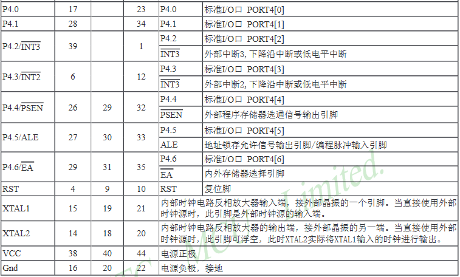
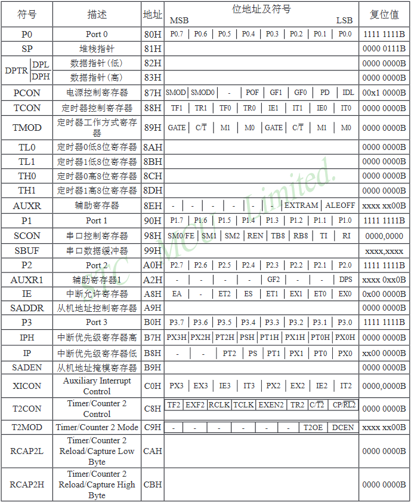
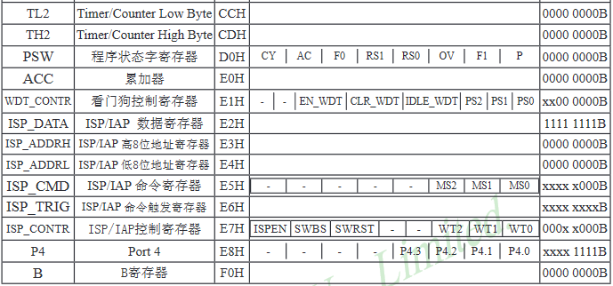
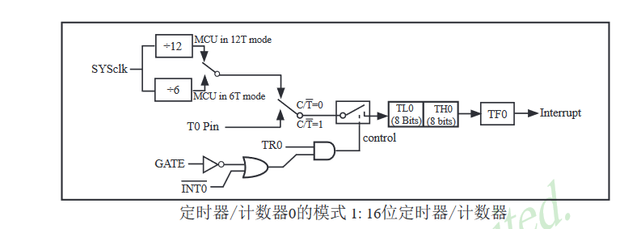
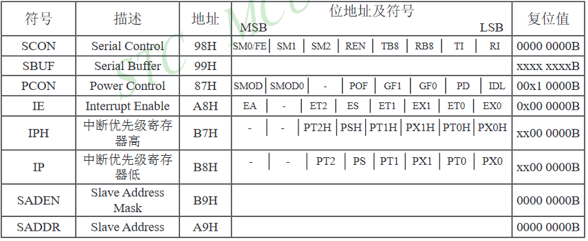
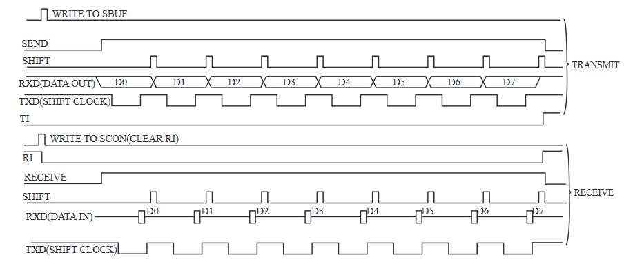
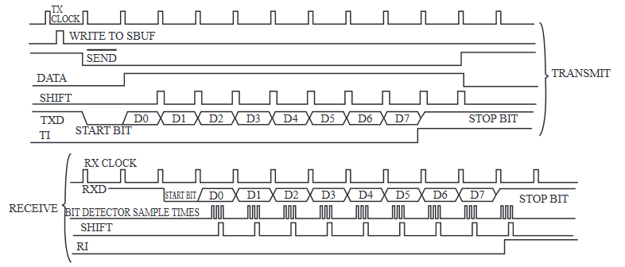
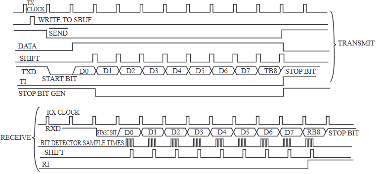
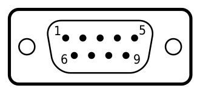

# 8051笔记

基于STC89C52RC


## 1 STC89C52RC引脚定义


如上图，STC89C52RC一共有40个管脚，定义如下表




文档对于引脚描述已经非常详细，这里总结一下重要的引脚功能

> **\#EA**：\#EA和P4_6共用引脚，已经有内部上拉，如果下拉到地（上电时为高电平），会从外部存储器开始运行。使用时一定注意，连接负载有可能会导致工作异常
>
> **P0\~P4**：都是普通IO，可以直接通过寄存器配置输入输出状态，并且通过寄存器读取输入状态或写输出状态。作为普通IO使用，在驱动能力上面有区别，P0开漏输出，其他口都是准双向，电路结构不同。P4不属于标准8052组成部分，为STC扩展部分
>
> **T0和T1**：分别和P3_4以及P3_5共用引脚，可以理解为分别连接了计数器0和1的时钟输入端
>
> **T2和T2EX**：分别和P1_0以及P1_1共用引脚。T2作为外部输入可以理解为连接计数器的时钟输入端，而T2EX用于控制计数器的动作，具体功能可以配置，比如触发计数，重装等
>
> **RxD TxD**：UART异步串口。STC不支持其他MCU生产商如Atmel的专用下载端口，程序下载也是通过串口，上电复位时运行固件，如果在缓冲区检测到有效命令就进入程序下载模式
>
> **\#INT0\~1**：2个外部输入中断（另外两个INT2\~3是STC添加的，并且在STC89C52RC没有引出，不属于标准8052部分）
>
> **RST**：复位引脚，高电平有效，大约10us复位


## 2 寄存器与存储器

## 2.1 程序存储器

8051采用的是程序存储器和内存空间分别编址，程序存储器地址宽度为16位

以STC89C52RC为例，程序存储器大小为8kB，地址范围0000H\~0FFFH，EEPROM大小为5kB


## 2.2 内存与寄存器

STC89C52RC一共有512字节的RAM，这其中包括了256字节的内部RAM和256字节的外部RAM

### 2.2.1 内部RAM

内部RAM又分为高128字节RAM以及低128字节RAM，其中高128字节RAM地址和SFR重叠，使用不同的寻址方式与指令加以区分


**低128字节RAM**：地址范围00H\~7FH

可以**直接或间接寻址**

| 区间 | 地址起点 | 地址终点 | 简介 |
| :-: | :-: | :-: | :-: |
| 寄存器组0 | 00H | 07H | 8个8bit通用寄存器R0\~R7，4个工作组通过PSW的RS1、RS0位切换 |
| 寄存器组1 | 08H | 0FH | 同上 |
| 寄存器组2 | 10H | 17H | 同上 |
| 寄存器组3 | 18H | 1FH | 同上 |
| 位寻址区 | 20H | 2FH | 大小16byte，共128bit，可以按byte地址（20H\~2FH）存取，也可以**使用位寻址指令**按bit地址（00H\~7FH）存取，在C中变量声明需要使用**bdata**指定 |
| 普通RAM区 | 30H | 7FH | 大小80byte，用于用户RAM以及堆栈，在C中变量声明需要使用**data**指定 |

**高128字节RAM**：地址范围80H\~FFH

只能**间接寻址**

| 区间 | 地址起点 | 地址终点 | 简介 |
| :-: | :-: | :-: | :-: |
| 普通RAM区 | 80H | FFH | 大小128byte，用于用户RAM以及堆栈，在C中变量声明需要使用**idata**指定 |


### 2.2.2 特殊功能寄存器区

**高128字节SFR区**：地址范围80H~FFH，与高128字节RAM重合

只能**直接寻址**，用于控制各种IO，计数器，控制中断等，对于了解8051的工作原理非常重要

SFR区地址分配图如下，蓝色字体为STC相比8052添加的寄存器


文档中对于各SFR的介绍如下





以下仅对寄存器做一些补充性的说明

**位寻址**：如上表所示，只有以8为倍数的地址可以进行位寻址

**程序计数器PC**：PC并没有出现在上图中，**所以PC不属于SFR**

**ACC累加寄存器**：累加寄存器ACC，用于一般的运算中，作为结果输出或操作数输入

**B寄存器**：在乘除法中和ACC结合使用，乘法中B存放16位结果的高位，ACC存放低位；除法中B存放除数，ACC存放被除数，商存放在ACC中，余数存放在B中

**SP堆栈寄存器**：用于指示当前栈顶，栈向上生长，如果指向的是7FH，那么堆栈事实上从80H开始。初始化后默认指向07H，需要手动设置

**DPTR（DPL和DPH）数据指针**：长度16位的寄存器，用于指向一个数据在**外部RAM**或**程序ROM**中存放的地址，一般用于MOVX指令。STC89C52中可以切换DPTR0还是DPTR1（不是标准8051功能，通过设置AUXR1的bit0切换）

**PSW状态寄存器**：表示当前的工作状态，位定义如下


其中，CY为carry进位标记，AC为辅助进位标记，OV为overflow溢出标记，P为ACC寄存器奇偶校验位（奇数个1置1），RS0和RS1用于表示当前寄存器组，F0和F1为用户标记位


### 2.2.3 外部RAM

标准8052中，外部RAM同样只能通过**间接寻址**访问，**独立编址**，地址从0000H开始，最多到FFFFH，**可以使用`MOVX`指令访问，而在C中需要使用xdata（使用DPTR寻址，能访问64k字节）或pdata（使用Ri寻址，只能访问低256字节）指定**

**STC89C52RC中的256字节外部RAM同样不是标准8052的组成部分**，在标准8052中属于外扩RAM地址区域，STC将其集成到了内部，超出以后才会通过IO使用外扩RAM

STC89C52RC的外部RAM可以通过将AUXR的bit1设为1禁用，这样使用MOVX访问外部RAM时会直接通过IO访问。同时设置AUXR的bit0可以设置ALE（Address Latch Enable）信号的输出，设为1可以使得ALE只在执行MOVX时输出，减少干扰


### 2.2.4 寻址方式

**立即数：** 在汇编中，所有立即数在前面添加\#表示，如下

```c
MOV A, #70H
```

**直接寻址：** 在指令中使用一个数字代表一个地址，如下

```c
ANL 70H, #15H
```

**间接寻址：** 在一个寄存器前加上\@符号，使用寄存器内存储的地址

```c
MOV A, @R0
```

**寄存器寻址：** 使用一个寄存器

```c
INC R0
```

**位寻址：** 8051不同于其他指令集的功能，可以对支持位寻址的区域进行数据操作

位寻址区的10H，传输到进位符号位C

```c
MOV C, 10H
```

**相对寻址：** PC加上一个偏移量，用于指令跳转，最多可以跳转-128\~127字节

```c
JC 80H
```

**变址寻址：** 数据寄存器加上一个偏移量

DPTR加上A中偏移量作为地址，数据传输至A中。**`MOVC`指令用于访问内部程序ROM，ROM和外部RAM一样使用独立编址**，ROM既可以存放程序也可以存放数据比如查找表，在C中ROM数据的声明一般使用**code**指定

```c
MOVC A, @A+DPTR
```


## 3 IO结构与配置

STC89C52RC所有的IO分为2种结构，一种是准双向、弱上拉（只有P1\~P4支持），一种是开漏输出（只有P0支持）

## 3.1 准双向弱上拉


IO口有3个上拉晶体管。IO口在输出为0时驱动能力很强。图中输入数据端其实漏画一个非门，这样才是读取的正确数据

**关于这种IO的工作原理可以从几种假设出发分析理解**

> **输出锁存0：**此时锁存数据为0，下方的NMOS输入为高电平所以**导通**，**强上拉和极弱上拉**PMOS输入一定是高电平所以一定**截止**。此时若端口引脚悬空，由于下拉NMOS此时一定**导通**所以端口引脚**一定处于低电平**，此时**弱上拉**PMOS输入为高电平所以**截止**，此时读取输入数据显示0。
>
> **此时如果从输入端直连VCC或接高电平输入会导致NMOS过流，可能烧坏单片机**

> **输出锁存1：**此时锁存数据为1。**假设是由0跳转而来**，那么在跳转瞬间，NMOS输入由高转低**立即截止**，**极弱上拉**PMOS**立即导通**，而**强上拉**PMOS输入端的或门由于在之后的两个时钟周期以内输入端都为低电平，所以此时**强上拉**也会**立即导通**并且**维持两个周期**迅速将端口**拉高**。如果此时端口悬空，弱上拉输入变为低同时**导通**。
>
> 此时可以在端口输入高电平或低电平而**不会导致过流现象（弱上拉和极弱上拉导通电阻非常大）**。如果此时将接口引脚接地，**弱上拉**PMOS也会自动截止，减小功耗

> 通过以上分析，可以推测**读取IO只要将输出锁存为1即可**。事实上也的确如此。主要的问题在于**IO输出高电平的驱动能力非常弱（可以轻松被拉低），而输出低电平的驱动能力非常强（直连VCC可能过流损坏），这一点和TTL电路非常相似**


## 3.2 开漏输出（输入）


图中输入数据端同样漏画一个非门

开漏输出（输入）相比前一种IO方式的电路简单很多，其实就是去除所有上拉PMOS的版本，**只有P0口支持**。用作输出时，**需要添加外置上拉电阻**才可正常工作输出高电平或低电平。同样，高电平的输出驱动能力远不及低电平输出驱动能力。

如果P0作为输入使用，不必要添加上拉电阻，并且**将锁存数据置位为1**，此时IO口输入电阻理想为无穷大，可以从引脚输入数据


## 3.3 IO读写

**每组IO（P0\~P4）事实上有两个寄存器**，一组用于读取输入一组用于设置输出，共用相同的地址，只通过读和写操作的不同加以区分。**IO寄存器支持位寻址**，汇编如下

```c
SETB P1. 0  ;置位P1_0为1，等价于SETB 90H
CLR P0. 2   ;复位P0_2为0，等价于CLR 82H
CPL P0. 2   ;翻转P0_2，等价于CPL 82H
```


## 4 定时器

定时器结构，配置寄存器以及数据寄存器如下




T0和T1都是16位长度定时器，**向上计数**。在STC89C52RC中还有第3个定时器T2

T0有4种工作模式，**模式0作为13位定时器/计数器，模式1作为16位定时器/计数器，模式2作为8位自动重装定时器，模式3作为两个单独的8位定时器/计数器**。而T1不支持模式3，其余相同

## 4.1 定时器控制寄存器

控制寄存器包括了TCON以及TMOD寄存器，这两个寄存器**也包含了外部中断INT0/1的控制**

TCON是控制寄存器，如下


**TF0/1：** 对应T0/1的中断请求位，一般在计数溢出时会置1，CPU响应中断时硬件或软件置0

**TR0/1：** 对应T0/1的运行控制，置1开始计数，置0停止计数。**当定时器对应GATE为1时，只在对应\#INT0/1无效时才会计数，此时可以直接通过外部引脚\#INT0/1控制计数**

**IE0/1：** 对应\#INT0/1的中断请求位，IE为1时向CPU请求中断，CPU响应中断时将该位硬件置0

**IT0/1：** 对应\#INT0/1的触发方式控制，IT为0代表低电平触发，IT为1代表下降沿触发。其中低电平触发方式需要\#INT0/1保持有效直到中断被响应，并且中断处理完成之前\#INT0/1需要退回到无效状态，否则会触发第二次中断

TMOD是模式寄存器，如下


**GATE：** 见上，置1可以实现外部引脚输入控制计数启停

**C/\#T：** 置0使用内部时钟（作定时器，输入时钟和机器周期相同，为输入晶振的**12分频**），置1使用外部时钟输入（作计数器），从T0T1（P3_4P3_5）输入

**M1M0：** 00B为模式0，13位计数，只使用TH[7:0]TL[4:0]拼接成为13位计数。01B模式1，使用TH[7:0]TL[7:0]所有位实现16位计数。10B为模式2，为8位自动重装模式，使用TL[7:0]计数，溢出产生中断同时将TH[7:0]载入重新计数。11B模式3只有计数器T0可用，此时T0分为两个单独的定时器使用，TL[7:0]会占用T0的所有控制端（GATE，\#INT0，TR0，TF0，C/\#T），而TH[7:0]会占用T1的TR1和TF1。T1在模式3下会停止工作，**但是T0在模式3下T1依然可以作为UART的时钟使用**


## 4.2 定时器数据寄存器

数据寄存器可以读写。可以用于预置值，改变定时长短，也可以读取计数值


## 4.3 定时器2

定时器T2长度16位，为标准8052组成部分，连接有P1_0（T2）P1_1（T2EX）两个外部引脚输入，寄存器定义如下


T2CON控制寄存器各位定义如下

**TF2：** 溢出中断标志，溢出置1，必须软件置0。若RCLK或TCLK为1则不会置位

**TR2：** 计数控制，置1计数，置0停止

**EXF2：** 外部中断标志，和TF2共用一个中断信号，**在EXEN2位为1并且外部输入引脚T2EX负跳变时触发置位为1，同时计数器被捕获或重装**，代表捕获或重装触发，必须软件置0。如果T2处于递增/减计数模式（即EXEN2为0）那么不会引发该中断

**RCLK和TCLK：** 用于设置串口UART模式1或3的时钟输入，将对应位设为1，UART就会将T2的**溢出脉冲**作为对应Rx或Tx的波特时钟，**如果都是0则使用T1溢出脉冲**。配置后T2所有中断无效

**EXEN2：** 外部T2EX引脚输入使能，置位1允许T2EX的负跳变触发计数器重装或捕获

**C/\#T2：** 计数时钟选择，置0使用内部时钟（晶振12分频）作为定时器使用，置1使用T2引脚输入作为计数器使用

**CP/\#RL2：** 模式设置，置1为捕获模式，置0为重装模式，**重装模式溢出以及T2EX负跳变都会导致重装，捕获模式下T2EX负跳变捕获后计数器继续计数**

T2MOD模式寄存器定义如下

**T2OE：** T2输出使能，T2的溢出脉冲会从T2/P1.0输出

**DCEN：** 计数方向，建议不动保持为0，向上计数

> 总结：计数器2的使用方法大致就是捕获和重载两种模式。
>
> 使能EXEN2，**捕获模式**（EXEN2置0则作为普通的16位计数器/定时器，溢出时产生中断，且不支持初值加载）一般使用内部时钟（如果是计数那就使用外部T2输入），此时T2EX下降沿会触发捕获，TL2和TH2的当前值被立即捕获到RCAP2L和RCAP2H寄存器同时产生中断，此时CPU前来读取捕获的数字。**注意这种状态下TF2在计数溢出时始终会产生中断，所以要在中断服务程序中使用判断**
>
> 如果工作在**重装模式**，首先需要赋值RCAP2L和RCAP2H寄存器，可以通过DCEN控制计数模式。如果DCEN为0，**此时T2只能递增计数**，如果使能EXEN2，那么此时计数溢出以及T2EX下降沿都会产生中断并且触发重载。**而当DCEN为1时的工作状态较为特殊**，该模式下需要**使用T2EX引脚控制计数方向（此时T2EX不是作为常规重载触发用途）**，这种模式其实可以看作T2的第三种模式。此时若T2EX为0则为递减计数，为1则为递增计数。**递减计数情况下从FFFFH开始向下计数**，到达预设值产生中断TF2同时重载FFFFH；**递增计数情况下从预设值开始向上计数**，到达FFFFH产生中断TF2同时重载初始值


## 5 中断

STC89C52RC中断系统结构如下


STC89C52RC支持4级中断，**正在执行的中断服务程序不会被同优先级中断请求所中断**。如果几个中断同时刻发生，STC89C52RC同级中断优先级如下，\#INT0最高


传统8051只支持2级中断。各中断控制寄存器地址以及定义如下


为兼容传统8051的两级中断，在IP之外添加了IPH寄存器，用于将每个中断的中断优先级号扩展为2位，实现4级优先级。

**IE：** 为各中断输入的屏蔽位，置位1允许中断，置位0屏蔽中断。EA是总屏蔽位，EX0/1为外部中断\#INT0/1的屏蔽位，ET0/1为计时器T0/1的屏蔽位，ES为串口中断屏蔽位，ET2为计时器T2屏蔽位。P4中的\#INT2/3屏蔽位通过XICON配置，由于没有引出所以不再描述

**IP和IPH：** 分别为对应中断优先级的低/高位，对应0\~3级中断。P4中\#INT2/3优先级（1位）通过XICON配置，由于没有引出所以不再描述


## 6 看门狗

看门狗不是标准8052组成部分，为STC添加的扩展模块

看门狗用于异常时复位，本质是个15位长度计数器，一旦CPU发生异常没有及时复位看门狗，看门狗可以及时复位系统


寄存器各配置位定义如下：

**EN_WDT：** 置1启动看门狗

**CLR_WDT：** 写1重新计数，用于定时喂狗操作

**IDLE_WDT：** 置1会在空闲模式下计数

**PS[2:0]：** 计数器分频系数，如下


**在12T模式下，看门狗延时计算公式 t = (12\*Prescale\*32768)/f**


## 7 UART串口

UART是标准8052的组成部分。STC89C52RC的UART串口**Rx和P3_0共用引脚，Tx和P3_1共用引脚**

STC89C52RC的标准UART**事实上使用了两个互相独立的发送、接收缓冲器（大小1字节）**，这两个缓冲器使用相同的地址（99H），仅通过读写区分开来。UART有4种工作模式

**UART拥有两个中断输出TI和RI，通过或门共用一个中断接口**


## 7.1 工作模式

UART所支持的4种工作方式中，只有123是真正的UART异步通信，拥有起始位以及结束位。串口工作方式包括一对一双机通信，以及一对多多机通信。多机通信只有模式2以及模式3支持

### 7.1.1 模式0

模式0使用固定传输速率，**速度只和单片机工作的模式（6T/12T）以及晶振频率有关（XTAL/6或XTAL/12）**。一帧传输8位，低位在前，只作为普通移位寄存器使用，没有起始和终止位，同时Tx作为同步时钟，Rx用作数据发送接收


### 7.1.2 模式1

模式1波特率可变，通过定时器1计数溢出脉冲获取时钟，一帧传输10位，其中包含8位数据位，1位起始位，1位结束位


### 7.1.3 模式2

模式2同模式0使用固定传输速率，一帧传输11位，其中包含8位数据位，1位自定义位，1位起始位，1位结束位


### 7.1.4 模式3

模式3波特率可变，通过定时器1获取时钟，一帧传输11位，其中包含8位数据位，1位自定义位，1位起始位，1位结束位


## 7.2 控制寄存器定义

UART端口相关寄存器定义如下



其中，SCON以及PCON寄存器中都有串口控制位，SBUF为输入输出缓冲，SADEN以及SADDR用于设置从机地址。其余都为中断控制

SCON以及PCON各配置位定义如下


重要配置位简介：

**SM0/FE**：如果SMOD0为1，该位用于帧错误检测，在接收电路（Rx）接收到无效停止位时会置该位为1，需要软件置0。如果SMOD0为0，该位和SM1一起用于指示串口工作方式。**SM0SM1为00代表模式0，01代表模式1，02代表模式2，03代表模式3**

**SM1**：见上

**SM2**：模式2或3中的多机通信控制位，置1监听总线上的地址帧，此时**每一帧数据中第9位（RB8）为0表示该帧为数据帧，为1表示该帧为地址帧**。如果在模式2和3下置SM2为1，同时开启REN允许接收，**那么RI在接收到的RB8为1时（接收到地址帧）才会触发中断，置RI为1，否则不会产生中断，缓冲区的数据也不会变化**，此时各从机检测是否为自己的地址，目标从机使用软件方法将SM2置0以开始接收数据帧（RB8为0）。如果是在模式1，SM2为1时只在接收到有效的停止位才会产生中断。模式0下应当置SM2为0

> 个人理解：SM2的本质就是可以控制RB8对中断产生的影响

**REN**：控制串行接收电路是否开启。需要软件置位或复位，置1允许Rx接收，置0关闭接收

**TB8**：模式2或3中要发送的第9位，只能由软件设置。可以用于数据校验或多机通信

**RB8**：模式2或3中接收的第9位。模式1下SM2为0，那么RB8为停止位

**TI**：发送中断请求标志位，表示**发送完毕**。模式0下表示第8位数据发送完毕，在其他模式下表示开始发送停止位，由硬件置位，需要由软件复位

**RI**：接收中断请求标志位，表示**接收完毕**。模式0下表示接收完一帧数据的第8位，使用软件复位，其他模式下在接收到停止位后置位产生中断。**RI和TI组成或逻辑，一个中断是接收还是发送中断需要由软件查询决定**


重要配置位简介：

**SMOD**：用于选择波特率，置1则在模式1、2、3下波特率和定时器T1溢出频率相同，置0则除以2，复位时为0

**SMOD0**：用于使能帧错误检测，置1使得SCON的SM0/FE用于检测帧错误（FE），置0使得SM0/FE位用于和SM1SM2一同指示当前串口的工作状态，复位时为0


## 7.3 工作模式详解

### 7.3.1 模式0

模式0功能较为局限，不支持波特率调整，以及起始停止位。Tx和Rx也不是常规功能，Tx是时钟输出，Rx用于数据输入输出。SM2需要置0

模式0的波特率仅和机器周期有关，为XTAL/12或XTAL/6。数据传输低位在先

数据传输时序图如下



除TxD和RxD以及TI、RI之外，其余信号都是内部信号

发送数据时，**内部发送信号SEND通过写SBUF触发**。在写入SBUF之后一个时钟，数据传输开始。RxD输出SBUF的最低一位，TxD在空闲状态下为高电平，在RxD输出一位有效数据时输出负脉冲，最后一位传输完毕之后TI转高电平产生中断

接收数据时，**首先需要复位RI，置位REN允许接收**。接收数据时**TxD同样用于时钟脉冲输出**。接收完8位数据之后RI置1，产生中断


### 7.3.2 模式1

模式1开始的串口通信就是真正的UART。此时Tx和Rx为常规功能，分别负责异步发送以及接收。

**注意，在模式1下时钟脉冲在经过SMOD选择是否分频之后，还会经过一个16分频，并且该分频是固定的，用于接收数据时多次采样**

数据传输时序图如下



发送数据同样由写SBUF触发整个过程。传输开始时，发送移位寄存器的第9位自动置1，内部信号SEND有效，Tx首先传输出一位0作为起始位（空闲状态下Tx为1），传输完8位数据以后输出一位1作为终止位，**同时**自动置TI为1产生中断。**接收移位寄存器的长度为9**

数据接收通过写REN为1触发。此时接收电路开始检测接收到的负跳变（代表接收到起始位），接收移位寄存器复位值全1。一旦接收到有效的起始位，就启动接收，**在传输完所有位之后再移动一位，使得第一位为接收到数据的最低位**。最终，如果此时RI为0（此时SM2=0），那么接收到的数据就会传输到SBUF，同时终止位会传输到RB8，并且在接收到终止位同时产生RI中断

**模式1波特率计算公式Baud=2^SMOD/32\*(Fov1)**


### 7.3.3 模式2

模式2就是不可调整波特率的模式3，和模式1一样拥有起始位以及结束位

模式2的一帧数据有9位，第9位为TB8/RB8，分别用于发送/接收。第九位可以将状态寄存器中的奇偶校验位加入，用于校验，或在多机通信时用于区分地址帧和数据帧。

数据传输时序图如下



发送同样通过写SBUF触发，在TB8传输完毕之后产生中断。数据接收时，此时首先RI=0，其次**当SM2=0（不开启多机通信），或者SM2=1（开启多机通信）且RB8=1（接收到地址帧）时**，才会将接收到的数据存入到SBUF，同时产生中断

**模式2波特率计算公式Baud=2^SMOD/64(Ft)**


### 7.3.4 模式3

模式3和模式2唯一的区别就是输入时钟的不同。模式3和模式1一样使用T1的溢出脉冲作为时钟来源，经过SMOD选择预分频以及经过固定的16分频之后，再输入到电路

**模式3波特率计算公式Baud=2^SMOD/32\*(Fov1)**


## 7.4 多机通信方法

多机通信的软件实现方法

多机通信为主从模式，一个网络中只能有一台主机，其余都为从机。需要在模式2或3下设置SMOD的SM2为1

通信过程如下：

> 1. 起始时，所有从机SM2置1，等待有效地址帧的到来才会中断
>
> 2. 主机发送呼叫地址帧，指定一个从机地址，置RB8为1。所有从机接收到该地址帧后会中断，CPU转向处理该地址帧
>
> 3. 地址指定的从机将SM2置0，开始继续接收处理之后的数据帧。**而其他从机保持SM2为1，此时其他从机对之后主机送来的数据帧不予理会，SBUF的数据不会更新，也不会产生中断**
>
> 4. 主机和从机之间的数据传送完毕，主机再次发送下一个从机的地址。**之前的从机通过软件方式判断下一个从机已经不是自己了，所以再次置SM2为1，直到下一次通信的到来**

除通信过程以外，多机通信一般还要规定数据帧，一般数据帧可以用于命令控制以及数据传送。这些都是属于软件实现的范畴


## 8 补充：RS232串口通信

## 8.1 基本概念

RS232串口最早设计的用途就是连接电传打字机和猫

在RS232串口通信中，设备被分为两种。一种是**DTE**（Data Terminal Equipment），如PC主机、哑终端等，这些设备在通信中一般会负责和人的交互；另一种是**DCE**（Data Circuit-terminating Equipment），如示波器、猫、PLC等，这些设备一般负责其他信号（如输出控制信号以及输入模拟信号等）和数据的相互转换。**通俗来讲DTE可以看作主机，DCE可以看作从机**。而在这个通信系统中没有明确规定相互连接两个设备的类型，一个DTE可以和一个DCE相连也可以和另一个DTE相连，就像一台笔记本（DTE），在运维时它可以和一台服务器（DTE）相连，也可以和一台猫（DCE）相连。现在的RS232支持**全双工**通信

RS232串口通信标准最常用的物理接口为DE-9（梯形9针），如下。一般DTE设备使用9针公头（PC主板常见），DCE设备使用9孔母头（PLC等工控设备常见）。公头设备和母头设备之间使用**直通线**连接，而公头设备和公头设备之间要使用**交叉线**连接


由于DE-9是一种应用较为广泛的物理接口，也被其他很多种通信接口使用，所以市场上很多连接线是不能用于RS232接口通信的，最常见的就是两头都是母头的直通线，它不能用于连接两台DTE（需要使用交叉线）。使用前一定要注意检查，避免通信异常甚至损坏设备


## 8.2 电平标准与接口信号定义

RS232串口标准中所有信号线都是**单向**的。DTE设备上的DE-9**公头**引脚编号以及定义见下。而DCE设备上母头引脚编号顺序为镜像（同时将插口正对自己）



| 编号 | 定义 | 全称 | DTE | DCE |
| :-: | :-: | :-: | :-: | :-: |
| 1 | DCD | Data Carrier Detect     | in | out |
| 2 | RxD | Received Data           | in | out |
| 3 | TxD | Transmitted Data        | out | in |
| 4 | DTR | Data Terminal Ready     | out | in |
| 5 | G   | Ground                  | com | com |
| 6 | DSR | Data Set Ready          | in | out |
| 7 | RTS | Request To Send         | out | in |
| 8 | CTS | Clear To Send           | in | out |
| 9 | RI  | Ring Indicator          | in | out |

所有的引脚都是针对DTE设备而定义的（如RxD和TxD，是相对于DTE设备而言的输入输出）

RS232标准规定使用-15V到-3V（相对于G而言）表示负电压，3V到15V表示正电压。用于数据传输的RxD和TxD都是使用**负逻辑**（负电压代表高电平1而正电压代表低电平0）。而用于流控制的信号线则恰恰相反，使用正电压表示信号有效（Asserted）而负电压表示无效

我们常见的USB转串口芯片，如CH340，FT232，CP2102等都是使用TTL电平标准，且数据传输使用正逻辑，不能直接接入RS232总线，需要添加一块电平转换芯片，如MAX232。MAX232需要外接电容，使用电荷泵将5V单电源转换为高压正负双电源，以符合RS232电平标准。正是因为RS232使用高电压进行通信，所以可以用于通信距离较长的情况，直到今天在要求高可靠性的场合如工控领域还有极其广泛的应用（之后的RS485等串口标准很多都使用了差分信号，可以提供更长的极限通信距离以及相当的可靠性，不再使用高电压）

RS232在实际应用中已经很少会使用到所有这些引脚了。最简单的2线RS232只连接G和TxD或RxD，一般用于单向通信，比如控制投影仪开关。3线RS232连接RxD，TxD和G，可以双向通信。5线RS232连接RxD，TxD，G，RTS，CTS，可以双向通信同时支持简单的流控制。现在PC上的RS232接口为保证兼容还是保留了所有这些引脚的完整功能

**RI**引脚

最早的猫都是通过电话线连接拨号上网。RI引脚可以用于表示电话线被呼叫响铃。有些计算机可以在RI引脚信号**跳变**时产生中断，这可以应用在UPS电源中，向服务器发送一个停电信号通知服务器尽快关机。绝大部分带RS232串口的台式PC也在BIOS中提供了通过RI唤醒的选项

**RTS(RTR)**和**CTS**引脚

最早的RS232设备中，DTE想向DCE传输数据时，会将RTS拉高，DCE在接收到信号后启动接收电路，同时将CTS拉高表示已经准备好接收数据，相当于一个握手过程。这种通信是半双工且**非对称**的，只能控制从DTE到DCE的数据流，而DTE无法控制从DCE发来的数据流

之后的RS232-E标准中，将RTS重新定义为RTR（Ready To Receive），变为全双工**对称**通信，由于历史原因在实际使用中它依然叫做RTS。DTE设备在准备好接收DCE的数据时会将RTR拉高，反之DCE可以接收数据时将CTS拉高。这种工作模式下两个信号独立运作，互不依赖。现在绝大多数的串口设备都使用这种定义

现在绝大多数PC都会将RTS一直置于有效状态，所以RTS一般作用不大

**DTR**和**DSR**引脚

DTE在准备好开始通信时会拉高一下DTR，而DCE在准备好通信时会拉高一下DSR。一次通信包含多次数据传输。在一些单片机开发板中会将DTR应用于单片机下载的自动复位，最好的例子就是Arduino Nano，使用了FT232RL的DTR信号作为复位

在串口操作中，打开串口DTR就会自动跳变

## 8.3 奇偶校验

奇偶校验看的是一串二进制数据（无论多少位）中有多少个1，校验位1位，位于传输一串数据的最后。偶校验时有偶数个1那么校验位为0，奇校验时有奇数个1那么校验位为0

现在实际应用中建议还是使用1位起始位，8位数据位，1位校验位或无校验位，1位停止位的串行数据格式


## 8.4 流控制

流控制分为硬件流控制和软件流控制。使用软件流控制时一般只使用RS232的3线接法，只连接GND，TxD和RxD，流控制通过发送特定ASCII控制字符实现。硬件流控制还要连接RTS以及CTS信号，通过这两个信号实现流控制，效率远高于软件流控制，但是不是所有的操作系统以及硬件都支持硬件流控制机制

另外，在RS232通信中如果RxD以及TxD保持状态0（正电压）很长一段时间，代表一次Break，表示通信需要复位


## 9 补充：软件状态机

软件状态机在单片机编程中是属于必学内容，事实上几乎所有常见的通信协议，如I2C，SPI等都可以使用软件状态机来模拟。结合定时器中断，软件状态机几乎可以精准模拟任何通信协议，只是占用CPU稍大，速度一般慢于硬件实现。虽然使用暴力延时翻转IO也可以实现通信，但是这不适用于其他计算任务较重的场合，容易受影响


## 10 补充：PID自动控制算法