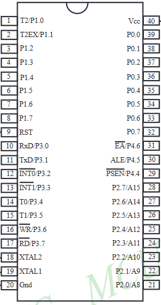
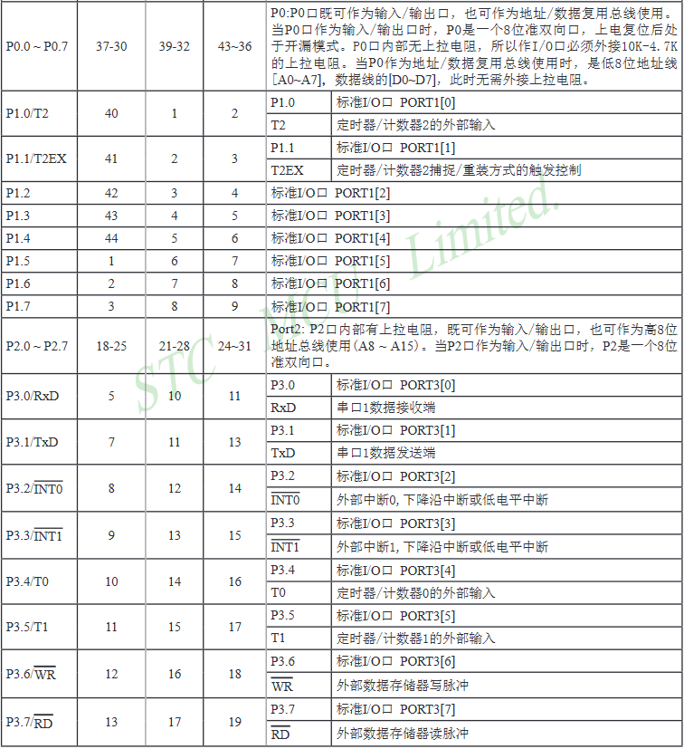
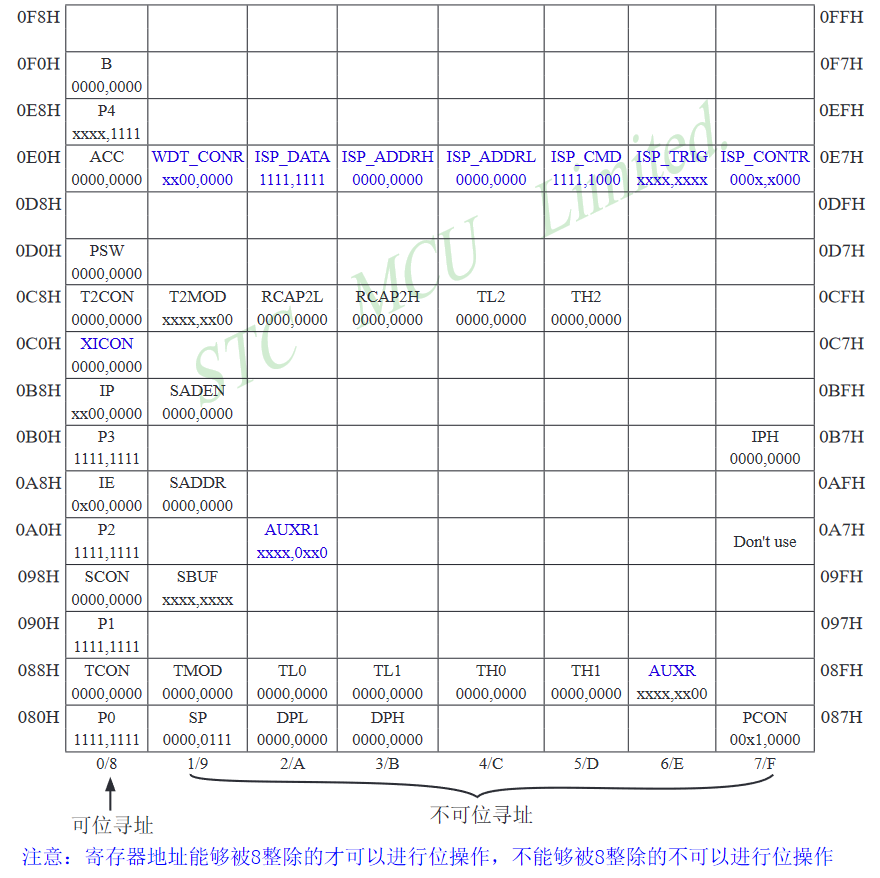
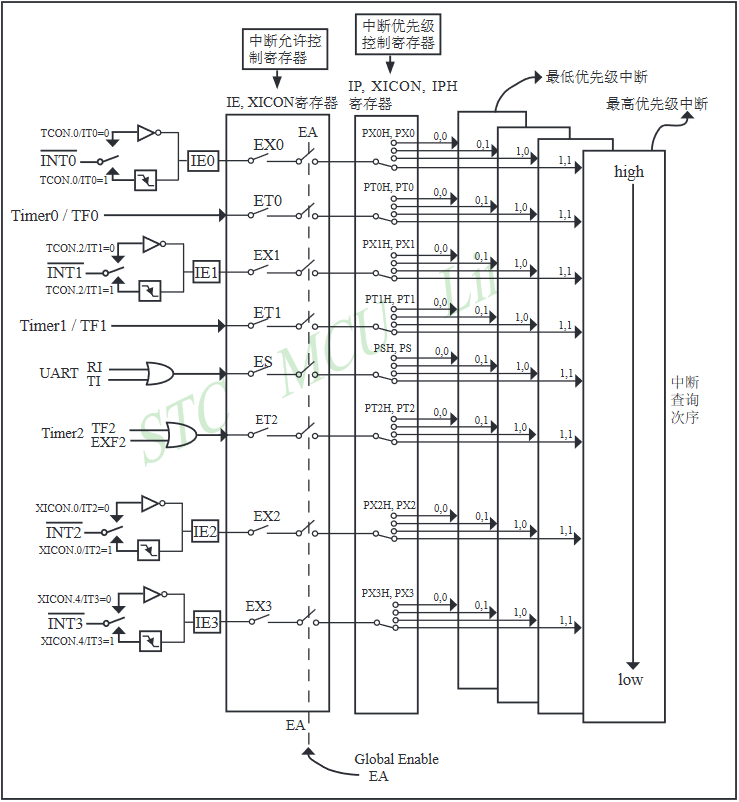
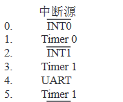
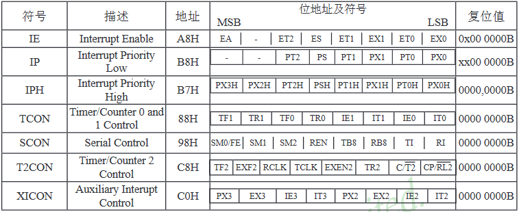
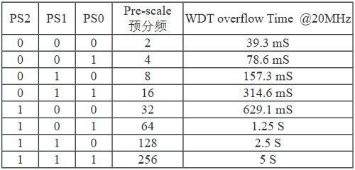

# 8051笔记

基于STC89C52RC


## 1 STC89C52RC引脚定义



如上图，STC89C52RC一共有40个管脚，定义如下表




文档对于引脚描述已经非常详细，这里总结一下重要的引脚功能

> **\#EA**：\#EA和P4_6共用引脚，已经有内部上拉，如果下拉地（上电时为高电平），会从外部存储器开始运行。使用时一定注意，连接负载有可能会导致工作异常
>
> **P0\~P4**：都是普通IO，可以直接通过寄存器配置输入输出状态，并且通过寄存器读取输入状态或写输出状态。作为普通IO使用，在驱动能力上面有区别，P0和P2上拉开漏输出，其他口都是准双向，电路结构不同。P4不属于标准8052组成部分，为STC扩展部分
>
> **T0和T1**：分别和P3_4以及P3_5共用引脚，可以理解为分别连接了计数器0和1的时钟输入端
>
> **T2和T2EX**：分别和P1_0以及P1_1共用引脚。T2作为外部输入可以理解为连接计数器的时钟输入端，而T2EX用于控制计数器的动作，具体功能可以配置，比如触发计数，重装等
>
> **RxD TxD**：UART异步串口。程序下载也是通过此串口，上电复位时如果在缓冲区检测到有效命令就进入程序下载模式
>
> **\#INT0\~1**：2个外部输入中断（另外两个INT2\~3是STC添加的，并且在STC89C52RC没有引出，不属于标准8052部分）
>
> **RST**：复位引脚，高电平有效，大约10us复位


## 2 寄存器与存储器

## 2.1 程序存储器

8051采用的是程序存储器和内存空间分别编址，程序存储器地址宽度为16位

以STC89C52RC为例，程序存储器大小为8kB，地址范围0000H\~0FFFH，可以分给用户的EEPROM大小为5kB


## 2.2 内存与寄存器

STC89C52RC一共有512字节的RAM，这其中包括了256字节的内部RAM和256字节的外部RAM

### 2.2.1 内部RAM

内部RAM又分为高128字节RAM以及低128字节RAM，其中高128字节RAM地址和SFR重叠，使用不同的寻址方式与指令加以区分


**低128字节RAM**：地址范围00H\~7FH

可以**直接或间接寻址**

| 区间 | 地址起点 | 地址终点 | 简介 |
| :-: | :-: | :-: | :-: |
| 寄存器组0 | 00H | 07H | 8个8bit通用寄存器R0\~R7，4个工作组通过PSW的RS1、RS0位切换 |
| 寄存器组1 | 08H | 0FH | 同上 |
| 寄存器组2 | 10H | 17H | 同上 |
| 寄存器组3 | 18H | 1FH | 同上 |
| 位寻址区 | 20H | 2FH | 大小16byte，共128bit，可以按byte地址（20H\~2FH）存取，也可以**使用位寻址指令**按bit地址（00H\~7FH）存取 |
| 普通RAM区 | 30H | 7FH | 大小80byte，用于用户RAM以及堆栈 |

**高128字节RAM**：地址范围80H\~FFH

只能**间接寻址**

| 区间 | 地址起点 | 地址终点 | 简介 |
| :-: | :-: | :-: | :-: |
| 普通RAM区 | 80H | FFH | 大小128byte，用于用户RAM以及堆栈 |


### 2.2.2 特殊功能寄存器区

**高128字节SFR区**：地址范围80H~FFH

只能**直接寻址**，用于控制各种IO，计数器，控制中断等，对于了解8051的工作原理非常重要

SFR区地址分配图如下，蓝色字体为STC相比标准8052添加的寄存器



文档中对于各SFR的介绍如下


以下仅对寄存器做一些补充性的说明

**位寻址**：如上表所示，只有以8为倍数的地址可以进行位寻址

**程序计数器PC**：PC并没有出现在上图中，**所以PC不属于SFR**

**ACC累加寄存器**：累加寄存器ACC，用于一般的运算中，作为结果输出或操作数输入

**B寄存器**：在乘除法中和ACC结合使用，乘法中B存放16位结果的高位，ACC存放低位；除法中B存放除数，ACC存放被除数，商存放在ACC中，余数存放在B中

**SP堆栈寄存器**：用于指示当前栈顶，栈向上生长，如果指向的是7FH，那么堆栈事实上从80H开始。初始化后默认指向07H，需要手动设置

**DPTR（DPL和DPH）数据指针**：长度16位的寄存器，用于指向一个数据在**外部RAM**中存放的地址，一般用于MOVX指令。STC89C52中可以切换DPTR0还是DPTR1（不是标准8051功能，通过设置AUXR1的bit0切换）

**PSW状态寄存器**：表示当前的工作状态，位定义如下


其中，CY为carry进位标记，AC为辅助进位标记，OV为overflow溢出标记，P为ACC寄存器奇偶校验位（奇数个1置1），RS0和RS1用于表示当前寄存器组，F0和F1为用户标记位


### 2.2.3 外部RAM

标准8052中，外部RAM同样只能通过**间接寻址**访问，**独立编址**，地址从0000H开始，最多到FFFFH，**使用`MOVX`指令访问，而在C中需**要使用xdata声明变量**

**STC89C52RC中的256字节外部RAM同样不是标准8052的组成部分**，在标准8052中属于外扩RAM地址区域，STC将其集成到了内部，超出以后才会通过IO使用外扩RAM

STC89C52RC的外部RAM可以通过将AUXR的bit1设为1禁用，这样使用MOVX访问外部RAM时会直接通过IO访问。同时设置AUXR的bit0可以设置ALE（Address Latch Enable）信号的输出，设为1可以使得ALE只在执行MOVX时输出，减少干扰


### 2.2.4 寻址方式

**立即数：** 在汇编中，所有立即数在前面添加\#表示，如下

```c
MOV A, #70H
```

**直接寻址：** 在指令中使用一个数字代表一个地址，如下

```c
ANL 70H, #15H
```

**间接寻址：** 在一个寄存器前加上\@符号，使用寄存器内存储的地址

```c
MOV A, @R0
```

**寄存器寻址：** 使用一个寄存器

```c
INC R0
```

**位寻址：** 8051不同于其他指令集的功能，可以对支持位寻址的区域进行数据操作

位寻址区的10H，传输到进位符号位C

```c
MOV C, 10H
```

**相对寻址：** PC加上一个偏移量，用于指令跳转，最多可以跳转-128\~127字节

```c
JC 80H
```

**变址寻址：** 数据寄存器加上一个偏移量

DPTR加上A中偏移量作为地址，数据传输至A中。**`MOVC`指令本质用于访问内部程序ROM，ROM和外部RAM一样使用独立编址**，ROM既可以存放程序也可以存放数据比如查找表

```c
MOVC A, @A+DPTR
```


## 3 IO结构与配置

STC89C52RC所有的IO分为2种结构，一种是准双向、弱上拉（只有P1\~P4支持），一种是开漏输出（只有P0支持）

## 3.1 准双向弱上拉


IO口有3个上拉晶体管。IO口在输出为0时驱动能力很强。图中输入数据端其实漏画一个非门，这样才是读取的正确数据

**关于这种IO方式可以从几种假设出发分析理解**

> **输出锁存0：**此时锁存数据为0，下方的NMOS输入为高电平所以**导通**，**强上拉和极弱上拉**PMOS输入一定是高电平所以一定**截止**。此时若端口引脚悬空，由于下拉NMOS此时一定**导通**所以端口引脚**一定处于低电平**，此时**弱上拉**PMOS输入为高电平所以**截止**，此时读取输入数据显示0。
>
> **此时如果从输入端直连VCC或接外设的高电平输入会导致NMOS过流，可能烧坏单片机**

> **输出锁存1：**此时锁存数据为1。**假设是由0跳转而来**，那么在跳转瞬间，NMOS输入由高转低**立即截止**，**极弱上拉**PMOS**立即导通**，而**强上拉**PMOS输入端的或门由于在之后的两个时钟周期以内输入端都为低电平，所以此时**强上拉**也会**立即导通**并且**维持两个周期**迅速将端口**拉高**。如果此时端口悬空，弱上拉输入变为低**导通**。
>
> 此时可以在端口输入高电平或低电平而**不会导致过流现象（弱上拉和极弱上拉导通电阻非常大）**。如果此时将输入接地，**弱上拉**PMOS也会自动截止，减小功耗

> 通过以上分析，可以推测**读取IO只要将输出锁存为1即可**。事实上也的确如此。主要的问题在于**IO输出高电平的驱动能力非常弱（可以轻松被拉低），而输出低电平的驱动能力非常强（直连VCC可能过流损坏），这一点和TTL电路非常相似**


## 3.2 开漏输出（输入）


图中输入数据端同样漏画一个非门

开漏输出（输入）相比前一种IO方式的电路简单很多，其实就是去除所有上拉PMOS的版本，**只有P0口支持**。用作输出时，**需要添加外置上拉电阻**才可正常工作输出高电平或低电平。同样，高电平的输出驱动能力远不及低电平输出驱动能力。

如果P0作为输入使用，不必要添加上拉电阻，并且**将锁存数据置位为1**，此时IO口输入电阻理想为无穷大，可以从引脚输入数据


## 3.3 IO读写

**每组IO（P0\~P4）事实上有两个寄存器**，一组用于读取输入一组用于设置输出，共用相同的地址，只通过读和写操作的不同加以区分。**IO寄存器支持位寻址**，汇编如下

```c
SETB P1. 0  ;置位P1_0为1，等价于SETB 90H
CLR P0. 2   ;复位P0_2为0，等价于CLR 82H
CPL P0. 2   ;翻转P0_2，等价于CPL 82H
```


## 4 计数器

计数器配置寄存器以及数据寄存器如下


以上是8052标准计数器，计数器T0和T1都是16位长度计数器。在STC89C52RC中还有第3个计数器T2，属于标准8052计数器

T0有4种工作模式，**模式0作为13位定时器/计数器，模式1作为16位定时器/计数器，模式2作为8位自动重装定时器，模式3作为两个8位定时器/计数器**。而T1不支持模式3，其余相同

## 4.1 计数器控制寄存器

控制寄存器包括了TCON以及TMOD寄存器，**也包含了外部中断的控制**

TCON是控制寄存器，如下


**TF0/1：** 对应计数器T0/1的中断请求位，一般在计数溢出时会置1，CPU响应中断时硬件或软件置0

**TR0/1：** 对应计数器T0/1的运行控制，置1开始计数，置0停止计数。**当计数器对应GATE为1时，只在对应\#INT0/1无效时才会计数，解决中断冲突**

**IE0/1：** 对应\#INT0/1的中断请求位，IE为1时向CPU请求中断，CPU响应中断时将该位硬件置0

**IT0/1：** 对应\#INT0/1的触发方式控制，IT为0代表低电平触发，IT为1代表下降沿触发。其中低电平触发方式需要\#INT0/1保持有效直到中断被响应，并且中断处理完成之前\#INT0/1需要退回到无效状态，否则会触发第二次中断

TMOD是模式寄存器，如下


**GATE：** 见上

**C/\#T：** 置1使用内部时钟（定时器），置0使用外部时钟输入（计数器），从T0T1（P3_4P3_5）输入

**M1M0：** 00B为模式0，13位计数，只使用TH[7:0]TL[4:0]拼接成为13位计数。01B模式1，使用TH[7:0]TL[7:0]所有位实现16位计数。10B为模式2，为8位自动重装模式，使用TL[7:0]计数，溢出产生中断同时将TH[7:0]载入重新计数。11B模式3只有计数器T0支持，此时T0的TL[7:0]会占用T0的所有控制端（GATE，\#INT0，TR0，TF0，C/\#T），而TH[7:0]会占用T1的TR1和TF1


## 4.2 计数器数据寄存器

数据寄存器可以读写。可以用于预置值，改变定时长短，也可以读取计数值


## 4.3 计数器2

计数器2在标准8051中不存在，长度16位，为8052的扩展，有P1_0（T2）P1_1（T2EX）两个外部引脚，寄存器定义如下


计数器寄存器TH2和TL2以及重载/捕获寄存器RCAP2H和RECAP2L，可以用于计数初值，具体不再描述

T2CON控制寄存器各位定义如下

**TF2：** 溢出中断标志，溢出置1，必须软件置0。若RCLK或TCLK为1则不会置位

**TR2：** 计数控制，置1计数，置0停止

**EXF2：** 外部中断标志，和TF2共用中断接口，**在EXEN2位为1并且外部输入引脚T2EX负跳变时触发置位为1，同时计数器被捕获或重装**，代表捕获或重装触发，必须软件置0。如果T2处于递增/减计数模式那么不会引发中断

**RCLK和TCLK：** 用于设置串口UART模式1或3的时钟输入，如果是1那么使用T2的溢出脉冲作为对应输入输出时钟，如果是0则使用T1溢出脉冲。配置后中断无效

**EXEN2：** 外部T2EX引脚输入使能，置位1允许T2EX的负跳变触发计数器重装或捕获

**C/\#T2：** 计数时钟选择，置0使用内部时钟作为定时器，置1使用T2引脚输入作为计数器

**CP/\#RL2：** 置1为捕获模式，置0为重装模式，**重装模式下溢出以及T2EX负跳变都会导致重装，捕获模式下捕获后计数器继续计数**

T2MOD模式寄存器定义如下

**T2OE：** T2输出使能

**DECN：** 向下计数，建议不动保持为0


## 5 中断

STC89C52RC中断系统结构如下



STC89C52RC支持4级中断，**正在执行的中断服务程序不会被同优先级中断请求所中断**。如果几个中断同时发生，STC89C52RC同级中断优先级如下，\#INT0最高



传统8051只支持2级中断。各中断控制寄存器地址以及定义如下



为兼容传统8051的两级中断，在IP之外添加了IPH寄存器，用于将每个中断的中断优先级号扩展为2位，实现4级优先级。

**IE：** 为各中断输入的屏蔽位，置位1允许中断，置位0屏蔽中断。EA是总屏蔽位，EX0/1为外部中断\#INT0/1的屏蔽位，ET0/1为计时器T0/1的屏蔽位，ES为串口中断屏蔽位，ET2为计时器T2屏蔽位。P4中的\#INT2/3屏蔽位通过XICON配置，由于没有引出所以不再描述

**IP和IPH：** 分别为对应中断优先级的低/高位，对应0\~3级中断。P4中\#INT2/3优先级（1位）通过XICON配置，由于没有引出所以不再描述


## 6 看门狗

看门狗用于异常时复位，本质是个15位长度计数器，一旦CPU发生异常没有及时复位看门狗，看门狗可以及时复位系统


寄存器各配置位定义如下：

**EN_WDT：** 置1启动看门狗

**CLR_WDT：** 写1重新计数，用于定时喂狗操作

**IDLE_WDT：** 置1会在空闲模式下计数

**PS[2:0]：** 计数器分频系数，如下



**在12T模式下，看门狗延时计算公式 t = (12\*Prescale\*32768)/f**


## 6 串口