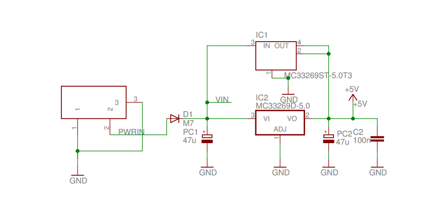
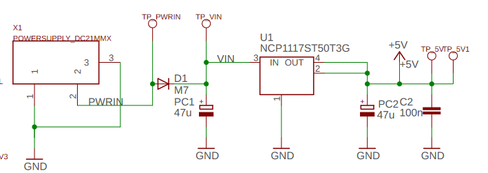
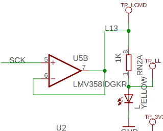
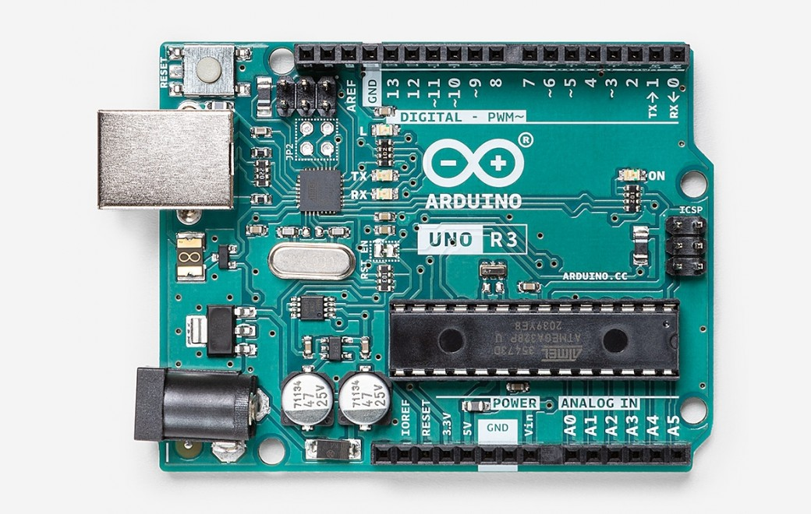
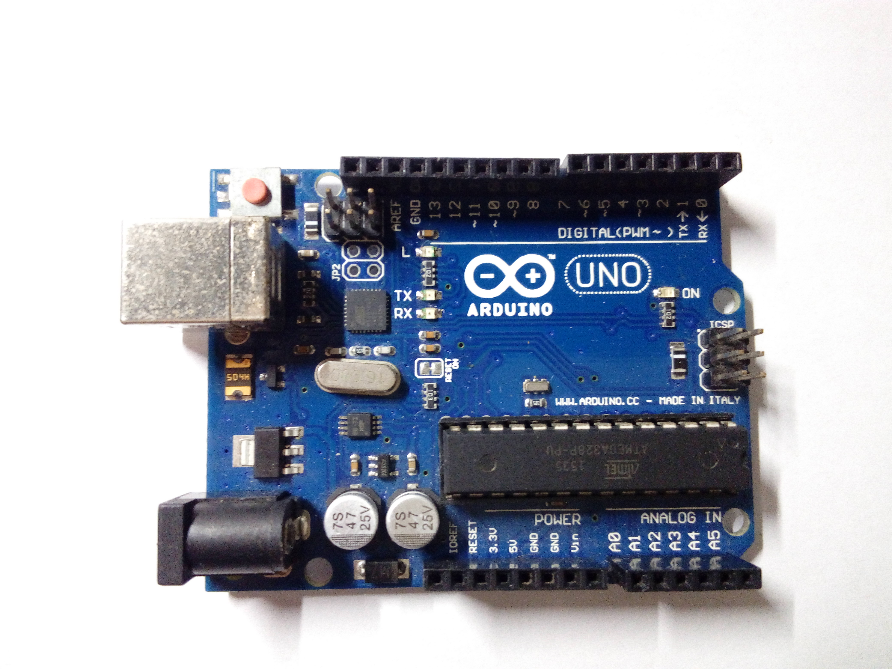
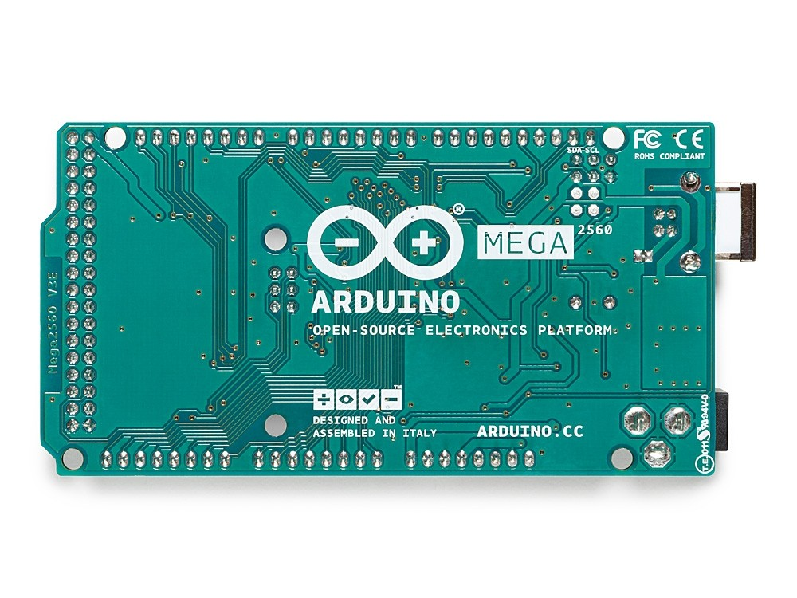
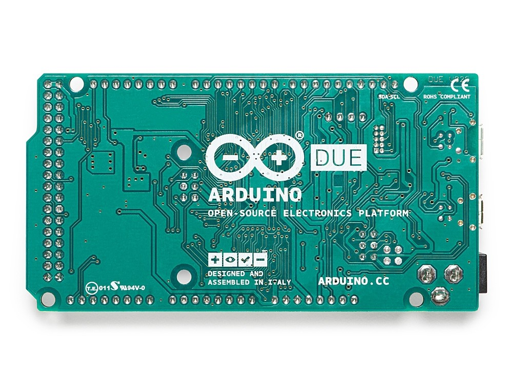

# AVR单片机深入学习

基于Arduino，了解AVR单片机的底层工作原理，像学8051一样学习AVR，摆脱对Arduino IDE的依赖，仅仅利用Arduino廉价且普及的硬件

## 参考资料

[Microchip AVR](https://www.microchip.com/en-us/products/microcontrollers-and-microprocessors/8-bit-mcus/avr-mcus)

[收集的文档](src/210702a01/)

## 0 Arduino硬件解析

由浅入深的硬件分析

## 0.1 Arduino硬件博物馆：各版本Arduino外观以及对比

### 0.1.1 Arduino UNO

UNO作为Arduino最经典的一款开发板，分为很多个版本，因为各种克隆版、授权代工、改良版等等实在太多了。

> 这里遵循TB商家的命名习惯做一些定义：
>
> **官方版**代指**所有遵循官方电路以及PCB设计生产的开发板**，这些开发板包括正版开发板（TB商家一般称为**原装进口正版**、**意大利官方英文版**等），国内授权代工版（目前已停产，一般称为**官方中文版**等），以及一些国内厂家根据官方网站提供的PCB文件生产的官方盗版（一般称为**官方版本**），这些开发板共同的特点就是usb电路部分都是使用一片正方形的ATmega16u2或8u2的单片机（需要下载固件），并且一般会印上Arduino的logo
>
> **改良版**代指**国内一些厂家由官方电路更改而来，重新自行设计PCB之后生产的开发板**（一般称为**改良版**或**改进版**）。这些改良版的共同特点是usb部分使用了南京沁恒的CH340芯片，是一个16脚长方形芯片，可以大大降低成本（ATmega16u2和ATmega328P一样是个完整功能的AVR单片机，价格较高）。而主控芯片一般使用贴片ATmega328P，也有少部分和官方版一样使用插槽安装直插式DIP芯片，并且一般不会打印Arduino的logo
>
> **克隆版**代指所有非官方工厂（包括官方代工）来源的开发板，包括了官方盗版以及改良版。现在新款的原装和代工版的PCB一般使用蓝绿色油墨

**官方版**

官方版UNO有新版UNO R3和旧版UNO两种，其中旧版已经非常少见，二手平台也基本找不到

新版UNO R3电路[查看](src/210702a01/Arduino_Uno_R3.pdf)

旧版UNO电路[查看](src/210702a01/Arduino_Uno.pdf)

官方新版与旧版电路区别主要在5V稳压芯片以及13脚的LED电路上

> 旧版5V稳压芯片采用一片MC33269D-5.0，这个5V三端稳压有两种不同的封装，所以图中画了两个，实际只安装一种封装的芯片
>
> 
> 
> 新版R3的5V稳压芯片采用一片AMS1117-5.0
>
> 
>
> 旧版13脚LED直接和328P的IO（PB5）相连，通过电阻限流
>
> 
>
> 新版R3的13脚LED利用了板载运放LM358中未使用的一个运放，作为一个跟随器用，利用运放输入高阻抗特性隔离LED负载，可以减小PB5口的电流负载，同时13脚理论阻值无穷大
>
> 
>
> 此外，新版相对于旧版在电源口部分添加了IOREF引脚，用于为扩展板提供参考IO电平

原装英文版（引自Arduino官网）

背面

> 进口的买不起，太贵了，同样价格可以买一打克隆版了。当然土豪不差钱无所谓

官方中文版（自摄）

背面

> Arduino官方授权中国厂商代工。这块中文版前主人将其用于小车电机控制，由于未知原因导致16u2芯片固件异常无法烧录，而328P芯片已被取下转移至旧版UNO上使用。之后有修复教程，以及16u2的开发（事实上UNO没有328P也可以当开发板用，功能和之后提到的Leonardo类似，可以模拟键盘，但是可扩展性稍差）

官方盗版（自摄）

背面

> 陪伴我时间最长的一块开发板，从刚上高中用到现在。这些克隆版缺点就是焊接工艺较差，元器件歪斜，但是工作稳定性没什么区别

旧版官方盗版（自摄）

背面

> 捡到的板子。字体形状比较奇怪，应该是当时的厂商没有相应的字体文件。比新版少一些接口，usb是使用的ATmega8u2而非16u2，复位键在中间，三端稳压不一样，功能方面和新版基本相同

**改良版**

改良版电路[查看](src/210702a01/Uno_ch340.jpg)

> 改良版就是将原ATmega16u2部分换成CH340，并且使用DTR\#作为复位信号

改良版（自摄）

背面

### 0.1.2 Arduino Nano

和UNO一样，Nano也有多种。Nano事实上是缩小版的UNO，同样使用ATmega328P，区别在usb部分。官方版一般使用FT232RL

**官方版**

原装英文版（引自Arduino官网）

旧版官方盗版（自摄）

背面

> 官方版usb部分都采用FTDI的FT232RL

**改良版**

改良版（自摄）

背面

> 改良版usb部分使用CH340

### 0.1.3 Arduino Leonardo

Leonardo因为没有单独的usb电路，所以没有所谓改良版。主控采用ATmega32u4，封装可能不同。另有Arduino Micro，就是Leonardo的缩小版，它和Leonardo的关系类似于UNO和Nano的关系

官方版电路[查看](src/210702a01/Leonardo_R3.pdf)

**官方版**

原装英文版（引自Arduino官网）

背面

官方盗版（自摄）

背面

### 0.1.4 Arduino Mega 2560

Mega2560使用ATmega2560-16AU作为主控芯片，本质和328P差不多，IO较多

这里只给出官方图片

**官方版**

原装英文版（引自Arduino官网）

背面

### 0.1.5 Arduino DUE

Arduino DUE主控芯片为SAM3X8E，使用32位ARM Cortex-M3核心而非AVR，IO电平为3.3V，不属于常规AVR开发板，比起UNO、Mega 2560等传统Arduino，和STM32更加相近，这里仅展示其新旧两种版本

新版DUE电路[查看](src/210702a01/Arduino_Due_V2.pdf)

旧版DUE电路[查看](src/210702a01/Arduino_Due.pdf)

> DUE功耗较大，新版以及旧版使用的5V供电电路不同。旧版使用的是LM2734Y构建的分立开关电源，有一个较大的黑色方形电感，缺点是容易啸叫。新版采用集成式开关电源MPM3610

**官方版**

原装英文版（引自Arduino官网）

背面

> 原装进口一样也是很贵，一般要350左右，不差钱的可以考虑

旧版官方盗版（自摄）

背面

> 相比官方原版，没有安装RTC晶振（32.768kHz）以及电容。入手时全新50多米，比很多2560还便宜一些

## 0.2 Arduino电路结构解析

只给出UNO以及Leonardo两种开发板的电路分析，其他经典AVR衍生版基本同理

### 0.2.1 UNO

这里再放一下UNO R3的[pdf](src/210702a01/Arduino_Uno_R3.pdf)

> 官方版本的UNO事实上使用了两片AVR单片机，一片是直插式DIP28的ATmega328P，另一片是贴片TQFP32的ATmega16u2。ATmega16u2作为usb芯片拥有usb所需的电路，而其他方面较328P较弱。
>
> ATmega16u2相比328P拥有usb模块，而缺少了计数器/定时器2，I2C模块以及AD模数转换

**电源**

> 由上图分析。Arduino UNO支持从DC口以及USB供电，主要电路以及MCU全部使用5V供电，3.3V供电仅仅用于为LM358（作为比较器使用）提供参考电压（左上角），当然也可以通过3.3V接口向外设供电。通过DC供电时，设AMS1117输出5V正常，LP2985输出3.3V，那么只有当VIN大于6.6V时，MOS管FDN340P才会截止，此时完全使用1117的5V供电。如果此时VIN输入电压小于6.6V（或VIN未连接），此时MOS管导通，主要由USB供电
>
> 设置这个电路就是为了防止在同时连接VIN和USB时USB口电流倒灌损坏电脑
>
> 328P分为数字部分供电以及模拟部分供电，这里都使用5V，其中模拟部分AVCC输入串联一个10uH电感

**GPIO**

> UNO引出了328P所有的引脚。这些引脚可以做普通IO功能。其中，PC兼做AD输入以及I2C；PD包含了UART，外部中断，计数器输入以及比较器输入；PB包含了SPI
>
> UART通过1k电阻直接和16u2相连。AREF为ADC模拟参考电压输入，IOREF直连5V为扩展板提供IO参考电压。SPI另外引出到一个6pin接口，用于AVRISP烧录，一般用于烧录空芯片、修复BootLoader功能

**USB电路以及复位电路**

> USB部分以ATmega16u2为中心。16u2同样引出了专门的ISP接口可用于烧录固件，另外的4个引脚在ISP（ICSP1）接口旁边，一般不焊接。usb接口通过22欧电阻连接到16u2，16u2没有专门的复位按钮。16u2和328P一样使用了一个16MHz的晶振，封装不同。
>
> 16u2和328P之间有3条线连接，除UART之外（TX、RX指示灯使用16u2另外的GPIO），16u2的PD7还连接到了328P的**复位电路部分**，在通过usb下载程序时16u2会自动复位328P
>
> 通过观察可以发现，328P的复位引脚通过10k电阻上拉到5V，同时通过100nF电容连接到32u4的PD7，PD7通过1k电阻接地。
>
> 上电后，**16u2的PD7输出低电平**，328P的RESET脚为0V，之后10k电阻为100nF电容充电，\#RESET失效，单片机开始工作。**下载时，16u2的PD7给出一个正脉冲**，此时电容C5两端都为5V而被放电。在正脉冲的下降沿后，328P的RESET引脚瞬间又被拉低到0V，328P复位，之后328P内部的BootLoader进入到ISP模式，烧录开始

### 0.2.2 Leonardo

Leonardo R3的[pdf](src/210702a01/Leonardo_R3.pdf)

Leonardo只有一片ATmega32u4，基本相当于拥有了16u2和328P的功能，下载程序原理和UNO完全不同，32u4的BootLoader可以直接从usb读取并更新代码，同时32u4可以编程变为任意的usb设备（UNO的16u2也可以，但是由于IO很多未引出所以没有什么利用价值，并且下载较为繁琐）。另外32u4支持JTAG

**电源**

Leonardo的电源部分和UNO基本相同，不再赘述

**GPIO**

> Leonardo除用于UART指示灯的IO之外引出了32u4其他所有的IO。除GPIO作用外，PF还包括了ADC输入以及JTAG功能；PD部分包含了4个外部中断，以及部分ADC输入，UART，I2C，计数器输入，PWM输出（OCxx），互补PWM输出（OC4x）；PE包含了比较器输入，6号外部中断以及BootLoader的选择性执行（可通过熔丝位配置）；PC包含了PWM输出，互补PWM输出以及AD输入0；PB包含了SPI，PWM输出，互补PWM输出，AD输入11，外部中断等
>
> 同样，Leonardo也将32u4的ISP单独引出，用于ISP烧录

**USB电路以及复位电路**

> 同样，usb接口通过22欧电阻连接到32u4的usb输入。而32u4在下载时的复位机制和UNO完全不同，在通过usb下载时32u4使用的是软件复位而不是通过硬件复位，所以在Windows下面开发会发现Leonardo会自动插拔。而经过观察发现，RESET在默认状态下只有通过一个10k电阻上拉到5V，复位只有通过按下按钮或将ISP端口的RST拉低

## 1 AVR深入分析

主要以ATmega328P/16U2/32u4为例，参考数据手册

## 1.1 AVR指令集简介以及内存架构

包括通用寄存器，RAM，ROM，IO，熔丝位等

AVR使用了哈佛结构，将数据以及指令存储区分开。内部可以看作使用了简单的两级流水，并且使用了大量的通用寄存器，多达32个

### 1.1.1 通用寄存器

### 1.1.2 

### 1.1.3 

## 1.2 时钟控制

## 1.3 定时器

## 1.4 GPIO

## 1.5 SPI

## 1.6 I2C

## 1.7 UART

## 1.8 AD转换器以及比较器

## 1.9 USB

## 1.10 BootLoader相关

BootLoader作为AVR单片机启动时运行的第一个程序，具有很重要的作用。通过UART的在线程序下载就是由BootLoader软件实现

## 1.11 AVR ISP下载协议

Atmel的AVR单片机通用的下载协议，通过SPI（ICSP）接口下载，由硬件支持所以和BootLoader无关，可以用于更新修复BootLoader等

## 2 从零开始搭建开发环境

从零开始的AVR开发环境，包括了软件的安装，环境的配置，工具链的使用，Makefile的编写等

## 2.1 为什么要从零开始

直接用Arduino IDE不香吗awa

~~那就从1开始~~

Arduino IDE适用于没有硬件基础的初学者，开发一些简单的应用。作为使用sdcc51入门8051的强迫症患者，~~我们要学会刀耕火种~~，摆脱对Arduino开发环境以及软件框架的依赖，了解工具链的工作流程以及Makefile的编写（Arduino IDE事实上也不好用，不支持代码提示，基本没有管理大型工程的能力，而且bug不少，当你开发大项目的时候就会后悔了，而且在单片机上乱用C++一定程度会降低代码效率）

> 据说最近Arduino出了一个新的Arduino IDE 2.0，目前（2021.7.24）处于beta阶段。试了一下，果然是套皮VSCode

## 2.2 工具链

## 2.3 烧录以及仿真

## 2.4 Makefile

## 2.5 VSCode配置

## 3 开发示例
