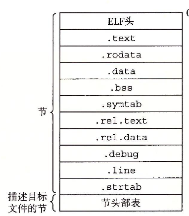

# LLVM学习笔记

有关现代编译器框架LLVM的笔记

附录为CSAPP第7章**链接**的学习笔记

# 参考书籍

*Getting Started with LLVM Core Libraries, Bruno Cardoso Lopes, Rafael Auler, Brazil, 2014*

*LLVM Cookbook, Mayur Pandey, Suyog Sarda, India, 2016*

## 附录

## CSAPP第7章：链接

有关计算机中可执行文件的结构，ABI，以及编译器链接过程的工作原理

## 1 链接基本概念

我们在平时编写一个简单的控制台程序时很少会遇到链接。然而事实上链接无处不在，大型工程的构建离不开链接，可以说链接器在软件工程中具有举足轻重的作用。链接器实现了程序构建的模块化，开发者可以将不同功能的代码分开，降低代码耦合度，从而方便功能的修改以及增删，方便了工程的管理。同时，链接使得闭源代码的发布成为可能

在**有操作系统支持**的环境中，链接一般可以分为**编译时链接**（由编译器负责，使用静态库），**加载时链接**（由操作系统加载器负责，使用共享库）以及**运行时链接**（由应用程序负责，使用共享库）。而在单片机等裸机环境中只有**编译时链接**，所有的代码都需要通过静态链接以后下载至Flash才能运行

## 1.1 编译器基本工作流程

我们平时使用GCC编译一个程序（`gcc main.c -o test`），事实上要经过**预处理器**、**编译器**、**汇编器**以及**链接器**共4个工具的处理，这4种工具分别对应`cpp`，`cc`，`as`以及`ld`。我们使用的`gcc`命令事实上不是编译器本体，只是一个外壳，用来调用上述的四种工具。像`gcc`这样的命令被称为**驱动器（driver）**

> 其中，预处理器`cpp`处理源码中的宏以及文件包含，输出`.i`预处理后的源文件
>
> 之后编译器`cc`将源码文件编译成为ascii码格式的`.s`汇编文件，其中存储了之后构建二进制文件所需的汇编代码，符号，常量等
>
> 汇编器`as`会将汇编代码文件`.s`翻译成为二进制的`.o`可重定位目标文件，此时的`.o`文件是可以直接被计算机CPU识别的二进制文件。多个`.o`文件可以使用`ar`打包成为一个`.a`库文件（此外还可以选择生成动态链接库等格式）
>
> 最后如果是使用静态链接，就需要使用到链接器`ld`。`ld`会将多个`.o`可重定位目标文件链接成为一个可执行文件。通过shell执行该文件时会调用操作系统的加载器，将可执行文件加载到内存中并运行

## 1.2 链接器的任务

可重定位目标文件一般由节（section）构成。这些节通常都存储有不同的数据，且各自独立：有的存储机器指令，有的存储已经初始化的全局变量，有的存储未初始化的变量

因此，链接器有两个主要任务：一个是**解析符号**。在可重定位文件中所有**函数**、**全局变量**以及**静态变量**等都有自己对应的名称（符号），符号解析就是为了将所有出现对该符号的**引用**和该符号的**定义**关联起来

> **全局**和**静态**在概念上容易混淆。就这么说吧：**全局**的变量在整个程序中只有一个，且所有其他模块都可以访问；而**静态**的变量是一个模块私有的，这样的变量在其他模块中无法访问

另一个是**重定位**。在目标文件中，汇编器生成的**机器代码**和**数据节**都是从0开始编址的。重定位的过程就是将各个符号与一个内存地址绑定（地址重分配），同时将所有该符号的引用都指向该地址，最终实现重定位。而重定位相关信息以及`ld`的执行指令由汇编器生成

> 有一个有趣的事实是，链接器并不是很了解具体的目标机器，无论是它的体系结构还是指令集，它只是单纯的处理并连接可重定位文件中的数据块。目标文件正是由这些数据块组成

## 1.3 目标文件

在Linux、FreeBSD等类Unix操作系统下的目标文件本质都使用ELF（`.elf`）（Executable and Linkable Format）格式，尽管实际文件格式的定义有所不同

> **目标文件**分为3种：
>
> **可重定位目标文件**：只能使用**静态链接**的方式应用到程序中，可以使用`ar`打包成为一个`.a`库文件
>
> **可执行目标文件**：可以直接被操作系统加载器加载到内存中执行的文件
>
> **共享目标文件**：可以在程序被加载或执行时动态地加载到内存中并链接的文件，也就是通常所说的**动态链接库**

一般所说的目标文件其实就可以称为一个**目标模块**。一个这样的模块由多个**字节序列**（节，section）构成，而多个这样的模块可以打包组成一个`.a`文件。这就是可重定位目标文件的本质

不同机器、不同操作系统的目标文件格式基本都是不同的（这就是通常所说**ABI**兼容性的决定因素之一，事实上ELF的文件格式就属于ABI规范的一部分）。同样是x86，Windows下的`.exe`可执行文件放到Linux环境下当然是不能直接执行的

也是由于以上原因，在Linux下会出现`wine`用于模拟Windows的运行环境（当然wine还提供了运行时所需API），FreeBSD会提供针对Linux的ABI兼容选项，而Windows下会有`mingw`和`msys2`这样的第三方类Unix环境出现（~~WSL是什么玩意儿~~）。另外，不同的硬件体系结构、操作系统、编译器工具链对于函数调用风格、寄存器分配以及内存分配等定义也有不同，这是**ABI**兼容另外需要解决的问题

## 2 目标文件结构

有关ELF文件的格式

## 2.1 ELF头

ELF头由一个16字节的序列开始。这个16字节的序列会给出目标机器的**字长**以及**字节序（大小端）**

在这16字节之后都是一些基本信息，包括**ELF头大小**，**文件类型（可重定位、可执行、可共享）**，**机器类型（使用的ISA）**，**节头部表的偏移地址**，以及**节头部表中条目大小以及数量**

节头部表一般位于ELF文件结尾，其中每一项（一个Entry）都用于描述不同节（Section）的位置和大小

## 2.2 节（Section）

ELF文件中的节依照存储数据的类型分为很多种

> `.text`：程序的二进制机器代码，最重要的部分之一
>
> `.rodata`：只读数据，比如在`printf()`中使用到的字符串常量，以及`switch`语句中使用到的跳转表
>
> `.data`：**已经初始化**的全局以及静态变量，在ELF文件中占有实际空间。运行时的局部变量存储于**栈**中，所以不会出现在这里
>
> `.bss`：**未初始化的静态变量**或者**初始化为0的全局以及静态变量**。这里面的数据仅仅是各个变量的占位符，这些变量在ELF文件中不会占有实际的数据空间，要到运行时才会在内存区域中分配空间并初始化为0。区分`.data`和`.bss`是为了提高存储效率
>
> `.symtab`：符号表，最重要的部分之一，用于存储在程序中定义、引用的**函数**以及**全局变量**的信息。**不包含局部变量**
>
> `.rel.text`：重定位信息（`rel`就是relocation的缩写），存储`.text`节中各条目的位置（地址），一般在该文件与其他文件链接时需要修改。如果一条指令调用了本文件外部的函数或者全局变量，就需要修改对应的指令。一般情况下**可执行文件不需要这些重定位信息**
>
> `.rel.data`：重定位信息，存储当前模块所有引用或定义的全局变量的信息
>
> `.debug`：调试符号表，只有使用`-g`选项时可用，存储程序中各种变量以及类型定义，包括局部变量，以及在本模块定义或引用的全局变量。另外还有原始的C源文件，用于调试时代码的定位
>
> `.line`：代码映射列表，只有使用`-g`选项时可用。存储`.debug`中C源文件代码和`.text`中机器码的映射
>
> `.strtab`：字符串表，存储了`.symtab`以及`.debug`中的符号表以及节名。每一个字符串以null（0x00）结尾

另外还有**伪节**（Pseudosection），常见有3种，`COMMON`，`ABS`以及`UNDEF`，见下一章

## 2.3 符号与符号表

每一个可重定位模块都有符号表以及对应存储的符号

> 符号分为以下3种：
>
> **全局符号（内部）**：由本模块定义并可以被自身或外部模块引用的符号，可以是全局变量或函数
>
> **全局符号（外部）**：由其他模块定义并在本模块引用到的符号，可以是全局变量或函数
>
> **局部符号**：在当前模块使用`static`关键字声明、定义的函数以及全局变量，只在当前模块可用，其他模块不可访问（相当于CPP中的private）

之前说过符号表`.symtab`中**不含有局部变量**，因为这些变量会在运行时在栈中管理。只有使用`static`声明的静态变量才会在`.bss`以及`.data`中分配空间，同时会在符号表`.symtab`中创建一个唯一的符号（即便有两个变量重名，也会自动加以区分）

符号表`.symtab`中的一个条目如下所示

> `name`项表示当前符号的**名称**（以NULL=0x00结尾）在字符串表`.strtab`中的偏移地址
>
> `section`表示当前符号在哪个节（如`.bss`或`.data`）。该字段事实上是到ELF文件末尾节头表中的一个索引
>
> 在可重定位文件中有3种**伪节**（Pseudosection，本体实际不存在的特殊节名，可执行文件没有伪节），使用`UNDEF`表示该符号不是在本模块定义的（也即只有引用）；`ABS`表示为绝对位置，该符号不能被重定位；而`COMMON`一般用于**未初始化的全局变量**，表示当前数据变量还未初始化以及分配空间
> 
> `value`用于表示当前符号**本体**（实际的数据）在节（如`.bss`或`.data`）中的地址偏移。而在可执行文件中由于不需要重定位信息，所以在可执行目标文件中这个值代表这个符号的实际绝对地址。如果是`COMMON`那么该字段表示内存对齐要求
>
> `size`表示符号目标的大小，以字节为单位。如果是`COMMON`那么该字段表示最小的大小
>
> `type`和`binding`共用一个字节，分别占用4bit。`type`表示符号的类型，可以是函数（Function）也可能是数据（Data）。`binding`用于表示符号为**全局**或**局部**类型

一个简单的示例如下。可以使用GNU工具链中的`readelf`读取一个目标文件的信息

> 其中，`Ndx`代表符号所在节编号，如果是`1`就代表`.text`节，`3`代表`.data`节，`UND`是伪节`UNDEF`，表示未定义的符号

> 这里补充一下`.bss`以及`COMMON`的区别，可能比较容易让人感到疑惑。`.bss`和`COMMON`

