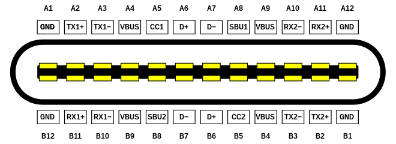
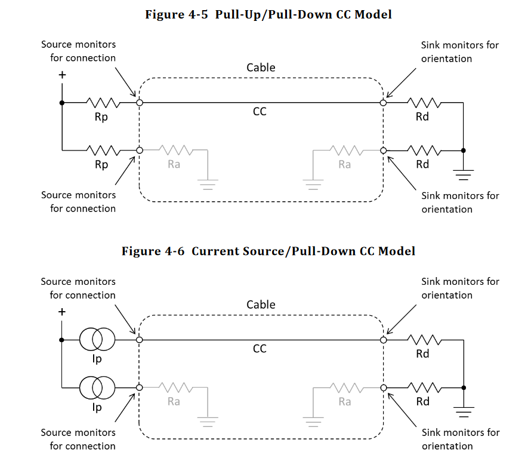
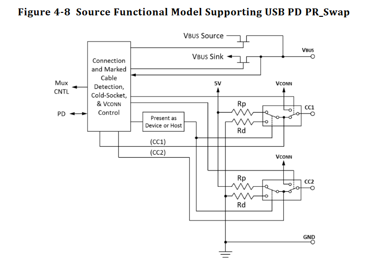
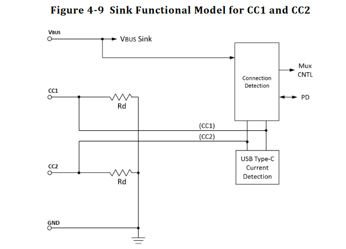
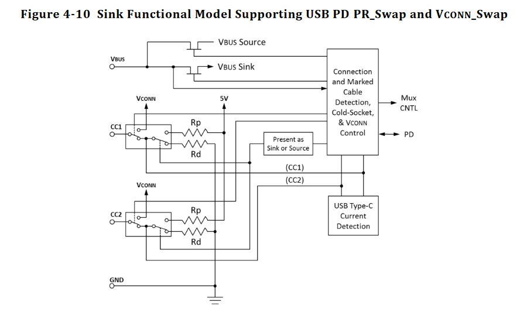
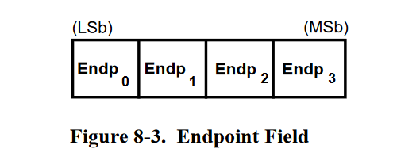
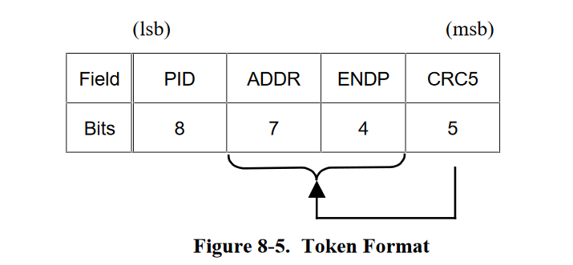
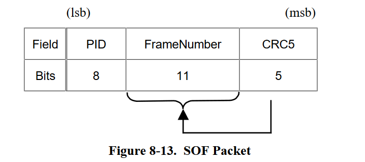
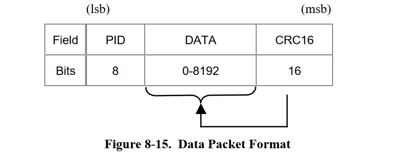
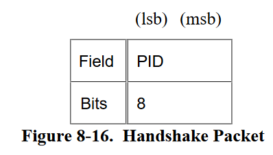

# USB通信协议

## 参考

[USB2.0](https://usb.org/document-library/usb-20-specification) | [本地文档](src/210731b01/usb_20.pdf)

[B站大佬的讲解](https://www.bilibili.com/video/BV1Ef4y1t73d)

## 1 导论

USB已经成为当今使用最广泛的计算机外设接口

USB3.0向下兼容USB2.0以及USB1.1。USB3.0理论最大可以支持5Gbit/s的传输速率（超高速模式），而USB2.0支持480Mbit/s（高速模式），12Mbit/s（全速模式）以及1.5Mbit/s（低速模式）三种传输速率，其中全速模式以及低速模式是原USB1.0规范定义的

USB有一个特性就是支持自动的驱动配置以及加载，可以做到即插即用，同时支持热插拔。相比其他接口，USB支持供电，使得设备无需单独的电源

> USB2.0分为低速LowSpeed（1.5Mbps）、全速FullSpeed（12Mbps）、高速HighSpeed（480Mbps）三种，而USB3.2中的超高速为SuperSpeed（5Gbps以上）


## 2 硬件接口与电气规范

仅研究USB2.0及以下版本

## 2.1 硬件接口：常规接口

下图截自Wikipedia


其余关于USB连接器的详细介绍同样可见[Wikipedia](https://en.wikipedia.org/wiki/USB_hardware#Connectors)，以下只介绍常用的

**Standard A**

用于USB主机端，无处不在，最常用的接口

母座正视图如下，公头镜像


| 引脚 | 1 | 2 | 3 | 4 |
| :-: | :-: | :-: | :-: | :-: |
| 定义 | VBUS | D- | D+ | GND |

> 两头A型的USB线缆是非标准线缆，在使用时最好检查一下VBUS是否相连，否则极大可能会电流倒灌烧坏供电（一些山寨机顶盒刷机时，视情况要断开VBUS改用独立供电，否则可能把电脑USB口和机顶盒烧坏）

**Standard B**

用于USB从机端，优点是比较牢固，常见于打印机，Arduino UNO也使用了该接口

母座正视图如下，右上为1脚，逆时针


| 引脚 | 1 | 2 | 3 | 4 |
| :-: | :-: | :-: | :-: | :-: |
| 定义 | VBUS | D- | D+ | GND |

**Micro A**

用于USB主机端，常用于移动设备。方形，较为少见，许多支持OTG的设备使用B型母座而不是A

Micro AB母座正视图如下


| 引脚 | 1 | 2 | 3 | 4 | 5 |
| :-: | :-: | :-: | :-: | :-: | :-: |
| 定义 | VBUS | D- | D+ | ID | GND |

> 通常设备会使用通用的Micro AB母座来同时兼容AB两种头。ST的NUCLEO-144系列开发板就使用到了这种母座
>
> USB OTG使用ID判定本设备应当作为主机还是外设。ID浮空表示外设，ID接地表示作为主机使用

**Micro B**

用于USB从机端，常用于移动设备。ID用于OTG功能

母座正视图如下


| 引脚 | 1 | 2 | 3 | 4 | 5 |
| :-: | :-: | :-: | :-: | :-: | :-: |
| 定义 | VBUS | D- | D+ | ID | GND |

## 2.2 硬件接口：USB-C

参考[USB-C](src/210731b01/USB%20Type-C%20Spec%20R2.1%20-%20May%202021.pdf)

近几年流行起来的接口，其规范在2014年才初步成型。真正意义上的的通用接口，体积适中，移动设备和主机都可用，针脚多所以支持大电流，主从通用，学习了苹果的正反插理念，寿命相较脆弱的Micro口也更长了。USB-C作为通用接口的代价就是电路变复杂，包括线缆的成本也会大大增加

> USB-C支持音频模式，可以传输模拟音频信号
>
> 此外由于USB-C接口支持另外4对差分信号的传输，所以也可以走HDMI和DP信号
>
> 现在大部分单片机还不能支持完整的USB-C功能（如DRP），所以在开发板设计中，一般将USB-C口的CC1和CC2引脚各自通过5.1k电阻接地，只能当作设备使用，是最常用的兼容设计方案

母座正视图如下



| 上排引脚 | A1 | A2 | A3 | A4 | A5 | A6 | A7 | A8 | A9 | A10 | A11 | A12 |
| :-: | :-: | :-: | :-: | :-: | :-: | :-: | :-: | :-: | :-: | :-: | :-: | :-: |
| 定义 | GND | TX1+ | TX1- | VBUS | CC1 | D+ | D- | SBU1 | VBUS | RX2- | RX2+ | GND |

| 下排引脚 | B12 | B11 | B10 | B9 | B8 | B7 | B6 | B5 | B4 | B3 | B2 | B1 |
| :-: | :-: | :-: | :-: | :-: | :-: | :-: | :-: | :-: | :-: | :-: | :-: | :-: |
| 定义 | GND | RX1+ | RX1- | VBUS | SBU2 | D- | D+ | CC2 | VBUS | TX2- | TX2+ | GND |

公头正视图如下


> 在USB-C中，设备端接口称为**上行接口UFP**，而主机端接口称为**下行接口DFP**。有些设备如手机可以作为设备或主机，这些设备使用的接口称为**DRP**，类似于USB-OTG

**引脚概览**

> USB-C在引脚功能上呈现中心对称。其中一共有4个GND，4个VBUS
>
> 可以发现在USB-C母座中，高速USB信号线A6B6是相通的为D+，A7B7是相通的为D-。而在USB-C插口中，只有A6A7是有效的，分别为D+D-，**而B6B7为空脚**。这样避免了信号引脚重复。此外，在USB-C线缆中**只有A5**（CC1）是两端连通的，而在有源USB-C数据线中B5（CC2，此时为Vconn）用于数据线里芯片的供电（CC1和D+D-同一排，位于TX1RX1一侧）
>
> 除以上引脚以及4对SuperSpeed差分信号对以外，USB-C还包含了4个非常重要的引脚，分别为CC1 CC2 SBU1 SBU2（其中CC表示Configuration Channel，SBU表示Sideband Use），这些引脚会在检测插入以及正反插，设备配置，音频模式，和快充配置中起作用
>
> 此外需要注意在连通SBU的USB-C线缆中SBU1和SBU2使用**交叉连接**
>
> USB-C规定Source要在CC引脚检测到接入后才能决定是否在VBUS供电

**工作模式**

> 除正常的USB模式以外，USB-C还支持Alternate Modes以及Audio Adapter Accessory Mode。其中前者用于其他协议信号的传输如HDMI，DP和数字音频（TCDA等），而Audio Adapter Accessory模式下通过D+，D-分别传输右声道，左声道的模拟音频信号，而两条SBU用于麦克风和模拟地AGND的连接

**关于CC引脚**

> 在Source供电端（一般是DFP），CC1和CC2通过电阻**Rp**上拉到一个电压源（也可能直接连接到一个小电流源），在连接设备后，主机会根据CC1和CC2的电压判别连接的设备类型
>
> 在Sink用电器端（一般是UFP），CC1和CC2一般需要连接下拉电阻**Rd**，阻值通常为5.1k
>
> 在有源线缆中，只有两端CC1连通，两端插头中的CC2各自通过电阻**Ra**接地（阻值通常小于等于1k，**Ra**指的是包含下拉电阻和芯片负载在内的最终并联阻值）。Source供电端只有在检测到CC引脚有一个对地阻值为**Ra**时，才会将对应引脚设为Vconn向有源数据线供电。Source和Sink都是通过CC引脚电压判定连接方向
>
> 无源线缆可能只连通CC1，而CC2可能是空引脚，也可能冒充有源线缆通过电阻**Ra**接地
>
> 而在非数字耳机中，CC1和CC2都通过**Ra**接地，将耳机连接到DFP后DFP需要将接口切换为模拟音频模式。模拟音频模式下VBUS不供电，但是可以充电
>
> 在PD中CC还会用于通信，Source和Sink通过数据线的CC1引脚使用BMC PD控制器进行PD协议通信





**电路方案**

普通供电Source端


> 最上方晶体管用于控制VBUS供电的通断
>
> 工作流程如下
>
> 1. 没有线缆和Sink连接时，VBUS处于关断状态，同时CC引脚都通过**Rp**上拉
>
> 2. 插入线缆以及Sink。Source端检测到了下拉电阻**Rd**后，可以选择性地将CC引脚钳位（不低于2.9v）以保护电路
>
> 3. Source端通过数据线的连接方向配置SuperSpeed信号线TXRX1、TXRX2的通路，判定Vconn引脚
>
> 4. 接通VBUS和Vconn
>
> 5. Source可以通过改变**Rp**来向Sink表示其供电能力
>
> 6. Source检测**Rd**被移除，关闭VBUS，Vconn，并重新将CC引脚上拉

支持USB PD协议供电端换向的Source端电路



> **DRP**的电路和上图基本相同，不同的是**DRP**在空闲状态需要不断切换上拉、下拉电阻

普通用电Sink端



> 工作流程如下
>
> 1. Sink检测到Source接通VBUS开始供电后，根据CC引脚的电压配置SuperSpeed信号线TXRX1、TXRX2的通路（Sink端没有Vconn）
>
> 2. Sink此时可以通过检测CC引脚的电流来判定Source端的供电能力，并可选择性地钳位CC引脚（不低于2.9v）

支持USB PD协议供电端换向的Sink端电路




## 2.3 供电能力

|  | 电压电流 |
| :-: | :-: |
| 2.0 | 5V, 500mA |
| 3.2 | 5V, 900mA |
| Type-C | 5V, 1.5A or 3A |
| PD | 20V, 5A Max, Configurable |


## 2.4 信号电平标准

USB2.0规定D+D-信号线的输入输出电平如下

低速/全速


高速


> 主机在检测到有USB接入后，通过检测D+D-信号线上的上拉电阻来判定设备是低速还是全速。低速设备将D-上拉（阻值1.5k，上拉到3.3V），全速和高速设备将D+上拉。高速设备在连接到USB时是全速模式，之后通过一些握手信号确定高速模式

**低速/全速**模式下，USB中D+D-差分信号线的电平标准见下表


> 在数据传输（0或1）时，发送端差分信号的高电平不低于2.8V，低电平不高于0.3V；而在接收端要求差分信号的电压差至少为200mV，同时高电平引脚需要高于2.0V
>
> **单端0**（`SE0`）即D+D-都为低电平（不高于0.3V），表示**复位**，**断连**或**数据包结束**。**单端1**（`SE1`）状态不会使用到
>
> **低速模式**下，`J`**状态**为差分0，`K`**状态**为差分1；而**全速模式**相反，`J`**状态**为差分1，`K`**状态**为差分0
>
> `Idle`**状态**时，D+D-数据线由于设备端上拉电阻的存在会维持一定的电压。在**低速模式**下，D+为低电平（低于0.3V）而D-为高电平（高于2.7V）；在**全速模式**下，D+为高电平而D-为低电平
>
> **恢复状态**用于唤醒设备（Suspend到Resume），发送一个`K`状态即可
>
> 数据包的**起始标志**（`SOP`）为`Idle`状态到`K`状态的跳变；而发送**结束标志**（`EOP`）时，发送端首先发送一个`SE0`，维持大约2个bit周期，再发送一个`J`，维持1个bit周期
>
> 断开连接时，发现D+D-保持`SE0`状态（低于0.3V）一定时间就可以判定连接断开
>
> 连接时，发现`Idle`状态超过一定时间就可以判定已经连接上
>
> 如果想要复位，发送端发送`SE0`（D+D-低于0.3V）维持10mS以上即可，而接收端发现D+D-低于0.8V超过2.5uS就可以判定发生了复位

> 此外，在**低速模式**下还有一个**保持唤醒**（`Keep Alive`）信号，因为低速设备没有帧起始数据包所以每间隔1mS都会有一个`EOP`信号防止设备挂起


## 3 数据传输

> 在USB的数据传输中，最基本的单元是**包**，而包由多个**字段**（域）组成。多个**包**可以组成一个**事务**，而多个事务组成一次**传输**
>
> USB中有四大传输，分别为**控制传输**（Control Transfers），**批量（大容量）传输**（Bulk Transfers），**同步传输**（Isochronous Transfers），**中断传输**（Interrupt Transfers）

## 3.1 NRZI编码与位填充

常用的通信接口例如UART，SPI，I2C都是基于NRZ的设计，这些通信接口需要依赖于额外的时钟信号线或一致的波特率来实现正确的信号传输

**全速、低速**模式下，USB的数据输出遵循`NRZI`编码（**反向不归零**，`Non-Return-To-Zero Inverted`，不是曼彻斯特编码），如下图所示


> 在NRZI编码中，当前数据周期如果需要表示数据为`0`，那么NRZI相比之前的输出会跳变（可能是`J`到`K`或`K`到`J`。如果数据一直是0那么输出就会一直跳变）。如果需要表示`1`，那么输出相比前一个bit的状态维持不变
>
> 这非常像[T触发器](200920c_verilog.md#123-t触发器)（短接JK触发器的JK端得到T端）的功能。假设我们的T触发器在T端输入0时输出跳变，输入1时输出停止跳变，起始时Q输出高电平，那么在T端口送入上图的Data波形，时钟上升沿在每个Data周期的中间到来，那么就会从Q端输出和NRZI相符的波形

> NRZI编码解决了时钟的同步问题。然而在极端的情况下，如果需要连续传输很多个`1`，输出将会在很长一段时间内维持不变，传输了多少个`1`难以判别。所以USB中采用了填充法（`Bit stuffing`），每隔**6个**连续的`1`就会插入一个`0`（即便`111111`位于序列末尾），这样输出将会以7为周期跳变。而接收端将会自动辨别填充的`0`并去除


## 3.2 数据包字段，域（Field）

USB中所有数据都是先传输`LSB`后传输`MSB`

一个USB数据包的字段依次如以下小节所示

### 3.2.1 SYNC域

每一个数据包都以`SYNC`域开头，用于同步时钟。在低速、全速模式下`SYNC`域长度8bit，高速模式下`SYNC`域长度32bit（高速模式下允许USB Hub将`SYNC`头部减短，最多4bit）

低速、全速模式SYNC的格式如下，3对KJ信号对后接2个K信号


> 之前说过的`SOP`数据包起始信号就是属于`SYNC`域的一部分（首个K信号。也就是说`SYNC`就是代表数据包的开始）


### 3.2.2 PID域

`PID`表示数据包的类型，长度8位，紧随`SYNC`之后，定义如下


`PID`中只有`PID0~PID3`表示包类型，其他的4位只是取反，用于简单的校验功能（如果两者不是相反那么就表示传输有误，接收端应当忽略）。不同`PID`定义如下

**Token**令牌包

| 名称 | Bin | Hex |
| :-: | :-: | :-: |
| `OUT` | `0001` | `0x1` |
| `IN` | `1001` | `0x9` |
| `SOF` | `0101` | `0x5` |
| `SETUP` | `1101` | `0xD` |

**Data**数据包

| 名称 | Bin | Hex |
| :-: | :-: | :-: |
| `DATA0` | `0011` | `0x3` |
| `DATA1` | `1011` | `0xB` |
| `DATA2` | `0111` | `0x7` |
| `MDATA` | `1111` | `0xF` |

**Handshake**握手包

| 名称 | Bin | Hex |
| :-: | :-: | :-: |
| `ACK` | `0010` | `0x2` |
| `NAK` | `1010` | `0xA` |
| `STALL` | `1110` | `0xE` |
| `NYET` | `0110` | `0x6` |

**Special**特殊包

| 名称 | Bin | Hex |
| :-: | :-: | :-: |
| `PRE` | `1100` | `0xC` |
| `ERR` | `1100` | `0xC` |
| `SPLIT` | `1000` | `0x8` |
| `PING` | `0100` | `0x4` |
| `Reserved` | `0000` | `0x0` |


### 3.2.3 地址域

地址域定义如下，分为**设备地址域**`Function address field`和**端点地址域**`Endpoint address field`两个地址域




> 设备地址域长度7位（支持最多`2^7-1=127`台设备），端点地址域长度4位，然而**只有高速、全速设备支持16个端点地址**，而低速设备只支持3个端点地址


### 3.2.4 帧号域

帧号域只有在`PID`为`SOF`（帧起始包）时才会出现，长度11位，表示当前帧号。每传输一个帧，帧号自动`+1`，最大计数`0x7FF`，溢出后从`0x000`开始重新计数


### 3.2.5 数据域

数据域长度不定，长度从`0`到`1024`字节不等（注意以字节为单位），传输时同样是`LSB`在前，`MSB`在后


> USB1.1中定义了`DATA0`，`DATA1`两个数据包`PID`，而USB2.0中定义了`DATA2`和`MDATA`


### 3.2.6 CRC域

`Token`或`Data`类型数据包中包含的`CRC`用于校验除`PID`以及`SYNC`域以外的所有数据（包含地址域）。`IN`，`OUT`，`SETUP`，`SOF`，`PING`以及`SPLIT`数据包包含一个长度为`5`的`CRC`域，而`Data`类型数据包包含一个长度为16的`CRC`域。两种`CRC`多项式分别如下定义


> 第一种多项式`0b100101`，表示为16进制`0x25`，第二种多项式`0b11000000000000101`，表示为16进制`0x18005`

> 补充：循环冗余校验CRC算法
>
> 计算CRC时，设多项式长度为`k`。首先在需要进行CRC校验的数据后面加上`k-1`个`0`，之后将补位的数据直接和CRC多项式**模2除**，最终得到长度`k-1`的余数，并将这`k-1`位余数放到数据末尾

```c
// data是数据，poly是多项式。进行异或除法（模2除法）
const uint32_t data = 0x9A893;
const uint32_t data_len = 20;
const uint32_t poly = 0x107;
const uint32_t poly_len = 9;

uint32_t remain = data << (poly_len - 1);
uint32_t mask = poly << (data_len - 1);
uint32_t pt = 1 << (poly_len + data_len - 2);

for(int i = 0; i < data_len; i++)
{
        if(pt & remain)
                remain ^= mask;
        pt >>= 1;
        mask >>= 1;
}

printf("%x\n", remain);
// 最终需要将CRC余数和数据合并
remain |= data << (poly_len - 1);
printf("%x\n", remain);
```

> 在带有CRC校验位的数据传输到接收方以后，接收方再使用实现约定的CRC多项式和接收到的数据（包含CRC位）进行模2除法。如果得到的余数不为`0`，那么就表示数据有误


## 3.3 数据包简介

### 3.3.1 令牌包

令牌数据包`Token`包括`IN OUT SETUP SOF`数据包

`IN`**令牌包**

表示数据从**设备**发送到**主机**，格式如下。其中最前面的`SYNC`和末尾的`EOP`省略，`PID`为`0x96`（这里的`PID`倒过来表示，`LSB`在前）



`OUT`**令牌包**

表示数据从**主机**发送到**设备**，格式同`IN`，`PID`为`0x87`

`SETUP`**令牌包**

数据从**主机**发送到**设备**，格式同`IN`，`PID`为`0xB4`

`SOF`**令牌包**

表示帧起始并给出长度为`11`的帧号，格式如下，**没有设备地址和端点**




### 3.3.2 数据包

数据包的格式如下



> 数据触发会用到`DATA0 DATA1`，`SPLIT`令牌事务处理会使用到`DATA0 DATA1 MDATA`，高速模式会使用到`DATA0 DATA1 DATA2 MDATA`
>
> **低速模式**限制数据域最大`8`字节，**全速模式**数据域最大`1023`字节，**高速模式**数据域最大`1024`字节

> USB中，Data数据包分为`DATA0 DATA1 DATA2`主要是用于纠错。数据包传输时会出错，握手包如`NAK ACK`传输时也会发生错误
>
> 例如在`IN`传输中，主机发送一个`IN`令牌，数据`DATA0`从设备发送到主机，主机回应一个`ACK`并且被设备成功接收，下一次主机发送一个`IN`令牌，设备将会使用`DATA1`数据包发送。假设主机接收到`DATA0`之后，发送的`ACK`没有被设备成功接收，设备认为主机没有发送`ACK`，将会再次使用`DATA0`进行数据的发送。此时主机本应该收到`DATA1`，结果发现接收到的是`DATA0`，判断传输出错，之后需要进行重传
>
> 而如果主机没有成功接收到`DATA0`，也不会发送`ACK`。主机将会重复发送`IN`令牌，此时设备依然使用`DATA0`发送数据，这样主机可以成功接收`DATA0`
>
> 在数据传输时需要按照规则切换`DATA0 DATA1`才能保证数据传输不出错


### 3.3.3 握手包

所有的握手包都只有一个`PID`，没有`CRC`或地址域，格式如下



`ACK`**握手包**

`PID`为`0x4B`，由接收端发送，表示已经正确接收到发送端的数据。发送端和接收端需要在这之后重新同步

`NAK`**握手包**

`PID`为`0x5A`，一般由USB设备（`Function`）发送，表示当前没有数据可以发送到主机或无法接收主机发来的数据。**主机不会发送**`NAK`

`STALL`**握手包**

`PID`为`0x78`，一般由USB设备（`Function`）发送，使用到`STALL`握手包时有`functional stall`或`protocol stall`两种情况。其中前者是由于端点被Halt，发送`STALL`表示端点无法发送或接收。**主机不会发送**`STALL`

`NYET`**握手包**

`PID`为`0x69`，用于**高速模式**。会在端点的`PING`中使用到，也会被hub使用到，表示hub还未完成或无法处理`SPLIT`任务


### 3.3.4 特殊包

`PRE`**特殊包**

用于hub，主机告诉hub下一个数据包为低速

`SPLIT`**特殊包**

**只在高速模式下可用**，在令牌包之前发送，表示一个分割操作

`ERR`**特殊包**

**只在高速模式下可用**，由hub返回表示`SPLIT`出错

`PING`**特殊包**

**只在高速模式下可用**


## 3.4 事务

USB中主要有`IN OUT SETUP`三大主要事务（`PID`表示）和`SOF`等其他特殊事务

### 3.4.1 三大事务

三大事务`IN OUT SETUP`都由3个数据包构成：**令牌包**，**数据包**和**握手包**

> **令牌包总是由主机端发送**，包含地址和端点信息，表示一个事务的启动
>
> **数据包**用于数据的传送，可能是主机到设备或设备到主机
>
> **握手包**用于表示数据已正确接收等情况

`IN`**事务**

> `IN`事务将数据从设备发送到主机，一般由3个数据包构成，依次为：主机发出的`IN`**令牌包**，设备发出的**数据包**，以及主机成功接收到数据包后响应的`ACK`**握手包**。此外，如果设备在接收到`IN`以后无法响应，应当返回一个`NAK`**握手包**，主机此时会重复请求

`OUT`**事务**

> `OUT`事务将数据从主机发送到设备，同样由3个数据包构成，依次为：主机发出的`OUT`**令牌包**，主机发出的**数据包**，以及设备成功接收到数据包后响应的`ACK`**握手包**。此外，如果设备在接收到`OUT`以后无法接收数据，应当返回一个`NAK`**握手包**，主机此时会重复请求

`SETUP`**事务**

> `SETUP`事务用于建立一个控制传输，`SETUP`令牌后会有一个数据包。最终设备总是回应一个`ACK`


## 3.5 控制传输（Control Transfers）

控制传输是非周期性传输，用于传输命令和状态。除控制传输，**其余三大传输都只由**`IN OUT`**事务构成**


## 3.6 批量传输（Bulk Transfers）

批量传输是非周期性传输，用于大容量数据的通信


## 3.7 同步传输（Isochronous Transfers）

同步传输是周期性传输，是持续性的，数据中会保存有时间戳。除同步传输，**其余三大传输都拥有握手包，且会不断切换数据包的**`PID`


## 3.8 中断传输（Interrupt Transfers）

中断传输是周期性传输，允许通信的有限延迟


## 4 描述符


## 5 SETUP包与标准设备请求


## 6 枚举
