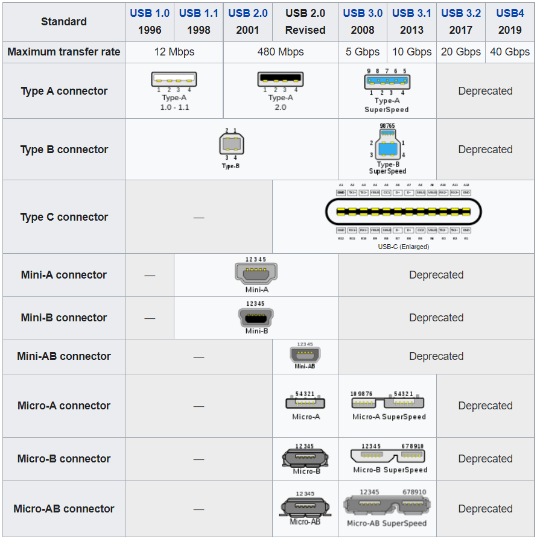
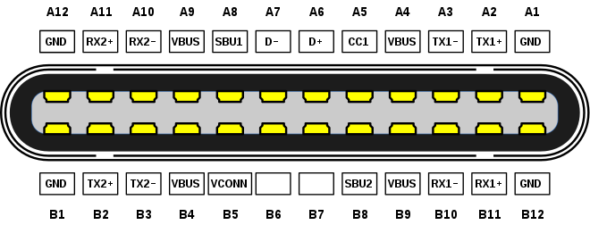
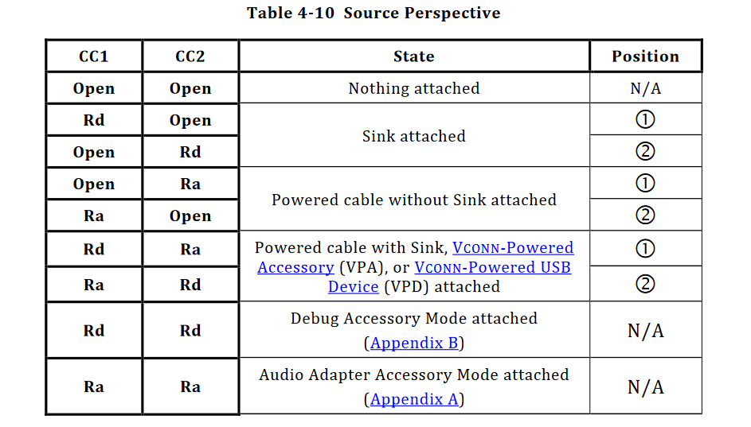
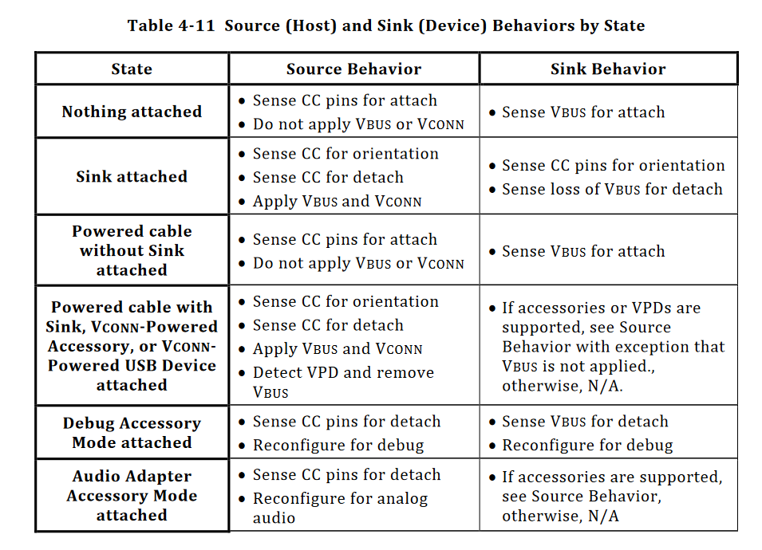
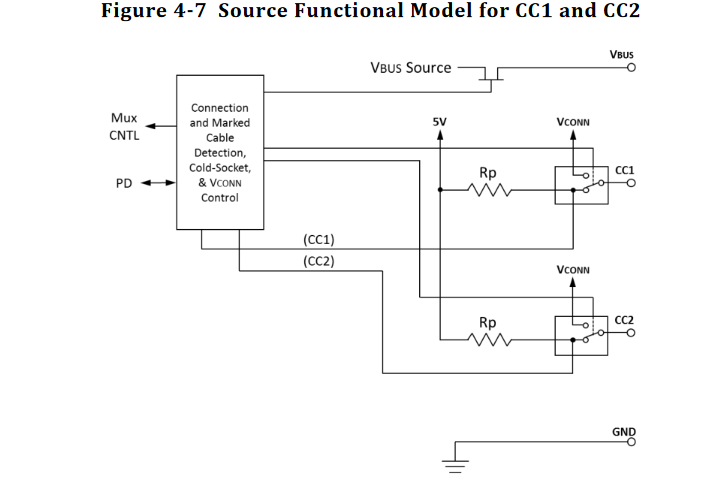

# USB：硬件，通信协议与驱动，应用开发

## 参考

[USB2.0](https://usb.org/document-library/usb-20-specification) | [本地文档](src/210731b01/usb_20.pdf)

[B站大佬的讲解](https://www.bilibili.com/video/BV1Ef4y1t73d)

## 1 导论

USB已经成为当今使用最广泛的计算机外设接口

USB3.0向下兼容USB2.0以及USB1.1。USB3.0理论最大可以支持5Gbit/s的传输速率（超高速模式），而USB2.0支持480Mbit/s（高速模式），12Mbit/s（全速模式）以及1.5Mbit/s（低速模式）三种传输速率，其中全速模式以及低速模式是原USB1.0规范定义的

USB有一个特性就是支持自动的驱动配置以及加载，可以做到即插即用，同时支持热插拔。相比其他接口，USB支持供电，使得设备无需单独的电源。同时USB没有对其信号线功能做具体的定义

另外，USB还具有较好的实时性能，可以将数据的传输以及最后的计算机处理过程的延迟降到很低

> USB2.0分为低速LowSpeed（1.5Mbps）、全速FullSpeed（12Mbps）、高速HighSpeed（480Mbps）三种，而USB3.2中的超高速为SuperSpeed（5Gbps以上）

## 2 硬件接口与电气规范

仅研究USB2.0及以下版本

## 2.1 硬件接口：常规接口

下图截自Wikipedia

其余关于USB连接器的详细介绍同样可见[Wikipedia](https://en.wikipedia.org/wiki/USB_hardware#Connectors)，以下只介绍常用的

**Standard A**

用于USB主机端，无处不在，最常用的接口

母座正视图如下，公头镜像

| 引脚 | 1 | 2 | 3 | 4 |
| :-: | :-: | :-: | :-: | :-: |
| 定义 | VBUS | D- | D+ | GND |

> 两头A型的USB线缆是非标准线缆，在使用时最好检查一下VBUS是否相连，否则极大可能会烧坏电路（一些山寨机顶盒刷机时，视情况要断开VBUS，否则可能把电脑USB口或机顶盒烧坏）

**Standard B**

用于USB从机端，优点是比较牢固，常见于打印机，Arduino UNO也使用了该接口

母座正视图如下，右上为1脚，逆时针

| 引脚 | 1 | 2 | 3 | 4 |
| :-: | :-: | :-: | :-: | :-: |
| 定义 | VBUS | D- | D+ | GND |

**Micro A**

用于USB主机端，常用于移动设备。方形，较为少见，许多支持OTG的设备使用B型母座而不是A

Micro AB母座正视图如下

| 引脚 | 1 | 2 | 3 | 4 | 5 |
| :-: | :-: | :-: | :-: | :-: | :-: |
| 定义 | VBUS | D- | D+ | ID | GND |

> 通常设备会使用通用的Micro AB母座来同时兼容AB两种头。ST的NUCLEO-144系列开发板就使用到了这种母座
>
> USB OTG使用ID判定本设备应当作为主机还是外设。ID浮空表示外设，ID接地表示作为主机使用

**Micro B**

用于USB从机端，常用于移动设备。ID用于OTG功能

母座正视图如下

| 引脚 | 1 | 2 | 3 | 4 | 5 |
| :-: | :-: | :-: | :-: | :-: | :-: |
| 定义 | VBUS | D- | D+ | ID | GND |

## 2.2 硬件接口：USB-C

参考[USB-C](src/210731b01/USB%20Type-C%20Spec%20R2.1%20-%20May%202021.pdf)

近几年流行起来的接口，其规范在2014年才初步成型。真正意义上的的通用接口，体积适中，移动设备和主机都可用，针脚多所以支持大电流，主从通用，学习了苹果的正反插理念，寿命相较脆弱的Micro口也更长了。USB-C作为通用接口的代价就是电路变复杂，包括线缆的成本也会大大增加

> USB-C支持音频模式，可以传输模拟音频信号
>
> 此外由于USB-C接口支持另外4对差分信号的传输，所以也可以走HDMI和DP信号
>
> 现在大部分单片机还不能支持完整的USB-C功能（如DRP），所以在开发板设计中，一般将USB-C口的CC1和CC2引脚各自通过5.1k电阻接地，只能当作设备使用，是最常用的兼容设计方案

母座正视图如下

| 上排引脚 | A1 | A2 | A3 | A4 | A5 | A6 | A7 | A8 | A9 | A10 | A11 | A12 |
| :-: | :-: | :-: | :-: | :-: | :-: | :-: | :-: | :-: | :-: | :-: | :-: | :-: |
| 定义 | GND | TX1+ | TX1- | VBUS | CC1 | D+ | D- | SBU1 | VBUS | RX2- | RX2+ | GND |

| 下排引脚 | B12 | B11 | B10 | B9 | B8 | B7 | B6 | B5 | B4 | B3 | B2 | B1 |
| :-: | :-: | :-: | :-: | :-: | :-: | :-: | :-: | :-: | :-: | :-: | :-: | :-: |
| 定义 | GND | RX1+ | RX1- | VBUS | SBU2 | D- | D+ | CC2 | VBUS | TX2- | TX2+ | GND |

公头正视图如下

> 在USB-C中，设备端接口称为**上行接口UFP**，而主机端接口称为**下行接口DFP**。有些设备如手机可以作为设备或主机，这些设备使用的接口称为**DRP**，类似于USB-OTG

**引脚概览**

> USB-C在引脚功能上呈现中心对称。其中一共有4个GND，4个VBUS
>
> 可以发现在USB-C母座中，高速USB信号线A6B6是相通的为D+，A7B7是相通的为D-。而在USB-C插口中，只有A6A7是有效的，分别为D+D-，**而B6B7为空脚**。这样避免了信号引脚重复。此外，在USB-C线缆中**只有A5**（CC1）是两端连通的，而在有源USB-C数据线中B5（CC2，此时为Vconn）用于数据线里芯片的供电（CC1和D+D-同一排，位于TX1RX1一侧）
>
> 除以上引脚以及4对SuperSpeed差分信号对以外，USB-C还包含了4个非常重要的引脚，分别为CC1 CC2 SBU1 SBU2（其中CC表示Configuration Channel，SBU表示Sideband Use），这些引脚会在检测插入以及正反插，设备配置，音频模式，和快充配置中起作用
>
> 此外需要注意在连通SBU的USB-C线缆中SBU1和SBU2使用**交叉连接**
>
> USB-C规定Source要在CC引脚检测到接入后才能决定是否在VBUS供电

**工作模式**

> 除正常的USB模式以外，USB-C还支持Alternate Modes以及Audio Adapter Accessory Mode。其中前者用于其他协议信号的传输如HDMI，DP和数字音频（TCDA等），而Audio Adapter Accessory模式下通过D+，D-分别传输右声道，左声道的模拟音频信号，而两条SBU用于麦克风和模拟地AGND的连接

**关于CC引脚**

> 在Source供电端（一般是DFP），CC1和CC2通过电阻**Rp**上拉到一个电压源（也可能直接连接到一个小电流源），在连接设备后，主机会根据CC1和CC2的电压判别连接的设备类型
>
> 在Sink用电器端（一般是UFP），CC1和CC2一般需要连接下拉电阻**Rd**，阻值通常为5.1k
>
> 在有源线缆中，只有两端CC1连通，两端插头中的CC2各自通过电阻**Ra**接地（阻值通常小于等于1k，**Ra**指的是包含下拉电阻和芯片负载在内的最终并联阻值）。Source供电端只有在检测到CC引脚有一个对地阻值为**Ra**时，才会将对应引脚设为Vconn向有源数据线供电。Source和Sink都是通过CC引脚电压判定连接方向
>
> 无源线缆可能只连通CC1，而CC2可能是空引脚也可能通过电阻**Ra**接地
>
> 而在非数字耳机中，CC1和CC2都通过**Ra**接地，将耳机连接到DFP后DFP需要将接口切换为模拟音频模式。模拟音频模式下VBUS不供电，但是可以充电
>
> 在PD中CC还会用于通信，Source和Sink通过数据线的CC1引脚使用BMC PD控制器进行PD协议通信
>
> 表格以及电路示意见下

**电路方案**

普通供电Source端

> 最上方场效应管用于控制VBUS供电的通断
>
> 工作流程如下
>
> 1. 没有线缆和Sink连接时，VBUS处于关断状态，同时CC引脚都通过**Rp**上拉
>
> 2. 插入线缆以及Sink。Source端检测到了下拉电阻**Rd**后，可以选择性地将CC引脚钳位（不低于2.9v）以保护电路
>
> 3. Source端通过数据线的连接方向配置SuperSpeed信号线TXRX1、TXRX2的通路，判定Vconn引脚
>
> 4. 接通VBUS和Vconn
>
> 5. Source可以通过改变**Rp**来向Sink表示其供电能力
>
> 6. Source检测**Rd**被移除，关闭VBUS，Vconn，并重新将CC引脚上拉

支持USB PD协议供电端换向的Source端电路

> **DRP**的电路和上图基本相同，不同的是**DRP**在空闲状态需要不断切换上拉、下拉电阻

普通用电Sink端

> 工作流程如下
>
> 1. Sink检测到Source接通VBUS开始供电后，根据CC引脚的电压配置SuperSpeed信号线TXRX1、TXRX2的通路（Sink端没有Vconn）
>
> 2. Sink此时可以通过检测CC引脚的电流来判定Source端的供电能力，并可选择性地钳位CC引脚（不低于2.9v）

支持USB PD协议供电端换向的Sink端电路

## 2.3 供电能力

|  | 电压电流 |
| :-: | :-: |
| 2.0 | 5V, 500mA |
| 3.2 | 5V, 900mA |
| Type-C | 5V, 1.5A or 3A |
| PD | 20V, 5A Max, Configurable |

## 2.4 电平标准

USB2.0规定D+D-信号线的输入输出电平如下

低速/全速

高速

> 主机在检测到有USB接入后，通过检测D+D-信号线上的上拉电阻来判定设备是低速还是全速。低速设备将D-上拉（阻值1.5k，上拉到3.3V），全速和高速设备将D+上拉。高速设备在连接到USB时是全速模式，之后通过一些握手信号确定高速模式

**低速/全速**模式下，USB中D+D-差分信号线的电平标准见下表

> 在数据传输（0或1）时，发送端差分信号的高电平不低于2.8V，低电平不高于0.3V；而在接收端要求差分信号的电压差至少为200mV，同时高电平引脚需要高于2.0V
>
> **单端0**（SE0）即D+D-都为低电平（不高于0.3V），表示**复位**，**断连**或**数据包结束**。单端1（SE1）状态不会使用到
>
> **低速模式**下，**J状态**为差分0，**K状态**为差分1；而**全速模式**相反，**J状态**为差分1，**K状态**为差分0
>
> **Idle状态**时，目标端D+D-数据线由于上拉电阻的存在会维持一定的电压。在**低速模式**下，D+为低电平（低于0.3V）而D-为高电平（高于2.7V）；在**全速模式**下，D+为高电平而D-为低电平
>
> **恢复状态**用于唤醒设备（Suspend到Resume），发送一个**K状态**即可
>
> 数据包的**起始标志**（SOP）为**Idle状态**到**K状态**的跳变；而发送**结束标志**（EOP）时，发送端首先发送一个**SE0**，维持大约2个bit周期，再发送一个**J状态**，维持1个bit周期
>
> 断开连接时，发现D+D-保持**SE0**状态（低于0.3V）超过2.5uS就可以判定连接断开
>
> 连接时，发现**Idle状态**超过2mS就可以判定已经连接上
>
> 如果想要复位，发送端发送**SE0**（D+D-低于0.3V）维持10mS以上即可，而接收端发现D+D-低于0.8V超过10mS就可以判定发生了复位

> 此外，在**低速模式**下还有一个**保持唤醒**（**Keep Alive**）信号，因为低速设备没有帧起始数据包所以每间隔1mS都会有一个EOP信号防止设备挂起

## 3 数据传输

## 3.1 NRZI编码与位填充

USB的数据使用NRZI编码传输（Non-Return-To-Zero Inverted）。

## 4 描述符

## 5 SETUP包与标准设备请求

## 6 枚举

## 7 补充：设备树

开发Linux硬件驱动必备知识

参考文档可以在[devicetree.org](https://www.devicetree.org/)下载 | [本地文档](src/210731b01/devicetree-specification-v0.3.pdf)

**设备树**是在ARM等没有BIOS和ACPI的平台中常用的设备描述文件，操作系统内核需要设备树文件来管理CPU，内存，外设等硬件

Bootloader可以在加载操作系统时将存储的静态设备树传递过去，也可以自动生成设备树，如UBoot。如果Bootloader不支持上述特性，那么设备树也可以安装在操作系统中

## 7.1 设备树文件格式

设备树顾名思义，其数据结构为树状结构，其中每一个元素称为树中的一个**节点**（node），每一个节点会包含**属性**（properties）和**子节点**（child nodes），每一个属性都是**键值对**（name-value pairs）

设备树有两种存在形式，一种是二进制形式，被操作系统使用；一种是文本形式，便于人工编辑

文本形式的设备树源文件后缀`.dts`，需要通过**设备树编译器**`dtc`编译为`.dtb`二进制格式。和C一样，设备树也可以使用`#include`包含其他设备树文件