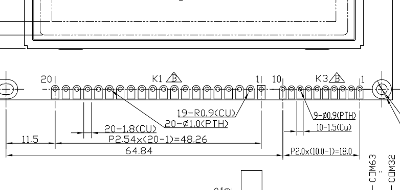

# 记录各种常见屏幕的构造，工作原理以及单片机驱动方法

# 液晶屏LCD

## 液晶屏制造工艺以及基本工作原理

液晶屏的制造工艺和半导体非常类似，同样需要经过光刻。一般的全彩液晶屏构成如下（当然现在绝大多数的液晶屏都已经采用LED背光了）。其中彩色滤光片以及电极都使用光刻工艺

液晶屏显示的基本原理就是**光的偏振**。由上图可以看出，液晶屏的关键部分由上至下可以分为上偏光膜，上玻璃基板，上电极/上配向膜，液晶，下电极/下配向膜，下玻璃基板，下偏光膜以及背光

上图中，液晶屏的上偏光膜和下偏光膜的偏振方向**互相垂直**，所以在液晶屏未通电时点亮背光，屏幕显示黑色，只有微量的光。此时如果在一个像素的电极之间加上适当的电压，就会导致这两个电极之间液晶分子的有序偏转，从而导致从下偏光膜传来的光再次被扭转，此时透过上偏光膜的光强度就会发生变化，从而实现图像的显示

> 液晶屏事实上分为**主动型**和**被动型**两大类

> 日常使用的廉价电子产品一般都使用**被动型**液晶屏，常见的有计算器，数字时钟，电子温度计，各类家电等，这些液晶屏的构造和上述所说有所不同。其中**笔段式液晶**都是定制，出厂就蚀刻好的，驱动方式较为简单，一般只有一面有笔段电极，和外部引脚一一对应，而另一面整面都是一个公共电极。而**点阵式液晶**为减少引脚需要使用**扫描**的驱动形式，为降低工艺难度与成本，有些液晶屏上下面电极分别用于行/列的驱动。我们常用的12864屏就属于点阵式
>
> 另外，依据液晶屏的显示方式可以分为**正显液晶屏**以及**反显液晶屏**两大类。其中我们最常见的计算器就是使用的正显形式，这种显示优点是可以省去背光（需要在液晶屏背面加上反光片）。**正显液晶屏的上下偏光膜偏振方向互相平行**，所以有光照射时会无阻碍通过，也会有反射，形成绿底黑字的显示效果。而我们常用的蓝色1602和12864屏就是典型的反显液晶屏，相比正显液晶屏更好看，但这种液晶在没有背光时显示效果较差。**反显液晶屏的上下偏光膜偏振方向互相垂直**，所以光线在通过时会被大量衰减，反显液晶显示的字体颜色就是实际上的背光颜色

> 而我们常说的TFT液晶屏（Thin Film Transistor，薄膜晶体管）属于**主动型**液晶屏，一般用于高端领域，绝大多数电脑、手机等数码产品的彩色液晶屏幕都是属于这种类型。这种液晶屏和**被动型**液晶屏的显示原理基本相同，**上下偏光膜偏振方向互相垂直**，其中有一整面的公共电极，而所有像素电极都在另一面电极上。这种液晶屏的特征就是每一个点都集成了一个薄膜晶体管，而由于晶体管的电容特性，它可以用于**按需**维持当前电极的电压，而不像被动式液晶一旦断电就不再有显示（有长余辉类型的被动式液晶，但是这极大影响了液晶响应性能，显示下一幅图像还会残余之前的显示内容），所以可以在同样的驱动频率下达到更好的显示效果。也是这种构造特性增加了这种液晶屏的制造成本

## 驱动芯片：ST7565

基于TOPWAY的LM6063HFW液晶模块，单色蓝底白字，分辨率128*64

使用3.3V电压

模块[手册](src/210808a01/LM6063HFW.pdf)

ST7565数据[手册](src/210808a01/ST7565.pdf)

### 数据接口

ST7565支持8位M68、i80并行数据接口，以及4线SPI接口（不是一般意义上的4线SPI，无MISO，不支持读取操作，但此时仍然需要通过RS（即A0）指定是命令还是数据）

物理接口引脚规格以及定义如下

> 其中，VSS为电源负极，VDD为正极，RS（A0）为命令/数据选择（输入0为指令，输入1为数据），\#CS为片选信号（低电平有效，无效时所有IO保持高阻态模式），\#RST为复位信号，PSB为IO接口模式选择（为0使用SPI模式，为1使用并口模式。默认为SPI）。BLA和BLK分别为背光输入的阳极（正极）和阴极（负极）。所有电压输入输出**最高3.3V**

跳线配置参考如下

这里只使用默认接口SPI，使用上图中的SCL（SPI时钟），SI（SPI数据），\#CS（片选）以及RS（A0）引脚

### 显示原理

ST7565最大支持131*65的显示，而LM6063HFW模块屏幕的像素点和显存的对应关系如下

如上图，显存分为8个页（Page），每一个页大小128字节，数据使用小端显示

LM6063HFW的初始化默认配置如下。之后在命令讲解中会提到这个配置

### 通信时序

要求的SPI通信时序如下

> SPI通信方式要求的上升/下降沿最大为15ns

### 命令详解

### 数据传输

## 驱动芯片：uc1617s

# OLED

# 墨水屏

# VFD