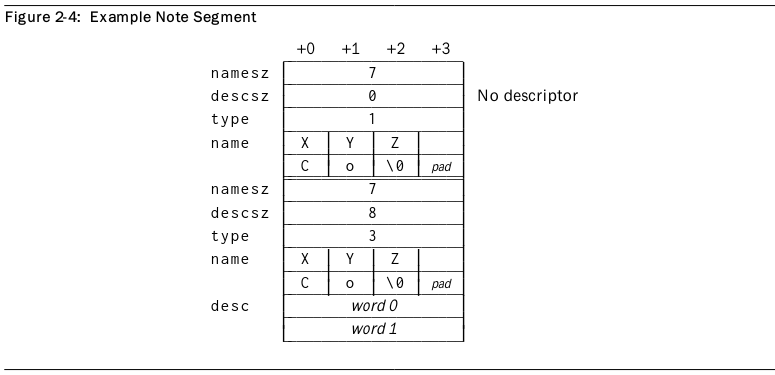
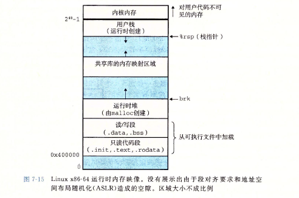
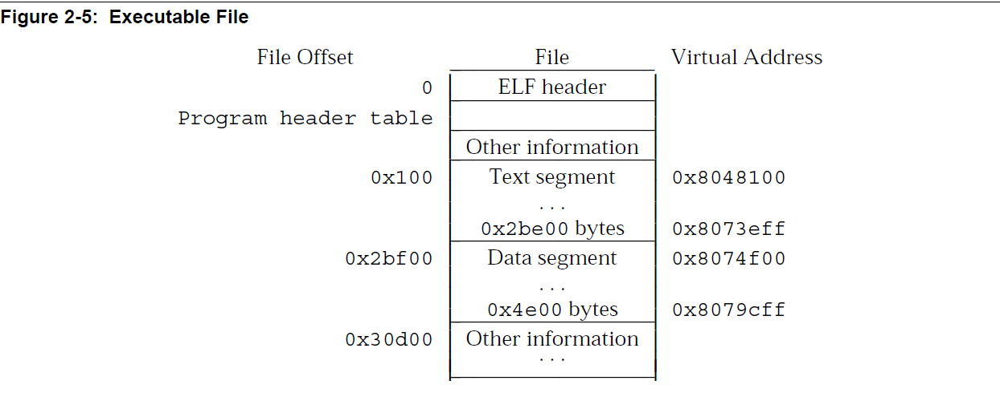
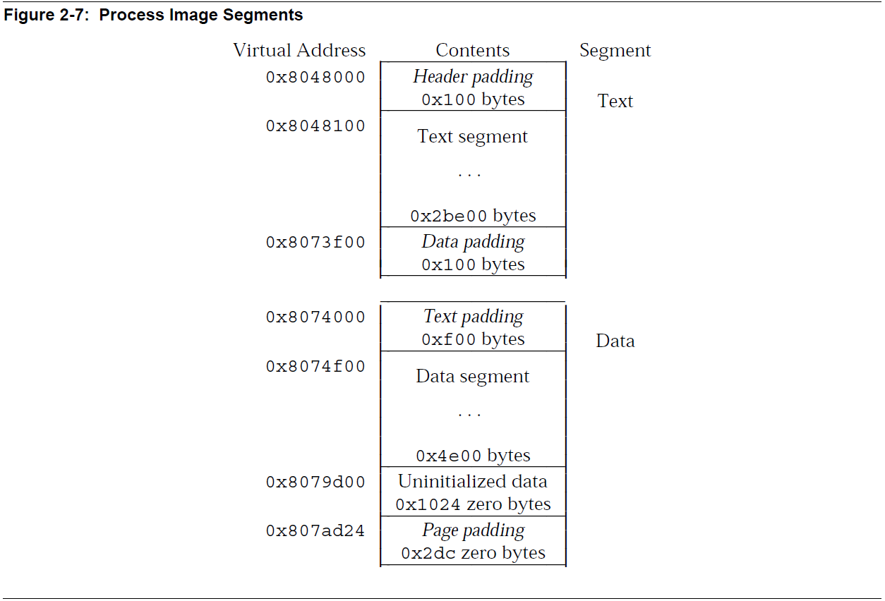
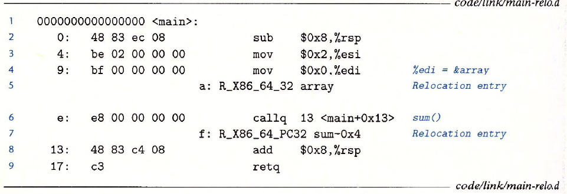
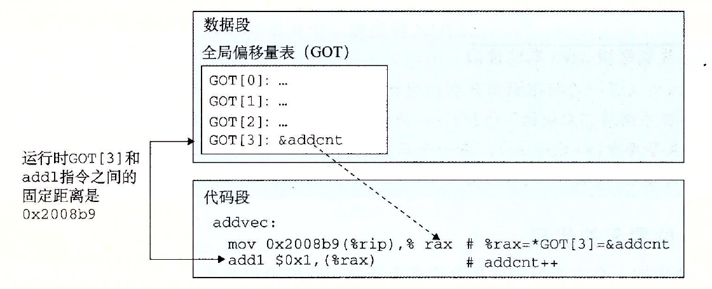
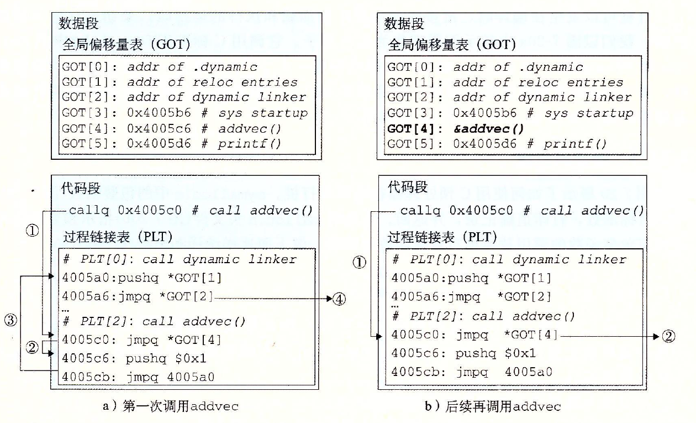

# ELF文件格式，链接器原理

## 参考资料

《深入理解计算机系统》，Randal E. Bryant，David R. O'Hallaron

[ELF_Format.pdf](src/210731a01/ELF_Format.pdf)

[Oracle 819-0690](https://docs.oracle.com/cd/E23824_01/html/819-0690/docinfo.html#scrolltoc)（可以下载pdf）

[FreeBSD ELF相关代码](https://cgit.freebsd.org/src/tree/sys?h=stable/13)。平台共用代码位于`sys/elf32`，`sys/elf64`。x86位于`x86/include/elf.h`，ARM位于`arm/include/elf.h`以及`arm64/include/elf.h`

## 目录

+ [**0**](#0-序言) 序言
+ [**1**](#1-elf文件结构) ELF文件结构
    + [**1.1**](#11-elf文件的种类) ELF文件的种类
    + [**1.2**](#12-elf文件结构概览) ELF文件结构概览
    + [**1.3**](#13-elf文件头) ELF文件头
        + [**1.3.1**](#131-elf-identification) ELF Identification
        + [**1.3.2**](#132-文件类型) 文件类型
        + [**1.3.3**](#133-机器类型) 机器类型
        + [**1.3.4**](#134-header-table相关) Header Table相关
        + [**1.3.5**](#135-机器特性) 机器特性
    + [**1.4**](#14-sections) Sections
        + [**1.4.1**](#141-section头) Section头
        + [**1.4.2**](#142-特殊section) 特殊Section
        + [**1.4.3**](#143-符号表) 符号表
        + [**1.4.4**](#144-重定位信息) 重定位信息
    + [**1.5**](#15-segments) Segments
        + [**1.5.1**](#151-program头) Program头
        + [**1.5.2**](#152-note-sectionsegment) Note Section/Segment
        + [**1.5.3**](#153-程序加载) 程序加载
        + [**1.5.4**](#154-动态链接) 动态链接
+ [**2**](#2-csapp第7章链接) CSAPP第7章：链接
    + [**2.1**](#21-编译工具链基本工作流程) 编译工具链基本工作流程
    + [**2.2**](#22-静态库的使用) 静态库的使用
    + [**2.3**](#23-重定位) 重定位
    + [**2.4**](#24-可执行目标文件加载) 可执行目标文件加载
    + [**2.5**](#25-动态链接) 动态链接
        + [**2.5.1**](#251-got表) GOT表
        + [**2.5.2**](#252-plt表) PLT表
    + [**2.6**](#26-库打桩) 库打桩
        + [**2.6.1**](#261-编译时打桩) 编译时打桩
        + [**2.6.2**](#262-链接时打桩) 链接时打桩
        + [**2.6.3**](#263-运行时打桩) 运行时打桩
+ [**3**](#3-补充) 补充
    + [**3.1**](#31-intel-hex文件格式) Intel hex文件格式


## 0 序言

平时我们使用IDE开发一个桌面程序，或者开发一个简单的控制台程序，基本不会意识到程序构建过程中链接的存在，也不会去关心二进制程序底层是如何运作的。例如使用Qt开发程序，在IDE窗口点击构建按钮，我们创建的大量源码文件以及头文件貌似自然而然就成为了可执行文件，执行我们想要的功能

目标文件，包括可执行文件，可重定位目标文件，以及共享目标文件，远不止机器代码这么简单，它还需要包含很多只读、初始化数据以及各种描述信息。ELF这种统一格式的出现使得程序文件的构建更加规范化，同时具备更强的通用性

链接也无处不在，大型工程的构建离不开链接（同样也离不开构建系统例如`Make`）。在大型工程中，将所有代码都放在一个源文件中是非常不明智的。链接器方便了程序构建的模块化，开发者可以将不同功能的代码分开，降低代码耦合度，减轻管理维护负担，同时闭源代码的发布也成为可能，也可以加快程序构建的速度。此外，在操作系统的支持下，共享库的动态链接机制也使得程序文件变得更小

事实上对于ELF文件格式以及链接器的深入理解是非常必要的，这是目前几乎所有软件赖以生存的基础。ELF作为当前最流行的目标文件格式，从单片机到服务器它都存在。虽然绝大部分不同的操作系统平台使用着不同的目标文件格式，或是ELF的不同实现，但底层原理都是相通的


## 1 ELF文件结构

ELF文件格式由UNIX System Laboratories提出，作为ABI标准的一部分，用以替代`a.out`等较老的二进制文件格式。Linux，FreeBSD等现代的类UNIX系统都广泛采用了这种文件格式，但是具体实现会略有不同，所以不通用

## 1.1 ELF文件的种类

ELF文件主要分为3种：**可重定位文件**（relocatable），**可执行文件**（executable）和**共享目标文件**（shared object）

ELF文件设计的用途主要有2个，一是被工具链中的链接器`ld`读取并和其他文件链接，另外也可以被操作系统的加载程序加载到内存中执行

此外，ELF适用于不同字长的硬件平台。以下基于32位架构讲解


## 1.2 ELF文件结构概览

ELF文件结构如下（区块的顺序会有所不同，不一定是下面展示的那样）


> `ELF header`位于ELF文件开头，主要记录了ELF文件的结构，处理器架构，`Program header table`和`Section header table`在文件中的位置等基本信息
>
> **可重定位文件**一般有`Section header table`以及多个`Section`，`Section`是给链接器看的，其中可能包含机器指令，只读数据，`switch`跳转表，变量，重定位信息等内容。这些文件不一定有`Program header table`
>
> **可执行文件**一般有`Program header table`以及多个`Segment`，`Segment`是给操作系统加载器看的，告诉加载器如何在内存中创建一个进程映像，一个`Segment`可能由1个或多个链接过程中的`Section`组成。可执行文件不一定有`Section header table`
>
> **共享目标文件**一般会同时拥有`Section header table`和`Program header table`

FreeBSD中ELF32基本数据类型定义如下

```cpp
/*
 * ELF definitions common to all 32-bit architectures.
 */

typedef uint32_t	Elf32_Addr;
typedef uint16_t	Elf32_Half;
typedef uint32_t	Elf32_Off;
typedef int32_t		Elf32_Sword;
typedef uint32_t	Elf32_Word;
typedef uint64_t	Elf32_Lword;

typedef Elf32_Word	Elf32_Hashelt;

/* Non-standard class-dependent datatype used for abstraction. */
typedef Elf32_Word	Elf32_Size;
typedef Elf32_Sword	Elf32_Ssize;
```

> 其中`Elf32_Addr`为32位地址，`Elf32_Off`为32位地址偏移，`Elf32_Half`为无符号半字数据，`Elf32_Sword`为有符号单字数据，`Elf32_Word`为无符号单字数据，`Elf32_Lword`为无符号双字数据
>
> 在ELF32文件中数据一般是4字节对齐的，可以发现`Elf32_Half`总是连续偶数个出现

> **逆向时一定要注意机器的大小端**。在小端机器中，ELF文件中所有的数据都按小端存放，在使用16进制编辑器查看时多字节数据要倒过来看


## 1.3 ELF文件头

FreeBSD中ELF头定义如下。取自`elf32.h`

```cpp
/*
 * ELF header.
 */

typedef struct {
	unsigned char	e_ident[EI_NIDENT];	/* File identification. */
	Elf32_Half	e_type;		/* File type. */
	Elf32_Half	e_machine;	/* Machine architecture. */
	Elf32_Word	e_version;	/* ELF format version. */
	Elf32_Addr	e_entry;	/* Entry point. */
	Elf32_Off	e_phoff;	/* Program header file offset. */
	Elf32_Off	e_shoff;	/* Section header file offset. */
	Elf32_Word	e_flags;	/* Architecture-specific flags. */
	Elf32_Half	e_ehsize;	/* Size of ELF header in bytes. */
	Elf32_Half	e_phentsize;	/* Size of program header entry. */
	Elf32_Half	e_phnum;	/* Number of program header entries. */
	Elf32_Half	e_shentsize;	/* Size of section header entry. */
	Elf32_Half	e_shnum;	/* Number of section header entries. */
	Elf32_Half	e_shstrndx;	/* Section name strings section. */
} Elf32_Ehdr;
```

`e_entry`表示程序入口的虚拟地址（没有入口则设为`0`），`e_ehsize`表示ELF头的大小

其中，`EI_NIDENT`定义为16（位于`sys/elf_common.h`）

```cpp
#define	EI_NIDENT	16	/* Size of e_ident array. */
```

### 1.3.1 ELF Identification

ELF32文件使用长度16字节的`e_ident`表示一些通用信息，为Identification，其中前7字节定义如下。之后需要加上占位符`EI_PAD`

| 下标 | 名称 | 作用 |
| :-: | :-: | :-: |
| `e_ident[0]` | `EI_MAG0` | 魔法数`0x7F` |
| `e_ident[1]` | `EI_MAG1` | 魔法数`0x45`（字符`E`） |
| `e_ident[2]` | `EI_MAG2` | 魔法数`0x4C`（字符`L`） |
| `e_ident[3]` | `EI_MAG3` | 魔法数`0x46`（字符`F`） |
| `e_ident[4]` | `EI_CLASS` | 表示机器字长，`0`表示`ELFCLASSNONE`无效，`1`表示`ELFCLASS32`为32位目标文件，`2`表示`ELFCLASS64`为64位目标文件 |
| `e_ident[5]` | `EI_DATA` | 表大小端，`0`表示`ELFDATANONE`无效，`1`表示`ELFDATA2LSB`小端（Little-Endian），`2`表示`ELFDATA2MSB`大端（Big-Endian） |
| `e_ident[6]` | `EI_VERSION` | 文件版本，值和`e_version`相同，只能为`1`（`EV_CURRENT`） |

FreeBSD中定义如下，添加了几个变量

```cpp
#define	EI_MAG0		0	/* Magic number, byte 0. */
#define	EI_MAG1		1	/* Magic number, byte 1. */
#define	EI_MAG2		2	/* Magic number, byte 2. */
#define	EI_MAG3		3	/* Magic number, byte 3. */
#define	EI_CLASS	4	/* Class of machine. */
#define	EI_DATA		5	/* Data format. */
#define	EI_VERSION	6	/* ELF format version. */
#define	EI_OSABI	7	/* Operating system / ABI identification */
#define	EI_ABIVERSION	8	/* ABI version */
#define	OLD_EI_BRAND	8	/* Start of architecture identification. */
#define	EI_PAD		9	/* Start of padding (per SVR4 ABI). */
```


### 1.3.2 文件类型

`e_type`表示文件的类型，是重定位文件，可执行文件还是共享目标文件。可以取以下值

| 名称 | 值 | 含义 |
| :-: | :-: | :-: |
| `ET_NONE` | `0` | 无效 |
| `ET_REL` | `1` | 可重定位文件 |
| `ET_EXEC` | `2` | 可执行文件 |
| `ET_DYN` | `3` | 共享目标文件 |
| `ET_CORE` | `4` | 核心文件。保留，没有明确定义该种文件格式 |
| `ET_LOPROC` | `0xFF00` |  |
| `ET_HIPROC` | `0xFFFF` |  |

FreeBSD中定义如下

```cpp
/* Values for e_type. */
#define	ET_NONE		0	/* Unknown type. */
#define	ET_REL		1	/* Relocatable. */
#define	ET_EXEC		2	/* Executable. */
#define	ET_DYN		3	/* Shared object. */
#define	ET_CORE		4	/* Core file. */
#define	ET_LOOS		0xfe00	/* First operating system specific. */
#define	ET_HIOS		0xfeff	/* Last operating system-specific. */
#define	ET_LOPROC	0xff00	/* First processor-specific. */
#define	ET_HIPROC	0xffff	/* Last processor-specific. */
```


### 1.3.3 机器类型

`e_machine`指定机器指令集

| 名称 | 值 | 含义 |
| :-: | :-: | :-: |
| `EM_NONE` | `0` | 无效 |
| `EM_SPARC` | `2` | SPARC |
| `EM_386` | `3` | i386 |
| `EM_68K` | `4` | MC68000 |
| `EM_MIPS` | `8` | MIPS RS3000 |

常见的CPU定义如下

```cpp
/* Values for e_machine. */
#define	EM_NONE		0	/* Unknown machine. */
#define	EM_SPARC	2	/* Sun SPARC. */
#define	EM_386		3	/* Intel i386. */
#define	EM_68K		4	/* Motorola 68000. */
#define	EM_MIPS		8	/* MIPS R3000 Big-Endian only. */
#define	EM_MIPS_RS3_LE	10	/* MIPS R3000 Little-Endian. */
#define	EM_PARISC	15	/* HP PA-RISC. */
#define	EM_SPARC32PLUS	18	/* SPARC v8plus. */
#define	EM_PPC		20	/* PowerPC 32-bit. */
#define	EM_PPC64	21	/* PowerPC 64-bit. */
#define	EM_ARM		40	/* ARM. */
#define	EM_SPARCV9	43	/* SPARC v9 64-bit. */
#define	EM_IA_64	50	/* Intel IA-64 Processor. */
#define	EM_X86_64	62	/* Advanced Micro Devices x86-64 */
#define	EM_AMD64	EM_X86_64	/* Advanced Micro Devices x86-64 (compat) */
#define	EM_AVR		83	/* Atmel AVR 8-bit microcontroller. */
#define	EM_XTENSA	94	/* Tensilica Xtensa Architecture. */
#define	EM_MSP430	105	/* Texas Instruments embedded microcontroller msp430. */
#define	EM_BLACKFIN	106	/* Analog Devices Blackfin (DSP) processor. */
#define	EM_SEP		108	/* Sharp embedded microprocessor. */
#define	EM_AARCH64	183	/* AArch64 (64-bit ARM) */
#define	EM_RISCV	243	/* RISC-V */
```


### 1.3.4 Header Table相关

`e_phoff`和`e_shoff`分别表示`Program header table`和`Section header table`在ELF文件中的偏移

`e_phnum`和`e_shnum`分别表示两种表包含的Entry数量，如果没有就为`0`

`e_phentsize`和`e_shentsize`分别表示两种表中每一个Entry的大小（和`num`相乘就是表的大小）

`e_shstrndex`指向`Section header table`的一个特殊入口，它的值为`section name string table`的入口项下标，该字符串表用于存储所有的`Section`名称。如果没有该表那么该变量赋值为`SHN_UNDEF`（为`0`）

```cpp
#define	SHN_UNDEF	     0		/* Undefined, missing, irrelevant. */
```


### 1.3.5 机器特性

`e_flags`存储特定CPU架构的相关信息，只在部分RISC平台如ARM，MIPS，PowerPC，RISC-V，SPARC下有定义，i386以及AMD64下该变量为`0`

部分ARM以及RISC-V所属代码如下

```cpp
/**
 * e_flags
 */
#define	EF_ARM_RELEXEC	0x1
#define	EF_ARM_HASENTRY	0x2
#define	EF_ARM_SYMSARESORTED	0x4
#define	EF_ARM_DYNSYMSUSESEGIDX	0x8
#define	EF_ARM_MAPSYMSFIRST	0x10
#define	EF_ARM_LE8		0x00400000
#define	EF_ARM_BE8		0x00800000
#define	EF_ARM_EABIMASK		0xFF000000
#define	EF_ARM_EABI_UNKNOWN	0x00000000
#define	EF_ARM_EABI_VER1	0x01000000
#define	EF_ARM_EABI_VER2	0x02000000
#define	EF_ARM_EABI_VER3	0x03000000
#define	EF_ARM_EABI_VER4	0x04000000
#define	EF_ARM_EABI_VER5	0x05000000
#define	EF_ARM_INTERWORK	0x00000004
#define	EF_ARM_APCS_26		0x00000008
#define	EF_ARM_APCS_FLOAT	0x00000010
#define	EF_ARM_PIC		0x00000020
#define	EF_ARM_ALIGN8		0x00000040
#define	EF_ARM_NEW_ABI		0x00000080
#define	EF_ARM_OLD_ABI		0x00000100
#define	EF_ARM_ABI_FLOAT_SOFT	0x00000200
#define	EF_ARM_SOFT_FLOAT	EF_ARM_ABI_FLOAT_SOFT /* Pre-V5 ABI name */
#define	EF_ARM_ABI_FLOAT_HARD	0x00000400
#define	EF_ARM_VFP_FLOAT	EF_ARM_ABI_FLOAT_HARD /* Pre-V5 ABI name */
#define	EF_ARM_MAVERICK_FLOAT	0x00000800

#define	EF_RISCV_RVC		0x00000001
#define	EF_RISCV_FLOAT_ABI_MASK	0x00000006
#define	EF_RISCV_FLOAT_ABI_SOFT	0x00000000
#define	EF_RISCV_FLOAT_ABI_SINGLE 0x000002
#define	EF_RISCV_FLOAT_ABI_DOUBLE 0x000004
#define	EF_RISCV_FLOAT_ABI_QUAD	0x00000006
#define	EF_RISCV_RVE		0x00000008
#define	EF_RISCV_TSO		0x00000010
```


## 1.4 Sections

Section是目标文件的基本组成部分。每一个Section在`Section header table`中只有1个header描述它，并且不是所有header都会对应1个Section。一个Section在文件中永远是连续的，且各自之间不能重叠。一个文件中可以有多个同名Section。目标文件中可能有一些空间没有被利用，这些空间称之为`inactive space`（程序开发者可以在这些`inactive space`中隐藏一些彩蛋）


### 1.4.1 Section头

`Section header table`中每一个入口（每一个项）都是一个结构体，存储了一个Section的名称（在`section name string table`中的下标），类型，在内存中的地址，在文件中的偏移、大小等等必要信息，定义如下

```cpp
/*
 * Section header.
 */

typedef struct {
	Elf32_Word	sh_name;	/* Section name (index into the
					   section header string table). */
	Elf32_Word	sh_type;	/* Section type. */
	Elf32_Word	sh_flags;	/* Section flags. */
	Elf32_Addr	sh_addr;	/* Address in memory image. */
	Elf32_Off	sh_offset;	/* Offset in file. */
	Elf32_Word	sh_size;	/* Size in bytes. */
	Elf32_Word	sh_link;	/* Index of a related section. */
	Elf32_Word	sh_info;	/* Depends on section type. */
	Elf32_Word	sh_addralign;	/* Alignment in bytes. */
	Elf32_Word	sh_entsize;	/* Size of each entry in section. */
} Elf32_Shdr;
```

`Section header table`就是一个顺序表，入口的下标按顺序为`0,1,2,...,e_shnum-1`。其中部分index被保留，如下（除了开头固定的`0`下标以外，只在`sh_link`域以及符号表等其他地方较为常见）

| 值 | 名称 | 含义 |
| :-: | :-: | :-: |
| `0` | `SHN_UNDEF` | Section头表中第0个入口，其中所有变量都为`0`。如果`e_shnum`指示该文件有10个Section，那么一般实际有效的有9个，包含字符串表 |
| `0xFF00` | `SHN_LORESERVE` | 编码保留区低边界 |
| `0xFF00` | `SHN_LOPROC` | 处理器专用编码保留区低边界 |
| `0xFF1F` | `SHN_HIPROC` | 处理器专用编码保留区高边界 |
| `0xFFF1` | `SHN_ABS` | 表示其中的符号确定，不受重定位影响 |
| `0xFFF2` | `SHN_COMMON` | common symbols（例如未分配的外部C变量） |
| `0xFFFF` | `SHN_HIRESERVE` | 编码保留区高边界 |

FreeBSD中定义如下

```cpp
/* Special section indexes. */
#define	SHN_UNDEF	     0		/* Undefined, missing, irrelevant. */
#define	SHN_LORESERVE	0xff00		/* First of reserved range. */
#define	SHN_LOPROC	0xff00		/* First processor-specific. */
#define	SHN_HIPROC	0xff1f		/* Last processor-specific. */
#define	SHN_LOOS	0xff20		/* First operating system-specific. */
#define	SHN_FBSD_CACHED	SHN_LOOS	/* Transient, for sys/kern/link_elf_obj linker only: Cached global in local symtab. */
#define	SHN_HIOS	0xff3f		/* Last operating system-specific. */
#define	SHN_ABS		0xfff1		/* Absolute values. */
#define	SHN_COMMON	0xfff2		/* Common data. */
#define	SHN_XINDEX	0xffff		/* Escape -- index stored elsewhere. */
#define	SHN_HIRESERVE	0xffff		/* Last of reserved range. */
```

`sh_name`为该Section的名称，值为Section名称字符串在`String table`中的起始下标。`String table`位置由一个特殊的header指定，这个header在`Section header table`中的下标由ELF头的`e_shstrndex`指定。字符串表示例如下


通过下标引用字符串得到的结果如下


> 字符串表下标从0开始，`sh_name`一般表示字符串中第1个字符在表格中的位置（也可以不是第1个字符）。每一个字符串以`\0`结尾。引用下标`0`得到`none`，引用其他`\0`所在下标得到空字符串。
>
> 同一个字符串可以被引用多次，也可能未被引用

`sh_type`指示该Section的类型，定义如下

| 名称 | 值 | 含义 |
| :-: | :-: | :-: |
| `SHT_NULL` | `0` | 标记该header为inactive，没有Section对应 |
| `SHT_PROGBITS` | `1` | 该Section存放程序定义的内容 |
| `SHT_SYMTAB` | `2` | 较完整的符号表，一般用于**静态链接** |
| `SHT_STRTAB` | `3` | 字符串表 |
| `SHT_RELA` | `4` | 带加数（Addend）的重定位信息列表（`Elf32_Rela`结构体）。一个文件可以有多个重定位信息区块 |
| `SHT_HASH` | `5` | 符号哈希表（用于动态链接时必须包含） |
| `SHT_DYNAMIC` | `6` | 用于动态链接的信息 |
| `SHT_NOTE` | `7` | 记录与描述类信息 |
| `SHT_NOBITS` | `8` | 和`SHT_PROGBITS`类似，但是在文件中不会占有任何空间。同时`sh_offset`是有效的 |
| `SHT_REL` | `9` | 不带加数的重定位信息列表（`Elf32_Rel`结构体） |
| `SHT_SHLIB` | `10` | 未定义的保留类型。基本不会遇到 |
| `SHT_DYNSYM` | `11` | 较精简的符号表，一般用于**动态链接** |
| `SHT_LOPROC` | `0x70000000` | 编码保留区下界。处理器相关 |
| `SHT_HIPROC` | `0x7FFFFFFF` | 编码保留区上界 |
| `SHT_LOUSER` | `0x80000000` | 编码保留区下界。用于应用程序定义的数据 |
| `SHT_HIUSER` | `0x8FFFFFFF` | 编码保留区上界 |

FreeBSD中还有其他类型，部分定义如下

```cpp
/* sh_type */
#define	SHT_NULL		0	/* inactive */
#define	SHT_PROGBITS		1	/* program defined information */
#define	SHT_SYMTAB		2	/* symbol table section */
#define	SHT_STRTAB		3	/* string table section */
#define	SHT_RELA		4	/* relocation section with addends */
#define	SHT_HASH		5	/* symbol hash table section */
#define	SHT_DYNAMIC		6	/* dynamic section */
#define	SHT_NOTE		7	/* note section */
#define	SHT_NOBITS		8	/* no space section */
#define	SHT_REL			9	/* relocation section - no addends */
#define	SHT_SHLIB		10	/* reserved - purpose unknown */
#define	SHT_DYNSYM		11	/* dynamic symbol table section */
#define	SHT_INIT_ARRAY		14	/* Initialization function pointers. */
#define	SHT_FINI_ARRAY		15	/* Termination function pointers. */
#define	SHT_PREINIT_ARRAY	16	/* Pre-initialization function ptrs. */
#define	SHT_GROUP		17	/* Section group. */
#define	SHT_SYMTAB_SHNDX	18	/* Section indexes (see SHN_XINDEX). */

#define	SHT_LOPROC		0x70000000	/* reserved range for processor */
#define	SHT_X86_64_UNWIND	0x70000001	/* unwind information */
#define	SHT_AMD64_UNWIND	SHT_X86_64_UNWIND 

#define	SHT_ARM_EXIDX		0x70000001	/* Exception index table. */
#define	SHT_ARM_PREEMPTMAP	0x70000002	/* BPABI DLL dynamic linking pre-emption map. */
#define	SHT_ARM_ATTRIBUTES	0x70000003	/* Object file compatibility attributes. */
#define	SHT_ARM_DEBUGOVERLAY	0x70000004	/* See DBGOVL for details. */
#define	SHT_ARM_OVERLAYSECTION	0x70000005	/* See DBGOVL for details. */
#define	SHT_HIPROC		0x7fffffff	/* specific section header types */
#define	SHT_LOUSER		0x80000000	/* reserved range for application */
#define	SHT_HIUSER		0xffffffff	/* specific indexes */
```

`sh_flags`描述该Section的属性，如可写，可执行，内存分配等，如下。**这些属性可以通过位或运算合并到一起**

| 名称 | 值 | 含义 |
| :-: | :-: | :-: |
| `SHF_WRITE` | `1` | 该Section包含了在程序实际执行时可写的内容 |
| `SHF_ALLOC` | `2` | 该Section包含了在程序实际执行时会占有实际空间的内容 |
| `SHF_EXECINSTR` | `4` | 该Section包含可执行的机器代码 |
| `SHF_MASKPROC` | `0xF0000000` | 处理器专用保留编码掩码 |

FreeBSD中定义如下

```cpp
/* Flags for sh_flags. */
#define	SHF_WRITE		0x1	/* Section contains writable data. */
#define	SHF_ALLOC		0x2	/* Section occupies memory. */
#define	SHF_EXECINSTR		0x4	/* Section contains instructions. */
#define	SHF_MERGE		0x10	/* Section may be merged. */
#define	SHF_STRINGS		0x20	/* Section contains strings. */
#define	SHF_INFO_LINK		0x40	/* sh_info holds section index. */
#define	SHF_LINK_ORDER		0x80	/* Special ordering requirements. */
#define	SHF_OS_NONCONFORMING	0x100	/* OS-specific processing required. */
#define	SHF_GROUP		0x200	/* Member of section group. */
#define	SHF_TLS			0x400	/* Section contains TLS data. */
#define	SHF_COMPRESSED		0x800	/* Section contains compressed data. */
#define	SHF_MASKOS	0x0ff00000	/* OS-specific semantics. */
#define	SHF_MASKPROC	0xf0000000	/* Processor-specific semantics. */
```

`sh_addr`，`sh_offset`以及`sh_size`分别表示该Section在执行时在内存映像中的起始地址，在文件中的偏移以及大小

`sh_addralign`和`sh_entsize`分别表示该Section的内存对齐要求，以及该Section中每一个项的大小（只有在Section中每一个项大小相同时才会使用到）。`sh_addralign`为`0`或`1`时表示没有对齐要求，在有对齐要求的Section中`sh_addr`需要和`sh_addralign`设定相符

`sh_link`和`sh_info`在不同的Section类型中有不同的作用。一般来说，`sh_link`用于存储相关Section的下标，`sh_info`用于其他额外信息。如下

| `sh_type` | `sh_link` | `sh_info` |
| :-: | :-: | :-: |
| `SHT_DYNAMIC` | 该动态链接信息表对应的字符串表的Section下标 | `0` |
| `SHT_HASH` | 该哈希表对应的符号表的Section下标 | `0` |
| `SHT_REL` `SHT_RELA` | 重定位信息相关的符号表的Section下标 | 重定位信息所作用的Section下标 |
| `SHT_SYMTAB` `SHT_DYNSYM` | 符号表相关的字符串表的Section下标 | 符号表中下一个本地符号下标（当前最后一个加1） |
| 其他 | `SHN_UNDEF` | `0` |


### 1.4.2 特殊Section

所有名称以点`.`开头的都是特殊Section。如下，**划重点**

| 名称 | Section类型 | 属性 | 描述 |
| :-: | :-: | :-: | :-: |
| `.bss` | `SHT_NOBITS` | `ALLOC WRITE` | （Better Save Space）该Section存储未初始化或初始化为0的数据，在文件中不占有实际空间。执行时加载到内存会自动分配空间并全部初始化为`0` |
| `.comment` | `SHT_PROGBITS` | `none` | 版本控制信息 |
| `.data` `.data1` | `SHT_PROGBITS` | `ALLOC WRITE` | 该Section存储已经初始化的数据，在文件中占有实际空间。执行时会按照初始值加载到内存 |
| `.debug` | `SHT_PROGBITS` | `none` | 符号调试相关信息，ELF未具体定义 |
| `.dynamic` | `SHT_DYNAMIC` |  | 动态链接信息，会在内存中占有实际空间，因此一定有`SHF_ALLOC` |
| `.dynstr` | `SHT_STRTAB` | `ALLOC` | 动态链接字符串表，一般存储符号名称 |
| `.dynsym` | `SHT_DYNSYM` | `ALLOC` | 动态链接符号表 |
| `.fini` | `SHT_PROGBITS` | `ALLOC EXECINSTR` | 程序正常退出时执行的指令 |
| `.got` | `SHT_PROGBITS` |  | 全局偏移表`Global Offset Table`，程序在执行时会用到 |
| `.hash` | `SHT_HASH` | `ALLOC` | 符号哈希表 |
| `.init` | `SHT_PROGBITS` | `ALLOC EXECINSTR` | 程序在进入到`main`函数之前执行的初始化指令 |
| `.interp` | `SHT_PROGBITS` |  | 程序解释器的路径。如果该文件中有一个运行时会被加载到内存的Segment包含了这个Section，那么这片区域会被设置为`SHF_ALLOC` |
| `.line` | `SHT_PROGBITS` | `none` | 调试使用的源码行信息，存储源码和机器代码的对应关系 |
| `.note` | `SHT_NOTE` | `none` | 记录、描述类信息 |
| `.plt` | `SHT_PROGBITS` |  | 包含`Procedure Linkage Table`，程序执行时会用到 |
| `.rel`+name | `SHT_REL` |  | 无加数的重定位信息。在`.rel`后面加上相应Section的名称，例如使用`.rel.text`表示这是`.text`的重定位信息。这片区域如果运行时会加载到内存则会被设置为`SHF_ALLOC` |
| `.rela`+name | `SHT_RELA` |  | 带加数的重定位信息。同上 |
| `.rodata` `.rodata1` | `SHT_PROGBITS` | `ALLOC` | 程序执行时的只读数据，不可写。可能是程序中使用到的字符串以及`switch`跳转表等（一些CPU硬件支持`switch`指令，需要使用到这些跳转表） |
| `.shstrtab` | `SHT_STRTAB` | `none` | Section名称字符串表 |
| `.strtab` | `SHT_STRTAB` |  | 通常为符号对应字符串表。这片区域如果运行时会加载到内存则会被设置为`SHF_ALLOC` |
| `.symtab` | `SHT_SYMTAB` |  | 符号表。这片区域如果运行时会加载到内存则会被设置为`SHF_ALLOC` |
| `.text` | `SHT_PROGBITS` | `ALLOC EXECINSTR` | 机器指令 |

此外，处理器架构专有的Section名称需要在前面加上该架构名称简写，例如`.ARM.attributes`


### 1.4.3 符号表

C代码符号使用示例

```cpp
int a = 0;				// 符号a属于.bss节，STB_GLOBAL，STT_OBJECT。强符号
int b;					// 符号b属于COMMON伪节，STB_WEAK，STT_OBJECT。此时b由于未初始化所以为弱符号，可以被其他文件中已初始化的同名强符号覆盖。如果其他文件未定义b或未初始化b，那么符号b最终会在链接后被归入.bss；如果其他文件有一个强符号b，那么b最终会在链接后出现在.data中
int c = 3;				// 符号c属于.data节，STB_GLOBAL，STT_OBJECT。强符号
static int d = 0;		// 符号d属于.bss节，STB_LOCAL，STT_OBJECT
static int e;			// 符号e属于.bss节，STB_LOCAL，STT_OBJECT
static int f = 3;		// 符号f属于.data节，STB_LOCAL，STT_OBJECT
extern int g;			// 符号g属于UNDEF伪节，STB_GLOBAL，STT_OBJECT。符号g已经确定是在其他文件中定义的，相比之下符号b不确定

int main() {			// 符号main属于.text节，STB_GLOBAL，STT_FUNC
	static int h = 3;	// 符号h属于.data节，STB_LOCAL，STT_OBJECT
	int i = 1;			// 变量i在栈区，不会出现在符号表。初始值一般位于.rodata节
	int j;				// 变量j在栈区，不会出现在符号表。此时j可能为不确定值（视平台而定，栈区不像.bss节那样初始化为0）
	int k[64];			// 数组变量k在栈区，不会出现在符号表。内容可能为不确定值
	// 在程序运行时使用malloc()分配的空间在堆区管理
	return 0;
}
```

符号表中的每一个入口是一个结构体，定义如下。和Section表一样，符号表的`index[0]`同样是保留的，其所有变量值都为`0`

```cpp
/*
 * Symbol table entries.
 */

typedef struct {
	Elf32_Word	st_name;	/* String table index of name. */
	Elf32_Addr	st_value;	/* Symbol value. */
	Elf32_Word	st_size;	/* Size of associated object. */
	unsigned char	st_info;	/* Type and binding information. */
	unsigned char	st_other;	/* Reserved (not used). */
	Elf32_Half	st_shndx;	/* Section index of symbol. */
} Elf32_Sym;
```

`st_name`表示该符号的名称（在一个字符串表中的下标，和`sh_name`一样）。设为0表示该符号没有名称

`st_other`永远为`0`

`st_value`表示符号的值。在重定位文件中一般是一个地址，表示符号的实际数据内容在对应Section中的偏移。在可执行文件和共享目标文件中一般是程序执行时该符号对应的虚拟地址。也可能就是该符号实际的值

`st_shndx`表示该符号对应的Section的下标，和`st_value`共同决定符号的位置。重定位时`st_value`值也会变。`st_shndx`取特殊值时有以下含义，取这3个特殊值时该符号分别对应`UNDEF`，`ABS`以及`COMMON`这3个伪节（这3个伪节只在可重定位文件中存在，且不会在`Section header table`中出现）

| 特殊值 | 含义 |
| :-: | :-: |
| `SHN_UNDEF` | 表示符号是未定义的。一般是在该文件中已经声明但是没有定义（C语言中使用`extern`声明），需要在链接时到其他文件中寻找 |
| `SHN_ABS` | 表示符号不会受重定位影响 |
| `SHN_COMMON` | 表示该符号属于`COMMON`伪节，代表一个未分配空间的未初始化数据，此时`st_value`表示内存对齐参数（单位字节），`st_size`表示需要分配的大小 |

> 由以上可以发现`COMMON`的作用貌似和`.bss`非常相近。两者主要的区别是，`COMMON`存放未初始化的**全局**变量。`.bss`存放未初始化或初始化为`0`的**静态**变量（使用`static`关键字修饰），和初始化为`0`的**全局**变量
>
> 可以这样记忆，只要初始化为`0`就只能放到`.bss`，只有全局变量未初始化时才会放到`COMMON`。这两种情况下在目标文件中都不会占用空间

`st_size`表示符号的大小（单位字节，如果没有大小或不确定大小则设为`0`）

`st_info`表示符号的种类以及属性，只有低1字节有效，通过以下方式访问

```cpp
/* Macros for accessing the fields of st_info. */
#define ELF32_ST_BIND(info)		((info) >> 4)
#define ELF32_ST_TYPE(info)		((info) & 0xf)

/* Macro for constructing st_info from field values. */
#define ELF32_ST_INFO(bind, type)	(((bind) << 4) + ((type) & 0xf))
```

最低1字节的高4bit表示binding，低4bit表示type

`ELF32_ST_BIND`定义如下

| 名称 | 值 | 含义 |
| :-: | :-: | :-: |
| `STB_LOCAL` | `0` | **本地符号**，只对当前目标文件可见，其他文件不可引用且可以定义同名符号。在C语言中一般是使用`static`声明的函数或变量（这是C语言中的一种封装机制）。**建议将静态变量和静态函数放在`.c`源文件**。在C++中一般一个类就是一个文件，就是使用`private`声明的成员。本地符号会覆盖全局符号和弱符号 |
| `STB_GLOBAL` | `1` | **全局符号**，对所有目标文件可见。在C语言中是文件中未加修饰的普通符号，这些符号可以在其他文件中使用`extern`关键字声明后引用。**建议将全局变量放在`.h`头文件**。在C++中就是使用`public`声明的成员 |
| `STB_WEAK` | `2` | **弱符号**属于特殊的全局符号，一般用于会发生全局符号冲突的情况。弱符号优先级较低，未初始化的全局变量默认是弱符号。与之相对的强符号，一般是函数和已经初始化的全局变量。C中可以使用`__attribute__((weak))`声明弱函数和弱变量，如果在链接（包括动态链接）时没有在其他文件中找到该符号，那么就使用该弱符号代替。而同名同类型强符号可以覆盖弱符号 |
| `STB_LOPROC` | `13` | 编码保留区下界。处理器相关 |
| `STB_HIPROC` | `15` | 编码保留区上界 |

`ELF32_ST_TYPE`定义如下

| 名称 | 值 | 含义 |
| :-: | :-: | :-: |
| `STT_NOTYPE` | `0` | 无类型 |
| `STT_OBJECT` | `1` | 数据符号，可以是变量，数组等 |
| `STT_FUNC` | `2` | 函数符号，可以是函数或其他类型的可执行代码。运行时从其他文件引用共享目标文件中的函数符号，操作系统会自动在`PLT`中创建一个入口 |
| `STT_SECTION` | `3` | Section符号，一般用于重定位，且低4位一般为`STB_LOCAL` |
| `STT_FILE` | `4` | 源文件符号，该符号的符号名给出当前目标文件对应的源文件名。该符号低4位为`STB_LOCAL`，且位于`index[SHN_ABS]`，不受重定位影响 |
| `STT_LOPROC` | `13` | 编码保留区下界。处理器相关 |
| `STT_HIPROC` | `15` | 编码保留区上界 |

FreeBSD中符号类型定义如下

```cpp
/* Symbol Binding - ELFNN_ST_BIND - st_info */
#define	STB_LOCAL	0	/* Local symbol */
#define	STB_GLOBAL	1	/* Global symbol */
#define	STB_WEAK	2	/* like global - lower precedence */
#define	STB_LOOS	10	/* Start of operating system reserved range. */
#define	STB_GNU_UNIQUE	10	/* Unique symbol (GNU) */
#define	STB_HIOS	12	/* End of operating system reserved range. */
#define	STB_LOPROC	13	/* reserved range for processor */
#define	STB_HIPROC	15	/*   specific semantics. */

/* Symbol type - ELFNN_ST_TYPE - st_info */
#define	STT_NOTYPE	0	/* Unspecified type. */
#define	STT_OBJECT	1	/* Data object. */
#define	STT_FUNC	2	/* Function. */
#define	STT_SECTION	3	/* Section. */
#define	STT_FILE	4	/* Source file. */
#define	STT_COMMON	5	/* Uninitialized common block. */
#define	STT_TLS		6	/* TLS object. */
#define	STT_NUM		7
#define	STT_LOOS	10	/* Reserved range for operating system */
#define	STT_GNU_IFUNC	10
#define	STT_HIOS	12	/*   specific semantics. */
#define	STT_LOPROC	13	/* Start of processor reserved range. */
#define	STT_SPARC_REGISTER 13	/* SPARC register information. */
#define	STT_HIPROC	15	/* End of processor reserved range. */
```


### 1.4.4 重定位信息

所谓重定位，就是在链接器将多个文件链接到一起时，将不同文件中同一个符号的引用和定义联系起来，**本质是对于Section数据内容的修改**。例如在机器代码Section中，如果调用了一个函数，那么就需要修改对应子程序调用指令中的地址。

> 一般在文件链接以后，有些程序代码需要拼接到一起，而各个代码块中指令的顺序一般是不会变的，重定位针对机器代码中涉及到跳转、内存数据存取等操作的指令进行更改。以ARM Cortex-M为例，函数调用有**立即数相对地址**跳转`BL label`和**寄存器绝对地址**跳转`BLX R1`两种，有些指令在重定位以后需要更改指令中的`label`相对地址或`R1`绝对地址（绝对跳转`BLX R1`之前往往还有其他`R1`相关的操作，例如把一个地址从Flash加载到`R1`）。这就是重定位的作用之一
>
> 函数调用的重定位会涉及到PLT（Procedure Linkage Table），将会在[1.5](#15-segments)讲解
>
> 此外重定位还需要解决全局变量等数据的重定位操作

文件链接的步骤中，首先链接器需要确定将两个文件结合拼接到一起的方法，之后需要修改符号的`st_value`，最后进行重定位操作，修改Section的内容（例如出现变量引用，函数调用，程序跳转的地方）

重定位信息位于`.rel`或`.rela`（例如`.rel.text`，`.rel.data`等，重定位对应的Section会直接在名称中体现。同时`.rel`以及`.rela`的`sh_link`和`sh_info`分别表示**相关符号表**以及**重定位信息对应的Section**）

重定位信息表中每一个入口都是一个结构体，FreeBSD中定义如下

```cpp
/*
 * Relocation entries.
 */

/* Relocations that don't need an addend field. */
typedef struct {
	Elf32_Addr	r_offset;	/* Location to be relocated. */
	Elf32_Word	r_info;		/* Relocation type and symbol index. */
} Elf32_Rel;

/* Relocations that need an addend field. */
typedef struct {
	Elf32_Addr	r_offset;	/* Location to be relocated. */
	Elf32_Word	r_info;		/* Relocation type and symbol index. */
	Elf32_Sword	r_addend;	/* Addend. */
} Elf32_Rela;
```

`r_offset`在重定位文件中表示重定位操作在该Section中的偏移。在可执行文件以及共享链接目标文件中表示重定位操作的虚拟地址。这里它代表的都是受重定位影响需要更改的数据单元的第1个字节的位置

`r_info`这个变量也是一个复合变量，用于指示重定位对应的符号下标（例如子程序调用指令所调用的函数的符号，占`r_info`的高3字节），以及重定位的类型（占`r_info`的低1字节。重定位类型规定了链接器对数据单元进行哪种重定位操作）。符号下标可以是`STN_UNDEF`。重定位类型因为不同处理器指令格式不一样所以是不同的。访问方式和`st_info`相似，如下

```cpp
/* Macros for accessing the fields of r_info. */
#define ELF32_R_SYM(info)	((info) >> 8)
#define ELF32_R_TYPE(info)	((unsigned char)(info))

/* Macro for constructing r_info from field values. */
#define ELF32_R_INFO(sym, type)	(((sym) << 8) + (unsigned char)(type))
```

`r_addend`用于存储重定位地址计算中可能使用到的常量加数，而在`.rel`中这个加数是隐式的。一般一个平台只会使用到`.rela`或`.rel`两者其一，视方便程度而定

i386中重定位类型定义示例如下。其他还有很多

| 名称 | 值 | 含义 |
| :-: | :-: | :-: |
| `R_386_NONE` | `0` | 不进行重定位 |
| `R_386_32` | `1` | 一般是将`r_addend`和对应符号在Section中的偏移`st_value`相加 |

FreeBSD中对于ARM的`ELF32_R_TYPE`的定义如下

```cpp
/*
 * Relocation types.
 *
 * All machine architectures are defined here to allow tools on one to
 * handle others.
 */

#define	R_ARM_NONE		0	/* No relocation. */
#define	R_ARM_PC24		1
#define	R_ARM_ABS32		2
#define	R_ARM_REL32		3
#define	R_ARM_PC13		4
#define	R_ARM_ABS16		5
#define	R_ARM_ABS12		6
#define	R_ARM_THM_ABS5		7
#define	R_ARM_ABS8		8
#define	R_ARM_SBREL32		9
#define	R_ARM_THM_PC22		10
#define	R_ARM_THM_PC8		11
#define	R_ARM_AMP_VCALL9	12
#define	R_ARM_SWI24		13
#define	R_ARM_THM_SWI8		14
#define	R_ARM_XPC25		15
#define	R_ARM_THM_XPC22		16
/* TLS relocations */
#define	R_ARM_TLS_DTPMOD32	17	/* ID of module containing symbol */
#define	R_ARM_TLS_DTPOFF32	18	/* Offset in TLS block */
#define	R_ARM_TLS_TPOFF32	19	/* Offset in static TLS block */
#define	R_ARM_COPY		20	/* Copy data from shared object. */
#define	R_ARM_GLOB_DAT		21	/* Set GOT entry to data address. */
#define	R_ARM_JUMP_SLOT		22	/* Set GOT entry to code address. */
#define	R_ARM_RELATIVE		23	/* Add load address of shared object. */
#define	R_ARM_GOTOFF		24	/* Add GOT-relative symbol address. */
#define	R_ARM_GOTPC		25	/* Add PC-relative GOT table address. */
#define	R_ARM_GOT32		26	/* Add PC-relative GOT offset. */
#define	R_ARM_PLT32		27	/* Add PC-relative PLT offset. */
#define	R_ARM_GNU_VTENTRY	100
#define	R_ARM_GNU_VTINHERIT	101
#define	R_ARM_RSBREL32		250
#define	R_ARM_THM_RPC22		251
#define	R_ARM_RREL32		252
#define	R_ARM_RABS32		253
#define	R_ARM_RPC24		254
#define	R_ARM_RBASE		255
```


## 1.5 Segments

Segment用于程序的执行过程，存在于可执行文件和动态链接目标文件中

程序运行需要机器代码，数据，堆栈等。在有高级操作系统支持的平台，程序运行需要经历程序加载和动态链接的过程，程序在RAM中执行。而在大部分单片机中，CPU直接从Flash读取程序和静态数据，而变量、堆栈等可变数据在RAM分配

Segment和Section两者事实上只是相同数据内容的两种不同视角

一般可执行文件会包含`.init .text .rodata .data .bss .symtab .debug .line .strtab`中的内容


### 1.5.1 Program头

和`Section header table`一样，Program也对应一个`Program header table`（个人认为其实也可以叫`Segment header table`），其中每一个Segment入口定义为如下结构体

```cpp
/*
 * Program header.
 */

typedef struct {
	Elf32_Word	p_type;		/* Entry type. */
	Elf32_Off	p_offset;	/* File offset of contents. */
	Elf32_Addr	p_vaddr;	/* Virtual address in memory image. */
	Elf32_Addr	p_paddr;	/* Physical address (not used). */
	Elf32_Word	p_filesz;	/* Size of contents in file. */
	Elf32_Word	p_memsz;	/* Size of contents in memory. */
	Elf32_Word	p_flags;	/* Access permission flags. */
	Elf32_Word	p_align;	/* Alignment in memory and file. */
} Elf32_Phdr;
```

`p_type`表示Segment类型

`p_offset`表示Segment在文件中的偏移

`p_vaddr`表示Segment在内存中的虚拟地址

`p_paddr`表示Segment在内存中的物理地址（在有操作系统的环境中支持地址映射，所以一般不会使用到）

`p_filesz`表示Segment在文件中的大小

`p_memsz`表示Segment在内存中的大小

`p_flags`表示该Segment的特性以及访问权限

`p_align`表示Segment的对齐参数。`0`和`1`时表示不对齐

其中，`p_type`可用设定值如下

| 名称 | 值 | 含义 |
| :-: | :-: | :-: |
| `PT_NULL` | `0` | 该Segment不起作用 |
| `PT_LOAD` | `1` | 该Segment包含了可被加载到内存的内容。此时`p_filesz`和`p_memsz`分别表示该Segment**在文件中的大小**以及**加载到内存后的大小**。`p_memsz`一般比`p_filesz`大，文件中的Segment在加载到内存以后紧接着就是多出的空间，这些空间全部初始化为`0`。**可加载的Segment在头表中一定按顺序排列**（按照`p_vaddr`排序） |
| `PT_DYNAMIC` | `2` | 包含了动态链接信息 |
| `PT_INTERP` | `3` | 包含了程序解释器的路径，该字符串以`NULL(0x00)`结束。这种Segment只会在可执行文件或共享目标文件中出现，且在头表中出现在所有可加载Segment入口（`PT_LOAD`）之前。该Segment最多出现1次 |
| `PT_NOTE` | `4` | 包含了额外信息的位置和大小 |
| `PT_SHLIB` | `5` | 该类型保留不使用 |
| `PT_PHDR` | `6` | 包含了`Program header table`在文件以及内存映像中的位置与大小，在头表中出现在所有可加载Segment（`PT_LOAD`）之前。该Segment最多出现1次。 |
| `PT_LOPROC` | `0x70000000` |  |
| `PT_HIPROC` | `0x7FFFFFFF` |  |

FreeBSD参考代码如下

```cpp
/* Values for p_type. */
#define	PT_NULL		0	/* Unused entry. */
#define	PT_LOAD		1	/* Loadable segment. */
#define	PT_DYNAMIC	2	/* Dynamic linking information segment. */
#define	PT_INTERP	3	/* Pathname of interpreter. */
#define	PT_NOTE		4	/* Auxiliary information. */
#define	PT_SHLIB	5	/* Reserved (not use0xf0000000d). */
#define	PT_PHDR		6	/* Location of program header itself. */
#define	PT_TLS		7	/* Thread local storage segment */
#define	PT_LOOS		0x60000000	/* First OS-specific. */
#define	PT_SUNW_UNWIND	0x6464e550	/* amd64 UNWIND program header */
#define	PT_GNU_EH_FRAME	0x6474e550
#define	PT_GNU_STACK	0x6474e551
#define	PT_GNU_RELRO	0x6474e552
#define	PT_DUMP_DELTA	0x6fb5d000	/* va->pa map for kernel dumps (currently arm). */
#define	PT_LOSUNW	0x6ffffffa
#define	PT_SUNWBSS	0x6ffffffa	/* Sun Specific segment */
#define	PT_SUNWSTACK	0x6ffffffb	/* describes the stack segment */
#define	PT_SUNWDTRACE	0x6ffffffc	/* private */
#define	PT_SUNWCAP	0x6ffffffd	/* hard/soft capabilities segment */
#define	PT_HISUNW	0x6fffffff
#define	PT_HIOS		0x6fffffff	/* Last OS-specific. */
#define	PT_LOPROC	0x70000000	/* First processor-specific type. */
#define	PT_ARM_ARCHEXT	0x70000000	/* ARM arch compat information. */
#define	PT_ARM_EXIDX	0x70000001	/* ARM exception unwind tables. */
#define	PT_MIPS_REGINFO		0x70000000	/* MIPS register usage info */
#define	PT_MIPS_RTPROC		0x70000001	/* MIPS runtime procedure tbl */
#define	PT_MIPS_OPTIONS		0x70000002	/* MIPS e_flags value*/
#define	PT_MIPS_ABIFLAGS	0x70000003	/* MIPS fp mode */
#define	PT_HIPROC	0x7fffffff	/* Last processor-specific type. */

#define	PT_OPENBSD_RANDOMIZE	0x65A3DBE6	/* OpenBSD random data segment */
#define	PT_OPENBSD_WXNEEDED	0x65A3DBE7	/* OpenBSD EXEC/WRITE pages needed */
#define	PT_OPENBSD_BOOTDATA	0x65A41BE6	/* OpenBSD section for boot args */
```

`p_flags`可用设置如下，这些权限参数可以通过或运算合并到一起

| 名称 | 值 | 含义 |
| :-: | :-: | :-: |
| `PF_X` | `0x1` | 该Segment可执行 |
| `PF_W` | `0x2` | 可写 |
| `PF_R` | `0x4` | 可读 |
| `PF_MASKOS` | `0x0ff00000` |  |
| `PF_MASKPROC` | `0xf0000000` |  |

FreeBSD参考代码如下

```cpp
/* Values for p_flags. */
#define	PF_X		0x1		/* Executable. */
#define	PF_W		0x2		/* Writable. */
#define	PF_R		0x4		/* Readable. */
#define	PF_MASKOS	0x0ff00000	/* Operating system-specific. */
#define	PF_MASKPROC	0xf0000000	/* Processor-specific. */
```


### 1.5.2 Note Section/Segment

Note一般用来存放各种专用的附加信息，例如兼容性等等。在ELF32中Note格式都为任意长度的单字（4字节）数据，其中每一个字的存放都遵照机器的大小端。Note需要内存对齐，示例如下：



在Note中，每一个项都以`namesz`，`descsz`以及`type`开头，分别表示Note中一个项的名称长度（字节），描述信息长度（字节），以及类型。其中名称以及描述信息需要4字节对齐，所以最后会有占位符。ELF并未定义所有这些数据的具体含义


### 1.5.3 程序加载

在较为高级的计算机系统中，程序代码存储在磁盘中（包括eMMC等）。磁盘本质和内存不同，它属于外设，和USB，串口，SPI一样，只能通过一些寄存器进行数据读写操作（Linux中的swap虚拟内存也是建立在这之上的）。CPU只能从内存中取指，所以需要由DMA先将数据传输到内存，之后程序才能执行

一般有MMU的平台都支持虚拟地址和物理地址的映射，且内存块分页管理（页大小一般可变且为2的n次幂）。在实际应用中，为提高效率，**程序的加载是惰性的**，程序在开始执行时往往不会将其所有的内容全部加载到内存，有些缺失的页只有当实际使用到时才会加载（引发缺页异常后相应页才会加载到内存）

在Linux中，程序可以通过调用`execve()`函数来调用加载器，通过shell执行一个程序时，shell首先会创建一个子进程，该子进程会通过`execve()`调用加载器，之后加载器会对该子进程进行初始化。最终加载器跳转到`_start`并执行`main()`

在x86_64中，加载后内存中的可执行程序映像可以示意如下。其中只读区域`.rodata .text .init`从虚拟地址`0x400000`开始，而运行时的栈区从最大可用用户地址开始向下生长



以下举例，假设内存页面大小4KB（`0x1000`）。文件中为节省空间所以一般不对齐，`p_offset`是实际的文件偏移，但`p_vaddr`可能不是加载到内存以后的真实虚拟地址。






> 观察上图，虽然Segment在文件中没有对齐，但是加载到内存以后一定是对齐的。可以发现在`Text`中，`p_offset`和`p_vaddr`对`0x1000`取模同余，两者都以`0x100`结尾。`Data`中也是同样的。ELF中规定`p_offset`和`p_vaddr`需要取模同余
>
> `Text`中`p_filesz`和`p_memsz`相等都为`0x2BE00`。在加载到内存以后，分配的页起始虚拟地址`0x8048000`，而`p_vaddr`规定起始地址为`0x8048100`，所以在页面开头需要加上长度`0x100`的占位符，而在末尾也需要加上占位符以对齐`0x8074000`
>
> `Data`中`p_memsz`为`0x5E24`，相较`p_filesz`的`0x4E00`要更大一些，说明`Data`中有部分未初始化数据，这些数据在加载到内存时需要初始化为`0`。起始地址为`0x8074F00`，所以对齐到`0x8074000`需要在开头加上长度`0xF00`的占位符，末尾到`0x807B000`也需要加上占位符，而长度为`0x1024`的未初始化数据会初始化为`0`
>
> 占位符不一定为`0`。需要看具体编译器中的规定

> 上文介绍的是可执行文件中的情况。而共享目标文件需要在程序运行时动态加载到内存中并链接，所以文件中的`p_vaddr`一般是相对地址，在实际运行时会加上一个基地址偏移


### 1.5.4 动态链接

**程序解释器**

程序解释器可以是一个可执行程序或是一个共享目标文件

如果一个程序的执行需要一个解释器，那么解释器可以有两种方式从系统交接控制权。第一种是**系统直接将文件的描述符告诉解释器，由解释器进行程序的加载与运行**。第二种是**系统加载可执行文件创建可执行映像，之后将必要信息告诉解释器并交接控制权**

在系统负责可执行文件加载的情况下，如果解释器是一个可执行文件，那么它在被系统加载时地址会和原先的可执行映像冲突，这个冲突需要系统解决。如果解释器是一个共享目标文件，那么它使用相对地址，和可执行文件中的地址无关，系统无需解决地址冲突

**动态链接器**

在操作系统中，由于所有应用程序都会使用到基本系统服务，而这些系统服务一般就是一些共享库，所以事实上几乎所有的应用的执行都会有动态链接的过程

动态链接器是一种特殊的程序解释器。在可执行程序中如果需要使用到动态链接，就需要定义一个`PT_INTERP`，这个Segment存储了系统中动态链接器的路径。

> 动态链接过程需要系统和动态链接器合作，完成以下任务
>
> 1. 将可执行文件的Segment加载到程序映像
>
> 2. 将共享目标文件的Segment加载到程序映像
>
> 3. 对可执行文件以及共享目标文件进行重定位操作
>
> 4. 系统关闭授予动态链接器的可执行文件描述符
>
> 5. 系统将控制权转交给应用程序

在一个可执行程序需要使用到动态链接时，静态链接器会将必要信息存入文件中以便动态链接器使用，这些数据一般标记为`PT_LOAD`

在共享目标文件中，一般会有几个额外的Section，一个是`.dynamic`，类型`SHT_DYNAMIC`，包含了动态链接的一些必要信息。一个是`.hash`，类型`SHT_HASH`，为符号哈希表。还有`.got`和`.plt`，类型`SHT_PROGBITS`，分别存储`Global offset table`和`Procedure linkage table`两张表。这些信息将会在动态链接中起到关键作用

> 在很多类UNIX系统中会有一个`LD_BIND_NOW`的变量。如果这个变量**存在且设定为非空字符串**，那么操作系统的加载器会在运行程序之前解析完所有的重定位。如果该变量**不存在或为空**，那么程序运行时符号的解析以及重定位操作就是惰性的，只有当使用到该符号时才会进行加载和重定位

**Dynamic Section**

`Dynamic Section`名称为`.dynamic`，类型为`PT_DYNAMIC`，包含了一个数组，其中每一个入口为如下结构体

```cpp
/*
 * Dynamic structure.  The ".dynamic" section contains an array of them.
 */

typedef struct {
	Elf32_Sword	d_tag;		/* Entry type. */
	union {
		Elf32_Word	d_val;	/* Integer value. */
		Elf32_Addr	d_ptr;	/* Address value. */
	} d_un;
} Elf32_Dyn;
```

`d_tag`决定了`d_un`的含义

`d_val`和`d_ptr`组成共用体，分别表示重定位的信息或文件中的虚拟地址。由于动态重定位以后**实际的内存虚拟地址可能是由文件中的虚拟地址加上基地址计算得来**，所以`d_ptr`中的地址也和文件中相符，动态链接器需要自动计算实际的内存虚拟地址

| `d_tag`取值 | 名称 | `d_un` | 可执行文件 | 共享目标文件 | 解释 |
| :-: | :-: | :-: | :-: | :-: | :-: |
| `0` | `DT_NULL` | 不起作用 | 必须有 | 必须有 | 放在最后，表示`PT_DYNAMIC`终结 |
| `1` | `DT_NEEDED` | `d_val` | 可选 | 可选 | 表示依赖的库文件名（编译时调用静态链接器获得的完整路径），可能有多个，其值指向`DT_STRTAB`中库文件名字符串的起始下标（每个字符串以`NULL`结尾） |
| `2` | `DT_PLTRELSZ` | `d_val` | 可选 | 可选 | 表示`Procedure linkage table`相关的重定位入口的总大小（单位字节） |
| `3` | `DT_PLTGOT` | `d_ptr` | 可选 | 可选 | 存储一个`Procedure linkage table`或`Global offset table`相关的地址 |
| `4` | `DT_HASH` | `d_ptr` | 必须有 | 必须有 | 表示符号哈希表`Hash table`的地址 |
| `5` | `DT_STRTAB` | `d_ptr` | 必须有 | 必须有 | 表示字符串表的地址，字符串中可能包含库文件名，符号名等 |
| `6` | `DT_SYMTAB` | `d_ptr` | 必须有 | 必须有 | 符号表地址 |
| `7` | `DT_RELA` | `d_ptr` | 必须有 | 可选 | 重定位信息表地址。一个目标文件可能有多个`.rel`，在创建可执行文件或共享目标文件时**链接器会将这些信息表合并为一个表**。由此动态链接器链接时获取的也是一张表 |
| `8` | `DT_RELASZ` | `d_val` | 必须有 | 可选 | 表示`DT_RELA`信息表的大小（单位字节） |
| `9` | `DT_RELAENT` | `d_val` | 必须有 | 可选 | 表示`DT_RELA`中一个入口项的大小（单位字节） |
| `10` | `DT_STRSZ` | `d_val` | 必须有 | 必须有 | 表示`DT_STRTAB`字符串表的大小 |
| `11` | `DT_SYMENT` | `d_val` | 必须有 | 必须有 | 表示`DT_SYMTAB`符号表的大小 |
| `12` | `DT_INIT` | `d_ptr` | 可选 | 可选 | 表示初始化程序的地址 |
| `13` | `DT_FINI` | `d_ptr` | 可选 | 可选 | 表示终止程序的地址 |
| `14` | `DT_SONAME` | `d_val` | 不起作用 | 可选 | 表示共享目标名在字符串表中的地址 |
| `15` | `DT_RPATH` | `d_val` | 可选 | 不起作用 | 表示共享库的搜寻路径在字符串表中的地址 |
| `16` | `DT_SYMBOLIC` | 不起作用 | 不起作用 | 可选 | 该`d_tag`出现时表示此时动态链接的运行方式有所不同，链接器从共享目标文件开始搜寻符号而不是可执行文件 |
| `17` | `DT_REL` | `d_ptr` | 必须有 | 可选 | 和`DT_RELA`只会使用其中一个。略 |
| `18` | `DT_RELSZ` | `d_val` | 必须有 | 可选 | 略 |
| `19` | `DT_RELENT` | `d_val` | 必须有 | 可选 | 略 |
| `20` | `DT_PLTREL` | `d_val` | 可选 | 可选 | 可以取`7`或`17`，表示重定位信息类型为`DT_RELA`还是`DT_REL` |
| `21` | `DT_DEBUG` | `d_ptr` | 可选 | 不起作用 | 调试专用 |
| `22` | `DT_TEXTREL` | 不起作用 | 可选 | 可选 | 如果该`d_tag`存在，表示重定位可能需要对不可写的区域进行更改 |
| `23` | `DT_JMPREL` | `d_ptr` | 可选 | 可选 | 表示和`PLT`唯一对应的重定位入口地址，在使用惰性加载时会跳过这些重定位入口 |
| `0x70000000` | `DT_LOPROC` | 未规定 | 未规定 | 未规定 |  |
| `0x7FFFFFFF` | `DT_HIPROC` | 未规定 | 未规定 | 未规定 |  |

FreeBSD中部分定义如下

```cpp
/* Values for d_tag. */
#define	DT_NULL		0	/* Terminating entry. */
#define	DT_NEEDED	1	/* String table offset of a needed shared library. */
#define	DT_PLTRELSZ	2	/* Total size in bytes of PLT relocations. */
#define	DT_PLTGOT	3	/* Processor-dependent address. */
#define	DT_HASH		4	/* Address of symbol hash table. */
#define	DT_STRTAB	5	/* Address of string table. */
#define	DT_SYMTAB	6	/* Address of symbol table. */
#define	DT_RELA		7	/* Address of ElfNN_Rela relocations. */
#define	DT_RELASZ	8	/* Total size of ElfNN_Rela relocations. */
#define	DT_RELAENT	9	/* Size of each ElfNN_Rela relocation entry. */
#define	DT_STRSZ	10	/* Size of string table. */
#define	DT_SYMENT	11	/* Size of each symbol table entry. */
#define	DT_INIT		12	/* Address of initialization function. */
#define	DT_FINI		13	/* Address of finalization function. */
#define	DT_SONAME	14	/* String table offset of shared object name. */
#define	DT_RPATH	15	/* String table offset of library path. [sup] */
#define	DT_SYMBOLIC	16	/* Indicates "symbolic" linking. [sup] */
#define	DT_REL		17	/* Address of ElfNN_Rel relocations. */
#define	DT_RELSZ	18	/* Total size of ElfNN_Rel relocations. */
#define	DT_RELENT	19	/* Size of each ElfNN_Rel relocation. */
#define	DT_PLTREL	20	/* Type of relocation used for PLT. */
#define	DT_DEBUG	21	/* Reserved (not used). */
#define	DT_TEXTREL	22	/* Indicates there may be relocations in non-writable segments. [sup] */
#define	DT_JMPREL	23	/* Address of PLT relocations. */
#define	DT_BIND_NOW	24	/* [sup] */
#define	DT_INIT_ARRAY	25	/* Address of the array of pointers to initialization functions */
#define	DT_FINI_ARRAY	26	/* Address of the array of pointers to termination functions */
#define	DT_INIT_ARRAYSZ	27	/* Size in bytes of the array of initialization functions. */
#define	DT_FINI_ARRAYSZ	28	/* Size in bytes of the array of termination functions. */
#define	DT_RUNPATH	29	/* String table offset of a null-terminated library search path string. */
#define	DT_FLAGS	30	/* Object specific flag values. */
#define	DT_ENCODING	32	/* Values greater than or equal to DT_ENCODING and less than DT_LOOS follow the rules for the interpretation of the d_un union as follows: even == 'd_ptr', odd == 'd_val' or none */
#define	DT_PREINIT_ARRAY 32	/* Address of the array of pointers to pre-initialization functions. */
#define	DT_PREINIT_ARRAYSZ 33	/* Size in bytes of the array of pre-initialization functions. */
#define	DT_MAXPOSTAGS	34	/* number of positive tags */
#define	DT_RELRSZ	35	/* Total size of ElfNN_Relr relocations. */
#define	DT_RELR		36	/* Address of ElfNN_Relr relocations. */
#define	DT_RELRENT	37	/* Size of each ElfNN_Relr relocation. */
```

**共享目标依赖**

在使用到共享目标文件的程序中需要解决动态链接的文件依赖问题

一个文件的所有**共享目标依赖**都位于`DT_NEEDED`，动态链接器需要递归地加载所有需要的共享目标才能链接成一个完整的内存映像。在链接的过程中，动态链接器首先检查可执行文件中的符号，之后依次递归地检查`DT_NEEDED`中目标文件包含的符号。这个过程只要保证共享目标文件可读即可。如果在依赖列表中同一个目标文件出现了多次，链接器也只会进行一次链接

`DT_SONAME`是为解决依赖文件名不统一的问题而产生的。如果依赖的共享目标文件中`DT_SONAME`不存在，那么在使用`gcc`进行编译后得到的可执行文件中其文件依赖`DT_NEEDED`使用的就是传入的共享目标文件的路径，如下示例（示例来自Oracle，不代表gcc的用法）

```shell
cc -o ../tmp/libfoo.so -G foo.o
cc -o prog main.o ../tmp/libfoo.so
elfdump -d prog | grep NEEDED
cc -o prog main.o /usr/tmp/libfoo.so
elfdump -d prog | grep NEEDED
```

> 两次`elfdump`输出的`DT_NEEDED`依赖文件名分别为`../tmp/libfoo.so`和`/usr/tmp/libfoo.so`。如果程序还要放到其他机器上运行，可能会找不到`libfoo.so`

在依赖文件中加入`DT_SONAME`为其指定一个不带路径（不带`/`）的依赖名，该文件名将会作为默认的依赖文件名被记录到可执行文件的`DT_NEEDED`中。如设置为`libfoo.so.1`，那么最终得到的`DT_NEEDED`中就会使用该名称，上述示例都会输出`libfoo.so.1`

如果动态链接器检查到可执行文件中的一个`DT_NEEDED`为不带路径的文件名，动态链接器会按照以下顺序寻找共享目标文件

> 1. 首先查找`DT_RPATH`中指定的路径。`DT_RPATH`格式示例`/home/tmp/lib:/home/test/lib:/home/apc/lib:`，路径之间使用`:`隔开，动态链接器会依次查找以上3个路径以及当前目录`./`
>
> 2. 之后查找当前环境变量`LD_LIBRARY_PATH`中包含的路径。格式示例`/home/tmp/lib:/home/test/lib:`或`/home/tmp/lib;/home/test/lib:`或`/home/tmp/lib:/home/test/lib:;`（这种格式在静态链接器中用法有所不同）
>
> 3. 最后查找`/usr/lib`

**Global offset table**

全局偏移表`GOT`用于可执行文件和共享目标文件之间，用于将文件中的内存访问转换为链接后实际的绝对地址

程序中如果需要使用一个符号的绝对虚拟地址，那么这个符号就会在全局偏移表中出现，且这个符号可能分别会在可执行文件以及共享目标文件中出现多次。不同处理器由于寻址方式不同，所以全局偏移表格式也不同

由于共享目标文件中的代码是位置无关的，它可以被加载到任何虚拟地址，所以不能使用绝对寻址，需要全局偏移表来间接获取绝对地址。在为共享目标文件分配好内存页以后，动态链接器会读取共享目标文件的`DT_REL`重定位信息并进行重定位操作。在i386中有一种重定位入口类型为`R_386_GLOB_DAT`，这种重定位就是全局偏移表相关的重定位。此时动态链接器会检查相关符号，计算出绝对地址并进行相应的处理

全局偏移表的入口`0`被保留用于存储`PT_DYNAMIC`的起始地址，方便动态链接器的运行

`GOT`表可以通过`_GLOBAL_OFFSET_TABLE_`访问

**Procedure linkage table**

过程调用表`PLT`用于将文件中的函数调用地址转换成为链接后函数实际的绝对地址。不同处理器中的`PLT`格式不同。可执行文件以及共享目标文件中都有`PLT`

**哈希表Hash table**

有关Hash table的作用可以看看[这篇文章](https://blogs.oracle.com/solaris/post/gnu-hash-elf-sections)

哈希表格式如下


32位ELF中哈希表中每一项都是4字节，其中`chain[]`大小和符号的数量相同。哈希函数依赖于哈希表，输入一个符号名称，输出对应符号在符号表中的下标

**初始化以及终止程序**

程序中使用到的每一个共享目标都可以有自己的初始化以及终止代码，分别放在`DT_INIT`（`.init`）和`DT_FINI`（`.fini`）。这些程序分别会在程序执行前以及执行后运行


## 2 CSAPP第7章：链接

## 2.1 编译工具链基本工作流程

我们平时使用GCC编译一个程序（`gcc main.c -o test`），事实上要经过**预处理器**、**编译器**、**汇编器**以及**链接器**共4个工具的处理，这4种工具分别对应`cpp`，`cc`，`as`以及`ld`。我们使用的`gcc`命令事实上不是编译器本体，只是一个外壳，用来调用上述的四种工具。像`gcc`这样的命令被称为**驱动器（driver）**

> 其中，预处理器`cpp`处理源码中的宏以及文件包含，输出`.i`预处理后的源文件
>
> 之后编译器`cc`将源码文件编译成为ascii码格式的`.s`汇编文件，其中存储了之后构建二进制文件所需的汇编代码，符号，常量等
>
> 汇编器`as`会将汇编代码文件`.s`翻译成为二进制的`.o`可重定位目标文件，此时的`.o`文件是可以直接被计算机CPU识别的二进制文件。多个`.o`文件可以使用`ar`打包成为一个`.a`库文件（此外还可以选择生成动态链接库等格式）
>
> 最后如果是使用静态链接，就需要使用到链接器`ld`。`ld`会将多个`.o`可重定位目标文件链接成为一个可执行文件。通过shell执行该文件时会调用操作系统的加载器，将可执行文件加载到内存中并运行
>
> 运行时动态链接使用`.so`共享目标文件格式，由操作系统加载到内存并链接


## 2.2 静态库的使用

静态库使用工具链中的`ar`命令创建，后缀`.a`，其本质是多个`.o`可重定位目标文件的集合。静态库可以使得链接器选择性的链接部分代码，减少可执行程序中的冗余代码，提高内存与存储效率

静态库格式不是ELF文件定义的一部分

示例

```shell
# 创建.a库文件
gcc -c apple.c peach.c
ar rcs libfruit.a apple.o peach.o

# 将.a库文件应用到main.c
gcc -c main.c
gcc -static -o mainprog main.o ./libfruit.a
```

> 库文件链接的符号解析过程如下，解析过程只涉及到`.o`文件名以及两种符号（已定义和未定义）
>
> 对于命令行上的每一个参数，首先判断其是否为`.o`可重定位文件。如果是那么就将其加入文件列表，同时对其中的符号进行解析，并且将已定义的符号和未定义的符号分开存放
>
> 如果发现参数为`.a`可重定位文件，链接器会查看当前未定义的符号，到`.a`中的`.o`目标文件成员中查找相应的符号。如果当前有未定义的符号存在于`.a`的成员文件中，那么就将该`.o`成员加入到文件列表，同时继续解析符号，将最终得到的已定义的符号和未定义的符号分开存放
>
> 最终如果发现还有未定义的符号，那么就输出错误。如果发现已经没有未定义的符号，那么链接器就会按照文件列表进行最终的链接

命令行中文件的顺序是常见的产生错误的原因。如下例

```shell
gcc -static ./libfruit.a main.o
```

> 这样一定会产生错误。因为先读取`./libfruit.a`，此时还没有任何未定义的符号。所以`./libfruit.a`中不会有任何`.o`文件成员会加入到最终的链接中
>
> 实际的命令行使用中一般将`.a`库文件名参数放到最后

有时候由于库文件之间会有相互引用，可能需要将库文件名重复多次（这种情况较为少见，同时静态库的设计者应当尽力避免这种情况）

```shell
gcc -static main.c libanimal.a libfruit.a libanimal.a
```

## 2.3 重定位

静态链接的重定位主要分为两个步骤

第一个步骤要重定位所有Section以及符号定义，将不同输入文件中的同类型Section，如`.data`等合并成一个Section，同时调整指令以及全局变量的运行时内存地址

第二个步骤就是要依赖于重定位信息`.rel`来对`.text`以及数据Section中的符号进行重定位，例如指令中使用到的全局数据地址

一般需要进行重定位处理的Section有`.text`和`.data`。例如`.text`中重定位操作一般需要修改指令中出现的地址（例如ARM中`MOVW R0, #0x120F` `LDR R1, [R0]`其中`R0`中的立即数就需要重定位操作）

不同的Section使用不同的重定位信息Section，例如`.data`使用`.rel.data`，`.text`使用`.rel.text`。每一条重定位信息都存储了重定位操作的位置以及重定位操作的类型

由于不同处理器的内存结构、寻址方式有差异，所以重定位类型以及对应的具体操作在不同处理器平台也是有很大区别的

以x86中两种寻址为例：

`R_X86_64_PC32`：PC相对寻址，当前PC加上一个32位立即地址

`R_X86_64_32`：32位立即地址绝对寻址



> 观察第6行。文件`main.o`中`callq`指令想要调用全局符号`sum`，即位于`sum.o`中的`sum()`函数。该重定位条目可以表示如下

```cpp
r.r_offset = 0xf; // 该重定位条目修改的内容起始地址0xf
r.r_info = ELF64_R_INFO(sum_addr, R_X86_64_PC32); // 类型R_X86_64_PC32
r.r_addend = -4; // x86_64加数常量
```

> 现在已知`ADDR(.text)=0x4004d0`，`ADDR(sum)=0x4004e8`，那么`callq`指令需要进行重定位操作的数据块就位于`0x4004d0+0xf=0x4004df`处，该区域当前为`0x00000000`。重定位以后该数据块需要更改为`0x4004e8-0x4004df-0x04=0x00000005`。由于机器是小端，所以为`05 00 00 00`
>
> `R_X86_64_32`绝对寻址的重定位操作更加简单，这里不再赘述


## 2.4 可执行目标文件加载

见[1.5.3章](#153-程序加载)


## 2.5 动态链接

动态链接库的使用示例如下

```shell
# 创建一个动态链接库libfruit.so
gcc -shared -fpic -o libfruit.so apple.c peach.c grape.c

# 将libfruit.so应用到main.c中，程序运行时会自动调用
gcc -o fresh main.c ./libfruit.so
```

> 上述示例中，加载器会首先加载并执行`fresh`，之后它会发现`fresh`中存在一个`.interp`，表示操作系统动态链接器的路径（Linux下一般为`ld-linux.so`，也是一个共享目标文件）。此时需要首先加载并执行`ld-linux.so`，之后该动态链接器会加载并重定位`libc.so`和`libfruit.so`，最后才对`fresh`中所有符号的引用进行重定位处理

在使用到动态链接目标文件的情况下，实际上所有的程序都使用了一个`.so`文件在内存中的相同副本。这就涉及到一个问题：不同程序中一般会使用到多个共享库，所以在不同的程序实例中这些共享库的加载位置是不相同的。同模块中的引用尚且可以使用相对寻址规避位置问题，然而`.so`中使用到的诸如`extern`声明的函数和全局变量就难以解决了

位置无关代码称为`PIC (Position-Independent Code)`。PIC涉及到GOT表和PLT表


### 2.5.1 GOT表

`GOT`表全称`Global Offset Table`，在目标文件中（包括`.so`共享目标文件）用于引用全局变量（这些变量一般位于其他模块）。`GOT`位于`.data`段开头，如下图所示



> 在一个目标文件被加载到内存时，它的`.data`和`.text`之间的距离是固定的，所以`.text`中的代码可以通过相对寻址方式访问`.data`。相对寻址就是实现`PIC`的基础。而**所有全局变量在**`GOT`**中都有一个相应的入口**，如上图中的全局变量`addcnt`，其绝对地址记录在`GOT`入口`GOT[3]`中，而`GOT[3]`可以通过相对寻址或PC相对寻址访问
>
> x86_64中，每一个`GOT`入口大小8字节，会对应有一个动态重定位项，动态链接器会在运行时根据这些重定位项进行重定位操作


### 2.5.2 PLT表

在`PIC`函数调用中`PLT`需要和`GOT`一起发挥作用。`PLT`位于`.text`中，每一个入口大小16字节

GNU中使用了延迟绑定（`Lazy Binding`）的技巧来提高动态重定位的效率



> 上图中，`PLT[0]`和`PLT[1]`分别为动态链接器`dynamic linker`和启动函数`__libc_start_main`的调用，是两个特殊入口，从`PLT[2]`开始的入口为用户相关
>
> 第一次调用`addvec()`外部函数时直接跳转到`PLT[2]`起始位置，此时`GOT[4]`**还未被重定位**，指向下一条指令而非`addvec()`的实际绝对地址，此时将函数`addvec()`的`ID=0x1`压栈并跳转到`PLT[0]`起始处
>
> 此时将重定位信息起始地址`GOT[1]`压栈，接下来调用的`ld-linux.so`会根据栈内的`ID=0x1`以及`GOT[1]`确定函数`addvec()`的位置并对`GOT[4]`进行修改，执行重定位操作，并将控制权转交给`addvec()`
>
> 之后再次调用`addvec()`时，由于`GOT[4]`已经进行了重定位，其中存储的是`addvec()`的实际绝对地址，所以无须再次重定位，每次跳转到`PLT[2]`会直接跳转到`addvec()`，而`PLT[2]`中剩余的指令不会执行


## 2.6 库打桩

库打桩全称`Library Interpositioning`，可以将共享库的代码调用替换为自己的代码，可以方便追踪程序中的函数调用等

### 2.6.1 编译时打桩

编译时打桩的原理非常简单，其实就是使用了C预处理器进行函数的替换，只要在想要进行打桩的程序中包含一个头文件替换原有函数即可

```cpp
// main.c
#include <stdio.h>
#include <malloc.h>

int main() {
	int *p = malloc(32);
	free(p);
	return 0; 
}
```

```cpp
// malloc.h
#define malloc(size) mymalloc(size)

void *mymalloc(size_t size);
```

```cpp
// mymalloc.c
#ifdef INTERP_COMPILETIME
#include <stdio.h>
#include <malloc.h>

void *mymalloc(size_t size)
{
	//自定义内容
}

#endif
```

使用以下命令编译

```shell
gcc -DINTERP_COMPILETIME -c mymalloc.c
gcc -I. -o main main.c mymalloc.o
```


### 2.6.2 链接时打桩

```cpp
// myfree.c
#ifdef INTERP_LINKTIME
#include <stdio.h>

void __real_free(void *ptr);

void __wrap_free(void *ptr)
{
	__real_free(ptr); // 实际调用的是libc的free()函数
	// 可以添加一些自定义的语句
}
#endif
```

使用以下命令编译

```shell
gcc -DINTERP_LINKTIME -c myfree.c
gcc -c main.c
gcc -Wl,--wrap,free -o main main.o myfree.o
```

> 使用以上命令，其他模块中所有对函数`free()`的引用都会转向`__wrap_free()`，此时对`__real_free()`的引用才是真正引用了`libc`中的`free()`函数


### 2.6.3 运行时打桩

```cpp
// myfree.c
#ifdef INTERP_RUNTIME
#define _GNU_SOURCE
#include <stdio.h>
#include <stdlib.h>
#include <dlfcn.h>

void free(void *ptr)
{
	void (*freep)(void *) = NULL; // 函数指针
	char *error;

	if (!ptr)
		return;
	
	freep = dlsym(RTLD_NEXT, "free"); // 获取libc中free()函数的地址
	if ((error = dlerror()) != NULL) {
		fputs(error, stderr);
		exit(1);
	}
	freep(ptr); // 实际调用了free()
	// 可以添加一些自定义的语句
}
#endif
```

使用以下命令编译

```shell
gcc -DRUNTIME -shared -fpic -o myfree.so myfree.c -ldl
gcc -o main main.c
```

使用以下命令运行`main`

```shell
# 先设置LD_PRELOAD环境变量
LD_PRELOAD="./myfree.so"
# 运行
./main
```

## 3 补充

## 3.1 Intel hex文件格式

Intel hex文件格式顾名思义最早由Intel设计，一开始用于其MDS，一般用来编程ROM，PROM，EPROM，EEPROM等存储器，本质是一个ASCII文本文件，直接用记事本打开就可以看。现在绝大多数单片机都使用这种文件格式进行程序的烧写，样例如下

```
:03000000020006F5
:03005F0002000399
:0300030002006296
:0200620080FE1E
:06003500E478FFF6D8FD9F
:200013007900E94400601B7A00900068780175A000E493F2A308B8000205A0D9F4DAF2752B
:02003300A0FF2C
:20003B007800E84400600A790175A000E4F309D8FC7800E84400600C7900900001E4F0A3C3
:04005B00D8FCD9FAFA
:0D000600758107120064E5826003020003AB
:04006400758200227F
:00000001FF
```

> hex文件中每一行称为一个**记录**，每一个记录由6部分构成，依次如下：
> 
> **起始符**：以`:`（`0x3A`）开头作为起始符。每一行最后以`\n`（`ASCII LF, 0x0A`）或`\r\n`（`ASCII CR LF, 0x0D 0x0A`）结尾（取决于操作系统的文本格式）
>
> **字节数量**：长度2字符，表示数据的字节数量（该行数据区字符数量的1/2）。最大255（`FF`）
>
> **地址**：长度4字符表示16位，每条记录最多可寻址64kB。可以支持基址偏移寻址，在文件中实现超过64kB的寻址。所有地址以**大端**形式存储
>
> **记录类型**：长度2字符，可以取`00`到`05`，表示记录的类型，数据的含义。
>
> **数据区**：长度2*n字符，其中n等于**字节数量**表示的数字
>
> **校验码**：长度2字符。其值为该行所有数字求和后取低字节补码的结果。观察样例第1行，`0xF5 = ~[(0x03+0x00+0x00+0x00+0x02+0x00+0x06) & 0x00FF] + 0x01`

记录类型定义如下：

| 代码 | 名称 | 含义 |
| :-: | :-: | :-: |
| `00` | Data | 该行记录为数据，**地址**和**字节数量**有效，其中字节数量表示实际的数据大小 |
| `01` | End Of File | 该行记录为EOF文件结束标志，**地址**和**字节数量**无效为0，每个文件在最后都会有，为`:00000001FF`（无数据区） |
| `02` | Extended Segment Address | 该行记录为16位基址（数据区长度4字符），**字节数量**固定为`02`，**地址**无效固定为`0000`。使用时左移4位（乘16）作为之后记录的基地址，由此最大可寻址1MB |
| `03` | Start Segment Address | 在8086中表示开始执行的地址，一般用不上。**字节数量**固定为`04`，**地址**无效固定为`0000` |
| `04` | Extended Linear Address | 类似`02`，16位基址，**字节数量**固定为`02`，**地址**无效固定为`0000`。在32位平台使用时左移16位作为高2字节地址，和`00`记录中的低2字节地址结合成为32位地址，可寻址4GB |
| `05` | Start Linear Address | 类似`03`，表示32位处理器中的起始执行地址，一般用不上。**字节数量**固定为`04`，**地址**无效固定为`0000` |