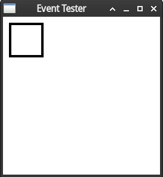

# Linux手动配置调试Wacom数位板

## 设备与环境

Archlinux

Wacom CTL672 (One by wacom)

## 1 软件包安装

```shell
sudo pacman -S xf86-input-wacom 
```

常用的绘画软件，`inkscape`用于绘制矢量图，`krita`和SAI、Photoshop比较类似，适用于~~二次元~~插画绘制

```shell
sudo pacman -S inkscape krita gimp
```

## 2 命令行配置

使用`xsetwacom`进行手动配置

首先列出设备

```
$ xsetwacom list devices
Wacom One by Wacom M Pen stylus 	id: 22	type: STYLUS    
Wacom One by Wacom M Pen eraser 	id: 23	type: ERASER 
```

可以通过以下命令获取当前配置状态，`22`为stylus的id

```
xsetwacom get 22 all
```

## 2.1 按键重映射（到键盘快捷键）

首先使用`xev`测试按键事件

```
xev -event button
```

或包含键盘事件等事件在内

```
xev
```

会出现以下所示的窗口，聚焦（激活）该窗口，并将光标放置在窗口内



依次点击鼠标左中右键，可以在终端看到类似如下的输出

```
ButtonPress event, serial 25, synthetic NO, window 0x3e00001,
    root 0x6d1, subw 0x3e00002, time 21395806, (43,18), root:(2834,481),
    state 0x10, button 1, same_screen YES

ButtonRelease event, serial 25, synthetic NO, window 0x3e00001,
    root 0x6d1, subw 0x3e00002, time 21395910, (43,18), root:(2834,481),
    state 0x110, button 1, same_screen YES

ButtonPress event, serial 25, synthetic NO, window 0x3e00001,
    root 0x6d1, subw 0x3e00002, time 21397614, (47,17), root:(2838,480),
    state 0x10, button 2, same_screen YES

ButtonRelease event, serial 25, synthetic NO, window 0x3e00001,
    root 0x6d1, subw 0x3e00002, time 21397734, (47,17), root:(2838,480),
    state 0x210, button 2, same_screen YES

ButtonPress event, serial 25, synthetic NO, window 0x3e00001,
    root 0x6d1, subw 0x3e00002, time 21398118, (47,17), root:(2838,480),
    state 0x10, button 3, same_screen YES

ButtonRelease event, serial 25, synthetic NO, window 0x3e00001,
    root 0x6d1, subw 0x3e00002, time 21398206, (47,17), root:(2838,480),
    state 0x410, button 3, same_screen YES
```

依次点击数位板笔的笔尖，下键（靠近笔尖一端），上键，可以得到如上类似的输出。说明笔尖默认映射为鼠标左键，下键映射为鼠标中键，上键映射为鼠标左键。区别是笔尖压感由0变为非0表示ButtonPress，反之表示ButtonRelease；而CTL672配套笔上的按键不区分Press或Release，只要按键按下就同时依次触发Press和Release

可以将按键映射到键盘快捷键，如下示例

```
xsetwacom set 22 Button 2 "key +ctrl z -ctrl"
```

> 将下键映射到Ctrl-Z。在ctrl之前加+或-分别表示ctrl键的按下以及释放事件，而不加任何+或-表示一次点击，即连续的一次按下与释放。所有可用的按键可以通过`xsetwacom list modifiers`查询
>
> 甚至可以编写一段巧妙的键盘宏

不加宏恢复默认映射

```
xsetwacom set 22 Button 2
```

## 2.2 设置画板有效感应区

画板的有效感应区映射到整块屏幕

通过以下命令获取当前的画板有效区域大小

```
$ xsetwacom get 22 Area
0 0 21600 13500
```

> 表示当前区域从`(0,0)`到`(21600,13500)`，这也是数位板物理支持的最大分辨率

如果显示器是16:9，可以通过以下命令将有效感应区大小设置为16:9，这样横向和纵向的缩放就变得相同，此时数位板下方有一片条状区域不再起作用

```
xsetwacom set 22 Area 0 0 21600 12150
```

有些特殊需求如OSU玩家可能需要将区域调小，可以如下操作，此时数位板只有左上角一小块区域起作用

```
xsetwacom set 22 Area 0 0 2000 2000
```

有效区的坐标数字甚至可以设置大于`(21600,13500)`，此时数位板无法映射到整块屏幕

恢复默认

```
xsetwacom set 22 ResetArea
```

也可以设置当前有效感应区到屏幕的映射，例如映射到当前屏幕左上角`(0,0)`（单位pixel像素）开始的大小`1728*1080`的区域，此时屏幕右侧有一片条状区域无法触及

```
xsetwacom set 22 MapToOutput 1728*1080+0+0
```

## 2.3 多显示器设置

通过`xrandr`查看当前的显示器接口

```
$ xrandr
Screen 0: minimum 320 x 200, current 3840 x 1080, maximum 16384 x 16384
eDP connected 1920x1080+0+0 (normal left inverted right x axis y axis) 309mm x 174mm
   1920x1080     60.05*+  40.03  
   1680x1050     60.05  
   1280x1024     60.05  
   1440x900      60.05  
   1280x800      60.05  
   1280x720      60.05  
   1024x768      60.05  
   800x600       60.05  
   640x480       60.05  
HDMI-A-0 connected 1920x1080+1920+0 (normal left inverted right x axis y axis) 598mm x 336mm
   1920x1080     60.00*+ 119.98   120.09    96.05    72.01    60.02    50.00    48.01    99.93    84.90    50.00    59.94  
   1680x1050     59.88  
   1280x1024     75.02    60.02  
   1440x900      59.90  
   1280x960      60.00  
   1280x800      59.91  
   1152x864      75.00  
   1280x720      60.00    50.00    59.94  
   1024x768      75.03    70.07    60.00  
   832x624       74.55  
   800x600       72.19    75.00    60.32    56.25  
   720x576       50.00  
   720x480       60.00    59.94  
   640x480       75.00    66.67    60.00    59.94  
   720x400       70.08  
DisplayPort-0 disconnected (normal left inverted right x axis y axis)
DisplayPort-1 disconnected (normal left inverted right x axis y axis)
```

当前连接了`eDP`以及`HDMI-A-0`。想要映射到外接显示器

```
xsetwacom set 22 MapToOutput HDMI-A-0
```

如果上述方法无效可以使用前述方法

```
xsetwacom set 22 MapToOutput 1920*1080+1920+0
```

## 2.4 压感曲线

见 https://linuxwacom.github.io/bezier.html

依次填入红点和粉点的xy坐标，示例

```
xsetwacom set 22 PressureCurve 0 50 50 100
```